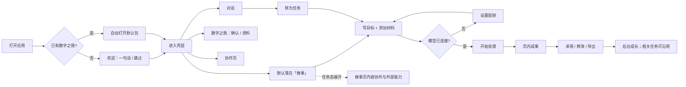

# Digital Me V2 — EXPERIENCE-REDESIGN-01A

- **任务**：`DIGITALME-V2-EXPERIENCE-REDESIGN-01A`
- **版本**：v0.1 · 2026-08-05
- **状态**：`owner_frozen` / `implementation_authorized_for_01B`（B1→B6 逐片；不得并行大改）
- **冻结日**：2026-08-05
- **基线**：`v2/foundation` @ `bbf8218`（含 GROWTH-PERCEPTION-BRIDGE）
- **上位**：架构巩固文（IA 冻结）、主体架构原则、用户意图与确认负担规则、最弱环节审计结论
- **FigJam**：[Digital Me Experience Redesign 01A](https://www.figma.com/board/MzhFrPO0Wctlk3qSCcEAEx)

> Owner 已冻结四主栏与次级设置/帮助等决策。本文件为 01B 实施合同；当前切片为 **B1**。

---

## 0. 一句话目标

把当前「五入口并列 + 做事页内嵌协作长文」的壳，收敛为：**一次意图完成一件事** 的暖色、低负担桌面体验；成长可感知但不喧宾夺主；协作与设置不抢主路径。

---

## 1. 当前主要用户流程（如实）

### 1.1 主路径（已实现）



### 1.2 当前痛点（产品判断，非测试计数）

| # | 现象 | 用户影响 |
|---|------|----------|
| P1 | 主导航 5 项平权，默认「做事」却与「协作/设置」同级抢注意力 | 陌生用户不知道先干什么 |
| P2 | 做事任务态内嵌完整协作/外部能力说明与表单 | 主路径被淹没；概念重复 |
| P3 | 设置暴露 Base URL / Model ID | 像开发控制台，不像个人产品 |
| P4 | 「留为成果」空壳；帮助与面板重复解释同一概念 | 信任下降 |
| P5 | 数字之我 / 成长提示已接线，但仍偏「第二页」 | 成长难成为主路径附带感受 |
| P6 | 文字过多、层级不清（审计已指认） | 持续使用意愿下降 |

### 1.3 明确保留的已验证价值

创建/自动恢复、对话轻入口、做事一次开始、材料上下文（含纳入摘要）、页内成果与修改/采用/导出、成长提示与 JIT、本地模型门禁、协作真实闭环（授权→执行→采用→撤销）。

---

## 2. 新信息架构（提案，待 Owner 冻结）

### 2.1 导航原则

1. **一条主线**：做事是默认工作台（意图 → 材料 → 成果）。
2. **两个伴行**：对话（澄清）、数字之我（核对与纠正）— 不与做事抢主 CTA。
3. **协作降频**：保留一级入口，但从「做事 compose」移除常驻长文；任务态仅保留**轻入口**「请人帮忙 / 用专业能力」。
4. **设置 / 帮助**：辅助；设置不进主五栏平权（移到顶栏次级或头像/齿轮）。

### 2.2 提案导航

```text
主栏（最多 4）：做事 · 对话 · 数字之我 · 协作
次级：设置（齿轮）· 帮助（？）
默认着陆：做事（空态友好，而非空表单恐吓）
```

与架构巩固文对齐说明：

- 原冻结「对话 | 做事 | 数字之我」+ 协作恢复一级 → **本提案保留协作一级**，但**降低视觉权重与做事内嵌负担**。
- 「设置」从主栏撤出，符合「首启不强制配齐」与少决策。

### 2.3 各面职责（修订）

| 面 | 用户一句话 | 主 CTA | 禁止 |
|----|------------|--------|------|
| **做事** | 帮我把这件事做完 | 开始处理 | 长篇概念科普；空壳按钮；强迫选能力类型 |
| **对话** | 先聊聊、记住一点 | 发送；可转为任务 | 自动生成成果；「留为成果」空壳 |
| **数字之我** | 你理解得对不对 | 保存补充；确认要点 | 学习流水账；完成度条 |
| **协作** | 交给别人或外部专业能力 | 新建协作 / 连接 | 与做事页双份完整表单 |
| **设置** | 连接模型 | 保存密钥 | Base URL 默认路径强制暴露 |
| **帮助** | 我该从哪开始 | 短列表 | 协议名 / 内部字段 |

### 2.4 做事工作台分区（提案）

```text
左：任务列表（精简）
中：当前意图区（目标 + 材料摘要 + 主按钮）
右：成果区（查看 / 采用 / 修改 / 导出；成长提示默认收起）
底或侧轻入口：请人帮忙 · 用专业能力（展开后才出授权表单）
```

协作完整管理（对象、进行中、撤销）**只在协作页**。

---

## 3. 关键页面线框（文字线框；FigJam 承载流程）

### 3.1 欢迎

```text
┌─────────────────────────────────────┐
│  Digital Me                         │
│  建立你的数字之我                     │
│                                     │
│  [ 用一句话介绍你自己…          ]   │
│                                     │
│  [ 开始使用 ]     先跳过             │
└─────────────────────────────────────┘
```

不变：一次决策；无文件夹选择器。

### 3.2 做事 · 空态 / 新建

```text
┌ 任务 │ 描述你要完成的工作              │（成果区空）┐
│ 列表 │ [                         ] │            │
│      │ 材料：添加文件 · 文件夹        │ 完成后右侧 │
│ +新建│ （尚无纳入摘要）               │ 显现成果   │
│      │ [ 开始处理 ]                  │            │
└──────┴───────────────────────────────────────────┘
```

### 3.3 做事 · 有成果

```text
┌ 任务 │ 目标（只读） + 材料摘要 ▸      │ 成果        │
│ …    │ 状态：已完成 · 可重试…        │ 采用 / 不采用│
│      │ ▸ 请人帮忙（折叠）            │ ▸ 已结合…   │
│      │                               │ 编辑器      │
│      │                               │ 继续修改    │
└──────┴───────────────────────────────┴────────────┘
```

### 3.4 对话

去掉「留为成果」。保留：发送、转为任务、清空。一句说明即可。

### 3.5 数字之我

保留三区：已确认 / 待确认 / 资料。文案更短；待确认用轻量卡片，不用表格感。

### 3.6 协作

首页：对象卡片 + 活动列表。新建向导分步（选对象 → 要求 → 勾选材料 → 授权说明 → 发出）。**不在做事页复制整套向导。**

### 3.7 设置

默认只见：服务提供方（DeepSeek 等预设）+ API Key + 测试连接。  
「高级连接」折叠：Base URL / Model ID。

---

## 4. 设计系统最小规范（v0）

继承现有暖色纸感，**不引入**紫霓虹 / 深色 Agent 控制台风。

| Token | 现行参考 | 规则 |
|-------|----------|------|
| `--bg` | `#f3efe6` | 暖底；可保留轻径向氛围，忌花哨 |
| `--panel` | `#fffdf8` | 主表面 |
| `--ink` / `--muted` | `#1c2430` / `#5c6672` | 正文 / 次要 |
| `--accent` | `#0f6a5a` | 唯一主行动色 |
| `--line` | `#d7d0c3` | 细分隔 |
| `--danger` | `#8a2f2f` | 仅失败 |
| 圆角 | 10–12px | 面板与按钮统一 |
| 字号 | 14 / 13 / 12 | 页标题 ≤ 一处强调；禁止多段 `muted tiny` 堆叠 |
| 动效 | 可选 150–200ms 透明度 | 忌弹跳与闪烁；成长提示出现不抖动布局 |

**组件最小集（壳层）**：`Button`（primary/ghost）、`Field`、`Panel`、`NavItem`、`StatusLine`、`DetailsReveal`、`EmptyHint`。  
继续 **Electron + 原生 HTML/CSS/JS**；不引入 React 壳重写。

**文案**：严谨、明白、中性；禁止协议名、内部字段、开发黑话。

---

## 5. 旧界面：删除 / 合并 / 保留

| 项 | 处置 | 说明 |
|----|------|------|
| 主导航「设置」平权按钮 | **合并→次级齿轮** | 减少主栏噪音 |
| 做事页常驻「协作与专业能力」长说明 | **删除常驻**；改为轻入口 | 表单迁协作页或抽屉 |
| 对话「留为成果」禁用按钮 | **删除** | 无能力不占位 |
| 外部能力 / 协作双入口文案重复 | **合并**到协作语义 | 做事仅「请人帮忙」「用专业能力」二词入口 |
| Base URL / Model ID 默认露出 | **合并进高级** | 预设路径默认填好 |
| 帮助长列表复读导航 | **缩短** | 3–5 句 + 链到当前面 |
| 任务列表 / 目标 / 材料 / 成果 / 采用 / 修改 / 导出 | **保留** | 主价值 |
| 成长提示、JIT、材料摘要 | **保留** | 刚接线；01B 仅做视觉收束 |
| 数字之我三列表 | **保留结构，收文字** | |
| 协作页对象与活动 | **保留并作为唯一完整面** | |
| bundle「分析依据」默认展开风险 | **默认收起**（已 details） | 保持 |

---

## 6. 工具与组件依赖建议

| 建议 | 结论 | 理由 |
|------|------|------|
| **Figma / FigJam** | **采用（本任务已建板）** | 流程与线框可共享；不进运行时 |
| **Playwright** | **01B 引入验收** | 窗口级主路径；不改产品架构 |
| **axe** | **01B 可选** | 键盘与对比度；壳层静态 HTML 易检 |
| **Storybook** | **暂缓** | 非 React 组件树；成本高于收益 |
| **Radix / React Aria / Headless UI** | **不引入** | 当前非 React；禁止为少量控件引入重型栈 |
| **图标库** | 可选极小 SVG 内联（设置/帮助） | 忌整包 icon font |
| **设计 Token** | **CSS 变量扩展现有 `:root`** | 零依赖、可入库 |
| **视觉回归** | 01B 末可选截图基线 | 非阻塞 |

**明确不做**：Ant/MUI/Chakra、Agent 控制台模板、为 01A 重写渲染栈。

---

## 7. 01B 分切片实施顺序（提案）

> 每片可独立验收；禁止并行大改。每片结束须：主路径可用、无协议泄漏、无空壳按钮。

| 序 | 切片 | 范围 | 验收焦点 | 预估 |
|----|------|------|----------|------|
| **B1** | 导航与着陆收束 | 设置改次级；默认做事空态文案；删「留为成果」 | 首屏决策 ≤2；无死按钮 | S |
| **B2** | 做事主路径纯净化 | 移除常驻协作长文；轻入口→抽屉/跳转协作 | 新建任务页可一眼开始 | M |
| **B3** | 设置渐进披露 | 预设 + Key；高级折叠 | 非技术用户可连 DeepSeek | S |
| **B4** | 协作单面完整化 | 向导收束在协作页；做事只保留入口 | 无双份表单 | M |
| **B5** | 视觉与文案打磨 | Token、空态、帮助缩短、成长/材料摘要样式 | 暖、静、少字 | S |
| **B6** | 自动化验收 | Playwright 主路径 + 可选 axe | 回归可重复 | S |

**不做进 01B**：能力商店、广播、紫深色主题、React 迁移、P2C1、第二主体 Store。

---

## 8. 需要 Owner 冻结的决策（≤3）

1. **导航**：是否批准「主栏 4 + 设置齿轮次级」（相对现行 5 平权）？
2. **协作入口**：做事页是否只保留二字轻入口，完整流程仅在协作页？
3. **设置**：是否默认隐藏 Base URL / Model ID（高级折叠）？

冻结前：**禁止大面积生产代码改造**。01A 仅文档 + FigJam + 审查画布。

---

## 9. 声明

- 未修改生产业务逻辑（本任务仅设计交付）。
- 未 push。
- FigJam：https://www.figma.com/board/MzhFrPO0Wctlk3qSCcEAEx
