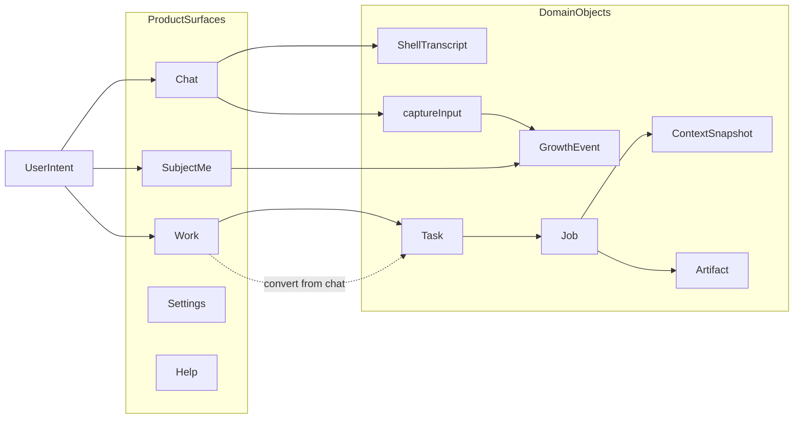

# Digital Me V2 — 产品架构巩固（Product Architecture Consolidation）

- **文档编号**：`DIGITALME-V2-PRODUCT-ARCHITECTURE-CONSOLIDATION-01`
- **版本**：v0.1.1（2026-08-04）
- **状态**：`owner_accepted` / `frozen_for_sequencing`
- **性质**：事实审计 · 产品架构 · 用户旅程 · 能力继承决策 · 后续实施路线  
  **不等于**单块实现授权；**不得**因本文直接开工 Collaboration 业务或 Artifact 采用闭环（须另开任务块）
- **基线权威**：`v2/foundation` @ `9db81ef`
- **上位合同**：
  - [`docs/design/digitalme_v2_subject_product_semantics_and_mvp_contract_v0.1.md`](../../../docs/design/digitalme_v2_subject_product_semantics_and_mvp_contract_v0.1.md)
  - [`docs/v2/digitalme_v2_domain_model.md`](../../../docs/v2/digitalme_v2_domain_model.md)
  - [`digitalme_subject_architecture_and_rd_principles_v0.1.md`](../../../digitalme_subject_architecture_and_rd_principles_v0.1.md)
  - Owner 决策 #107（C+A；七模块框架；不设「创作」一级入口）
- **关联**：
  - 样本审计（非裁决源）：[`../audit/digitalme_v2_validated_product_capability_recovery_audit_20260804.md`](../audit/digitalme_v2_validated_product_capability_recovery_audit_20260804.md)
  - 工作树处置：[`../audit/digitalme_v2_product_shell_worktree_disposition_20260804.md`](../audit/digitalme_v2_product_shell_worktree_disposition_20260804.md)
  - Workflow V2 设计：[`docs/design/digitalme_mvp_core_workflow_v2_design_v0.1_20260802.md`](../../../docs/design/digitalme_mvp_core_workflow_v2_design_v0.1_20260802.md)（见 §C.5）

---

## 0. 一句话结论

V2 **底层合同足够**承载「对话探索 → 做事交付 → 使用即构建 → 纠正再使用 → 主体间协作」。  
**当前 MVP 导航**冻结为 `对话 | 做事 | 数字之我`；设置与帮助为辅助；**协作是核心主线**，无可用闭环时**不显示空一级入口**，Collaboration MVP 完成后**立即**恢复为一级入口（**不得**标为远期 P3）。  
模型 / Agent / Skill / 工具调用为 MVP **后台能力**，由设置管理连接、由做事流程选用；独立能力商店后置，**能力不得从架构消失**。

---

## A. 基线与证据边界

### A.1 已提交基线（`9db81ef`）

SubjectPackage、GrowthEvent、`captureInput`、Task/Job/Artifact、材料上下文、修改/导出、模型连接、CommandBus≤20。未宣称 `mvp_ready` / `closed_alpha_ready`。

### A.2 未提交工作树

仅作验证样本与处置对象；与本文冲突时以本文为准。逐文件裁决见工作树处置审计。

### A.3 底层不变合同

```text
SubjectPackage  ·  GrowthEvent（唯一主体事实入口）
Task / ExecutionJob  ·  ContextSnapshot  ·  Artifact
CommandBus ≤ 20  ·  无第二套主体 Store
聊天 transcript ≠ GrowthEvent  ·  无第二套 Job 状态机
```

---

## B. 事实审计（摘要）

| 层 | 要点 |
|----|------|
| 底层已冻结 | SubjectPackage / GrowthEvent / Task·Job / Snapshot / Artifact / CommandBus |
| 已验证价值 | 对话轻入口、做事一次路径、材料、页内成果、修改·采用·导出、重启、模型、使用即构建、帮助边界 |
| 捕捉链 | 初始一句话 / 对话 / Task / 材料：须接通；Artifact 修改与采用/否定：下一切片 |

---

## C. 目标产品信息架构（冻结）

### C.1 当前 MVP 导航（冻结）

```text
一级：对话 | 做事 | 数字之我
辅助：设置 | 帮助
协作：核心主线；当前无可用闭环时不显示空一级入口；
      Collaboration MVP 完成后立即恢复为一级入口；
      不得描述为远期 P3。
```

### C.2 各入口职责

| 入口 | 职责 | 禁止 |
|------|------|------|
| **对话** | 轻交流；可 `captureInput`；可转为任务 | 默认生成 Artifact；聊天当主体权威 |
| **做事** | Task→Job→Artifact；材料；少决策；默认文档类交付 | 计划必经；创作一级入口；强迫理解 Adapter 名 |
| **数字之我** | 感知与纠正；资料列表/移除 | 完成度门禁；学习流水账 |
| **设置** | 模型等连接与凭证 | 首启强制配齐才能进入 |
| **帮助** | 轻量说明页/菜单 | 堆主界面长文；协议黑话 |
| **协作**（待恢复入口） | Collaboration MVP 后一级入口 | 空占位一级入口；假装公网协作 |

### C.3 能力产品定位（冻结）

| 能力形态 | 定位 |
|----------|------|
| 模型连接 | 设置管理；做事前诚实门禁 |
| Agent / Skill / 工具调用 | MVP **后台能力**；由做事流程自动选择或调用 |
| 独立能力商店 / 一级「能力」入口 | **后置** |
| 能力本身 | **不得从架构消失**；跟随接入模型上限 |

### C.4 Collaboration 优先级（冻结）

后续顺序：

1. 当前工作树收口（产品壳单一切片）  
2. Artifact 采用 / 否定闭环  
3. **Collaboration MVP**  
4. 三线整体闭环（对话·做事·主体 + 协作）  
5. 对话、帮助、视觉与能力入口完善  

**Collaboration MVP 最小验收**（首轮同机双 SubjectPackage；不依赖公网 / P2P / 支付 / 市场）：

```text
A 导入或选择 B
  → 发出协作请求
  → 范围确认
  → AuthorizationGrant
  → B 完成限定子任务
  → Artifact 返回
  → A 验证整合
  → 撤销
  → 再次调用被拒绝
  → 双方形成不同 GrowthEvent
```

### C.5 Workflow V2 文件定位（冻结）

文件：[`digitalme_mvp_core_workflow_v2_design_v0.1_20260802.md`](../../../docs/design/digitalme_mvp_core_workflow_v2_design_v0.1_20260802.md)

登记状态：

```text
legacy_workflow_reliability_design_absorbed_into_v2_constraints
parallel_implementation_stopped
```

**保留并继承到 V2 约束**：

- 唯一执行入口  
- 材料快照冻结  
- UI 只投影权威 Job  
- 单材料失败不拖垮任务  
- 分阶段失败与重试  
- quality / learn 不推翻已完成 Artifact  
- 新旧任务成果不串线  

**禁止迁入 V2**：

- `task.workflowV2`  
- 第二套状态机  
- `actBehalf:*` IPC  
- legacy renderer 编排  
- 旧 Package 结构  

### C.6 Transcript 生命周期（冻结）

路径示例：`SubjectPackage/ui/conversation.ndjson`（壳层辅助面）。

| 规则 | 要求 |
|------|------|
| 迁移 | **随 SubjectPackage 迁移** |
| 清除 | **可清空或删除** |
| 检索 | **默认不参与任务检索** |
| 派生 | **不进入主体派生** |
| 主体写入 | **仅**经 `captureInput` 提炼后才可能形成 GrowthEvent |
| 删除聊天 | **不自动删除**已确认主体内容 |
| 禁止 | **不得**静默升级为 Memory Store / 第二事实源 |

### C.7 对象映射



---

## D. 核心用户旅程（冻结摘要）

1. **首次**：一句话 → 默认包 → 立即对话或做事  
2. **对话→做事**：交流不建 Task；转为任务后才有 Artifact  
3. **做事**：材料 + 开始处理 + 页内成果 + 修改/导出；状态投影 Job；可取消  
4. **采用/纠正**（下一切片）：采用/否定 → 使用即成长  
5. **重启**：任务与成果仍在  

---

## E. 能力继承决策（更新）

| 能力 | 裁决 | 优先级 |
|------|------|--------|
| 对话轻入口 | 重设计产品面；本壳可收口 | 当前切片 |
| 做事 / 材料 / 成果 / 导出 / 重启 / 模型 | 复用底层 | — |
| 采用 / 否定 | 重设计产品面 | **下一切片** |
| Collaboration | **核心主线**；入口待 MVP 后立即恢复 | **序 3**（非 P3） |
| 帮助 | 辅助轻量入口 | 当前切片最小页 |
| 能力商店一级入口 | 后置；后台能力保留 | 序 5 |
| 创作入口 / 计划必经 / 音视频宣称 / 完成度门禁 | **否决** | — |

---

## F. 后续实施路线（冻结顺序）

| 序 | 块 | 说明 |
|----|----|------|
| 1 | 当前工作树收口 | 产品壳单一切片；见处置审计 |
| 2 | Artifact 采用 / 否定闭环 | 捕捉闭环关键缺口 |
| 3 | Collaboration MVP | 同机双包最小验收（§C.4） |
| 4 | 三线整体闭环 | 对话·做事·主体 + 协作 |
| 5 | 对话、帮助、视觉与能力入口完善 | 含能力入口体验，非能力消失 |

**停止条件**：新建平行主体 Store；聊天=GrowthEvent；重写 Work Runtime；复制 legacy renderer；迁入 Workflow V2 禁项 → 立即停止并上报。

---

## G. Owner 冻结确认记录

本版已按 `ARCHITECTURE-FREEZE-AND-WORKTREE-DISPOSITION-01` 修订并登记为：

```text
owner_accepted
frozen_for_sequencing
```

Collaboration Product Entry 已于 `c017e7b` 合入；采用闭环此前已合入。本文 IA 仍冻结，不因后续能力切片改动导航。

---

## H. 演进方式（2026-08-04 增补；不改变已确认 IA）

当前四个主要产品面（对话、做事、数字之我、协作）**不按各自独立路线纵向无限推进**，而按完整用户价值链轮动：

```text
主体理解 → 任务执行 → 能力调用 → Artifact 验证与采用
→ 授权协作 → 成长与恢复 → 下一轮
```

约束：

- 协作与未来广播必须由主体、能力、授权、验证、审计共同支撑；
- 整体能力以最弱关键模块为准；
- 进入主分支必须按产品准备验证或正式产品能力建设，不以一次性实验代码代替；
- **下一阶段**：远端能力产品准备（`DIGITALME-V2-REMOTE-CAPABILITY-PRODUCT-READINESS-01`），统一 CapabilityAdapter 合同与恢复/验证边界，**不直接建设开放网络、不接真实 A2A、不启动公网广播**。

状态保持：

```text
owner_accepted
frozen_for_sequencing
ia_unchanged
evolution_policy_appended
```
