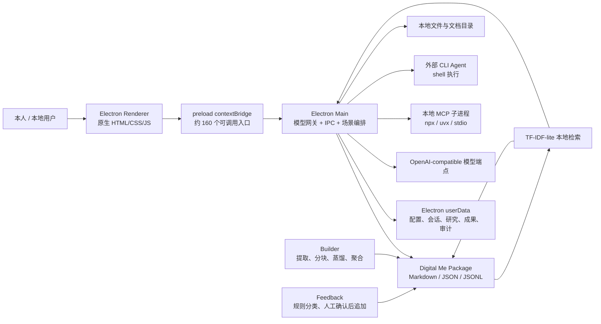
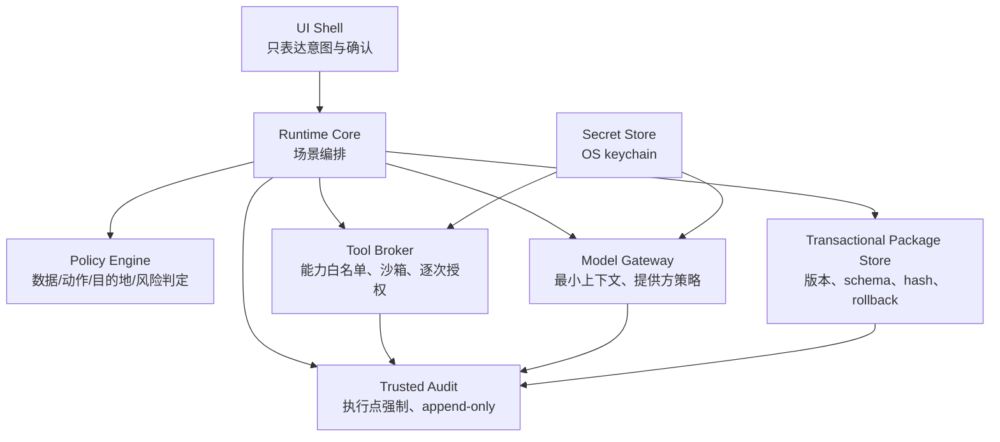

# Digital Me 系统架构审计报告

版本：1.0  
审计日期：2026-07-16  
审计对象：`Digital Me` 工作区、`digitalme-app`、`digital-me-package` 及根目录产品/架构文档  
审计性质：代码与静态数据审计；不包含真实模型密钥下的完整端到端验收、渗透测试、安装包签名验证和云端系统审计

---

## 1. 执行摘要

### 1.1 总体结论

Digital Me 的战略定位和逻辑骨架成立，不需要推倒重来。`Package / Builder / Runtime` 三分法、主体层与能力层分离、本地优先、原始证据优先于衍生索引等原则，仍应作为后续架构基线。

但从实际代码而不是愿景文档判断，当前系统应正式定义为：

> **具备真实功能闭环的单机 Alpha 原型；可以用于受控的本人试用和产品验证，但尚未达到“可信数字主体”或可分发产品的安全、数据完整性与工程质量门槛。**

这不是因为主架构方向错误，而是因为目前最有价值的主体资产仍由一组缺乏事务、版本、加密、强制授权和系统化测试的本地 JSON/JSONL/Markdown 文件承载；与此同时，MCP、本机文件读写和外部命令执行等高权限能力已经提前进入运行时。

### 1.2 对此前文档判断的正式校正

此前“功能丰富的 Digital Me 原型”判断基本正确，但需要两点校正：

1. **实现度比文档层审查预期更高。** Builder、文本提取、蒸馏、检索、反馈写回、人生图谱、研究与写作工作台、MCP、外部 CLI 委派、基础审计均有真实代码，不只是界面占位。
2. **安全与主权成熟度比架构文档表达更低。** 本地保存尚未形成加密、可验证来源、可回滚版本、强制权限检查和可审计执行的完整机制；“本地”当前主要是存储位置，不等于已实现用户主权。

### 1.3 综合评级

| 维度 | 评级 | 判断 |
|---|---:|---|
| 战略定位与逻辑架构 | 4/5 | 方向清晰，有独立价值，关键分层合理 |
| 当前产品实现度 | 3/5 | 已有可运行 Alpha，多个场景真实点亮，但闭环证明不足 |
| 代码架构与可维护性 | 2/5 | 已有模块萌芽，但主进程和渲染层仍是巨型单体 |
| 数据治理与可追溯性 | 2/5 | 大量条目带 `sourceRefs`，但缺哈希、完整引用、事务和版本历史 |
| 安全与权限强制 | 1/5 | 有界面确认和提示词边界，但缺运行时统一策略、密钥保护与能力隔离 |
| 可靠性、测试与可运维性 | 1/5 | 无自动化测试、无构建发布链、无结构化错误与完整审计保障 |
| 用户主权与可迁移性 | 2/5 | Package 与 App 已分离，但导出/删除/恢复/迁移/验签未形成闭环 |

### 1.4 审计意见

**有条件通过架构方向审计，不通过生产就绪审计。**

在完成本报告 P0 项前，应限制为本人受控试用：

- 不录入无法承受泄露的密钥、证件、财务、医疗和他人隐私原文；
- 不默认启用第三方 MCP 或未知 `npx` 包；
- 不使用外部 CLI 对重要目录执行写操作；
- 不将当前 Package 的签名、审计或来源字段对外宣称为密码学可验证证据；
- 每次重要 Builder/反馈写回前人工备份整个 Package。

---

## 2. 审计范围与方法

### 2.1 已审计范围

- 桌面运行时：`digitalme-app/src/` 全部 JavaScript、HTML、CSS 与配置；
- 主体数据包：`digital-me-package/` 的 manifest、人格、记忆、框架、life graph、policy、trust、contracts 与 commerce 占位结构；
- 关键规格：产品规格、MVP 范围、端主权架构、数据主权、人的定义、Life Graph、项目 context/log；
- 依赖与静态质量：依赖树、已知依赖漏洞、JavaScript 语法、JSON/JSONL 可解析性；
- 数据证据链：source index、`sourceRefs`、hash、文件位置与推断状态。

### 2.2 已执行验证

- 所有 `src/**/*.js` 与 `src/**/*.mjs` 通过 `node --check`；
- 37 个 JSON 文件均可解析；
- 1,081 条被抽查的主要 JSONL 记录均可解析；
- 生产依赖审计未发现已知漏洞；
- 完整依赖审计发现 Electron 32.3.3 存在高等级已知漏洞，需要升级；
- 未发现项目级自动化测试文件；
- 未发现可执行的 Package 完整导出、删除、重导入和行为一致性测试。

### 2.3 未覆盖范围

- 未使用真实 API Key 完成模型对话、蒸馏和工具调用的端到端运行；
- 未对第三方 MCP 包做供应链代码审查；
- 未进行恶意 prompt、恶意文档、XSS、路径穿越或命令注入的动态攻击测试；
- 未发现实际云平台代码，因此无法审计账号、同步、KMS、计费、多租户与云端删除；
- 当前工作区及 `digitalme-app` 均未显示 Git 仓库元数据，无法审计提交历史、分支保护与发布流水线。

---

## 3. 当前真实架构

### 3.1 已真实实现

| 能力 | 实现状态 | 代码事实 |
|---|---|---|
| Package 加载与 prompt 组装 | 已实现 | persona、style、boundaries、life、framework、memory 被组装进模型上下文 |
| Builder | 已实现 | 支持 DOCX/TXT/MD/PPTX/PDF 提取、分块、三次重试、聚合、相似度过滤、审阅写回 |
| 本地检索 | 已实现 | 对 memory、framework、events、inferences 等构建 TF-IDF-lite 索引 |
| 反馈写回 | 部分实现 | 修正经预览确认后追加到 memory/persona/style；无候选版本与回滚 |
| Life Graph | 已实现但治理不完整 | events、people、inferences、outcomes 等可写、确认、拒绝 |
| 写作与研究 | 已实现 | 会话、成果库、研究项目、grounded 检查、Word/Markdown/PPT 输出 |
| MCP 能力 | 已实现但高风险 | 可安装、连接、列工具并由模型自动调用 |
| 外部 CLI 委派 | 已实现但高风险 | 用户勾选写授权后，以 shell 启动任意配置命令 |
| 基础审计 | 部分实现 | 仅本地 JSON，最多 200 条，可清空，部分记录由 renderer 主动上报 |
| 云同步、多端、E2E 加密 | 未实现 | 仅有目标态架构文档 |
| Package 签名与链锚定 | 占位 | key、signature、txHash 均为空或 placeholder |
| Package 分级导出/恢复 | 未实现 | 文档中有 Lite/Standard/Full，运行时代码没有对应闭环 |

### 3.2 架构优点

1. **主体数据与应用代码物理分离。** Package 不被锁死在应用内部数据库中，具备未来可迁移基础。
2. **原始事实与衍生检索在理念上分离。** 当前检索索引可重建，没有把向量库当事实源。
3. **主进程/渲染进程边界基本正确。** `contextIsolation: true`、`nodeIntegration: false`，模型响应在主要对话区域使用 `textContent` 渲染。
4. **Builder 已具有基本防幻觉意识。** 有来源登记、相似度过滤、乱码过滤、人工审阅入口和截断元数据。
5. **推断与事实开始分层。** Life Graph 中存在 inference 状态、置信度、确认/驳回动作。
6. **产品已具备真实闭环材料。** 从导入、提取、蒸馏、写回到后续对话检索，不再是纯概念系统。

---

## 4. 关键发现与风险登记

风险等级定义：

- **P0 阻断**：继续扩大使用会直接放大主体资产泄露、误写或不可恢复风险；进入公开测试前必须处理。
- **P1 高优先**：不一定立即造成事故，但会阻止产品核心承诺被证明或使系统难以稳定演进。
- **P2 改进**：应纳入工程治理，但不阻断受控的单机验证。

### F-01：密钥和高敏配置以明文保存并返回渲染层（P0）

**证据**

- `config.json` 直接以 JSON 写入 `apiKey`；
- MCP 的 GitHub、Brave、Google 等令牌被写进同一个 `capabilityExtensions[].env`；
- `config:get` 和 `extensions:getConfig` 会把配置返回 renderer；
- 未使用 OS Keychain、Windows DPAPI 或 Electron `safeStorage`。

**影响**

本机同用户进程、云盘同步、备份软件、恶意扩展或 renderer 漏洞可能获取模型与第三方账号密钥。该实现与架构文档“能力令牌本机加密存储”的已确认原则不一致。

**整改**

- 建立独立 `SecretStore`，用 OS 密钥链或 `safeStorage` 保存 secret；
- renderer 只接收 `hasApiKey`、`secretConfigured` 等布尔状态，不回传明文；
- 配置导出明确剔除 secret；
- 对现有明文配置提供一次性迁移并清理旧字段。

### F-02：MCP 与外部能力没有真正的最小权限和进程隔离（P0）

**证据**

- MCP 子进程继承 `...process.env`，再叠加扩展自己的 env；
- 可由用户配置任意 command、args、cwd；精选能力通过 `npx -y` 运行未锁定版本的包；
- 没有网络出口限制、资源限制、沙箱、包签名或来源校验；
- 工具权限只停留在扩展级“启用”，没有工具级的读/写/删/执行分级；
- 已连接工具可以由模型在最多 6 轮循环中自动调用，调用前没有统一高风险判定与逐次确认。

**影响**

恶意或被劫持的 MCP 包可以读取进程环境、访问本机网络和文件，并以 Digital Me 进程权限执行。工具描述和远程内容还可能通过 prompt injection 诱导模型调用写入或外发工具。

**整改**

- P0 阶段先关闭“任意自定义 MCP 自动执行”，仅保留审计过的白名单；
- `npx` 包必须固定精确版本和完整性摘要，禁止运行 `latest`；
- 子进程使用最小环境变量白名单，不继承全部 `process.env`；
- 引入统一 `Policy Decision Point`：每次工具调用先判定数据范围、动作类型、目标和风险；
- 写、删、执行、外发和读取 Package/密钥目录必须逐次确认；
- 将文件系统能力限制到规范化后的已授权目录，并做真实路径检查；
- 后续再加入 OS 级沙箱、网络域名白名单、CPU/内存/时限与一键撤销。

### F-03：外部 CLI 委派是“确认后任意 shell”，不是可验证授权（P0）

**证据**

- 命令、参数模板与 cwd 均可配置；
- 使用 `spawn(..., { shell: true, env: { ...process.env } })`；
- “允许改动授权目录”只是 renderer 传入的布尔值；
- 代码没有把外部进程限制在用户声称的授权目录，也无法阻止其访问其他目录；
- 审计只记录任务摘要和退出码，不记录实际文件变更、命令哈希或数据外发。

**影响**

当前的“只读/可写”是产品文案，不是操作系统或运行时强制边界。用户一旦确认，外部程序可使用当前账户全部权限。

**整改**

- 在完成沙箱前，将外部 CLI 标记为“开发者实验功能”，默认关闭；
- 取消 `shell: true`，只允许受信任可执行文件与参数数组；
- 绑定规范化工作目录和文件变更清单；
- 执行前显示命令、目录、预计权限，执行后显示实际 diff；
- Package、密钥、系统目录默认不可写，必须另行高风险授权。

### F-04：Package 写回没有事务、版本历史、冲突控制和回滚（P0）

**证据**

- Builder 会顺序修改 source index、memory、framework、style、persona，多文件写入没有事务；
- feedback 直接 append 到核心文件；
- inference/event 更新会整体重写 JSONL；
- 多处同步 `writeFileSync/appendFileSync` 没有临时文件 + fsync + 原子 rename；
- manifest 的 `updatedAt` 没有随写回更新；
- 架构文档要求“最后写入 + 版本历史可回滚”，代码未实现。

**影响**

断电、进程崩溃、WPS 云盘并发同步或两个操作交错时，可能出现部分写入、数据丢失或 Package 内部不一致。用户不能解释“哪次学习改变了我”，也不能可靠撤销。

**整改**

- 抽出唯一 `PackageStore`，禁止业务模块直接写 Package 文件；
- 每次修改形成 immutable change set：before hash、after hash、actor、reason、source、affected paths；
- 使用临时目录写完整新版本，校验后原子切换；
- 建立版本号、migration、快照、回滚与并发锁；
- 将 Builder/Feedback 的所有写入先进入候选版本，用户确认后一次提交。

### F-05：来源“可读”但尚不可验证（P0）

**数据核对结果**

- source index 有 79 个来源，所有 `hash` 均为空；
- 主要 memory 的 `sourceRefs` 覆盖率较高，这是明显优点；
- 仍有 `consolidated` 被 30 条记录引用，但 source index 没有对应来源；
- 6 个 source index 条目没有被主要数据引用；
- 7 个来源路径在当前工作区无法解析；
- `life/events.jsonl` 22 条记录没有 `sourceRefs`；
- 现有 `signature.json` 明确为占位，无真实公钥和签名。

**影响**

系统能展示“来源标签”，却不能证明来源文件是否被替换、条目是否确实从该版本材料生成、Package 是否被篡改。不能把当前 sourceRefs 宣称为证据链或密码学审计。

**整改**

- source 登记时计算内容 SHA-256、大小、MIME、采集时间与 canonical URI；
- 每个事实、记忆、推断至少记录 source id + source hash + 可定位片段；
- 修复悬空引用和缺失路径；
- 区分“原文证据”“模型提取”“本人声明”“人工修正”；
- Package 签名前先完成 canonical serialization 与 manifest 文件树哈希。

### F-06：事实、推断与本人声明仍未被强类型隔离（P0）

**证据**

- feedback 的普通纠正常被写成 `confidence: high` 的长期记忆，来源仅为通用字符串 `feedback`；
- Builder 的 memory 均写入同一 `long_term` 类型；
- Life Graph 中中高置信推断默认直接 `confirmed`；
- 当前数据中存在 41 条 `confidence: low` 却标为 `status: confirmed` 的 inference，说明历史规则或数据迁移已产生语义矛盾；
- 本人声明、事实、模型推断、当前状态、发展意图没有统一 schema 与不同写入权限。

**影响**

模型提取结果可能逐步冒充本人事实或立场；“越用越好”也可能变成未经察觉的身份漂移。

**整改**

落实七类数据分层，并在 schema 与写权限上强制：

1. immutable evidence；
2. evidence-backed fact；
3. owner assertion；
4. system inference；
5. current state；
6. development intent；
7. capability/policy。

除低风险、可撤销的短期状态外，模型不得直接把候选内容写入 confirmed 主体层。

### F-07：边界主要是 prompt 约束，不是数据流强制策略（P0）

**证据**

- `never_inject`、`never_export`、`never_speak_for_me` 最终都被摘要成 system prompt 文本；
- 当前代码没有在检索、附件、模型请求、导出和工具调用前按 scope 做结构化过滤；
- `buildSystemPrompt` 会把整份 persona、framework 和 long-term memory 送给配置的模型服务；
- 模型端点允许任意 OpenAI-compatible `baseURL`，没有域名信任、数据出境说明或每服务数据政策。

**影响**

“不注入”“不随导出”无法靠提示词可靠执行。用户可能以为已经设置技术边界，实际只是要求模型遵守一句话。

**整改**

- 建立统一数据分类与 redaction engine；
- 在模型请求、工具调用、导出三条出口分别执行策略；
- 每条记录有 sensitivity、allowed purposes、allowed destinations；
- 发往第三方模型前显示本轮将发送的数据类别和服务商；
- prompt 规则保留为第二层防线，不能作为唯一防线。

### F-08：Electron 安全基线不完整且版本过旧（P0）

**优点**

- 已设置 `contextIsolation: true`、`nodeIntegration: false`；
- 主对话内容主要使用 `textContent`，降低模型输出直接 XSS 风险；
- 只加载本地 `index.html`。

**缺口**

- Electron 实际版本为 32.3.3，完整依赖审计报告高等级漏洞；
- 没有 CSP；
- 没有显式阻止导航与新窗口；
- 没有 permission request deny-by-default；
- 没有验证 IPC sender；
- preload 暴露约 160 个高层接口，其中包括打开任意本地路径、保存扩展配置、调用任意已连接工具、运行外部 Agent；
- `shell.openExternal` 允许任意 HTTP/HTTPS URL，未使用域名或来源策略。

**整改**

- 升级到仍受支持且已修复相关公告的 Electron 版本，并做回归；
- 设置严格 CSP；
- deny navigation、deny unexpected window creation、deny permissions by default；
- 所有 IPC handler 验证 sender URL，并对输入做 schema 校验；
- 缩减 preload API，按场景拆分并移除通用高权限入口；
- 为外部 URL 增加可信来源判定与用户可见确认。

### F-09：审计账本不是可信审计（P1）

**证据**

- `l0-audit-ledger.json` 最多保存 200 条；
- 用户可直接清空；
- 没有哈希链、签名、append-only 文件或外部锚定；
- 部分审计由 renderer 调用 `l0:auditAppend` 生成，可以漏报或伪造；
- 模型工具自动调用路径没有逐次写入统一审计，主要返回 capability id；
- 审计不记录输入数据范围、工具参数、目标、结果摘要 hash 与确认人。

**影响**

当前日志只能用于 UI 历史提示和调试，不可用于追责、授权证明或合规凭证。

**整改**

- 所有高权限动作由 main/runtime 在实际执行点强制审计；
- append-only、滚动归档、hash chain、可导出；
- 记录 decision、policy version、data scope、tool/version、arguments redaction、result hash、approval；
- “清空”改为新建日志代次，旧账本保留或由本人明确销毁并记录销毁事件。

### F-10：代码边界尚未实现文档要求的五层解耦（P1）

**证据**

- `src/main.js` 约 2,876 行、105 KB，集中 IPC、模型、工具、输出、研究和 Builder 编排；
- `src/renderer/app.js` 约 7,391 行、272 KB，集中全部页面状态和交互；
- preload 暴露约 160 个 API；
- Package I/O 分散在 builder、feedback、life、policies、materials 与 main；
- 使用 CommonJS + 原生 JS，无静态类型与 schema 生成边界；
- 文档要求的 Package Store、Runtime Core、Gateway Client、Sync Client、UI Shell 尚未成为可独立测试模块。

**影响**

权限规则难以统一，修改一个场景容易破坏其他场景，未来 Web/手机复用成本高。

**整改顺序**

1. 先抽 `PackageStore` 和 `SecretStore`；
2. 再抽 `PolicyEngine` 与 `AuditService`；
3. 再抽 `ModelGateway`、`ToolBroker`、`RuntimeCore`；
4. 最后拆 renderer 状态与场景模块。

不要先为了“更现代”整体改写框架；应沿真实信任边界逐层抽取。

### F-11：错误处理普遍吞错，无法支撑可信运行（P1）

**证据**

- 大量空 `catch {}`；
- JSON 解析失败经常回退为空数据；
- 工具连接失败会被自动忽略并回落普通模型；
- 自动保存失败会静默置空；
- 同步文件写入阻塞主进程，且错误缺少统一分类。

**影响**

用户可能看到“系统继续运行”，但数据、工具或证据链已降级。对数字主体系统，静默降级比显式失败更危险。

**整改**

- 统一错误类型：data corruption、policy denied、secret unavailable、provider error、tool error、partial write；
- 关键写入失败必须阻断并告知；
- 可恢复降级必须显示原因和影响；
- 结构化本地日志与可导出诊断包默认脱敏。

### F-12：没有自动化测试与可重复发布链（P1）

**证据**

- `package.json` 只有 `start` 与 `dev`；
- 未发现 test/spec 文件；
- 无 lint、typecheck、coverage、build、package、sign、release 脚本；
- 当前可验证范围只有语法、数据解析和依赖审计。

**影响**

无法证明反馈后改善、边界不越权、导入导出一致、历史数据可迁移，也无法安全升级 Electron 或拆分主进程。

**整改**

建立四层测试：

1. Package schema/fixture/migration；
2. Builder、retrieval、feedback、policy 单元测试；
3. IPC contract 与工具授权集成测试；
4. Playwright/Electron 端到端关键路径与恶意输入测试。

### F-13：产品规格、README、manifest 与代码版本状态漂移（P1）

**证据**

- README 仍称 MCP、审计和反馈规则未实现，但代码已有部分实现；
- App/package version 仍为 0.1，产品规格修订已经推进到 v0.3.x；
- manifest `updatedAt` 仍停留在 2026-07-08；
- manifest 将 MCP 标记为 `enabled: false`，运行时却已支持并可启用；
- MVP 写明 SQLite/向量检索与分级导出，实际使用 JSON/JSONL + TF-IDF-lite，导出闭环未实现。

**影响**

团队无法准确回答“已决定、已开发、已验证”分别是什么，审计与排期会持续失真。

**整改**

- 建立 capability registry：`planned / specified / implemented / statically_verified / runtime_verified / released`；
- 代码版本、Package schema 版本、产品版本分开管理；
- README 只描述当前可运行事实；
- context/log 保留索引和历史，不再承担所有事实源职责。

### F-14：缺少证明 Digital Me 核心价值的评测系统（P1）

**证据**

- 现有代码有 grounded 检查和相似度启发式，但没有固定 eval dataset 和基线对照；
- 记忆数量、框架数量和材料数量被用作覆盖度信号；
- 没有“通用模型 + 普通提示词”对照；
- 没有三轮反馈后的稳定改善曲线；
- 没有 Package 导出—删除—导入后的行为一致性测试。

**影响**

无法证明系统比普通个人提示词/知识库更像本人，也无法区分“学习”与“漂移”。

**整改**

建立固定评测集与版本化分数：事实、来源、判断、风格、边界、跨会话、反馈改善、迁移一致性和对照盲测。

### F-15：单机运行之外的架构仍是目标态，不是已验证系统（P2）

Web、手机、账号、E2E 同步、设备撤销、云模型网关、协作、A2A、AP2、DID 和百万 DAU 均未进入本次代码审计对象。它们可以保留为远景，但不应继续占用近期架构复杂度或对外形成已具备印象。

---

## 5. 核心承诺审计

| 核心承诺 | 当前证据 | 审计结论 |
|---|---|---|
| **像我** | persona/style/framework/memory 注入、本地检索、Builder、修正写回 | 有实现基础，尚无盲测与对照评测，未证明 |
| **属于我** | Package 独立目录、本地优先、目录可配置 | 只证明本地持有；缺加密、完整导出、验签、版本与恢复，不完全成立 |
| **能替我做事** | 写作、研究、MCP、CLI 委派已运行到代码层 | 能力已存在，但授权不是强制隔离，安全门槛未过 |
| **会持续成长** | feedback 写回、Builder 增量、Life inference 确认 | 有增量写入，不等于可控学习；缺候选区、版本、回滚和改善评测 |

因此目前最准确的产品表述是：

> Digital Me 已经能够加载和增量修改一个人的数字资料包，并基于它完成若干任务；但“它确实更像我、真正属于我、受控替我做事、且会稳定成长”仍需工程与评测共同证明。

---

## 6. 目标架构建议

现有方向无需替换，近期应把单机系统收敛为六个可强制执行的核心边界：

### 6.1 Package Store

- 是主体资产唯一写入口；
- schema validation、migration、snapshot、atomic commit、rollback；
- evidence、fact、assertion、inference、state、intent、policy 分层；
- manifest 文件树 hash；
- index/embedding 明确为可删除衍生物。

### 6.2 Policy Engine

- 输入：actor、purpose、data scope、action、destination、risk；
- 输出：allow / deny / require confirmation / redact；
- 同一策略同时约束模型上下文、导出、MCP、CLI 与未来 A2A；
- 边界不再只是 prompt 文本。

### 6.3 Tool Broker

- 只允许注册、锁版、验明来源的 capability；
- 独立最小 env、工作目录与网络策略；
- 工具级权限和参数级风险评估；
- 工具返回内容视为不可信输入，防 prompt injection；
- 所有执行从 Broker 经过，禁止场景代码绕过。

### 6.4 Secret Store

- secret 与普通 config 分离；
- renderer 永远不拿到 secret；
- 支持轮换、撤销和导出排除；
- 能力只在启动瞬间获得自己需要的最小 secret。

### 6.5 Audit Service

- 在真实执行点记录，而非依赖 UI；
- 与 Package version 和 policy version 关联；
- 默认脱敏但可验证；
- 可导出给本人检查。

### 6.6 Eval Harness

- 作为正式系统部件而不是临时测试脚本；
- 每次 Package 更新、模型更换和策略变更都可重跑；
- 分数与失败样本绑定版本。

---

## 7. 整改路线

### 阶段 0：立即止血与基线冻结（2—5 天）

1. 标记当前版本为 `0.1-alpha`，只允许受控单人试用；
2. 默认关闭自定义 MCP 自动执行和外部 CLI；
3. 将 API Key/第三方 token 迁入 SecretStore；
4. 升级 Electron，补 CSP、navigation/window/permission/IPC sender 基线；
5. 对整个 Package 建立一次只读快照、文件 hash 清单与离线备份；
6. 修复 `consolidated` 悬空来源、缺失路径和低置信 confirmed 数据矛盾；
7. 建立最小 Git 仓库与变更基线（如当前确实尚未版本化）。

**退出标准**：密钥不再明文回传 renderer；未知能力默认不能执行；现有主体资产有可验证快照；Electron 不再使用已知高风险旧版本。

### 阶段 1：固化主体内核（1—2 周）

1. 抽出 PackageStore、schema 和 migration；
2. 七类数据分层落地；
3. 所有写回变为候选 change set + 人工确认 + 原子提交；
4. manifest 自动更新时间、版本和文件 hash；
5. 实现快照、diff、rollback；
6. 为 Builder/feedback/life/policies 建立单元测试。

**退出标准**：任意一次学习都能回答“为什么改、改了什么、依据是什么、如何撤销”；故障不会留下半写 Package。

### 阶段 2：证明“像我且会改善”（2—3 周）

1. 建立 50—100 条固定评测集；
2. 同一模型下对比：无个性化、普通提示词、当前 Digital Me；
3. 重要事实来源可定位率 100%；
4. 风格与判断由本人盲测；
5. 连续三轮反馈后，分数改善且关键事实/边界不回退；
6. 将评测报告绑定 Package version。

**退出标准**：以数据证明 Digital Me 优于“通用模型 + 普通提示词”，而不是以功能数量证明。

### 阶段 3：受控能力执行（2—4 周）

1. 建立 PolicyEngine 和 ToolBroker；
2. 文件、网络、外发、写入、删除、执行分级；
3. MCP 固定版本、来源、权限清单和最小 env；
4. 工具调用逐条可信审计；
5. 选择一个受控能力完成红队测试；
6. 外部 CLI 在沙箱或严格受控工作区内恢复。

**退出标准**：高风险行为 100% 被技术层拦截或要求本人确认；恶意工具内容不能绕过授权。

### 阶段 4：证明“属于我”（2—4 周）

1. 完整 Package 导出、删除、重导入；
2. schema 迁移与旧版兼容测试；
3. 签名、验签和可选加密封装；
4. 第三方最小 reader 验证可移植性；
5. 再设计 E2E 同步、设备撤销和恢复。

**退出标准**：用户离开当前 App 后仍能保有、验证和恢复主体资产；服务商或客户端更换不改变核心事实。

---

## 8. 建议的近期非目标

在阶段 0—3 完成前，以下方向不进入主线：

- A2A 对外协作；
- AP2/x402 交易；
- DID 对外身份；
- 能力市场扩品；
- 多人匹配或主体出租；
- 百万 DAU 平台实现；
- 大规模 Web/手机端开发；
- 以多模态输入数量作为进展指标。

保留协议与数据结构研究即可，不继续增加运行时攻击面。

---

## 9. 最小验收清单

### 主体真实性

- [ ] 重要事实 100% 有可解析 source id、source hash 和定位片段；
- [ ] 本人声明与模型推断在 schema、界面和写权限上分离；
- [ ] 所有 confirmed inference 经本人确认或可解释规则确认；
- [ ] 固定评测优于同模型普通提示词基线。

### 主体控制权

- [ ] 所有重要更新可预览、接受、拒绝、回滚；
- [ ] `never_inject` / `never_export` 由代码过滤而非只靠 prompt；
- [ ] 高风险工具动作 100% 进入确认；
- [ ] 一键撤销能力和 secret 后，子进程无法继续访问。

### 主体资产

- [ ] Package 可完整导出、验 hash、删除、重导入；
- [ ] 重导入后固定评测结果在容差内一致；
- [ ] secret 不进入 Package、会话导出或日志；
- [ ] 每次写入是原子版本并可恢复。

### 工程质量

- [ ] 自动化测试覆盖 PackageStore、PolicyEngine、Builder、Feedback、ToolBroker；
- [ ] Electron 安全基线自动检查；
- [ ] 依赖、安装包、更新包锁版并可验证；
- [ ] 关键错误可见、可诊断、默认脱敏。

---

## 10. 最终审计结论

Digital Me 已经跨过“只有构想”的阶段：当前代码证明它确实可以把材料蒸馏进一个独立 Package，并用这个 Package 支撑对话、写作、研究和能力调用。这是本次审计最重要的正面发现。

但系统尚未跨过“可信主体”的门槛。当前最高风险并不是缺少更多能力，而是主体资产的写入、来源、密钥、权限和审计仍然偏原型化，而高权限执行能力已经进入系统。

正式建议是：

> **保留现有战略与逻辑骨架，立即停止扩大能力面；先把 PackageStore、SecretStore、PolicyEngine、ToolBroker、AuditService 和 Eval Harness 六个内核做实。用可追溯、可回滚、可强制授权、可迁移和可重复评测，证明 Digital Me 的核心承诺。**

完成这些工作后，项目才适合从“本人可用的 Digital Me Alpha”进入“可交给他人安全试用的 Digital Me 产品”。

---

## 附录 A：关键代码证据索引

| 主题 | 文件/位置 |
|---|---|
| Electron 窗口安全配置 | `digitalme-app/src/main.js:91` |
| 明文 config 与 API Key | `digitalme-app/src/main.js:509` |
| Package prompt 组装 | `digitalme-app/src/main.js:749` |
| 模型 HTTP 网关 | `digitalme-app/src/main.js:778` |
| 自动工具循环 | `digitalme-app/src/main.js:939` |
| 外部 CLI 委派 | `digitalme-app/src/main.js:1819`、`src/orchestration/agents.js` |
| MCP 配置与调用 | `digitalme-app/src/main.js:2693`、`src/capabilities/extension-manager.mjs` |
| Builder 写回 | `digitalme-app/src/builder.js:982` |
| Feedback 直接写回 | `digitalme-app/src/feedback.js` |
| 推断默认确认 | `digitalme-app/src/life.js:535` |
| Prompt 型边界 | `digitalme-app/src/policies.js` |
| 基础审计 | `digitalme-app/src/orchestration/audit-store.js` |
| Package 签名占位 | `digital-me-package/trust/signature.json` |
| 架构目标态 | `digitalme_architecture_edge_sovereign_v0.1.md` |

## 附录 B：外部安全基线

- Electron Security Checklist: https://www.electronjs.org/docs/latest/tutorial/security
- Electron safeStorage: https://www.electronjs.org/docs/latest/api/safe-storage
- MCP Security Best Practices: https://modelcontextprotocol.io/docs/tutorials/security/security_best_practices

