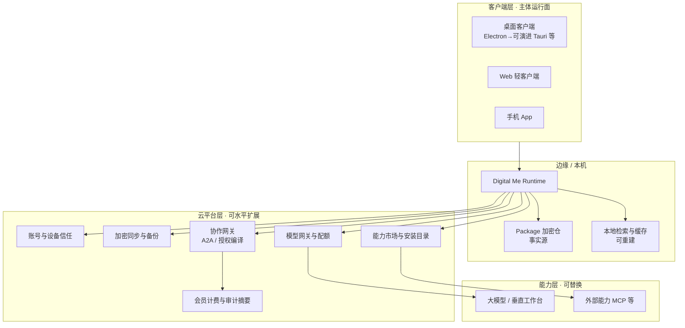

# Digital Me 系统架构设计：端主权 × 云边平台

| 项 | 内容 |
|---|---|
| 文档版本 | v0.1 |
| 状态 | **已确认**（2026-07-10） |
| 适用范围 | 面向百万用户乃至百万日活量级的长期系统拓扑；约束客户端、云平台、能力层分工 |
| 关联 | `digitalme_context.md`（战略与决策索引）、`digitalme_product_spec_v0.2.md`（界面与功能）、`digitalme_narrative_ai_era_autonomy.md`（叙事） |
| 一句话 | **客户端持有主体，云平台提供可水平扩展的账号 / 加密同步 / 模型与协作管道；能力层全部可插拔。扩容对象是网关与同步，不是把「每个人的我」做成中心库里的一行人设。** |

---

## 0. 决策摘要（已确认）

1. **不采用**「纯网页 SaaS + 人设/记忆明文全在云」作为主架构。  
2. **不采用**「仅桌面、永久无云」作为终局（主权好，但难达消费级百万 DAU）。  
3. **采用**：**本地主体客户端（Runtime + Package）+ 可扩展云边服务平台 + 外置能力层**。  
4. 当前 Electron 桌面应用是 **MVP / 验证载体**，不是终局唯一客户端；须尽早 **UI 与 Runtime 解耦**，以便 Web / 手机薄客户端共用同一主体协议。  
5. 百万日活时，云上扩的是：**身份、加密同步、模型网关、能力目录、协作网关、计费与风控**——不是默认托管每人全量明文素材与「云端大脑」。

---

## 1. 问题与目标

### 1.1 要同时满足的两难

| 目标 | 含义 |
|---|---|
| **产品规模** | 百万注册用户、乃至百万日活：需要 Web/手机获客、账号体系、可水平扩展的后端、稳定更新与计费 |
| **主体主权** | Digital Me 是「人的数字主体层」：Package 可带走、可审计、平台中立；不与大模型公司同台做成又一个云端聊天盒 |

二者冲突时：**主权与可迁移优先于中心化便利**；规模化通过「云边管道」实现，而非牺牲主体归属。

### 1.2 非目标（本架构明确不做）

- 成为又一家大模型公司（算力与预训练不是主线）。  
- 以广告 / 出售用户人格数据为商业核心。  
- 用「全云多租户人设库」替代本地 Package 作为唯一事实源。  
- 自造协作/交易协议（仍对齐 MCP / A2A / AP2 / DID，见 context §4.5）。

### 1.3 与既有结论的关系

| 既有结论 | 本文件如何落地 |
|---|---|
| 本地优先 + 云同步（context 决策 #3） | 细化为「端主权 Runtime + E2E 同步」拓扑 |
| 主体层 × 能力层（§7.10） | 云平台属主体侧基础设施；模型/MCP 属能力层 |
| 能力安装不自研功能 | 云侧提供目录与元数据，不替代市场能力 |
| 桌面 App 直接开发（决策 #8） | 桌面是首发客户端；架构预留多端 |
| 产品规格驱动 UI | 本文件管部署与系统边界；「用户看见什么」仍以 product_spec 为准 |

---

## 2. 总拓扑

### 2.1 三层结构

### 2.2 各层一句话

| 层 | 一句话职责 |
|---|---|
| **客户端 + 本机 Runtime** | 像我、记忆注入、授权确认、成稿与日常主路径；敏感上下文默认在端侧或用户密钥下处理 |
| **云平台** | 账号、多端同步、模型路由与配额、能力目录、对外协作、计费；按 DAU 水平扩展 |
| **能力层** | 预训练推理与外部工具；Digital Me 做路由、注入、审计，不当成自有「器官垄断」 |

### 2.3 核心原则：「扩管道，不扩中心大脑」

- **事实源**：`Digital Me Package`（及用户授权的本地/加密副本）。  
- **衍生物**：向量索引、会话缓存——可重建，默认可本地；上云须加密且可删除。  
- **云可见默认**：账号元数据、设备列表、加密 blob、配额与计费事件、用户显式授权的外发审计摘要。  
- **云不可见默认**：未加密的完整记忆、原始素材库、未授权的对话全文。

---

## 3. 路线对比与否决理由

| 路线 | 百万 DAU 工程性 | 对战略 | 结论 |
|---|---|---|---|
| **A. 纯 Web SaaS，人设/记忆全在云** | 最好扩、最好做增长漏斗 | 与可带走、可信任、主体层冲突；平台风险集中 | **否决为主架构** |
| **B. 仅桌面、无云** | 分发/多端/协作弱，难达百万 DAU | 主权最佳 | **否决为终局**；可作为极早期形态 |
| **C. 端主权 + 云边平台** | 客户端分流负载；云扩网关与同步 | 主权可叙事；Web/App 可获客；桌面做重能力 | **采用** |

---

## 4. 客户端层设计

### 4.1 多端职责

| 客户端 | 职责 | 不做（默认） |
|---|---|---|
| **桌面** | 重度工作台、蒸馏 Builder、本地文件与能力安装、成稿导出 | — |
| **Web** | 轻量对话、查看成稿、账号与订阅、授权确认入口 | 完整蒸馏流水线、任意本机 MCP 进程托管 |
| **手机** | 通知、轻问、高风险动作确认、出行场景轻交互 | 完整 Package 编辑与重型能力安装 |

### 4.2 当前实现与演进

| 阶段 | 客户端技术 | 要求 |
|---|---|---|
| 现在（MVP） | Electron + 本地 HTML/CSS/JS 渲染 | 验证产品与规格；**看起来像网页 ≠ 网站产品** |
| 规模化前 | **UI 与 Runtime 解耦** | 抽出 Package I/O、检索、会话、网关客户端、同步协议为可共享模块 |
| 增长期 | Web / 手机薄客户端 + 桌面重客户端 | 同一账号与同一 Package 同步协议 |
| 可选优化 | 桌面可评估 Tauri 等更轻运行时 | 不以换壳为优先；以解耦与同步协议为优先 |

### 4.3 解耦边界（工程约束）

须尽早形成稳定边界，避免「所有逻辑写在 Electron 渲染进程」：

1. **Package Store**：读写、版本、校验、导出；  
2. **Runtime Core**：组 prompt、检索、工具循环、成稿拆分规则；  
3. **Gateway Client**：模型调用、流式、停止、配额错误的人话映射；  
4. **Sync Client**：加密备份/拉取、冲突策略；  
5. **UI Shell**：各端界面（受 `digitalme_product_spec` 约束）。

---

## 5. 本机 Runtime 与 Package

### 5.1 Runtime 职责（主体侧）

与 context §4.2 对齐，本机优先承载：

1. Builder（蒸馏与版本更新）；  
2. Runtime（任务编排、像我约束）；  
3. 数据采集与分流管道入口（§2.5）；  
4. 本地 Model Gateway 客户端（可指向官方云网关或用户自备引擎）；  
5. Capability Installer（本机连接 MCP / 内置能力）；  
6. Feedback Rules Engine；  
7. 本地审计日志（完整）；云侧仅存用户同意的摘要或加密审计包。

### 5.2 Package 主权规则

1. Package 为**唯一事实源**；云端加密副本不得在产品叙事上称为「云端的你」。  
2. 用户可随时导出、删除云端副本、更换设备恢复。  
3. 索引与微调权重（若未来有）均为**可再生成加速件**，不替代 Package。  
4. 多端冲突：默认「最后写入获胜 + 版本历史可回滚」；高冲突场景提示用户（少决策：尽量自动合并无冲突字段）。

### 5.3 敏感路径

| 数据 | 默认位置 | 上云条件 |
|---|---|---|
| persona / memory / frameworks / style | 本机 Package | E2E 加密同步开启且用户知情 |
| 原始素材库 | 本机或用户自选盘 | 可选加密备份；禁止明文中心检索他人素材 |
| 会话历史 | 本机优先 | 可选同步；可分「仅设备 / 加密云」 |
| 能力令牌（OAuth 等） | 本机加密存储 | 经云代理转发须显式同意（既有决策） |

---

## 6. 云平台层设计（百万 DAU 扩容面）

### 6.1 模块清单与优先级

| 优先级 | 模块 | 职责 | 扩容要点 |
|---|---|---|---|
| P0 | **账号与设备信任** | 注册登录、多设备、吊销、恢复 | 无状态认证、会话、风控 |
| P0 | **加密同步与备份** | Package / 会话密文上下行、版本 | 对象存储 + 元数据分片；服务端不持解密密钥（理想）或托管 KMS 分权 |
| P0 | **模型网关与配额** | 路由多引擎、限流、成本、流式代理 | 水平扩展 API；按用户/套餐配额；可回落用户自备 Key |
| P1 | **能力市场与目录** | 精选能力元数据、安装说明、信誉 | CDN + 审核流水；**不**默认替用户跑全部 MCP |
| P1 | **协作网关** | Interaction Contract → A2A Agent Card 等；对外授权调用 | 与 AP2/计费衔接；按调用量扩展 |
| P1 | **会员计费与审计摘要** | 主体层订阅、授权外发计量 | 账本可对账；明细最小化 |
| P2 | **推送与通知** | 手机确认、任务完成 | 区域化推送 |
| P2 | **合规与区域** | 数据驻留、删除权、未成年人等 | 多区域部署 |

### 6.2 模型网关策略

- **官方网关（可选）**：降低小白配置成本（符合「认证后置 / 少决策」）；密钥与配额在平台侧。  
- **自备引擎**：高级用户仍可直连自有 baseURL（现有设置能力保留）。  
- **注入点**：无论哪条路径，**像我约束与 Package 上下文在 Runtime 组装**；网关只传已组装的请求或按协议传「加密上下文句柄」（远期）。  
- **成本控制**：百万 DAU 下模型费用是主成本；须有套餐、速率限制、缓存、小模型分流（能力层选择，非自研大模型）。

### 6.3 协作与交易（架构预留 → 增长期点亮）

与 context §4.5 一致：

- 内部：`Interaction Contract` 授权编排；  
- 对外：编译为 A2A / AP2 等标准工件；  
- 云协作网关负责：**发现、鉴权、限流、审计摘要、结算事件**；  
- 高风险动作仍回客户端做人工确认。

### 6.4 明确不放进中心库的默认主路径

- 每人全量原始素材明文检索库；  
- 未授权的跨用户人格训练语料池；  
- 「平台代管的永久云端 Digital Me 进程」作为唯一在线形态（可做**可选**托管，须单独产品与合规设计，不得默认真相源）。

---

## 7. 能力层

1. 大模型、垂直工作台、专业模型、MCP 工具均属能力层。  
2. Digital Me 通过 **Model Gateway + Capability Installer + 授权** 使用它们。  
3. 云平台可提供「托管代理 / OAuth 代完成」以降低摩擦（context 决策 #13），但仍属连接能力层，不改变主体归属。  
4. 内置高频能力（读指定目录、抓公开网页等）可走本机内置工具，不强制经外部进程（context 既有方向）。

---

## 8. 安全、信任与合规基线

1. **传输**：TLS；同步载荷 E2E 加密（目标态）。  
2. **存储**：本机加密 at-rest（目标态）；云端密文。  
3. **密钥**：用户口令/设备密钥派生；平台若代管密钥须分权与可迁移。  
4. **审计**：本机完整；云侧最小化；对外调用可验证摘要。  
5. **删除权**：账号注销 → 删除云端密文与元数据；本机由用户自行处置。  
6. **高风险**：付款、签约、对外承诺、批量外发——人工确认（既有红线）。  
7. **链**：可选哈希锚定，非主底座（既有决策）。

### 8.1 审计后第一阶段强制工程边界（2026-07-16）

`digitalme_architecture_audit_20260716.md` 证明当前安全能力主要是原型，第一阶段必须将以下六个边界实现为独立、可测试、不可绕过的内核：

1. **PackageStore**：Package 唯一写入口；schema、source hash、原子版本、migration、diff、rollback；
2. **SecretStore**：API Key/OAuth token 使用 OS 安全存储；renderer 与普通 config 不持有明文；
3. **PolicyEngine**：按 actor、purpose、data、action、destination、risk 判定 allow/deny/confirm/redact；
4. **ToolBroker**：能力白名单、精确版本、最小 env、目录/网络/动作权限和调用前确认；
5. **AuditService**：由实际执行点强制记录、append-only、关联 Package/Policy 版本；
6. **EvalHarness**：主体准确性、边界、反馈改善、能力稳定性和迁移一致性的固定评测。

第一阶段还必须补齐 Electron 安全基线：受支持版本、严格 CSP、禁止非预期导航和新窗口、权限默认拒绝、IPC sender 与 payload 校验。

在上述边界验收前：自定义 MCP 自动执行、外部 CLI 写入、任意 secret 注入均默认关闭或标记开发者实验；“已确认”“可审计”“授权目录”不得只由 renderer 布尔值或 system prompt 文字决定。

---

## 9. 规模化分期（避免一上来按百万造）

| 阶段 | 用户量级（直觉） | 架构重点 | 客户端 |
|---|---|---|---|
| **现在–v1** | 内测 / 百级 | 单机 Runtime + 本地 Package + 外接模型；验证像我与工作台 | Electron 桌面 |
| **v1.x** | 千–万 | 账号 + E2E 备份同步 + 可选官方模型网关；UI/Runtime 解耦启动 | 桌面为主 |
| **增长期** | 十万级 | Web/手机薄客户端；网关扩容；能力市场；推送确认 | 桌面 + Web + App |
| **百万 DAU** | 百万级 | 多区域、配额与风控、协作网关、计费与合规 hardening | 全端；扩平台层 |

**当前阶段覆盖说明（2026-07-16）**：现在–v1 内部新增“主体可信化与协作感知”硬化阶段。先完成本地 Package/Secret/Policy/Tool/Audit/Eval 六内核，再建设账号和 E2E 同步。协作仅交付默认私有的人读能力名片、Agent Card 草案、一次性 Interaction Contract 和本地模拟；不提前建设公网协作网关。

**原则**：每一阶段必须是**可用产品**；不为远期拓扑阻塞当前交付（与全数据覆盖分期原则同构）。

---

## 10. 商业与架构的对齐（预留）

商业场景仍可不作为 MVP 驱动力，但拓扑须预留：

| 可能模式 | 落在哪一层 |
|---|---|
| 主体层会员（同步、网关配额、多端） | 云平台 Bill + GW |
| 授权外发 / 被机构调用的薄抽成 | Collab + Ledger |
| 用户自备模型 Key | 几乎不经平台计费 |
| 卖广告 / 卖人格数据 | **禁止作为架构默认** |

---

## 11. 对当前代码库的含义（落地指引）

| 现状 | 架构要求 |
|---|---|
| `digitalme-app` Electron 单体 | 可继续迭代产品；新增功能避免把「同步/账号/网关」写死在渲染层 |
| 本地 `userData` 会话与 config | 视为单机态；未来映射为 Sync Client 的本地缓存 |
| 设置中的智能引擎地址 | 保留为「自备引擎」；未来增加「使用官方连接」开关 |
| Package 目录可配置 | 保持可迁移；同步以 Package 为单元 |
| 产品规格中的工作台 / 成稿预览 | 不因云架构改变交互原则；Web 端须遵守同一普通人语言与暖色人感 |

**本文件不替代** `digitalme_product_spec_v0.2.md`：不在此排 UI 控件；在此定系统边界。

---

## 12. 文档索引与维护

| 文档 | 关系 |
|---|---|
| 本文 | **部署与系统拓扑唯一详述**（端主权 × 云边） |
| `digitalme_context.md` | 战略结论与决策索引；§4 逻辑架构；指向本文 |
| `digitalme_product_spec_v0.2.md` | 界面与功能唯一需求源 |
| `digitalme_phase1_subject_upgrade_plan_v0.1.md` | 当前阶段工作包、DoD 与执行机制 |
| `digitalme_architecture_audit_20260716.md` | 当前代码与数据的风险证据基线 |
| `digitalme_log.md` | 变更与讨论流水 |
| `digitalme_narrative_ai_era_autonomy.md` | 对外叙事（自立、主体/能力分层） |

修订规则：拓扑或主权边界变更 → 升本文版本 → 在 context 决策表追加一条 → log 记一笔。

---

## 13. 修订记录

| 日期 | 版本 | 说明 |
|---|---|---|
| 2026-07-10 | v0.1 | 首版：确认端主权 × 云边平台；否决纯 SaaS 主架构与纯离线终局；多端职责、云模块优先级、分期与安全基线；用户确认同意后入库 |
| 2026-07-16 | v0.1.1 | 架构审计后补充第一阶段强制工程边界：PackageStore / SecretStore / PolicyEngine / ToolBroker / AuditService / EvalHarness；协作先做默认私有的感知与授权骨架 |
