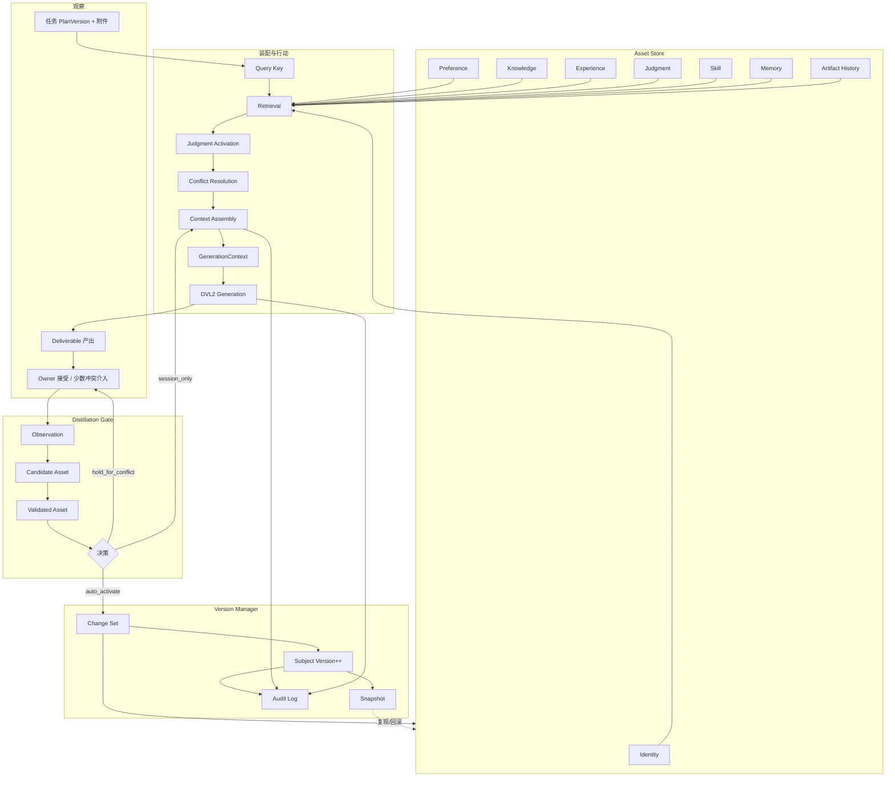

# Digital Me Cognitive Runtime v0.1  
## 产品与技术规格

| 项 | 值 |
|----|-----|
| 文档状态 | `design_draft`（设计稿；未授权实现；不表示已落地） |
| 版本 | v0.1 |
| 日期 | 2026-07-26 |
| 前置设计 | Digital Me Context Assembly Layer v0.1 |
| 对齐原则 | `digitalme_subject_architecture_and_rd_principles_v0.1.md` §1–§3.1 |
| 范围 | 定义持续进化数字主体的核心运行架构；**只规格，不编码** |

---

## 0. 摘要

**Cognitive Runtime（认知运行时）** 是 Digital Me 主体内核之上的运行层：持续观察任务与成果、蒸馏并版本化主体资产、在生成前按任务装配有界上下文、在接受后自动学习回流，并在异常冲突时才请求本人介入。

它不是：

- 又一个 Agent 框架；
- 又一个 RAG / 向量库产品；
- 又一个「把聊天记录塞进 prompt」的 Memory 插件。

它是：**让「数字之我」在每次感知—判断—表达—行动中保持连续、可审计、可进化的运行架构。**

设计原则（强制）：

1. **用户不是训练员** — 默认自动学习；不要求标注流水线。  
2. **只有异常冲突需要用户介入** — 常规接受即回流。  
3. **所有主体变化可审计** — Change Set + Snapshot + 回滚依据。  
4. **不允许把所有历史数据塞入 Prompt** — 检索 + 配额 + 截断必须可证明。  
5. **目标是持续进化的数字主体，不是个人资料库** — 资产要可激活、可冲突、可废弃，而非只存档。  
6. **蒸馏不降级模型能力** — 主体信息叠加/校对，不阉割通用能力（原则 §3.1）。

---

## 1. 产品定位

### 1.1 Cognitive Runtime 是什么

面向 Owner 的产品表述：

> Digital Me 在做事时，会带着「我是谁、我怎么判断、我过去学到什么」去完成任务；做完并被你接受后，会自动把值得留下的经验收回来，下一次更像你——通常不用你当教练。

面向工程的定义：

> Cognitive Runtime = **Subject Asset 生命周期管理 + Distillation Gate + Versioned Subject Store + Judgment Activation + Context Assembly + Learning Loop**，挂接在交付与行动路径（当前主线为 DVL2 Deliverable Generation）之前与之后。

### 1.2 与普通系统的区别

| 维度 | 普通 AI Agent | 典型 RAG | 典型 Memory 系统 | **Digital Me Cognitive Runtime** |
|------|---------------|----------|------------------|----------------------------------|
| 中心 | 工具调用与任务完成 | 文档检索增强生成 | 会话/用户记忆读写 | **连续数字主体** |
| 知识从哪来 | 工具/提示/临时检索 | 外部语料库 | 对话与笔记 | **本人源头蒸馏 + 任务回流** |
| 「我」是否版本化 | 通常否 | 否 | 弱 | **Subject Version / Change Set / Snapshot** |
| 判断 vs 知识 | 常混为一谈 | 偏事实检索 | 偏偏好片段 | **Judgment 一等公民**；知识不可替代判断 |
| 学习方式 | 少有闭环或需微调 | 通常无主体回流 | 常需用户整理 | **接受成果 → 自动蒸馏 → 主体更新** |
| Prompt 策略 | 易全量堆上下文 | top-k 文档 | 易无限追加 memory | **分层配额 + provenance；声称必有依据** |
| 冲突 | 少结构化处理 | 少 | 少 | **冲突策略 + 少数需 Owner 介入** |
| 成功标准 | 任务完成 | 答案有据 | 记得住 | **更符合本人事实、判断框架、表达与边界**（对照原则「核心对照测试」） |

### 1.3 一句话边界

- **资料库**：存得全。  
- **RAG**：检得准。  
- **Agent**：做得完。  
- **Cognitive Runtime**：在做得完的同时，**仍是同一个可进化的我**。

---

## 2. 核心对象模型

### 2.1 Subject Asset（主体资产）— 统一抽象

所有进入主体层的可检索单元均为 Subject Asset。

| 字段 | 说明 |
|------|------|
| `assetId` | 稳定标识 |
| `layer` | Identity / Preference / Knowledge / Experience / Judgment / Skill / Memory / ArtifactHistory |
| `kind` | 层内细分（如 identity.role、judgment.tradeoff） |
| `statement` 或 `payload` | 可渲染表述或结构化载荷 |
| `status` | 见 §3 生命周期 |
| `confidence` | 低 / 中 / 高（或 0–1） |
| `stability` | 稳定度（易变 vs 长期） |
| `importance` | 对主体连续性的重要度 |
| `sourceRefs` | 来源（蒸馏输入、成果版本、Owner 确认等） |
| `evidenceRefs` | 证据摘录/哈希 |
| `sensitivity` | 敏感级（公开可用 / 任务内 / 需授权 / 禁出站） |
| `scope` | 适用范围（全局 / 场景 / 受众 / 任务类型） |
| `conflictsWith` | 已知冲突资产引用 |
| `version` | 资产自身修订号 |
| `createdAt` / `updatedAt` / `activatedAt` / `deprecatedAt` | 时间线 |
| `subjectVersionIntroduced` | 首次进入 Active 的 Subject Version |

### 2.2 分层定义

#### Identity（身份）

- **是什么**：我是谁、公开自我定义、角色与不可轻易改写的自我描述。  
- **不是什么**：一次性任务口吻、临时自称。  
- **生成作用**：强约束与署名一致性；高敏感默认不出站宣传物，除非任务明确且授权。

#### Preference（偏好）

- **是什么**：表达风格、结构习惯、受众沟通偏好、禁忌与「不要这样写」。  
- **不是什么**：可证伪的世界事实。  
- **生成作用**：调节表达；与任务约束冲突时**任务约束优先**。

#### Knowledge（知识）

- **是什么**：可复用事实、领域陈述、项目/产品可核验信息（经蒸馏或确认）。  
- **不是什么**：在冲突情境下的取舍规则（那是 Judgment）。  
- **生成作用**：提供事实背景；与**本次参考材料**冲突时，以材料为本次项目证据，Knowledge 降为背景并标注不确定。

#### Experience（经验）

- **是什么**：经历、案例、做过什么、结果如何（叙事与情景）。  
- **不是什么**：抽象决策规则（可升格为 Judgment）。  
- **生成作用**：类比与可信度；需防「把旧项目故事套到新项目」。

#### Judgment（判断）— **v0.1 重点新增**

- **是什么**：在不确定或冲突下，本人如何权衡的可复用规则/框架。  
  - 例：「对投资人材料，先讲问题与时机，再讲方案」；「未核实数据不得写成结论」；「对外介绍优先主体连续性而非技术清单」。  
- **结构建议**：
  - `situation`：适用情境  
  - `options`：常见选项（可选）  
  - `rule`：取舍规则  
  - `rationale`：为何如此（可追溯到经验）  
  - `priority`：与其它 Judgment 的相对优先级  
  - `derivedFrom`：源自哪些 Experience / 接受成果  
- **不是什么**：百科知识、模型自带常识、单次任务的临时决定。  
- **生成作用**：在 Context Assembly 中 **Judgment Activation** 优先于同主题 Knowledge 堆砌；见 §8。

#### Skill（技能）

- **是什么**：可调用的做法、流程、模板、能力引用（「怎么做」的程序性资产）。  
- **注入规则**：默认只注入名称 + 一句话适用说明，**不**注入内部协议名、工具调用黑话或完整 skill 源码（用户面文案规范）。

#### Memory（记忆）

- **是什么**：长期记忆条目（语义 / 情景 / 程序等类型），含 auto-learn 写入。  
- **约束**：**禁止全量注入**；必须经检索 + 配额；一次性/低置信/过期可过滤。

#### Artifact History（成果史）

- **是什么**：已接受 DeliverableVersion 的摘要索引（非全文重灌）。  
- **作用**：风格连续、避免重复、对照「上次投资人材料怎么写的」。

### 2.3 与任务侧对象的关系

| 任务侧（DVL2） | 主体侧（Runtime） |
|----------------|-------------------|
| PlanVersion / understanding | 定义**本次**目标与受众 |
| referenceMaterials | **本次**项目证据 |
| DeliverableVersion | 产出；接受后进入学习闭环 |
| SubjectAssembly | 运行时装配结果，钉进 provenance |

**权威优先级（冲突时）**：

1. 明确任务约束与授权边界  
2. Active Identity（及高稳定性 Judgment）  
3. 本次参考材料（项目事实）  
4. Active Knowledge / Experience  
5. Memory / Artifact History  
6. 模型通用能力（始终保留，不被主体「关掉」）

---

## 3. Subject Asset 生命周期

```text
Observation → Candidate Asset → Validated Asset → Active Asset → Deprecated Asset
```

| 状态 | 含义 | 谁能推进 | 能否进入默认 Assembly |
|------|------|----------|------------------------|
| **Observation** | 原始观察：对话片段、成果文本、附件、外部反馈、系统信号 | 系统自动采集 | 否 |
| **Candidate Asset** | Distillation Gate 抽出的候选主体陈述 | 系统自动 | 否（可进「仅本次」overlay） |
| **Validated Asset** | 已通过稳定性/重要性/一致性/来源校验，待激活或待冲突处理 | 系统；冲突时 Owner | 通常否，直至 Active |
| **Active Asset** | 已进入当前 Subject 有效集，可被检索装配 | 无冲突自动；或 Owner 确认冲突决议 | **是** |
| **Deprecated Asset** | 被取代、撤销或过期；保留审计，默认不装配 | 系统或 Owner | 否（除非显式历史对照） |

状态迁移原则：

- **正向自动**：Observation → Candidate → Validated → Active（低风险、无冲突、非敏感）。  
- **阻断需人**：敏感 Identity/价值观/授权边界冲突；高影响 Judgment 互相矛盾；来源不可信但重要性高。  
- **废弃不删除**：Deprecated 保留，支持回滚与「为何不再用」。

---

## 4. Distillation Gate（蒸馏阀门）

### 4.1 为什么需要

若无阀门：

- 每次接受成果都会污染主体（一次性措辞变成「我的偏好」）；  
- 模型幻觉与项目套话进入 Identity；  
- Prompt 与主体膨胀；  
- 无法审计「为什么变成现在的我」。

阀门的产品意义：**自动学习，但不是无差别吸收。**

### 4.2 输入 / 输出

**输入（Observation 包）**：

- Accepted DeliverableVersion（文本/结构摘要）  
- 可选：任务 PlanVersion 理解、附件指纹、审阅批注、Owner 显式纠正  
- 可选：会话中的高信号修正（「不要这样写」「我更在意…」）

**输出**：

- Candidate Assets（带 layer 建议、confidence、sourceRefs）  
- 门控评分卡：`stability` / `importance` / `consistency` / `sourceTrust`  
- 决策：`auto_activate` | `hold_for_conflict` | `session_only` | `reject`  
- 审计事件

### 4.3 四维判断

| 维度 | 问题 | 高分倾向 | 低分倾向 |
|------|------|----------|----------|
| **稳定性 Stability** | 是否跨任务仍成立？ | 身份、长期判断框架 | 「本次」「临时」「只要这一次」 |
| **重要性 Importance** | 是否影响主体连续性/对外表达？ | Identity、Judgment、边界 | 琐碎格式偏好 |
| **一致性 Consistency** | 是否与 Active Identity/Judgment 冲突？ | 互补或同向 | 直接否定既有 Identity |
| **来源可信度 Source Trust** | 证据是否够硬？ | Owner 接受的成果 + 可追溯摘录 | 模型臆造、无附件支撑的「事实」 |

**合成策略（示意）**：

- 四维均达标且无冲突 → `auto_activate`  
- 一致性失败 → `hold_for_conflict`（Owner 三选：保持 / 按新更新 / 仅本次）  
- 稳定性低但任务有用 → `session_only`  
- 来源可信度低且像事实主张 → `reject` 或降为 Candidate 不激活  
- 敏感层默认更严：即使重要性高，也更易 `hold_for_conflict`

### 4.4 与「用户不是训练员」的关系

- 默认路径：**接受 = 授权系统尝试学习**（在既定敏感策略内）。  
- Owner 不需要打标签；系统自动分类到 layer。  
- 仅当阀门判定「异常冲突 / 高敏」时打断。

---

## 5. Digital Me Version（主体版本）

### 5.1 Subject Version

- 主体在某一时刻的**逻辑版本号**（或内容摘要哈希）。  
- 每次 Active 集发生提交级变化，Subject Version 递增。  
- Context Assembly 与 Deliverable provenance 应记录 `subjectVersion`（或 snapshotId）。

### 5.2 Change Set

- 一次原子变更集合（对齐现有 PackageStore Change Set 思想）。  
- 含：actor（system:distill / owner / system:auto-learn）、reason、ops、sourceRefs、dataKinds、时间。  
- **禁止**无 Change Set 的静默改写 Active 资产。

### 5.3 Snapshot

- 某 Subject Version 的可恢复只读快照（或可重建快照）。  
- 用途：复现某次生成、审计、回滚、对照实验（「用旧主体再生成」）。

### 5.4 回滚与审计

| 能力 | 要求 |
|------|------|
| 审计 | 谁、何时、因何成果/观察、改了哪些 asset、门控决策 |
| 回滚 | 支持回滚到指定 Subject Version / Change Set（产品上可先「软回滚」：Deprecated 新写入并恢复旧 Active） |
| 生成绑定 | DeliverableVersion.provenance 绑定 assemblyId + subjectVersion，使「那次为什么这样写」可查 |

---

## 6. Cognitive Runtime 架构

```text
┌──────────────────────────────────────────────────────────────────┐
│                     Cognitive Runtime v0.1                         │
│                                                                    │
│  ┌──────────────┐   ┌──────────────┐   ┌──────────────────────┐  │
│  │ Asset Store  │←──│ Version      │←──│ Distillation Gate    │  │
│  │ (分层资产)    │   │ Manager      │   │ (观察→候选→激活)      │  │
│  └──────┬───────┘   └──────────────┘   └──────────▲───────────┘  │
│         │                                          │              │
│         ▼                                          │              │
│  ┌──────────────┐   ┌──────────────┐   ┌──────────┴───────────┐  │
│  │ Retrieval    │──▶│ Judgment     │──▶│ Conflict Resolution  │  │
│  │              │   │ Activation   │   │                      │  │
│  └──────────────┘   └──────────────┘   └──────────┬───────────┘  │
│                                                    ▼              │
│                                         ┌──────────────────────┐  │
│                                         │ Context Assembly     │  │
│                                         │ → SubjectAssembly    │  │
│                                         └──────────┬───────────┘  │
└────────────────────────────────────────────────────┼─────────────┘
                                                     ▼
                                        Generation / Action paths
                                        (DVL2 Deliverable Generation)
                                                     │
                                                     ▼ Accept
                                        Learning Loop → Gate → Store
```

### 6.1 Asset Store

- 权威存放 Active / Validated / Deprecated 资产。  
- 映射物理：Package 目录 + distill 文件 + memory jsonl + 未来 judgment 索引等。  
- **只通过 Version Manager 写入。**

### 6.2 Retrieval

- 按 Query Key 从 Asset Store 取候选；分层 top-K；多样性与新鲜度。  
- 输出：带分数的 Candidate Set（装配候选，非生命周期 Candidate）。

### 6.3 Judgment Activation

- 从检索结果中识别 Judgment 层；按 situation 匹配任务。  
- 输出：`activatedJudgments[]`（有序）+ 抑制规则（见 §8）。

### 6.4 Conflict Resolution

- 应用优先级与冲突表；能自动解决的自动解决；否则标记 `needs_owner`。  
- 不把互斥 Identity 双双静默塞进 prompt。

### 6.5 Context Assembly

- 见 §7；产出 `SubjectAssembly` + `renderedText` + budget 元数据。

### 6.6 Version Manager

- Change Set 提交、Subject Version 递增、Snapshot、回滚、审计日志。

---

## 7. Context Assembly（装配规格）

继承 Context Assembly Layer v0.1，并纳入 Runtime。

### 7.1 输入

- 任务：`goal/audience/usage/constraints`、deliverable kind/title/purpose  
- 附件：`referenceMaterials`（分账预算）  
- 主体：Asset Store 中 Active 资产（+ 可选 session overlay）  
- 策略：场景（如对外宣传 / 内部文档）、敏感策略、配额配置  

### 7.2 检索

- 合成 Query Key（任务理解 + 交付项 + 附件关键词，非附件全文二次灌入检索器时可只用标题/摘要）。  
- 分层检索；Memory / Artifact History 强制 top-K。

### 7.3 评分

示意：`score = topicOverlap + audienceMatch + recency + confidence + judgmentSituationMatch − sensitivityPenalty − conflictPenalty`。

### 7.4 配额

- **主体总预算**与**附件预算分账**（示例：主体 6–10k 字符；附件另计）。  
- 分层默认配额（Identity / Judgment 优先保障；Memory 严格上限）。  
- 截断必须记 `included:false, reason`。

### 7.5 冲突

见 §2.3 优先级与 §4/§8；冲突摘要进入 `SubjectAssembly.conflicts`。

### 7.6 输出

```text
SubjectAssembly {
  assemblyId, subjectVersion, packageId, packageVersion,
  queryKeyDigest, assembledAt,
  layers: { identity, preference, knowledge, experience, judgment, skill, memory, artifactHistory },
  activatedJudgments: [...],
  renderedText,
  budget: { used, limit, truncated },
  conflicts: [...],
  policy: { excludedCount, sensitivityFilteredCount }
}
```

并入 `GenerationContext`（在既有 goal/附件字段之上）。

### 7.7 Provenance

DeliverableVersion 必须可回答：

- 用了哪些主体资产 / 记忆 / 技能 / 历史成果；  
- 激活了哪些 Judgment；  
- 哪些被预算或策略排除；  
- `assemblyId` + `subjectVersion`。

**规则：provenance 声称 ⊆ 实际进入 messages 的内容。**

---

## 8. Judgment Model（判断模型）

### 8.1 如何沉淀人的判断

来源优先级：

1. Owner 显式规则（少而珍贵）  
2. 对成果的系统性修正模式（多次同类修改 → Judgment 候选）  
3. Accepted Artifact 中稳定的取舍结构（经 Distillation Gate，`importance`+`stability` 高）  
4. Experience 聚类后的抽象（经验叙事 → 判断规则，保留 `derivedFrom`）

沉淀形态必须是 **situation + rule（+ rationale）**，避免只存口号。

### 8.2 如何激活

1. Retrieval 召回 Judgment 候选。  
2. **Situation Match**：任务 kind/audience/usage/constraints 与 `situation` 对齐。  
3. 排序：match × importance × confidence；同情境取有限条（如 3–7）。  
4. 写入 `activatedJudgments`，在 `renderedText` 中单独成块，例如：「本人判断框架（须遵守）：…」。  
5. 生成 system/user 提示明确：**在通用能力之上应用这些取舍；不要用百科知识覆盖这些规则。**

### 8.3 如何避免「知识替代判断」

| 反模式 | Runtime 对策 |
|--------|----------------|
| 只堆 Knowledge 事实，不给取舍 | Judgment 层独立；装配时 Judgment 块优先于 Knowledge 块 |
| 模型用「更全面」覆盖本人取舍 | Prompt 约束：activatedJudgments 为硬约束（在授权与合法范围内） |
| 把 Judgment 写成事实句子 | Distillation Gate：判断类必须带 situation/rule 结构，否则不进 Judgment 层 |
| 单次任务决定写成终身判断 | `stability` 低 → session_only 或 Experience，不进 Active Judgment |
| RAG 文档分数压过 Judgment | 评分函数对 Judgment situation match 加权；配额预留 Judgment |

**产品检验**：同一事实集合下，若 Owner 的取舍不同，Digital Me 产出应可区分；若无法区分，判为 Judgment 未生效。

---

## 9. Learning Loop（学习闭环）

```text
Accepted Artifact (DeliverableVersion)
  → Observation 打包
  → Distillation Gate（Extract / Classify / Score）
  → Candidate → Validated
  → Conflict Resolution
        ├─ auto_activate → Change Set → Subject Version++ → Snapshot
        ├─ hold_for_conflict → Owner：保持 / 更新 / 仅本次
        └─ session_only / reject
  → Future Context Assembly 可读到新 Active 资产
```

原则：

- **接受是主开关**（在敏感策略内），不是另开「训练模式」。  
- 学习失败不得撤销「已接受」审阅状态。  
- 写入必须经 Version Manager；可读路径仅 Active（+ 合法 overlay）。

---

## 10. 与现有 Digital Me 模块映射

| 现有模块 | 在 Cognitive Runtime 中的角色 | 缺口（相对本规格） |
|----------|-------------------------------|--------------------|
| **distillMe** | Identity / Experience / Fact(Knowledge) 的主要人工蒸馏来源与确认态 | 缺 Judgment 层；缺统一生命周期；Assembly 未默认接入 DVL2 |
| **PackageStore** | Version Manager / Change Set / 提交预览的物理与审计基础设施 | 需显式 Subject Version/Snapshot 产品语义对齐 |
| **memory / long-term-memory.jsonl** | Memory 层存储；auto-learn 写入目标之一 | 缺检索配额门禁；生成侧未读回 |
| **experience-proposal** | 高敏/冲突时的「提案 → 预览 → Owner 确认写入」模式 | DVL2 默认应以自动阀门为主；proposal 升格为冲突/高敏通道 |
| **deliverable-auto-learn** | Learning Loop 的 DVL2 实现雏形（extract→consolidate→conflict→commit） | 需对齐 Distillation Gate 四维与 Judgment 分类；确保 Active 可被 Assembly 读取 |
| **assembleDoingContext** | 早期「读 distill 全量 confirmed」的装配原型 | **升级为** Retrieval+配额+Judgment Activation；禁止长期全量 |
| **DVL2 Deliverable Generation** | 行动/表达主路径；消费 GenerationContext | 需挂 Context Assembly；provenance 补齐 subject/judgment/memory refs |
| **Context Assembly Layer v0.1** | 本 Runtime 的装配子系统规格 | 纳入本文件 §7，并增加 Judgment 一等公民 |

**当前真实差距（诚实）**：DVL2 生成主路径仍以 Plan + 附件为主；主体蒸馏与 Package **尚未**成为默认生成上下文。本规格定义目标架构，不宣称已实现。

---

## 11. 最小实现路线（分期）

> 每阶段须获 Owner 实现授权后再编码；阶段完成 ≠ Owner 真机 accepted。

### Phase A — Runtime 基础

- Subject Asset 模式与生命周期枚举  
- Asset Store 读模型（映射 distill + memory）  
- Distillation Gate 最小四维与决策枚举  
- 审计事件骨架  

**出口**：能列出 Active 资产；能对一次 Observation 给出 gate 决策（可先规则）。

### Phase B — Assembly 接入

- Retrieval + 分层配额  
- SubjectAssembly → GenerationContext → DVL2 generators  
- provenance.subjectRefs / assemblyId  

**出口**：无附件时 confirmed Identity/Fact 可进入模型输入；有附件时分账并存；测试断言独特主体语句进 prompt。

### Phase C — Learning 闭环

- 对齐 deliverable-auto-learn 与 Gate  
- Active 写入后可被 Phase B 检索  
- 冲突三选项与 session_only  

**出口**：接受 → 写入 → 再生成可见（独特 token 测试）。

### Phase D — Judgment

- Judgment 对象与沉淀规则  
- Judgment Activation + 「知识不替代判断」提示与配额  
- 对照测试：同知识不同判断 → 产出可区分  

**出口**：至少一类场景（如投资人介绍）有可激活 Judgment。

### Phase E — Version

- Subject Version / Snapshot 与生成绑定  
- Change Set 回滚路径（可先软回滚）  
- 审计查询：某次成果用了哪版主体  

**出口**：可回答「这次生成为什么像我/不像我」并支持回滚验证。

---

## 12. 完整数据流图



---

## 13. 验收判据（规格级，非已实现声明）

Cognitive Runtime v0.1 **设计完成**的标志是本文冻结为可评审规格。  
**实现完成**另需（未来）：

1. 有 Active 主体资产时，DVL2 生成 provenance 中 subject/judgment 引用非空（或显式 `empty_reason`）。  
2. 不得全量 memory 进 prompt；预算截断可审计。  
3. 接受成果后自动学习；仅冲突/高敏打断 Owner。  
4. 主体变更皆有 Change Set；生成可绑定 Subject Version。  
5. Judgment 激活可导致与「纯知识 RAG」可区分的产出。  
6. 通用任务能力不明显低于裸模型（原则 §3.1 回归意识）。

---

## 14. 明确不做（v0.1）

- 不把 Owner 变成数据集标注员。  
- 不用微调替代 Distillation Gate + Versioned Assets（可后议）。  
- 不在默认路径注入内部协议名/工具黑话。  
- 不把 Cognitive Runtime 做成独立聊天机器人产品壳。  
- 不在未授权阶段宣称「已形成完整数字主体」。

---

## 15. 文档修订

| 版本 | 日期 | 说明 |
|------|------|------|
| v0.1 | 2026-07-26 | 初稿：定位、对象模型、生命周期、蒸馏阀门、版本、架构、装配、判断、学习闭环、模块映射、分期路线与数据流 |

**状态**：`design_draft`。升格为 `spec_frozen` 或进入实现，需 Owner 明确授权。
