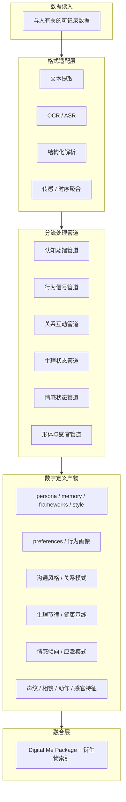
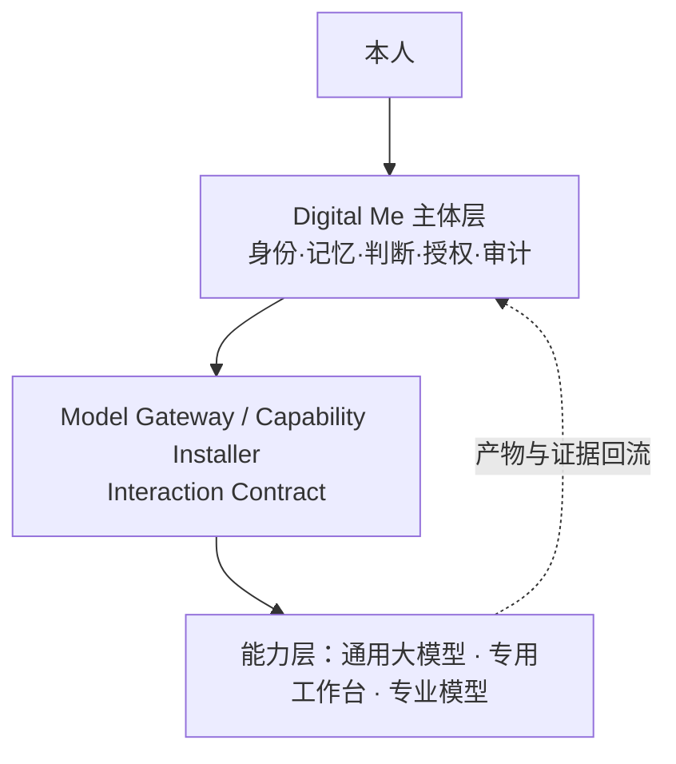

# Digital Me 项目上下文（参照 Aivestor）

版本：v0.1
状态：持续更新
最后更新：2026-07-21

> **当前产品主线（2026-07-21，规划基线重建）**：**数字主体第一纵向闭环 — 理解我并产出**。  
> **最高架构与研发原则**：[`digitalme_subject_architecture_and_rd_principles_v0.1.md`](digitalme_subject_architecture_and_rd_principles_v0.1.md)（**v0.1.1 `active`**）。  
> **当前唯一执行计划**：[`digitalme_first_vertical_loop_sprint_plan_v0.1.md`](digitalme_first_vertical_loop_sprint_plan_v0.1.md)（**v0.1.5 `spec_frozen`**；第 1–2 块 `accepted`；第 3 块 `implemented_pending_codex_review`）。  
> **冻结规格**：[`digitalme_first_vertical_loop_spec_v0.1.md`](digitalme_first_vertical_loop_spec_v0.1.md)（**v0.1.0 `spec_frozen`**）。  
> **下一项任务**：**第一闭环实现 · 第 4 块：Experience Proposal 与主体回流** — 须获实现授权后才编码。  
> **废止/暂停**：不再以 R2 边缘验收、R3 迁移、旧 Skill/MCP/Agent/身份并列 7 任务块、**旧 DM-Core-01A 开发指令**为当前执行主线。R2 代码 **retained as infrastructure**；R3 = **`paused`**；PAN-02～06 相对新主线 **`paused`**。提交 **`55ae01f`** = **`partially_reused_as_first_vertical_loop_scaffold`**。
> **产品定义（摘要）**：Digital Me 是由本人拥有和控制、以本人为源头持续形成、能够调用外部智能能力，并在明确授权下代表本人感知、判断、表达、行动和协作的个人数字主体系统（全文见架构原则文 §1）。
>
> **历史主线（已降级）**：**P1-PANORAMA** 与 Renderer Foundation（R0/R1 `accepted`；R2 实现保留）见 [`digitalme_panorama_execution_index_v0.1.md`](digitalme_panorama_execution_index_v0.1.md)（**不再作为当前执行索引**；状态标记 `superseded_as_current_execution_index`）。
>
> **界面与功能需求源**：桌面应用既有表面细则仍以 [`digitalme_product_spec_v0.2.md`](digitalme_product_spec_v0.2.md)（文内 **v0.6.3**）为参照；**与新主线冲突处以架构原则文与第一闭环计划为准**，规格待后续对齐升版。战略与逻辑架构以本文 + 架构原则文为准；**部署与系统拓扑**以 [`digitalme_architecture_edge_sovereign_v0.1.md`](digitalme_architecture_edge_sovereign_v0.1.md) 为准。
>
> **公共叙事**：数字主权为目标与核心公共叙事；广义数字资产口径与 Digital Org 长期方向见 [`digitalme_digital_sovereignty_narrative_v0.1.md`](digitalme_digital_sovereignty_narrative_v0.1.md)。Digital Org **不进入**本轮个人闭环实现。
>
> **产品身份（2026-07-11）**：Digital Me 是面向**大量真实用户**的通用产品，不是仅为当前 Owner 服务的定制化 Demo。当前 Package / 试用材料仅作验证样本；默认能力、默认文案、默认流程必须以普遍用户为准。见 §3 第 16 条、§5.4、决策 #27–#28。

## 1. 项目背景

Digital Me 旨在解决 AI 时代“人的主体性”问题：个人如何在 AI 能力快速增强的环境中，持续保有并扩展自身的记忆、判断、表达、能力与关系，而不是被平台和模型吸收。

Aivestor 提供了可验证样本：个人判断与表达可被结构化蒸馏、可迁移导出、可跨工具复用。这证明了 Digital Me 的核心路径具备现实基础。

## 2. 项目目标与阶段计划

### 2.0 系统建设双线指导思想（2026-07-12）

Digital Me 的系统推进建设，长期按**两条并行主线**组织，不得只做其中一条而空转另一条：

| 主线 | 要达成什么 | 产品落点（示意） |
|------|------------|------------------|
| **A · 数字化构建人** | 将人进行数字化构建，确立**真实、动态**的数字之我，并具备**自我管理、自我发展**的条件与能力 | 「我」：材料 → 人模型富化 → Package / 认知面板 / 边界与意图；映射循环；主权与自我定义 |
| **B · 主体化数字实体** | 将数字之我打造成具备**主体性**的数字实体后，建立其**主动产出**，以及与他人（含其它 Agent）**合作**的顺畅体验，支撑人在**现实世界与数字世界**的存在与发展 | 对话 / 做事（分场景） / 能力扩展；应用循环；协作与授权网关；像我委派与回流 |

**关系说明**：

1. **A 是根基，B 是伸展**：没有可核对、可纠错、可授权的「真实动态之我」，主动产出与对外合作只会变成通用助手壳；没有 B，A 会沦为个人档案柜，无法支撑人在双世界中的存在与发展。
2. **与三循环对齐**：A 主要对应**映射循环**（及规则化反馈中「守住是谁」的部分）；B 主要对应**应用循环**（及规则化反馈中「对外行动与协作」的部分）。反馈循环同时服务 A（纠错进化）与 B（协作中学习）。
3. **排期与验收**：凡功能立项，须能说清主要服务 A、B 或双线衔接；禁止只堆能力安装而不加深「是谁」，也禁止只堆画像而不打通产出与协作体验。
4. **与主权原则一致**：A 落实自我定义权与自我发展的条件；B 在授权边界内把主体性延伸到数字世界行动面。见 `digitalme_data_sovereignty_principle_20260711.md` 与决策 #23、#34。

一句话：

> **先把人建成真实动态、可自我管理与发展的数字之我；再把它做成有主体性的数字实体，能主动产出、能与人及 Agent 顺畅合作，从而支撑人在现实与数字两个世界里的存在与发展。**

### 2.0.1 四板块推进共识（2026-07-13；排期先后被 P1-PANORAMA 与 2026-07-21 第一纵向闭环覆盖）

在双线指导思想之下，系统长期按四个板块组织（对应建设顺序，非四个并列产品）。**以下「近期取舍」为 2026-07-13 历史策略记录；自 2026-07-18 起曾以 P1-PANORAMA 覆盖；自 2026-07-21 起当前排期以第一纵向闭环计划为准**（见 `digitalme_first_vertical_loop_sprint_plan_v0.1.md`）。

| 板块 | 对应主线 | 核心命题 | 近期取舍（历史；已被 Panorama 覆盖） |
|------|----------|----------|------------------|
| **① 数字之我构建** | A | 架构精修；采集完整、便捷、**三低成本**；准确性与一致性 | **（历史）曾为排期主战场**：养我体验、蒸馏质量、投递箱/分流 → **现为体验链「构建我」环节，服从 Panorama 闭环** |
| **② 能力构建（眼耳口鼻手脚）** | B 的执行面 | 编程、自媒体、营销、写作、商务、运维、重复任务等 | **跟随策略**：不争最强最新，直接导入业界最好能力 → **现为「武装我」** |
| **③ 协作雏形** | B 的协作面 | 唯一标识、结算/能力/数据 API；对外展示与匹配；可雇佣/可授权 | **架构已备、运行时分期** → **现为「授权我 / 代表我协作」本地模拟切片** |
| **④ 快速启动（增长）** | 双线获客 | 关系导入、示范包、开放信息预生成等 | **只做服从主权的冷启动**；不做以匹配/恋爱为主产品的增长捷径 → **与 PAN-05 传播同步** |

正式细则见 §2.6（构建质量）、§7.11（能力跟随）、§7.12（协作与服务面）、§7.13（冷启动与暂缓项）；决策 #36–#39、**#58**。

### 2.1 北极星目标

构建“本地优先、平台中立、可迁移、可授权、可审计”的个人数字主体系统，使 Digital Me 能够与其他 Agent 和他人协作、交易，并持续演化。

北极星须同时覆盖 §2.0 双线：对内建成**真实动态之我**（A），对外形成**可行动、可协作的主体体验**（B）。

### 2.2 MVP 核心目标（2026-07-08 更新）

MVP 的最主要目标是**将人与 AI 结合起来：把人蒸馏进 Digital Me，形成明确属于自己的数字之我，并让它在数字世界中"动起来"**（对齐 §2.0：A 建成之我，B 使之行动）。具体包含三层能力：

1. **映射循环（数字孪生）**：持续收集人的数据——行为、工作成果、生理、情感等——沉淀到 Digital Me 中，使其成为人及人的工作生活的动态映射；
2. **应用循环（主动产出）**：人主动应用 Digital Me 吸收更多信息数据、产出更多产物。Digital Me 不自己开发功能，而是以 AI 为底座，可选择安装任意市场可用的能力（Skill / 插件 / MCP 工具等），灵活适应数字世界中的任何任务；
3. **规则化反馈（相对独立性）**：Digital Me 具备按预定规则对外界信息进行反馈调整的能力。在此意义上，它是一个超越于人、相对独立的数字存在，但始终受本人规则与授权约束。

### 2.3 阶段计划（当前共识）

1. **定位与结构**：完成定位、主权原则、能力抽象、Package 结构；
2. **Builder 原型（蒸馏）**：导入资料并生成 persona/memory/skill/policy，形成"明确的自己的 Digital Me"；
3. **Runtime 原型（动起来）**：本地优先运行、模型网关、审计日志、数据持续采集、能力安装机制、规则化反馈引擎；
4. **协作协议层（架构预留）**：Interaction Contract、授权网关、权限沙箱；
5. **交易能力（架构预留，暂不落地）**：计费策略、结算记录、收益对账的结构预留；
6. **网络试点（远期）**：待外部交互场景成熟后，验证"人-Agent-人"协作闭环。

### 2.4 本我复现与全数据覆盖原则（2026-07-09 确立）

**定位重申**：Digital Me 的目标是**尽可能复现人的真实状态**，并以数字化形态重新武装后投身于数字世界——不是聊天机器人的变体，而是可独立行动、持续演化的**个人数字主体**。

**主线（当前与长期）**：从人的各类可记录数据中**蒸馏提取综合特征**（表达风格、价值立场、判断框架、记忆、偏好、行为模式等），是**本我复现的关键路径**。当前以文本素材（著作、文章、方案、对话转写等）为**材料技术主战场**（非产品排期主线；**产品排期**见 `digitalme_first_vertical_loop_sprint_plan_v0.1.md`；§2.8 为三位一体历史定义），这条主线须持续完善——包括格式适配、蒸馏算法、多源交叉验证、核心层整合与检索增强。

**远景（方向确定，分期实现）**：Digital Me 应能处理**与一个人有关的所有可记录、可传递的数据**，无论单条价值量大小。终局愿景是：**将与某人有关的全部信息投入系统，即可在数字世界中得到一个在思想、意识与行为上与真人高度相似的数字之人**。

| 原则 | 含义 |
|---|---|
| **全数据覆盖** | 文字、对话、工作成果、决策记录、音视频、图像、日程、关系互动、生理与情感信号等，凡可数字化留存者，均属素材范畴；不因当前价值不明而排除 |
| **能力逐步建立** | 格式适配层（提取 / OCR / ASR / 结构化解析）与蒸馏 / 行为 / 关系等分流管道分期接入；架构预留全量入口，实现按投入产出比与技术成熟度排序推进 |
| **算法持续精进** | 蒸馏引擎不固化于 v0.1 提示词；随素材类型扩展，持续优化「如何从各类数据中提取、校验、融合人格信号」——含多源交叉验证、行为反推、矛盾信号处理、信噪比过滤 |
| **产品可行性约束** | 方向不因工程分期而动摇，但**每一阶段的交付须是可用的产品**：优先高价值、高成熟度、低摩擦的素材类型；避免为远景牺牲当前用户的获得感 |

**与现有架构的关系**：

1. **映射循环（§2.2）** 是本原则在运行层的体现——持续采集 → 沉淀 → 动态映射；
2. **Data Ingestion Pipeline（§4.2）** 是全数据覆盖的工程载体；
3. **四层「像我」路径（§4.4）** 是本我复现的技术栈——蒸馏为骨架，向量化与检索为血肉，反馈为进化；
4. **起步双材料 + 评测问卷（`digitalme_intake_questionnaire.md` v0.2）**：履历（人生事实）与评测（观念判断）搭大致框架；问卷与文件导入同属蒸馏主线。无文件时用问卷；无履历时用「人生骨架」。

**当前实现差距（诚实标注）**：v0.1 已打通 docx / txt / md / pptx / pdf 文本蒸馏 + 问卷；音视频、图像、行为数据等尚未接入。差距属分期交付，非方向退缩。

### 2.5 分流管道、数字定义与多模态呈现（2026-07-09 远景架构）

**理想输入态**：系统读入与人有关的数据后，**按数据类型自动分流**至不同处理管道，各自生成对应的**数字定义**（Digital Definition），再融合为完整的数字主体。不是「所有数据走同一条文本蒸馏」，而是「一类数据 → 一条管道 → 一类数字定义」。



| 处理管道 | 典型输入 | 生成的数字定义 | 复现维度 | v0.1 状态 |
|---|---|---|---|---|
| **认知蒸馏** | 著作、文章、方案、对话转写、读书笔记 | persona、memory、decision-frameworks、style-guide、skills | 思想、观点、价值观、判断方式、表达风格 | ✅ 部分实现（文本） |
| **行为信号** | 日程、待办、选择记录、消费、出行、应用使用 | preferences、行为画像、优先级模型 | 真实行为偏好 vs 自我描述 | ❌ 架构预留 |
| **关系互动** | 微信/邮件、会议记录、社交互动 | 沟通风格（分对象）、关系模式、协作习惯 | 对不同关系中的「另一个我」 | ⚠️ 间接（经文本蒸馏） |
| **生理状态** | 可穿戴、睡眠、运动、体检、慢病指标 | physiological-profile（节律、基线、阈值） | 生理节律对精力与决策的影响 | ❌ 架构预留 |
| **情感状态** | 情绪日志、应激事件、（可选）生理耦合信号 | affective-profile（倾向、触发、恢复模式） | 情感反应与压力下的行为变化 | ❌ 架构预留 |
| **形体与感官** | 照片、视频、录音、动作捕捉 | voice-model、appearance-model、motion-model、感官特征描述 | 声音、相貌、动作、体态、官能特征 | ❌ 架构预留 |

**融合原则**：各管道产物分属 Package 不同模块（或本地衍生物索引），通过 `identity` 与 `manifest` 关联为同一数字主体；管道之间**可交叉校验**（如自我报告 vs 行为记录 vs 生理信号）。

---

**理想输出态**：当前输出以**认知层**为主——观点、价值观、风格、判断、文本对话与文件产出（PPT 等）。远景中，Digital Me 的**呈现与交互**应覆盖人的多模态存在，使数字之我不仅能「说得像」，还能「听起来像、看起来像、动起来像」：

| 输出层 | 内容 | 典型场景 | v0.1 状态 |
|---|---|---|---|
| **认知 / 语言** | 观点、论证、风格化文本、结构化文件 | 对话、写作、决策辅助、报告/PPT | ✅ 已实现 |
| **声音** | 个人声纹、语调、语速、口头禅 | 语音播报、播客、有声内容、语音助手 | ❌ 远期 |
| **相貌** | 面部、体态、着装风格 | 头像、视频出镜、虚拟形象 | ❌ 远期 |
| **动作** | 手势、姿态、习惯性动作 | 演示、教学、虚拟陪伴 | ❌ 远期 |
| **影音** | 个人化视听内容生成 | 演讲视频、课程、自媒体 | ❌ 远期 |
| **感官 / 具身** | 在虚拟环境中的感知与反应模式 | **游戏**、**虚拟场景任务**、**数字医学**（康复训练、医患沟通模拟、健康行为干预） | ❌ 远期 |

**输出与输入的对称性**：形体与感官管道的输入（录音、影像、动作数据）既是数字定义的来源，也是多模态输出的训练/配置素材。认知管道提供「想什么、怎么说」；形体管道提供「谁在说、怎么动」；生理与情感管道提供「在什么状态下做判断」——三者合一，方接近「思想、意识与行为均高度相似」的终局。

**产品分期（重申）**：上表全部为实现方向；近期仍聚焦认知蒸馏主线与可交付文本/文件产出。声纹、相貌、游戏具身、数字医学等依赖技术成熟度与合规边界，按场景价值与可行性排序接入，**不因远期宏大而阻塞当前可用产品**。

### 2.6 数字之我构建精修：完整性 · 三低成本 · 准确性一致性（2026-07-13）

**判断**：架构骨架已具备；下一阶段不是另起炉灶，而是把「养我」做成可度量、可交付的产品质量。属线 A 的精修主线。

| 维度 | 含义 | 产品落点 | 验收示意 |
|------|------|----------|----------|
| **完整性** | 该进数字之我的材料能进、该分流的能分对；缺口可见、可补 | 投递箱、分流建议、人生轨迹与认知面板缺口提示；问卷补洞 | 用户能看见「还缺什么」而非默默残缺 |
| **便捷性** | 少步骤、少术语、默认正确路径 | §3.1 少决策；智能构建；一键导入 | 完成一步即感到变强 |
| **三低成本** | 同时压低**认知成本、时间成本、资金成本** | 认知：说人话、少选项；时间：自动写入/批量构建；资金：本地优先、能力跟随导入而非自研堆成本 | 普通用户能在可接受时间内完成初次可用之我 |
| **准确性** | 事实、观点、风格与本人可核对；可纠错 | 质检 Agent、sourceRefs、人工确认中高把握自动采纳边界 | 高后果内容可溯源；编造可标出 |
| **一致性** | 跨对话、跨产物、跨时间不自相矛盾；与禁区/边界一致 | 核心层 + 检索 + 边界注入；矛盾信号进入审阅 | 「像我」不因会话切换而漂移 |

**与现有原则关系**：完整性 ↔ §2.4 全数据覆盖（分期）；三低成本 ↔ §3.1 人人可用；准确性一致性 ↔ §4.4 四层像我路径 + §7.9 质检/证据链。

**排期含义**：线 A 精修优先于线 B 的复杂协作运行时；但线 B 的能力跟随（§7.11）可并行，因其不依赖完整协作网关。

### 2.7 审计后第一阶段：主体可信化与协作感知（2026-07-16；执行队列已于 2026-07-18 降级）

依据 `digitalme_architecture_audit_20260716.md`，当前系统正式定义为**具备真实功能闭环的单机 Alpha**：战略与逻辑骨架成立，但安全、数据完整性、版本回滚、权限强制和评测尚未达到可信主体或公开测试门槛。

第一阶段总目标（仍有效）为：

> **强化主体属性与用户的主体认知和产品感知；建立安全、可信、可管的主体内核；让已有写作、研究和受控执行能力真实稳定可用；建立用户可见、默认私有、可授权可撤销的外部协作最小骨架。**

本阶段四条主线（产品意图仍有效）：

1. **主体可感知**：主体首页、事实/声明/推断/状态/发展意图分层、版本与待确认变化；
2. **主体可信可管**：PackageStore、SecretStore、PolicyEngine、可信审计、备份恢复与回滚；
3. **能力真实可用**：写作、研究、受控文件/执行三条主路径连续真实验收；停止用能力数量或 UI 存在证明完成；
4. **协作最小感知**：本人可读能力名片、Agent Card 草案、一次性 Interaction Contract、本地协作模拟与结果回流。

**排期变更（2026-07-18，决策 #58；已被决策 #94 覆盖）**：`digitalme_phase1_subject_upgrade_plan_v0.1.md` **不再作为当前顺序执行计划**；降级为 Trusted Beta 依据。当时曾将主线切为 **P1-PANORAMA**。**2026-07-21 起**：当前唯一产品执行主线为 **第一纵向闭环 — 理解我并产出**（见 `digitalme_first_vertical_loop_sprint_plan_v0.1.md`）；P1-PANORAMA 降为历史主线与基础设施状态表。

### 2.8 第一阶段三位一体 Alpha / Trusted Beta（2026-07-18 确立；2026-07-19 PAN-00R 修订）

**第一阶段最高定义（PAN-00R，取代「在首页完整展示产品全貌」的旧理解）**：Digital Me 第一阶段必须同时完成三个组成部分的 Alpha：

| 组成 | 要点 |
|---|---|
| **理解我** | 低负担输入本人资料与日常表达；后台正确蒸馏，区分事实、本人主张、推断、当前状态和边界；用户只处理少量关键纠错与确认；任务相关信息可准确检索；无关主体信息保持沉默；不用密集页面证明理解 |
| **武装我** | 统一能力框架；真实可体验的能力样例；能力可安装、扩展、替换和撤销；主体信息只在相关时增强结果；AI 能力上限不被蒸馏结果限制 |
| **连接世界** | 外部请求、授权、执行、停止、结果处置和记录的协作骨架；第一阶段不要求全面公网协作，但须让用户感知未来如何代表本人；外部行动受本人授权和边界约束；结果与反馈形成成长候选；外部输入不得直接改写主体 |

**产品意义**：只有「理解我」是数字档案；「理解我 + 武装我」是个性化 Agent；三者齐备才形成产品与技术意义上的初级数字主体。法律身份、社会承认、规模互操作属于后续阶段，第一阶段不得过度宣称。

**第一阶段闭环**：用户输入自己 → 后台蒸馏并形成可修正的自我 → 调用可扩展能力 → 经本人授权参与外部协作 → 获得结果与反馈 → 形成事实、经验、能力表现或发展线索候选 → 经正确分类及必要确认后推动 Digital Me 成长 → 改善下一次工作与协作。成长回流规则见 PAN-00R 任务包 §2.1（外部输入不得直接改写主体；立场/意图/人格/边界改变须本人确认）。

| 层 | 目标 | 文档 |
|---|---|---|
| **三位一体 Alpha** | 理解我 × 武装我 × 连接世界三部分 Alpha 达标；极简前台 + 复杂后台 | `digitalme_phase1_task_P1-PANORAMA_product_panorama_alpha.md`（v0.4）；产品规格 v0.6 §7.6 |
| **Trusted Beta** | 按用户证据完成高风险路径、异常、迁移、兼容与安全硬化 | 原第一阶段升级计划（降级后）+ PAN-06 输出 |

四个产品承诺：**这是我 · 属于我 · 由我管 · 代表我协作**——继续有效，但作为帮助与叙事内容，由真实体验兑现，不作为默认首页主体。

**「产品全貌」新定义（PAN-00R）**：不是在一个页面上把所有概念展示出来，而是用户通过几条简洁、真实、可完成的路径，自然建立认识：它逐渐理解我；它能获得能力并帮助我工作；我可以修正和约束它；风险与对外行动由我决定；它能够与世界交互；它会从经历和反馈中成长。

**数字主权**：是 Digital Me 的目标与核心公共叙事。「数据」采用广义口径（事实信息、知识、文章、报告、代码、设计、影音、判断、关系、项目记录及其它数字产出物）；不采用机械化个人数据变现叙事；核心是主体对其合法数字资产与产出物拥有可执行的管理、使用、授权、限制、撤销、迁移和价值安排能力。Digital Me 是数字主权的重要基础设施与支撑方，**不宣称**单靠产品已完成法律、市场与社会制度变革。母稿：`digitalme_digital_sovereignty_narrative_v0.1.md`。

**Digital Org**：纳入长期架构方向；可与 Digital Me 共享主体、资产、能力、授权、协作和审计内核。多成员、角色审批、机构数据授权和价值分配运行时 **不进入**当前个人 Alpha；P1-PANORAMA 完成后再评估 `DORG-00`。

执行索引（历史）：`digitalme_panorama_execution_index_v0.1.md`。  
**当前执行计划**：`digitalme_first_vertical_loop_sprint_plan_v0.1.md`。

## 3. 主要结论（当前阶段）

1. Digital Me 不是“聊天机器人产品”，而是“人的数字主体层”；
2. Skill/Agent/数字员工可由 Digital Me 调用或派生，但不能替代 Digital Me 本体；
3. 第一阶段应坚持“用户主权 + 本地优先 + 可迁移 + 可审计”；
4. **区块链不作为主技术底座**，而作为可插拔的确权、存证、结算增强层；
5. 必须内置高风险动作人工确认机制；
6. 先解决可用性与可迁移，再扩展协作交易网络效应；
7. **商业应用场景当前尚不清晰，不作为 MVP 驱动力**。协作与交易能力是从个人主权、数据主权出发的架构性准备（例如未来"机构付费获得个人数据授权用于模型训练"这类场景），条件规划好、逐步推进，但不据此做近期预测；
8. **Digital Me 采用"能力安装"而非"功能自研"模式**：以 AI 为底座，通过安装市场可用能力适应任务，自身核心只做身份、记忆、判断、授权与审计。
9. **面向所有人，而非仅懂技术的人（2026-07-09 首要原则）**：产品默认服务普通用户。技术细节（协议名、命令行、运行时、包名、中间态）一律藏到后面；与人交互的界面须简单易懂，**主动减少用户决策负担**。开发者能力通过「高级」入口保留，不得成为默认路径。
10. **主体层 × 能力层（2026-07-10）**：与大模型/工作台/专业模型是分层协同而非同台竞品；核心能力与能力半径（暂时）区分见 §7.10，由此留出独立发展空间。
11. **规格驱动开发（2026-07-10）**：界面与功能以 `digitalme_product_spec_v0.2.md` 为唯一需求源；零星试用反馈先入 backlog 评审，再改规格升版后开发。见该文档 §0。
12. **普通人语言 + 暖色人感（2026-07-10）**：面向技术小白与普通知识工作者；默认路径使用标准化通用语言，消除技术名词/技术逻辑外露。界面消除冷清机械与强科技感，采用暧色调、强调人感。见产品规格 §2 第 2–3 条。
13. **端主权 × 云边平台（2026-07-10）**：面向百万用户/百万日活，采用「本地主体客户端 + 可扩展云边服务 + 外置能力层」；否决纯 Web SaaS 明文中心人设库为主架构，亦否决纯离线桌面为终局。扩容对象是账号/加密同步/模型网关/协作与计费，不是把「每个人的我」做成中心库。详述见 `digitalme_architecture_edge_sovereign_v0.1.md`。
14. **成稿与对话分流 + 真实交付（2026-07-10）**：普通问答完整留在主对话；右侧用户面称「成稿预览」（不用「画布」）。成稿须为正文而非下载说明；自动落盘 `文档\DigitalMe\成稿\`；导出 Word（`.docx`，宋体/雅黑）须 WPS 可开。禁止模型谎称已写文件。见产品规格 §4.5 与决策 #22。
15. **个人数据主权 = 自我定义权 + 自我发展权（2026-07-11，指导思想）**：主权不仅是数据归属，更是人声明「是谁 / 要成为谁 / 需要什么信息」并管理自己目标函数的权利——抵抗被自动算法吸入黑洞的有效武器，保持人之为人的理性之锁。主权必要非充分：须配合意图层（人定方向与约束）与发展型用户假设；默认发展向匹配，不得为增长退化为时长最大化。完整原则与六条开发约束见 [`digitalme_data_sovereignty_principle_20260711.md`](digitalme_data_sovereignty_principle_20260711.md)。
16. **通用场景文案 + 通用需求优先（2026-07-11）**：产品默认文案须服务普通用户真实场景，禁止把研讨个案写进界面；需求取舍以普遍性为准，协作方（含 AI）应对非普遍需求提出反对与更通用方案。见 §3.1、§5.4 与产品规格 §2 第 10–11 条。
17. **系统建设双线指导思想（2026-07-12）**：（A）数字化构建人——真实动态的数字之我 + 自我管理与自我发展的条件与能力；（B）主体化数字实体——主动产出 + 与他人/其它 Agent 合作的顺畅体验，支撑人在现实与数字两个世界的存在与发展。A 为根基、B 为伸展；功能立项须标明服务哪条线。正式条文见 §2.0、决策 #34。
18. **「我」内构建 | 数字之我二分（2026-07-12）**：构建 = 进料与加工；数字之我 = 成品与校对。侧栏不单列构建。智能构建（分批/截断/可中断）+ 少决策自动写入为养我主路径。规格 v0.2.10、决策 #35。
19. **四板块推进（2026-07-13）**：①数字之我构建精修（完整/便捷/三低成本/准确一致）→ ②能力跟随导入 → ③协作雏形（标识·API·展示·可雇佣）→ ④服从主权的冷启动。见 §2.0.1、决策 #36–#39。
20. **能力板块跟随策略（2026-07-13）**：编程、自媒体、营销、写作、商务、运维、重复任务等能力面**不争最强最新、直接导入业界最好**（Claude Code/Codex、编排框架、MCP/Skill 市场等）；Digital Me 负责像我约束、授权、审计与回流。见 §7.11、决策 #37。
21. **协作服务面分期（2026-07-13）**：对外「能做什么」展示、自动匹配、数字之我出租/受雇、个人数据授权、接零活/分包——方向确认；运行时在架构就绪后分期点亮，不阻塞养我与能力跟随。见 §7.12、决策 #38。
23. **对话轻入口 + 做事分场景（2026-07-13）**：侧栏「对话 | 做事 | 我 | 能力」；写作合并为唯一交付面；对话「留为文稿」；未就绪场景标筹备中。规格 **v0.3**、决策 #44。
24. **极简产品原则（2026-07-19，PAN-00R 冻结）**：后台复杂、前台极简；用户体验结果，不观看系统证明自己；个性化默认隐性发生；授权只在风险边界上显性发生；审计、来源和依据可按需展开但不占主界面；日常无感、风险有感；能力无负担、权力有控制；重要异常、冲突或外部行动才打断用户；普通用户界面不得展示产品规格、工程状态或系统设计说明；页面文字大幅减少。前台/后台/帮助/高级四层分层与「产品全貌」新定义见规格 v0.6 §2.0、PAN-00R 任务包 §4。
25. **AI 使用主体信息原则（2026-07-19，PAN-00R 冻结）**：不采用「回答上限受蒸馏内容限制」逻辑，也不采用「先生成通用答案再机械贴入个人引用」逻辑。**AI 负责能力上限；Digital Me 负责方向、真实性、边界、连续性和本人特征。** 相关性门强制：与任务无关的主体信息不得进入生成；无相关信息时宁可不做个性化。见 §4.4、规格 v0.6 §2.0.1。

### 3.1 交互体验总则（2026-07-09）

| 准则 | 含义 |
|---|---|
| 人人可用 | 不以「会配开发环境」为前提；默认路径零技术门槛 |
| 细节后置 | MCP、npx、API、路径、编码等只出现在高级/故障排查 |
| 少决策 | 能默认的就默认；能自动的就自动；选项越少越好，推荐优于全量罗列 |
| 说人话 | 状态、错误、下一步用场景语言，不用协议错误码堆砌 |
| 立刻获得感 | 用户完成一步后应感到「变强了」，而不是「又多配了一项」 |
| 认证后置 | 需到原网站申请 API Key / Token / OAuth 的能力，**不进入默认推荐**；要么后台代完成，要么归入「高级」 |
| 通用场景文案 | 说明与示例用多数人熟悉的材料/情境；勿用仅对当前试用者有意义的个案 |
| 通用需求优先 | 默认能力服务普遍用户；个人特例不升为全体默认 |

**适用范围**：能力扩展、任务产出、蒸馏 Builder、设置、对话工作台——全产品面，不仅限于 MCP。界面与功能细则见 `digitalme_product_spec_v0.2.md`。

### 3.2 产品规格与分期指针（2026-07-10）

| 文档 | 作用 |
|---|---|
| `digitalme_subject_architecture_and_rd_principles_v0.1.md` | **当前最高架构与研发原则**：产品定义、数字主体循环、能力/身份/验收、纵向闭环、治理 |
| `digitalme_first_vertical_loop_sprint_plan_v0.1.md` | **当前唯一执行计划**（v0.1.2 `spec_frozen`）：冲刺状态与任务顺序 |
| `digitalme_first_vertical_loop_spec_v0.1.md` | **第一闭环冻结规格**（流程、四合同、能力、55ae01f 裁定、验收） |
| `digitalme_product_spec_v0.2.md`（文内 **v0.6.3**） | **既有界面与功能细则参照**（与新主线冲突处以架构原则文 / 第一闭环计划为准，待对齐升版） |
| `digitalme_phase1_task_P1-PANORAMA_product_panorama_alpha.md`（v0.4） | **历史总任务**：三位一体 Alpha（`superseded` 作为当前主线定义） |
| `digitalme_phase1_task_PAN-00R_three_part_alpha_reset.md` | **历史战略修订依据**：三位一体定义、极简原则、PAN-01/PAN-01R 裁定 |
| `digitalme_panorama_execution_index_v0.1.md` | **历史执行索引 / 基础设施状态表**（`superseded_as_current_execution_index`；保留 R0–R2 事实） |
| `digitalme_digital_sovereignty_narrative_v0.1.md` | **公共叙事母稿**：数字主权、广义数字资产、Digital Org |
| `digitalme_architecture_edge_sovereign_v0.1.md` | **部署与系统拓扑唯一详述**：端主权 × 云边平台；多端职责；云模块优先级；百万 DAU 分期；安全基线 |
| `digitalme_phase1_subject_upgrade_plan_v0.1.md` | **Trusted Beta 硬化与风险依据**（不再作为当前顺序执行计划） |
| `digitalme_architecture_audit_20260716.md` | **审计风险基线**：代码事实、P0/P1/P2 发现、生产就绪判断与整改依据 |
| `digitalme_capability_status_v0.1.md` | **工程能力证据表**（不自动决定用户面状态） |
| 本文 | 战略（含 §2.0 双线）、逻辑架构（§4）、主权、协议、决策索引；**主线条以文首为准** |
| `digitalme_data_sovereignty_principle_20260711.md` | **个人数据主权指导思想**：自我定义与自我发展权利；对抗算法黑洞；画像/推荐/匹配开发约束 |
| `digitalme_narrative_ai_era_autonomy.md` | 对外/对内叙事（含双线简述） |
| `digital-me-project-positioning-draft.md` | 定位讨论稿（战略原则含双线） |

**近期工程焦点（2026-07-21）**：决策 **#94–#96**——第一纵向闭环规格已 `spec_frozen`；下一项 = **实现任务意图与本人上下文装配（第一闭环实现 · 第 1 块）**（待授权）。R3 paused；`55ae01f` retained_for_mapping_review（已裁定）。
## 4. 系统架构共识（草案）

> **部署拓扑补充（2026-07-10）**：本节描述逻辑模块（核心层 / 运行层 / 信任层）。物理部署与百万规模扩容面见 [`digitalme_architecture_edge_sovereign_v0.1.md`](digitalme_architecture_edge_sovereign_v0.1.md)（端主权 Runtime + 云边平台 + 能力层）。决策 #3「本地优先 + 云同步」由此文细化。

### 4.1 核心层

1. Identity & Ownership（身份与权属）；
2. Memory & Source（记忆与来源）；
3. Skill & Decision（能力与判断）；
4. Policy & Authorization（策略与授权）；
5. Audit & Accountability（审计与追责）。

### 4.2 运行层

1. Digital Me Builder（蒸馏与版本更新）；
2. Digital Me Runtime（本地优先运行环境）；
3. Data Ingestion Pipeline（持续数据采集 → 按类型分流至各处理管道，见 §2.5；支撑数字孪生映射）；
4. Model Gateway（多模型路由，AI 底座）；
5. Capability Installer（能力安装器：从市场安装 Skill / 插件 / MCP 工具，不自研功能）；
6. Feedback Rules Engine（规则化反馈引擎：按预定规则对外界信息做出反馈调整）；
7. Interaction Gateway（对外协作调用，架构预留）；
8. Usage & Settlement Ledger（计量结算账本，架构预留）。

### 4.3 信任增强层（可选）

1. DID（按需启用）；
2. Package Hash Anchor（链上哈希锚定）；
3. 授权凭证与结算凭证存证。

### 4.4 “输出像我”的技术路径（2026-07-08 结论）

按保真度与成本递进，采用四层组合：

1. **蒸馏文件（骨架）**：style-guide / decision-frameworks / memory，保证输出“不出格”，但仅靠描述性规则上限约六七分像；
2. **素材向量化（血肉）**：对原始素材（书、文章等）建向量索引，保证观点与知识引用准确。索引是可重建的衍生物，存本地缓存（如 `source-materials/.index/`），不进 Package 核心，不破坏可迁移性；
3. **示例检索（语感）**：任务执行时检索本人最相关的原文片段作为 few-shot 样本，“展示而非描述”，是提升风格还原度性价比最高的一层；
4. **反馈回流（进化）**：用户修正按类型回流更新风格与记忆，“像我程度”随使用爬升。

微调（fine-tune / LoRA）保真度最高，但绑定模型、维护成本高，与平台中立原则冲突，MVP 阶段不做；若后续采用，Package 与素材库仍为唯一事实源，微调模型仅为可再生成的加速件。

**落地进展（2026-07-08）**：第 1 层（蒸馏文件）与第 3 层（示例检索）已初步实现——
- **记忆采用"核心层 + 原始底料"双层结构**：全量蒸馏（914 记忆 / 170 框架）经语义整合浓缩为核心层（30 记忆 / 16 框架 + 结构化 persona/style，对话时全量注入约 49KB）；原始底料留存于 `memory/raw-memory.jsonl`、`decision-frameworks-raw.json` 作为检索语料；
- **RAG 检索注入已上线**：`digitalme-app/src/retrieval.js` 按当前问题从底料动态召回最相关条目追加到核心层（v0.1 为本地词法检索，升级路径为嵌入向量）。第 2 层（素材整体向量化）与第 4 层（反馈回流）仍待做。

> **实现状态说明（2026-07-19，PAN-00R Codex 第一轮 / v0.6.1）**：上述「对话时全量注入约 49KB」是 **v0.6 之前的现有实现状态，不是目标行为**。默认全量注入与产品规格 v0.6 §2.0.1 相关性门冲突。**PAN-02（理解通道 Alpha）必须评估并替换为任务相关检索与分层注入**。在 PAN-02 完成前，不得以全量注入路径证明「像我」能力已经达标。本说明仅为文档定性；**不在本次文档任务中修改检索或 prompt 代码**。

**与本我复现主线的关系（§2.4）**：四层路径是「从数据到像人」的技术栈；素材类型扩展（写作 / 对话 / 决策 / 行为 / 关系 / 生理情感，见 `digitalme_log.md` 素材类型待办）与格式适配须同步推进，使每层能消费越来越全的人相关数据。§2.5 将输入分流管道与输出多模态呈现纳入同一远景架构。

**相关性门与 AI 能力上限（2026-07-19，PAN-00R 补充）**：「输出像我」不等于「输出受限于蒸馏结果」，也不等于「机械贴入个人引用」。冻结关系为：**AI 负责能力上限；Digital Me 负责方向、真实性、边界、连续性和本人特征。** 主体信息按类型分层起作用——verified fact 为事实锚点；confirmed owner assertion 为立场与意图约束；preference/style/pattern 为软引导；inference/direction clue 为低权重假设；boundary/authorization 为硬约束；**与任务无关的信息不得进入本次生成**。检索只取高度相关的主体信息；没有相关信息时宁可不做个性化，不得强行引用，更不得因主体资料不足而降低通用 AI 本可达到的输出质量。用户默认只看自然结果，依据与审计按需展开。完整规则见规格 v0.6 / v0.6.1 §2.0.1、PAN-00R 任务包 §3。

### 4.5 对齐业界互操作协议栈（2026-07-08 结论）

**背景**：2025→2026 年间智能体互操作协议已收敛为 Linux Foundation 治理的分层事实标准。Digital Me 的协作/交易能力**不自造协议、对齐标准**，且必须写入架构，否则应用推广时返工。

**分层栈与映射**：

| 层 | 标准 | 成熟度（2026-07） | Digital Me 对应 |
|---|---|---|---|
| 工具层 | **MCP** | 成熟，AAIF 治理 | Capability Installer 装能力/调工具 |
| 协作层 | **A2A** | v1.0.1（2026-05）生产可用，150+ 组织；IBM ACP 已并入 | 对外发布 Agent Card；Interaction Gateway |
| 交易层 | **AP2 + x402** | 60+ 伙伴，FIDO 标准化中；x402 链上稳定币可用 | Mandate（Intent/Cart/Payment）承载授权/结算/审计 |
| 身份层 | **W3C DID**（ANP 基于其上） | DID 成熟；ANP 标准化中 | identity.json 的 did 字段；个人/数据主权 |

**关键判断**：
1. A2A 是协作层赢家（ACP 已并入），信任基元为 W3C 可验证凭证（VC）+ 密码学签名，链仅为 AP2/x402 的可选扩展——与本项目“链非主底座”结论一致；
2. `Interaction Contract` 定位澄清为 Digital Me **内部授权编排层**，对外**编译**为标准工件：身份能力面→A2A Agent Card；计费结算→AP2 Mandate；确权→DID + 可选链上锚定；既保主权治理，又与生态即插即用；
3. MVP 不实现完整 A2A/AP2 运行时，但 **Package 数据结构已对齐其真实 schema**（本轮落地：`contracts/agent-card.json`、`contracts/interaction-contract-schema.json`、`commerce/mandates/*`、`trust/chain-anchor.json`）。

### 4.6 采用规模与接入次序（2026-07-08 调研留档）

**为什么重要**：决定"我们接入这套标准后，能够到多大的协作/工具网络"。数据说明网络效应前提已成立，佐证"对齐标准而非自造"的决策。

**采用数据**（截至 2026 H1，标注来源口径，日后需复核）：

| 协议 | 能"够到"什么 | 规模 | 来源/口径 |
|---|---|---|---|
| **MCP**（工具层） | Digital Me 可调用的工具/数据源 | 约 **9,600** 个可连接服务器（严口径；宽口径 9.6k–1.75万）；SDK 月下载约 **4.2 亿** | 官方 registry 9,652（2026-05）；Anthropic 称 10,000+（2025-12）；npm+PyPI 统计 |
| **A2A**（协作层） | Digital Me 可协作/委派的智能体 | **150+ 组织**在生产环境；22,000+ GitHub stars；5 语言 SDK | Linux Foundation 新闻稿（2026-04-09） |
| **AP2**（交易层） | Digital Me 可收付费结算的对象 | **60+** 支付/产业伙伴 | AP2 发布（2025-09）；含 Mastercard/Visa/PayPal/Coinbase/Amex |

**关键洞察（避免被"150"低估）**：A2A 已被主流 Agent 框架（Google ADK、LangGraph、CrewAI、LlamaIndex、Semantic Kernel、AutoGen、Microsoft Agent Framework）与云平台（Copilot Studio/Azure AI Foundry、Bedrock AgentCore、Gemini Enterprise，均 GA）原生支持。故实际可协作对象≈"整个用主流技术栈构建的严肃 Agent 生态"，而非一份 150 家名单。行业背景：79% 公司在采用 AI Agent，57% 大企业已部署。

**诚实注意事项**：①业界无权威的"全网可协作 Agent 实时计数"，报的是组织/服务器/框架支持；②宽口径 MCP 目录中过半服务器已失效，采用严口径约 9,600；③"支持协议"≠"愿意协作"，真正协作仍过 `Interaction Contract` 的授权/计费/审计关（正是 Digital Me 的价值点）。

**接入次序决策**：**先 MCP → 再 A2A → 最后 AP2**。
1. **MCP 优先**：立刻为 Digital Me 装上近万个现成工具，收益最直接，且是"能力安装而非功能自研"路线的现成弹药库；
2. **A2A 次之**：当需要让 Digital Me 对外被其他 Agent 发现/委派时接入；
3. **AP2 最后**：有真实收费场景时再接。
   —— 此次序与第 7.1 节"MCP 排在 Runtime 编译器之前"一致。

## 5. 人与 AI 协作方式（工作机制）

### 5.1 决策分层

1. AI 负责检索、草拟、执行低风险任务；
2. 人负责目标设定、边界定义、关键判断与高风险确认；
3. 所有关键行为保留可追溯日志。

### 5.2 交互协议

每次跨主体交互遵循 Interaction Contract，明确：

1. 谁调用；
2. 调用什么能力；
3. 用什么数据；
4. 授权多久；
5. 如何计费；
6. 如何追责。

### 5.3 反馈闭环

1. 内容修正；
2. 风格修正；
3. 结论修正；
4. 风险修正；
5. 边界修正。

反馈沉淀到 memory/policy/skill 的新版本，形成可演化系统。

### 5.4 Owner 与 AI 协作规范（产品开发，2026-07-11；2026-07-16 强化）

适用于：本仓库内产品设计、规格修订、界面文案与功能取舍（Cursor / AI 协作开发会话）。

1. **角色**：Owner 提出目标、约束与**线索**；AI 负责检索、审视、草拟、实现与**主动质检 / 检测审计**；关键判断与高风险确认仍归人。
2. **Owner 意见 = 假设与线索（强制）**：想法可能不全、可错、可非最优，**不得**直接当规格或 sprint backlog 照搬。AI 须审视后，按下列顺序推进：
   1. **审视**：普遍性、完整性、风险；可反对并给出更通用方案；
   2. **对标**：同类产品或行业最佳实践（主路径与明确不做）；
   3. **适配**：按 Digital Me 原则裁剪（主体层、能力跟随、少决策、本地优先、通用需求优先）；
   4. **规格 / 决策**：写入产品规格与本文 / `digitalme_log.md` 后再排期；
   5. **实施**：按规格落地；冲突先改规格；
   6. **检测与审计**：验收用户路径；禁止协议泄漏到用户面、空壳按钮、无依据却宣称「减少错误」。
3. **通用需求优先**：收到需求时，AI **必须先评估**是否属于多数目标用户的普遍需求。
   - 普遍 → 可进入规格与默认路径；
   - 偏个人特例 → **应明确反对或拒绝升为默认**，并提出更通用的替代方案（或建议放入高级/个人配置/可选模板）。
4. **禁止个性化牵引默认产品**：不得因当前 Package 主人、某次试用文件、讨论中的方便例子，把默认文案、默认流程、默认模板绑死在单人情境上。
5. **文案闸门（与规格 §2.12 一致）**：用户面文案须严谨明白、面向使用场景；禁止讨论腔、开发技术名词、口语化口号进入默认界面。自检：「换成陌生用户是否仍一眼明白」。
6. **规格优先**：与 §3 第 11 条、产品规格 §0.2 一致——零星试用反馈先 backlog，评审后再改规格升版开发。
7. **允许反对**：Owner 明确授权 AI 在本规范下提出反对；反对须附理由与更通用方案，不得仅说「不做」。

#### 5.4.1 规划、执行、实现与运维的固定机制（2026-07-16）

1. **Codex 为默认技术负责人**：负责审计、规划、规格、任务拆分、架构/安全复核、测试设计、结果解释与下一步路由；
2. **Owner 为目标与环境执行者**：确认真实产品取舍，执行 GUI、账号、密钥、控制台和人工体验验收，并把结果返回 Codex；
3. **Cursor 或 Codex 为单任务实现者**：按任务包编码和测试；同一任务只设一个代码 Owner，不同时修改同一组文件；
4. **任务包先于编码**：必须写明规格指针、允许/禁止范围、迁移、回滚、自动测试、人工验收与未验证边界；
5. **双重验收**：实现者提供自动验证，Codex 做架构/安全/回归复核，Owner 做产品体验验收；三者未完成不得标记 released；
6. **闭环落档**：每轮更新 `digitalme_log.md`，重要变更同步 context/product/architecture，避免规格与实现再次漂移。

完整机制见 `digitalme_phase1_subject_upgrade_plan_v0.1.md` §6。

**决策编号**：#27、#46、#47。

## 6. 当前风险与约束

1. 授权与责任边界不清会阻碍商业落地；
2. ~~没有统一交互协议将导致跨 Agent 协作困难~~ → 已明确对齐 A2A/MCP/AP2/DID 业界标准（见 4.5），风险转为“需持续跟踪标准演进（A2A 版本、AP2 在 FIDO 的标准化）”；
3. 若过早“全链路上链”，会抬高复杂度并影响可用性；
4. 若忽略日志与审计，将难以进入企业级场景。

## 7. 下一步工作优先级

### 7.0 已完成（截至 2026-07-08）

- Builder 蒸馏闭环（文件导入 + 问卷采集）；全量蒸馏张元林素材；
- 语义整合为"核心层 + 原始底料"双层结构；
- RAG 检索注入（本地词法检索）接入对话；
- 协作/交易对齐业界标准（A2A/MCP/AP2/DID），Package 落地对齐字段。

### 7.1 近期优先级（建议顺序）

> **2026-07-21 规划基线重建（当前）**：执行计划 [`digitalme_first_vertical_loop_sprint_plan_v0.1.md`](digitalme_first_vertical_loop_sprint_plan_v0.1.md)（**v0.1.2 `spec_frozen`**）；冻结规格 [`digitalme_first_vertical_loop_spec_v0.1.md`](digitalme_first_vertical_loop_spec_v0.1.md)。**下一项**：**实现任务意图与本人上下文装配（第一闭环实现 · 第 1 块）**（待实现授权）。R3 / 旧 DM-Core-01A 开发指令 / 并列 Skill·MCP·Agent·身份任务块 **不得**作为下一步。
> **2026-07-16 审计后重排（历史）**：第一阶段不再扩展能力面，切换为“主体可信化与协作感知”。当时以 `digitalme_phase1_subject_upgrade_plan_v0.1.md` 为执行清单；原 v0.3.13 的 L0/审计/CLI 只能视为原型，不视为已达到安全可用。
> **2026-07-18 覆盖（历史）**：当时执行索引改为 `digitalme_panorama_execution_index_v0.1.md`；原升级计划降为 Trusted Beta 硬化依据（决策 #58）。
> **2026-07-21 R2 相关（历史；已降级）**：R0/R1 accepted；R2 实现保留为基础设施，**不再**作为当前验收主线。
> **2026-07-19 PAN-01S.1 实现覆盖（历史；已被 2026-07-20 acceptance superseded）**：PAN-01S 曾为 `statically_verified` / `owner_changes_requested`；PAN-01S.1 曾为 `statically_verified` / `implemented`（不 accepted）。

1. **限定范围的仓库实现映射与第一闭环规格冻结**（文档；**已完成** → 规格 `spec_frozen`）；
2. **实现任务意图与本人上下文装配（第一闭环实现 · 第 1 块）**（**当前下一项**；待实现授权）→ 其后：研究与表达入口 → 真实 Skill → 只读外部信息 → 证据区分 → Experience Proposal 回流 → 对照验收；
3. 第二～四纵向闭环仅保留接口与方向，不得提前铺开。

（以下 1–7 为 2026-07-16 历史 Trusted Beta 硬化清单，**不再是当前执行顺序**：）

1. **工程与 Package 基线冻结**：Git、Alpha 标记、Package hash 快照、能力状态表；
2. **主体资产内核**：PackageStore、七类数据、原子版本、候选更新、来源 hash、回滚；
3. **安全可信可管**：SecretStore、PolicyEngine、Electron 安全基线、执行点可信审计；
4. **主体产品感知**：主体首页、信任中心、版本与待确认变化；
5. **已有能力硬化**：写作、研究、受控文件/执行三条路径真实验收；MCP/CLI 经 ToolBroker 限权；
6. **协作最小骨架**：能力名片、Agent Card 草案、一次性授权草案、本地模拟、结果回流；
7. **评测与阶段验收**：对照评测、安全红队、导出恢复一致性、非开发者主体认知测试。

## 7.5 输出能力演进：从"对话"到"数字员工"（2026-07-08）

> **远景补充（§2.5）**：输出不限于认知层文本与文件。远期还包括声音、相貌、动作、影音乃至感官/具身呈现（游戏、虚拟场景、数字医学等）。本节侧重「能做事」的执行能力演进；多模态呈现见 §2.5 输出层表。

用户期望 Digital Me 的输出不限于文本，而能像数字员工一样：感知外部信息输入、经外部互动后判断决策、推动流程、整合外部资源以达成既定目标。这属于从"副驾（copilot）"到"自主执行体（agent）"的跃迁，与项目定位中"Digital Me 可作为数字员工承担工作职责"一致。

实现路径（分层，风险递增，均受本人规则与授权约束）：

1. **结构化产出**：把本人作品范式（报告/约稿/提纲/备忘录等）沉淀为 Skill 模板，产出成品而非仅对话；
2. **工具执行（能力扩展 / MCP，"手脚"）**：接入外部工具，获得检索、读写文件、查数据、联网等实际动作能力；
3. **Agent 任务循环**：感知→规划→行动→观察→迭代，直到目标达成（ReAct / 工具调用循环）；
4. **触发与感知**：从"用户提问"扩展到外部事件驱动（新邮件、webhook、定时、文件变化）；
5. **规则化决策**：由 decision-frameworks + 反馈规则引擎决定行动；高风险动作强制人工确认；
6. **资源整合与协作**：多步骤、多工具编排，必要时通过 Interaction Contract 调用其他 Agent 或他人；
7. **执行审计与回流**：审计账本记录每步动作与结果，反馈更新记忆与规则。

关键约束：执行能力是复杂度与风险最高的部分，必须"能力越强、护栏越严"；高风险动作（付款、签约、对外承诺等）始终保留人工最后确认权。

### 7.7 任务产出：从对话到可交付文件（2026-07-09）

应用循环的第一项落地能力：**演讲 PPT 生成**。流程：按 Digital Me 人格/风格/框架（+ RAG）规划 JSON 幻灯片结构 → 本地 `pptxgenjs` 渲染为 `.pptx`（含演讲者备注）→ 用户选择保存路径。入口：App 侧栏 **「任务产出」**。

与纯对话的区别：对话只给提纲文本；任务产出给**可直接打开使用的文件**。后续按同模式扩展 Word/Markdown 报告、备忘录等；**能力扩展**（MCP）则负责调用外部系统（邮件、日历、联网检索等），与本地产出互补。

#### 演讲 PPT：现状与升级任务（2026-07-09 试用结论）

| 维度 | 当前 v0.1（已上线） | 待升级 |
|---|---|---|
| 目标 | **解决有无**：能导出可打开的 `.pptx`，内容「像我」 | **好用、易用、好看** |
| 版式 | 白底黑字、纯文字要点列表，无设计母版 | 主题包、配色、封面区样式 |
| 美化 | 无配图、图表、品牌元素 | 可选配图；从历史满意 PPT 蒸馏版式规则 |
| 备注 | 已含演讲者备注 | 保持并支持更长口语提示 |
| 路径 | 本地 `pptxgenjs`，不依赖外部服务 | 版式层可配置；重度排版可再接能力扩展 |

**结论**：当前朴素样式是**有意的设计取舍**（先验证规划→文件交付闭环），不是缺陷。记入系统升级 backlog，优先级：内容准确与「像我」> 版式美化 > 动画等。

### 7.8 能力扩展（产品名；技术为 MCP Client）（2026-07-09 启动）

**命名**：面向用户统一称 **「能力扩展」**；技术文档、协议对齐、开发者设置中保留 **MCP** 原名。

**分工**（与 7.7 任务产出互补）：

| 少数自研 | 多数能力扩展 |
|---|---|
| Digital Me 本体、任务产出模板（PPT/报告等） | 检索、邮件、日历、数据库、SaaS、文件系统等 |
| 强绑人格的规划与本地渲染 | 安装市场/官方 registry 已有扩展，不自研 |

**骨架能力（v0.1）**：配置扩展列表 → 连接（stdio）→ 列出工具 → 试调用；尚未接入对话自动选工具（下一步）。

**商店式引导（v0.2，2026-07-09）**：侧栏「能力扩展」改为精选目录（应用商店形态），按场景分类（新手推荐 / 本地文件 / 联网检索 / 代码协作 / 数据），每项含「适合什么、为什么装、如何用、风险」；一键启用（路径/API Key 引导弹窗）→ 连接 → 试调用。手动填 MCP 命令收进「高级」。发现更多：官方 servers 仓库、mcp.so、Smithery。连接失败时回传扩展进程 stderr 便于排查。

**新手建议武装包**：本地文件读写 + 网页抓取 + 知识记忆（均可一键启用，零配置）。联网搜索（Brave）等需 API Key 的项在「高级扩展」。

#### 产品原则：体验与获得感优先（2026-07-09 确认）

能力扩展是用户**体验感与获得感最强**的触点之一（「Digital Me 突然能做事了」），应**持续大力投入**功能与使用体验，而不是停在「能连上 MCP」的技术骨架。

**体验目标（演进方向）**：

| 层级 | 目标 | 说明 |
|---|---|---|
| 发现 | 不用懂 MCP | 场景语言、精选目录、推荐武装包；高级命令藏起来 |
| 启用 | 少步骤、少术语 | 理想路径：启用 ≈ 可用；密钥/路径用向导，失败可自助修 |
| 状态 | 一眼看懂 | 「已启用未连接」等中间态要有白话解释，或尽量消掉中间态 |
| 获得感 | 立刻感到变强 | 连接成功后给出「你现在能做什么」示例；尽快接入对话自动用工具 |
| 信任 | 可控、可审计 | 权限与风险说清楚；高风险动作仍人工确认 |

**工程含义**：能力扩展的 UX/引导/稳定性与「对话像我」同级重要，列入持续优化主线，不按「一次性骨架」结项。

#### 去技术摩擦战略（2026-07-09 确认：可大幅改进）

**问题本质**：MCP 本身是给开发者的协议；若把 `npx`/`uvx`/包名/PATH/编码直接暴露给用户，门槛必然高。产品层必须把协议细节**完全藏起来**，用户只看到「能力」与「一键可用」。

**目标体验**：普通用户路径 = **选能力 → 点启用 → 立刻能用**（不出现「已启用未连接」、不要求装第二套运行时、报错说人话）。

**分层手段（按投入递增）**：

| 阶段 | 做什么 | 用户感知 |
|---|---|---|
| **A. 精选与运行时收敛（近期）** | 商店只推「零额外依赖」扩展（优先 Node/`npx`，与 App 同运行时）；Python/`uvx`/Docker 标为进阶或替换实现；启用后**自动连接**；缺依赖时中文自助修复，不用原始 stderr | 不再撞上 uvx/乱码 |
| **B. 安装器与状态机（中期）** | 应用内下载/缓存扩展包（少依赖临时 npx）；启动时自动重连已启用项；消掉「启用/连接」双态；密钥向导 + 一键打开申请页 | 像装 App，不像配开发环境 |
| **C. 内置核心能力（中期）** | 最高频能力（读指定目录、抓公开网页、简单搜索）可做**内置工具**，不经过外部 MCP 进程；MCP 仍作扩展生态 | 核心能力「开箱即有」 |
| **D. 托管/打包分发（远期）** | 可选云托管 MCP、或 `.mcpb` 式一键包；可信目录审核；对话内自动选工具 | 完全无感的「手脚」 |

**原则**：① 用户永远不必知道 MCP/npx/uv；② 推荐区禁止高摩擦运行时；③ 失败可行动（装什么 / 换哪个替代 / 如何重试）；④ 技术配置只留在「高级」；⑤ **需第三方 API Key / 认证的能力不推荐给普通用户**——要么产品后台代完成，要么仅出现在「高级扩展」。

**推荐区（普通用户）**：本地文件读写、网页抓取、知识记忆、分步思考——一键启用，无密钥。

**高级区**：Brave 搜索、GitHub、SQLite 等（需 API Key / Token / uv / 手填路径）；手动添加自定义 MCP 命令。

**已落地的第一刀（同日）**：网页抓取从 `uvx` 改为 `npx mcp-fetch-server`；启用后自动连接；缺命令时中文提示。

#### 认证代理层与「邮箱登录般丝滑」（2026-07-09 共识）

**「Digital Me 自己做代理层」指什么？**

不是替用户伪造身份，而是在**用户已授权**的前提下，由 Digital Me 在中间承担技术对接，让用户只完成「登录 / 点允许」，而不用自己拿 API Key、填 Token、配 MCP 命令：

```
用户 ──「用 Google/GitHub 登录」──► Digital Me（代理/网关）
                                      │
                                      ├─ 代管 OAuth 会话或代发 API 请求
                                      ├─ 密钥加密存本机或受控云端
                                      └─ 对对话侧只暴露「能力」：能搜、能读仓库…
                                              │
                                              ▼
                                        第三方（Brave / GitHub / …）
```

| 模式 | 用户看到 | 技术实质 | 适用 |
|---|---|---|---|
| **本地 MCP + 手填 Key**（当前高级区） | 去官网申请、复制粘贴 | 用户自备密钥 | 极客 / 过渡期 |
| **OAuth 一键授权**（目标体验） | 「用 xxx 账号连接」→ 浏览器登录 → 完成 | Digital Me 换得 access token，本地加密存储 | GitHub、Google、部分 SaaS |
| **托管 MCP / 能力网关** | 点启用即用，无 Key | Digital Me 或合作方运营网关，统一配额与审计 | 搜索、通用抓取等 |
| **内置能力** | 无「扩展」概念 | 不经过外部 MCP 进程 | 读本地文件、抓公开网页等高频项 |

**能否做到像 `zhangyuanlinx@gmail.com` 登录网站一样丝滑？**

**能，且应作为长期目标**——前提是第三方提供 OAuth（或类似）标准登录，而不是只给开发者 API Key。体验路径应是：点「连接」→ 弹出熟悉登录页 → 授权 → 回到应用显示「已连接」。用户永远不见 Token、MCP、npx。

**本地优先约束**：令牌默认加密存本机；是否经云端代理转发须用户显式知情同意；高风险写操作仍人工确认。

#### 用户分层：普通用户 vs 代码赋能（2026-07-09）

| 人群 | 近期能力扩展策略 | 说明 |
|---|---|---|
| **无代码需求** | 推荐区：文件、网页、记忆；不推 GitHub 等到主路径 | 复杂认证工具需求天然少 |
| **有代码 / 自动化需求** | 高级区 + 持续降摩擦：GitHub OAuth、仓库选择器 | 代码能力是长期**最重要赋能之一** |
| **长期** | 代码类工具从「高级」逐步升级为「OAuth 一键连接」；与 MCPB、内置代码执行协同 | 降摩擦持续进行，不因普通用户少碰而停 |

**v0.3 技术调研（待办）**：MCPB（`.mcpb`）一键导入可行性、与精选目录整合；Smithery/官方 registry 对接；**认证代理最小原型（GitHub OAuth 试点）**。

**对话接入（2026-07-09 已上线最小版）**：已连接的能力扩展自动注入对话 system prompt，并走 OpenAI-compatible tool calling 循环；工作台侧栏显示「已武装」状态。网页抓取 = **给定 URL 读取**，不是全网搜索。

### 7.6 技能习得：从"复刻本人"到"超越本人"（2026-07-08）

用户提出：Digital Me 应能被动/主动学习本人不具备的新技能（如毫无经验地开发游戏；家人患病时学习医学判断，甚至研发药物）。这与项目定位"通过输入扩展感知、让人获得类似贾维斯的能力并持续成长"一致——Digital Me 不只是本人的镜像，更是本人的增强。

**机制**：复用蒸馏引擎，但把来源从"本人素材"转向"外部权威知识"（书、课程、论文、专家、社区），生成领域知识、判断框架与工具计划；以 AI 为推理底座；以 MCP 工具为执行手段；以"实践—反馈"循环持续精进。两种模式：被动学习（吸收来源）与主动学习（边做边学）。

**可行性梯度**（取决于：知识是否已编码可得 / 执行是否可数字化 / 出错代价与监管）：

1. **高可行（如游戏开发）**：知识充足、执行可数字化（写代码）、出错代价低。Digital Me 可真正学习设计、掌握引擎、借代码工具构建并运营，达到胜任水平；
2. **部分可行（如医学判断）**：可成为强大的"知情研究者/第二意见/病历梳理/临床试验检索/医患沟通助手"，显著放大对真专家的可及性；但不能替代持证医生的诊断与治疗决策——受物理检查、责任、监管与高出错代价限制，定位为"辅助而非决策"；
3. **仅辅助/生态依赖（如药物研发）**：AI 可助力文献、靶点、分子设计（专用模型），但研发需实验室、临床试验与审批，个人无法独立完成；属远期科幻前沿，非单体 Digital Me 之力。

**关键区分**：①"让 Digital Me 拥有技能" vs "帮本人达成目标"——高风险领域应聚焦后者（放大对真专家与真资源的可及性）；②增强 vs 替代——高风险专业判断（医疗、投资、法律等）始终保留真专业人士与本人的最后确认权，与既定风险红线一致。

### 7.9 业界垂直工作台启示与产品规划用语（2026-07-10）

对照业界「同一模型 × 垂直 harness」类产品（如科研工作台 Claude Science）后确认：Digital Me **对齐其技术趋势（应用层 harness、能力安装、可审计产物、质检环）**，但**不照搬其领域分类逻辑与产品目的**。对方服务「把某一学科的研究做完且可辩护」；Digital Me 服务「把人装进数字主体并仍属于本人」。下列条目为**产品规划正式用语**，后续需求、路线图与对外叙述优先采用。

#### 7.9.1 概念澄清：输入分流 ≠ 学科专家分工

| | Digital Me（§2.5） | 学科垂直工作台（对照） |
|---|---|---|
| **分类依据** | 人的**数据来源 / 数据形式**（文本、行为、关系、生理、情感、形体等） | 学术研究的**学科门类**（基因组、蛋白结构、化学信息学等） |
| **主要作用面** | 以**输入侧**为主：不同数据需不同处理管道，在拼装数字之我时用法不同 | **输入规范 + 输出规范**一体：既规定如何取数，也规定图表、引用、可复现产物形态 |
| **统一性** | 分流结果统一汇入**同一个数字之我**（Package 之内、主体之下） | 按课题/学科任务编排，目标是科研交付物，不是「一个人的完整数字主体」 |
| **可借鉴点** | — | **质检环、产物溯源、Skill 沉淀、开箱场景包**等 harness 能力；**不是**把学科 Specialist 一一映射为 Digital Me 的数据管道 |

**规划表述**：Digital Me 坚持「一类数据 → 一条处理管道 → 一类数字定义 → 融合为同一主体」；质检是跨管道、面向「像我与可追溯」的能力，**不按学科门类拆分产品本体**。

#### 7.9.2 产品规划条目（可排期）

| 规划用语 | 含义 | 产品动作 | 优先级导向 |
|---|---|---|---|
| **Runtime Harness 优先** | 上限由运行环境与编排决定，而非自研专用模型 | 持续投入 Package 加载、能力安装、审计、三循环；模型走多模型网关 | 战略主线 |
| **产物证据链（Provenance）** | 每条记忆、框架、任务产出可追溯至素材与生成上下文 | 升级 `sourceRefs`：绑定素材片段、蒸馏/生成会话摘要、时间戳；支持「为何如此判断」一键展开 | 高 |
| **质检 Agent（Reviewer）** | 对照事实记录做校验，不假装全知 | **蒸馏质检**：对照原文标编造/过泛/冲突；**输出质检**：对照 persona/frameworks/政策标「不像我」或越权；高风险仍人工确认 | 高 |
| **本人 Skill + 共享 Skill** | 与 MCP「能力扩展」价值同级：可沉淀工作流、可复用他人已验证流程 | **自建**：满意流程一键存为本人 Skill 并随 Package 迁移；**复用**：安装他人/市场 Skill（只读或授权改）；与 Capability Installer 统一发现与启用体验 | 高 |
| **开箱场景包（Starter Pack）** | 降低冷启动与决策负担，照顾「不知从何开始」的用户心理 | 按人群/职业预置：问卷情境、示例 Skill、推荐能力扩展、示范任务；默认路径「选场景 → 开始」；持续做实做丰富 | 高 |
| **项目工作区（持久上下文）** | 同一任务内保持中间产物与工具状态，减少重复冷启动 | 对话/任务产出支持「项目会话」；与核心层注入策略协同优化 | 中 |
| **责任边界话术** | 增强而非替代专业与本人最终确认 | 默认 UI 与 Package policy 明示：医疗/投资/法律/对外承诺等须人工确认 | 持续 |

#### 7.9.3 与既有模块的落点

1. **Harness / 证据链 / 质检** → Runtime、Audit、Builder 蒸馏闭环、任务产出；
2. **本人 Skill + 共享 Skill** → §7.6 技能习得、§7.8 能力扩展（与 MCP 并列的一等能力面，非附属）；
3. **开箱场景包** → §3.1 少决策 / 立刻获得感、问卷采集、精选能力推荐；
4. **输入分流** → 仅 §2.5，勿与学科 Specialist 叙事混用。

### 7.10 主体层与能力层：与大模型 / 工作台 / 专业模型的关系（2026-07-10 确立）

**战略重要性**：本节把 Digital Me 与大模型公司的**核心能力与能力半径（暂时）**区分开来，从而留出独立发展空间——不与「谁的模型更强、谁的垂直工作台更深」正面撞车，而占据「人的数字主体」层。

#### 7.10.1 一层定位公式

> **能力层提供算力、领域流水线与专科推理；Digital Me 提供是谁、按什么规则、代表谁、结果如何回到本人。**
> 结构关系是 **主体层 × 能力层**，不是「又一个并列的聊天/办公工具」。



| 层 | Digital Me（主体层） | 大模型公司 / 专用工作台 / 专业模型（能力层） |
|---|---|---|
| **核心能力** | 本我蒸馏与映射；Package 主权；像我约束；授权与审计；成长沉淀（Skill/记忆回流） | 预训练与推理；领域 harness；专科权重与数据；规模化算力 |
| **能力半径（当前共识，可随生态演变修订）** | 人的数字主体全生命周期；跨模型/跨工具的「带着我」；对人侧的自立与发展 | 通用智能上限；垂直交付深度；专科任务精度 |
| **不主攻（暂时）** | 自研基础模型；与垂直工作台比拼学科流水线深度 | 个人主权 Package；跨厂商的「我是谁」持久层 |
| **发展空间** | 主体层越清晰，越能把能力层当可替换零件与可雇佣市场 | 模型与工作台越多，主体层的编排与授权价值越大 |

**「暂时」的含义**：能力半径是**当前产品边界与叙事边界**，不是永久禁区。若未来主体层需要本地小模型、专科适配器等，仍以 Package 为事实源、以增强本人为目的；**不把「成为又一家大模型公司」当作战略主线**。

#### 7.10.2 三类能力对象的协同方式

| 对象 | Digital Me 做什么 | 对方做什么 | 回流什么 |
|---|---|---|---|
| **通用大模型** | 路由、人格注入、质检、换模不换我 | 临时推理与生成 | 满意表达/判断 → Package；修正 → 反馈 |
| **专用工作台** | 意图翻译、授权出域、验收、像我化解读 | 领域规范的分析/产物/provenance | 方法与流程 → 本人 Skill；结论 → 记忆 |
| **专业模型** | 按需插拔、最小必要上下文、拼装进数字定义或任务 | 窄而深的专科输出 | 专科结果经确认后进入主体或产物 |

**角色分工（防抢活）**：对方是器官与工具；Digital Me 是身体与人格。器官可换，人格与主权不换。领域最优算法不自研替代；「能否代表本人」与长期成长沉淀由主体层主责。

#### 7.10.3 协同接口（四种交换）

1. **身份与能力面**（如 A2A Agent Card）：可被发现、可说明「我能做什么」；
2. **上下文**：经授权的人格切片与任务约束 ↔ 领域结果；最小必要、敏感分级；
3. **授权与结算**（Interaction Contract → 标准 Mandate 等）：范围、红线、可否付费；
4. **产物与证据**：验收标准与像我质检 ↔ 结果 + provenance；写入审计账本。

真正合作发生在 3、4：能调模型的人很多；**代表某人、在何范围内、如何进入其长期资产** 才是主体层价值。

#### 7.10.4 与既有架构的落点

- Model Gateway、Capability Installer、Interaction Gateway、Audit → 本节的工程载体；
- §4.5 协议栈 → 与能力层互联的标准语言；
- §7.9 harness 启示 → 能力层产品的可借鉴点；本节界定**为何不与之同台竞品化**；
- 部署拓扑（端主权 × 云边）→ `digitalme_architecture_edge_sovereign_v0.1.md`；
- 对外叙事 → 见 `digitalme_narrative_ai_era_autonomy.md`（自立 + 主体/能力分层）。

### 7.11 能力板块：跟随策略与做事能力版图（2026-07-13；**2026-07-15 升版 · 决策 #54**）

**战略一句话**：能力面采取**跟随策略**——不争最强、不追最新、不自研垂直能力洪流；**直接导入业界当前最好**，Digital Me 负责「像我、授权、审计、回流」。

这与 §3 第 8 条「能力安装而非功能自研」、§7.10「主体层 × 能力层」、§7.8 能力扩展一脉相承。**做事能力正式按四层版图组织**，禁止用职业清单冒充场景墙。

#### 7.11.0 做事能力四层版图（强制）

| 层 | 用户面 | 作用 | Digital Me 职责 |
|----|--------|------|-----------------|
| **L0 主体编排** | 控制权 / 边界 / 轨迹 / 审计 / 回流 | 数字之我当总管：选谁干、守边界、收成果 | **独有、优先加深（v0.3.13）** |
| **L1 办事场景** | 做事 · 写作/研究/编程… | 任务形态与交付面 | 少而稳；仅稳定新交付面才加场景 |
| **L2 Skill** | Skill | 怎么办这件事 | 能力页管理；场景仅引入 |
| **L3 工具能力** | 工具能力 | 能调什么手脚（读盘、检索、邮箱等） | Capability Installer 跟随导入 |

外部执行体（编程 Agent 等）与工具一并经 **L0** 调度，**不**新开顶栏。

#### 7.11.1 L1 场景目录与导入优先级

| 场景 | 状态导向 | 典型导入 | 备注 |
|------|----------|----------|------|
| **写作** | 已点亮 | 成稿/改写 Skill | 风格与记忆注入 |
| **研究** | 已点亮 | 检索/读网页 + 研究 Skill | 来源综合 |
| **编程** | **v0.3.11 骨架点亮** | GitHub / 本地仓 + 第三方 Coding Agent 约定 | **禁止自研 IDE**；走 L0 |
| **办事台账（薄）** | 工具原语优先 | 邮件、日历等 MCP | 可后升薄场景；勿先做商务厚产品 |
| **自动化** | 中期 | 定时、批处理、RPA | 绑规则引擎 |
| **学习** | 中期 | 笔记/复习 Skill；可先挂研究 | — |
| **影音** | 后置 | 成熟视频/音频 harness | — |

**职业垂直**（自媒体、营销、运维等）→ **开箱 Skill 包或能力推荐组**，默认**不占**一级场景位。

#### 7.11.2 跟随策略的边界

1. **跟什么**：工具层（MCP）、执行 Agent、编排框架、垂直 harness——谁在业界最好就接谁；
2. **不跟什么**：不跟大厂比拼基础模型训练；不把「最新协议/最新框架」当 KPI；
3. **换零件不换我**：能力可替换，Package 与主权不换；
4. **体验仍自研**：发现→启用→对话内使用的低摩擦体验、像我质检、授权确认——这是主体层职责，不可外包掉。

#### 7.11.3 扩展性四条（合格定义）

1. **新手脚**：符合工具能力注册规范即可进「能力」商店（高级/审核分级）；
2. **新办法**：Skill 包可导入（预置 / 自建 / 后市场）；
3. **新任务形态**：仅当出现稳定新交付面才加 L1 场景；否则用 Skill 挂在现有场景；
4. **新外部 Agent**：注册能力说明 + 授权策略 → 由 L0 调度，不新开顶栏。

#### 7.11.4 L0 主体委派最小闭环（DoD · v0.3.13）

对内可用即达标（**控制权优先**；编程不强求像我外显）：

1. **控制权**：授权分级；外部委派须用户确认；成果经「采用为成果」回流；
2. **边界约束**：Package 归属与禁区优先于文风模仿；
3. **轨迹可见**：用户面展示调用了哪些手脚/执行体；
4. **审计落库**：本机账本可查阅；写作 / 研究 / 编程统一记入；
5. **成果回流**：结论或产物写入本场景成果区。

**本切片已落地**：审计 UI；跨场景控制说明；本机 CLI 执行体委派。
**明确不做（本切片）**：对外出租市场、完整远程协议调度网、AP2 结算、自研 IDE。

### 7.12 协作雏形：展示 · 匹配 · 可雇佣 · 授权（2026-07-13）

**判断**：协作基本能力的**数据结构与协议对齐已初步具备**（唯一标识、能力面、结算/授权字段、A2A/AP2/DID 雏形，见 §4.5–4.6）。下一阶段是让人与其它 Agent **看见数字之我能做什么**，再谈出租与接活。

#### 7.12.1 能力面（已确认方向）

| 能力 | 含义 | 分期 |
|------|------|------|
| **唯一标识** | 可发现、可寻址的数字主体身份（对齐 DID / Agent Card） | 数据结构 ✅；运行时对外发布 分期 |
| **能力 / 数据 / 结算 API** | 说明能提供什么、用什么数据、如何计量 | Package 字段 ✅；对外 API 网关 分期 |
| **对外服务展示** | 「我的数字之我能做什么」可读目录 / Agent Card 人读版 | 中期：先本人可见，再可选公开 |
| **自动匹配** | 任务/需求与能力面匹配（发展向，非时长最大化） | 中后期；须服从主权原则 |
| **数字之我出租 / 受雇** | 被其它 Agent 或组织在授权内雇佣 | 对齐既有「数字雇佣」；交易层 AP2 就绪后试点 |
| **个人数据授权使用** | 限定范围、可撤回、可审计、可收益 | 架构预留已有；商业场景成熟再运营 |
| **接零活 / 分包** | 任务拆分、转包其它 Digital Me / Agent | 依赖匹配 + 结算 + 审计闭环 |

#### 7.12.2 推进次序（避免过早网络化）

1. **对内可读能力面**：用户自己先看清「我现在能做什么」；
2. **受控对外展示**：显式公开选项 + 最小 Agent Card；
3. **授权调用试点**：单次/短期 Interaction Contract；
4. **结算与出租**：有真实付费场景再点亮 AP2；
5. **匹配与接活市场**：网络效应最后做——先有可信供给，再有市场。

**约束**：不因「出租/接活」叙事提前做大众社交或人格商店；高风险动作仍人工确认；商业模式仍非 MVP 驱动力（§3 第 7 条），但**服务展示与可雇佣是线 B 的正当伸展**。

### 7.13 快速启动（冷启动）取舍（2026-07-13）

增长手段必须服从主权与双线，**不得为获客扭曲产品默认目标函数**（见 `digitalme_data_sovereignty_principle_20260711.md`）。

| 设想 | 价值判断 | 可行性与条件 | 决策 |
|------|----------|--------------|------|
| **社会关系导入**（通讯录/聊天记录） | **高**：关系管道 + 协作动力（合作、赚钱、共事）清晰 | 技术可行；须**明示同意、敏感分层、禁自动外发**；动力话术用合作/价值，不用窥私 | **采纳为中期冷启动**：先导入进人生轨迹/关系候选，再谈协作 |
| **开放信息预生成 → 推送认领** | **高**：降低「从零建我」摩擦；示范「你已有一个可选用之我」 | 仅用公开可得信息；**先生成草稿包，须本人认领/授权后方可激活对外**；禁止未同意即冒充本人行动 | **采纳为实验路径**：opt-in 认领为硬门闩 |
| **名人示范包 / digitalhe** | **中**：批量可见性、教学与传播；非核心用户路径 | 肖像权/著作权/虚假代言风险高；宜「致敬示范/教学样本」，不宜默认商用冒充 | **有限采纳**：官方示范 Package + 清晰免责；命名可用 digitalhe 作名人示范线，与本人 Digital Me 区分 |
| **Soulmate / 男女匹配** | **低（近期）**：社交拉动强，但易把产品拖向约会/娱乐匹配，与「发展向主体层」冲突 | 合规与安全成本高；与「暂不做大众社交」一致；易为增长牺牲主权默认 | **暂缓**：不作近期增长主路径；若远期做，须独立意图模式且默认关闭 |

**动力原则（关系导入）**：用户愿意导入关系的主因应是**合作与创造价值**（共事、分包、能力互补），而非「被算法撮合恋爱」。产品文案与默认匹配逻辑与此对齐。

## 8. 已确认决策（2026-07-08）

1. MVP 场景：创始人协作与决策助理（作为首个验证人群，核心仍是"蒸馏 + 动起来"）；
2. MVP 主目标：人蒸馏为 Digital Me + 数字孪生映射循环 + 主动应用产出循环 + 规则化反馈能力；
3. 部署策略：本地优先 + 云同步（**2026-07-10 细化**：端主权 × 云边平台，见决策 #21 与 `digitalme_architecture_edge_sovereign_v0.1.md`）；
4. 区块链定位：可选哈希锚定，不作为主底座；
5. 商业模式：暂无清晰场景，按次调用计费作为架构预留方向，不作为 MVP 目标；
6. 功能策略：不自研任务功能，以 AI 为底座 + 安装市场可用能力；
7. 风险边界：高风险动作一律人工确认；
8. **产品路线（同日更新）**：放弃"先借 Agent 框架验证、后独立化"的两步走，**直接开发独立本地桌面应用（Digital Me App）**。架构一开始保持完整骨架，功能分期点亮；首版优先"蒸馏 + 应用"循环，映射与反馈循环随后。Cursor 角色调整为开发工具。
9. **协作/交易对齐业界标准（同日更新）**：不自造协议，协作层对齐 **A2A**、工具层对齐 **MCP**、交易层对齐 **AP2+x402**、身份层对齐 **W3C DID**；`Interaction Contract` 作为内部授权编排层对外编译为这些标准工件。此项必须进入架构，避免应用推广时返工。Package 已落地对齐字段雏形（`contracts/`、`commerce/`、`trust/`）。
10. **能力扩展体验优先（2026-07-09）**：能力扩展是体验感与获得感最强的产品面之一，须持续大力设计与打磨（发现→启用→连接→对话内使用），不以「MCP 能连」为完成标准。
11. **去技术摩擦（2026-07-09）**：普通用户路径须达到「选能力 → 启用 → 可用」；协议细节（MCP/npx/uvx）不得成为默认门槛；精选区优先零额外运行时；可大幅改进且列为持续主线（见 7.8 去技术摩擦战略）。
12. **人人可用 · 细节后置 · 少决策（2026-07-09，首要原则）**：做让所有人都能用的产品，不是只给懂技术的人用；技术细节隐藏到后面；界面简单易懂，减少用户决策负担。见 §3 第 9 条与 §3.1。凡与此冲突的交互（双态术语、强制手填命令、原始报错甩锅）视为体验缺陷，优先修。
13. **认证与密钥后置（2026-07-09）**：需到原网站申请 API Key / Token / OAuth 的能力，默认不推荐；要么后台代完成（**认证代理层 / OAuth 一键连接**），要么归入「高级扩展」。普通用户推荐区只保留零配置、一键可用项。
14. **代码能力长期赋能（2026-07-09）**：代码相关工具（GitHub 等）对无开发需求用户可后置，但对「让人获得贾维斯式能力」长期至关重要；须持续降低安装与使用摩擦（OAuth 替代手填 Token、MCPB、对话内自动用工具），与「人人可用」不矛盾——分路径、同标准。
15. **本我复现与全数据覆盖（2026-07-09）**：Digital Me 须尽可能复现人的真实状态并以数字化形态重新武装；从可记录数据中蒸馏综合特征是本我复现的关键主线，须持续完善。远景为处理与人有关的一切可记录可传递数据，终局为全量信息投入即得思想、意识与行为高度相似的数字之人。方向确定；实现分期，每阶段须为可用产品，按可行性、投入产出比、技术成熟度排序推进。见 §2.4。
16. **分流管道与多模态呈现（2026-07-09）**：输入侧按数据类型分流至不同处理管道，生成不同数字定义（认知、行为、关系、生理、情感、形体感官等）；输出侧从认知/语言扩展至声音、相貌、动作、影音、感官/具身（游戏、虚拟场景、数字医学等）。认知管道为当前主线；其余管道与输出层按技术成熟度与场景价值分期接入。见 §2.5。
17. **业界 harness 启示入库（2026-07-10）**：对齐「应用层 harness、能力安装、可审计、质检」趋势；**不**将学科专家分工类比为 Digital Me 数据管道——后者是输入侧分流并统一于同一数字之我。正式规划用语见 §7.9：Runtime Harness 优先、产物证据链、质检 Agent、本人 Skill + 共享 Skill（与 MCP 同级价值）、开箱场景包做实做丰富、项目工作区、责任边界话术。
18. **主体层 × 能力层（2026-07-10）**：Digital Me 与大模型公司/专用工作台/专业模型是主体层与能力层关系，非并列竞品。核心能力与能力半径（暂时）区分见 §7.10——由此留出「人的数字主体」发展空间；协同靠路由注入、委派回流、专科插拔与四类接口（身份、上下文、授权、产物证据）。不把成为大模型公司当作战略主线。
19. **产品规格驱动开发（2026-07-10）**：停止「走到哪里算哪里」与个人零星需求直接驱动实现。正式规格见 `digitalme_product_spec_v0.2.md`（IA、工作台对标 Claude/ChatGPT 基线、产物目录、各表面、v0.2/v0.3/v1.0 DoD、准入规则）。后续 App 功能排期与验收以该文档为准；战略架构仍以本文为准。
20. **普通人语言与暖色人感（2026-07-10）**：默认交互使用通用场景语言，禁止技术名词外露；视觉采用暧色调、人感设计，去冷清机械与强科技感。写入 `digitalme_product_spec_v0.2.md` §2，并在 v0.2 实现中落地。
21. **端主权 × 云边平台拓扑（2026-07-10）**：面向百万用户/百万日活，确认系统架构为「本地主体客户端（Runtime + Package）+ 可扩展云边服务（账号、E2E 同步、模型网关、能力目录、协作网关、计费）+ 外置能力层」。否决纯 Web SaaS 明文中心人设库为主架构；否决纯离线桌面为终局。桌面 Electron 为当前验证载体；须 UI 与 Runtime 解耦以支持 Web/手机薄客户端。扩容对象是网关与同步，不是中心化「云端大脑」。完整设计见 `digitalme_architecture_edge_sovereign_v0.1.md`。
22. **成稿预览与真实落盘（2026-07-10）**：用户面禁用「画布」用语，改称「成稿预览」。问答/解释不得只出现在右侧。成稿自动保存至本机 `文档\DigitalMe\成稿\`（`.md` + `.docx`）；docx 采用宋体/微软雅黑以便 **WPS** 打开。模型不得谎称已写入文件；附件正文须真实注入上下文。规格见 `digitalme_product_spec_v0.2.md` §4.5（v0.2.2+）。
23. **个人数据主权指导思想（2026-07-11）**：个人数据主权 = 自我定义权 + 自我发展权；是抵抗被自动算法吸入黑洞的有效武器，是保持人之为人的一道理性之锁。主权是必要非充分条件——须「人主动管理目标函数」+「面向致力于发展能力与潜力的用户」。产品默认发展向；意图可声明、可审计、可撤回；「利于发展」由人定义。凡涉及画像/推荐/匹配/信息分发，以 `digitalme_data_sovereignty_principle_20260711.md` 第 1、3 节为准。见 §3 第 15 条。
24. **v0.2 验收通过并启动 v0.3（2026-07-11）**：工作台 DoD 人工验收通过。v0.3 首刀：产物库（模板新建、列表精修、md/docx 导出）、成稿「送入产物库」、开箱场景包 ≥3（创始人决策 / 写作表达 / 投研分析）。PPT 归入产物模板入口，消除与工作台两张皮。
25. **素材三去处与数字化边界（2026-07-11）**：能进 Digital Me ≠ 一律人格蒸馏。材料分 **A 人格蒸馏 / B 社会事实（人生轨迹） / C 高敏保管·禁入表达层**。履历与任职类材料默认归 B，重心是带时间的角色与社会事实，不是抄标准履历；硬走风格蒸馏属管道过粗。数字化目标是「可授权的自我模型」，须保留凭证、他人隐私、用户禁区、高后果本人在场决定等**不自动进入表达层**的内容。用户指引见 `digitalme_material_guidance_v0.1.md`；社会全貌结构见 `digitalme_life_graph_v0.1.md`（时间主线 + 维度表）。
26. **人生轨迹结构（2026-07-11）**：社会全貌以**时间事件主线**关联行为/身份/结果，并维护角色任职、社会关系、资产、成绩、兴趣等维度表（另补作品目录、地理、承诺义务、边界等）。与人格蒸馏分管道。见 `digitalme_life_graph_v0.1.md`。
27. **通用场景文案与通用需求优先（2026-07-11）**：默认产品文案须面向普通用户真实场景；需求须评估普遍性，非普遍需求应由协作方反对并给出更通用方案。见 §3 第 16 条、§5.4、产品规格 §2 第 10–11 条。
28. **通用产品而非个人 Demo（2026-07-11）**：开发目标是可服务大量真实用户的产品。Owner 本人的 Package、素材与试用路径是验证样本，不是产品边界。凡把单人情境写成默认能力/文案/流程，视为偏离产品身份。
29. **人生轨迹浏览与表达禁区（2026-07-12）**：侧栏「人生轨迹」提供时间线与维度只读浏览；表达禁区写入 `policies/boundaries.json` 并注入对话。规格见 `digitalme_product_spec_v0.2.md` §6.5（v0.2.5）。资产分表后置。
30. **人的定义七层与「我」栏目（2026-07-12）**：以社会学/人类学可数字化定义（观念、表达、角色、关系、叙事时间、行为、边界）为采集口径总纲，见 `digitalme_person_definition_v0.1.md`。侧栏收拢为「我」；真时间轴可编辑；关系（ego–alter）延期并下线错误实现；禁区改为系统默认 + 确认修改。规格 v0.2.6。
31. **材料投递箱为主构建路径（2026-07-12）**：不依赖用户先精确分类。近期：人生事实入口迁至时间线。下一主线：统一投递箱 + 系统建议分流 + 人工确认；再后文件夹映射与授权渠道接入。全盘静默扫描不做默认。见 person_definition §7。
32. **投递箱 × 可读范围规划落地（2026-07-12）**：正式规划见 `digitalme_inbox_access_plan_v0.1.md`；初版规格 v0.2.7。后续收拢进「我 · 构建」（见决策 #35）；可读范围 = 授权文件夹扫描入队；产品用语不用无边界的「开放访问」。
33. **人模型富化可调用 + 认知面板（2026-07-12）**：材料确认写入后须更新可调用画像（PersonEnrichment：事件/成就/领域/机构触点/关系人候选/能力线索/推断），并进入对话注入、检索与「我 · 认知」；机构≠人际关系；规格 v0.2.8。
34. **系统建设双线指导思想（2026-07-12）**：Digital Me 长期按两条并行主线推进——（A）将人数字化构建为真实动态、具备自我管理与自我发展条件的数字之我；（B）将数字之我打造成具备主体性的数字实体后，建立主动产出及与他人/其它 Agent 合作的顺畅体验，支撑人在现实世界与数字世界的存在与发展。A 为根基、B 为伸展；立项须标明服务哪条线。正式条文见 §2.0。
35. **「我」内构建 | 数字之我 + 少决策智能构建（2026-07-12）**：定位「构建 = 进料与加工；数字之我 = 成品与校对」。侧栏不单列构建；问卷入构建；智能构建分批/截断/可中断，中高把握自动采纳。过程只在构建页。规格 **v0.2.10**。下次优先精修文案与易用，再平衡线 B。
36. **四板块推进共识（2026-07-13）**：系统在双线之下按 ①数字之我构建精修 → ②能力跟随 → ③协作雏形 → ④服从主权的冷启动 组织推进。构建质量以完整性、便捷性、三低成本（认知/时间/资金）、准确性与一致性为精修指标。见 §2.0.1、§2.6。
37. **能力板块跟随策略（2026-07-13）**：编程、自媒体、营销、写作、商务、运维、重复任务等场景**不争最强最新，直接导入业界最好**（含 Claude Code/Codex、编排框架、MCP/Skill 等）；主体层只做像我、授权、审计、回流与低摩擦体验。见 §7.11。
38. **协作服务面分期（2026-07-13）**：对外展示「能做什么」、自动匹配、数字之我出租/受雇、个人数据授权、接零活/分包为线 B 确认方向；推进次序为对内能力面 → 受控对外展示 → 授权调用 → 结算出租 → 匹配接活。不阻塞养我与能力跟随。见 §7.12。
39. **冷启动取舍（2026-07-13）**：采纳关系导入（合作/价值动力）与开放信息预生成认领（opt-in 硬门闩）；有限采纳名人/digitalhe 示范包；**暂缓 Soulmate/恋爱匹配作为增长主路径**。见 §7.13。
40. **履历 + 评测为冷启动双材料（2026-07-13）**：有履历（人生事实）与评测（观念判断）即可搭大致框架；一份文件含两块效果相同。评测问卷升 v0.2（大五/价值/情境≥3/人生骨架/表达边界），起步门槛收紧。规格 **v0.2.14**。见 `digitalme_intake_questionnaire.md`。
41. **材料列表紧凑化 + 用户面文案原则 + 评测选项化（2026-07-13）**：待处理材料紧凑行、已写入折叠；用户面禁止研讨/口语/技术直出（规格 §2.12）；自我评测 v0.3 以点选为主。规格 **v0.2.15**。
42. **线 B 能力跟随起步（2026-07-13）**：开箱场景绑定推荐能力并自动启用连接；对话注入场景约定；对内「我现在能做什么」聚合工具/场景/产物类型。规格 **v0.2.16**。协作对外发布仍后置。
43. **成稿 ↔ 产物库双向打通（2026-07-13）**：存回同一条、工作台打开成稿、模板直达成稿预览。规格 **v0.2.17**。下一步转向任务式执行与更多能力跟随，缩短「能做事」距离。
44. **对话轻入口 + 做事分场景（2026-07-13）**：侧栏改为「对话 | 做事 | 我 | 能力」；取消独立「产物」顶栏；写作合并为唯一交付面（文稿库+改稿+导出同页）；对话减压并用「留为文稿」进入写作；做事目录点亮写作/研究，其余筹备中。规格 **v0.3**。交互上废止跨栏导送叙事；Deliverable 数据能力保留。
45. **研究课题流水线 + 本人 Skill（2026-07-13）**：研究≠写作研报模板复用；主对象为 ResearchProject（立题→资料→框架→初稿→改稿→终稿 + 质检）；本人 Skill 跨场景挂载与「存为/启用」。规格 **v0.3.1**。（**已被 #46 纠偏**：六阶段不再作主路径。）
46. **研究对标纠偏 + 协作规范（2026-07-13）**：Owner 意见=假设；强制流程为对标最佳实践→适配 Digital Me→规格决策→再开发。研究主对象改为 ResearchNotebook（来源集一等、grounded 问答、综合物、最小 claimNotes、可选进度）；无来源禁止送到写作；六阶段强制流水线降级。规格 **v0.3.2**。
47. **两项协作原则再确认（2026-07-13）**：（1）用户面文案必须严谨明白、面向用户与使用场景，禁止讨论/开发技术名词与口语化用词进入默认产品；（2）Owner 想法仅为提议与线索，AI 须审视并对标最佳实践、按 Digital Me 修正，经规格决策后实施，并做检测与审计。见 §5.4、产品规格 §2.12–§2.14、`.cursor/rules/product-development-process.mdc`。
48. **研究/写作主路径简化 A 方案（2026-07-14）**：研究默认同页问答与导出（对标 Perplexity 快速答复层 + NotebookLM 来源核对作进阶）；材料改软标注、禁止无材料阻断主路径；「到写作改稿」可选非默认；UI 默认极简、专业工具渐进披露。规格 **v0.3.3**。
49. **功能对标法 + 研究 85% 路线（2026-07-14）**：各工作台模块开发前先对标市场最好并量化差距；研究 v0.3.4–v0.3.6 已交付（检索入库、四步 Agent、grounded 校验、本地材料、结论展开）。规格 **§5.3.2**。
50. **写作空白稿优先（2026-07-14）**：对标 Notion/Docs 等——默认新建空白通用文稿、对话发送可自动建稿；固定文种模板折叠为次要。规格 **v0.3.7 §5.2**。
51. **研究三栏 + 会话持久化（2026-07-14）**：左课题/中对话/右成果；`threads` 持久化问答；修正离开再回丢失命令与答复的缺陷。规格 **v0.3.8**。
52. **能力页 Skill 区 + 工具能力分层（2026-07-14）**：反对难懂的「流程配方」话术；Skill 与 MCP（工具能力）在「能力」统一管理、按场景分类；场景页只保留选用入口。写作补「采用为成果」。规格 **v0.3.9 §6.3**。
53. **场景 Skill 条再简化（2026-07-14）**：写作/研究只留下拉「选用=引入」；创建/删除仅在能力页。规格 **v0.3.10**。
54. **做事能力四层版图 + L0 委派（2026-07-15）**：L0 主体编排 / L1 场景 / L2 Skill / L3 工具；职业垂直降为包不占默认场景；扩展性四条；编程场景骨架 + Skill 引入自动准备工具。规格 **v0.3.11**、§7.11。
55. **编程 UX 与指导体系（2026-07-15）**：交互列内滚动与输入对齐；授权白话；成果台（文件/链接/说明）；用户手册 v0.1 启动，约定每场景说明+短提示。规格 **v0.3.12**。
56. **L0 控制权加深（2026-07-15）**：编程「像我」降为次要；审计账本落库展示；写作/研究统一挂 L0；本机外部命令执行体委派（确认后）。规格 **v0.3.13**、§5.0.1 / §7.11.4。
57. **正式架构审计后收敛（2026-07-16）**：架构方向有条件通过，生产就绪不通过；当前为单机 Alpha。第一阶段改为“主体可信化与协作感知”：PackageStore / SecretStore / PolicyEngine / ToolBroker / AuditService / EvalHarness 六内核，主体首页与信任中心，写作/研究/受控执行真实验收，以及默认私有的能力名片、Agent Card 草案、一次性 Interaction Contract 与本地协作模拟。规划+Owner 执行+Cursor/Codex 单任务实现的机制固定化。详见 §2.7、§5.4.1、`digitalme_phase1_subject_upgrade_plan_v0.1.md`。（**执行队列已被 #58 覆盖**：该计划降为 Trusted Beta 硬化依据。）
58. **启动 P1-PANORAMA / Product Panorama Alpha（2026-07-18）**：因执行过早进入局部精细化、产品全貌与市场认知不足，正式将当前主线从「按底层 WP / 写入迁移逐项硬化」切换为纵向产品闭环。代码基线 `5ab55dc`；文档基线另含 `8fb8210`（仅 P1-07 收工纪要）。P1-07 冻结为 `statically_verified / owner_partial_verified / known_acceptance_gaps / frozen_for_panorama`（不标 accepted）。Product Panorama Alpha 与 Trusted Beta 分开。数字主权为公共叙事总纲，广义数字资产口径；Digital Org 入长期架构但不进当前个人 Alpha。工程状态与用户面五态分开。下一实现任务仅为 PAN-01。详见 §2.8、`digitalme_phase1_task_P1-PANORAMA_product_panorama_alpha.md`、`digitalme_panorama_execution_index_v0.1.md`、产品规格 v0.5。
59. **PAN-00 accepted 与 PAN-01 任务包批准（2026-07-18）**：Codex 最终复核通过；验收提交 `bc85a14`。PAN-00 正式 `accepted`。独立任务包 `digitalme_phase1_task_PAN-01_product_panorama_home.md` 已批准：只读升级「数字之我 → 首页」为「全貌」；侧栏「我」默认进入全貌；用户面五态由主进程生成；不新增主体写入。当时唯一实现任务为 PAN-01。
60. **PAN-01 statically_verified（2026-07-18）**：规划提交 `52b0d14`；实现提交 `01d56d0`；实现分支 `codex/pan-01-product-panorama-home`。复用 SubjectOverview，新增主进程 `panorama` 字段（四承诺、五步路线、userStatus/navTarget）；默认入口始终「数字之我 → 全貌」；inbox 不劫持。**不标 accepted**；验收前不启动 PAN-02。
61. **PAN-01 Codex 第一轮复核修复（2026-07-18）**：Hero/隐私 fail-closed；四承诺动态证据；发展意图不再用 owner_assertion 冒充；资料版本入口可发现聚焦；hermetic 22/22、owner-runtime 9/9。状态仍为 `statically_verified`。
62. **PAN-01 Codex 第二轮最小复核修复（2026-07-18）**：身份读取失败时区分隐私配置与访问结论；分层/JSONL 损坏时「这是我」「看见我」降为预览。状态仍为 `statically_verified`；PAN-02 未开始。
63. **PAN-01 Owner 产品感知未通过与 PAN-01R 批准（2026-07-19）**：PAN-01 保留为 `statically_verified` / `owner_product_perception_failed` / `retained_as_scaffold`（不 accepted、不回滚）。根因：承诺被展示但未被真实体验证明。批准独立任务包 PAN-01R（主权协作闭环）：规格冻结后直接实现；工程完成后最多 `statically_verified`。PAN-02/03/04 暂停至 PAN-01R 验收。规格补丁 v0.5.2：产品全貌不能只靠静态说明，必须由纵向主权闭环提供产品证据。
64. **PAN-01R statically_verified（2026-07-19）**：规格 `PAN01R_SPEC_BASE`=`35c5aea`；实现分支 `codex/pan-01r-sovereign-collaboration-loop`；五步本地模拟主权协作体验 + 双隔离生成 + 单次授权 + adopt/reject；`test:pan-01r` 36/36；`test:pan-01r-owner-runtime` 通过。**不标 accepted**；PAN-02 未开始。
65. **PAN-01R Codex 第一轮复核修复（2026-07-19）**：identityClaims 永不升格 verified_fact；依据类别平衡；previewId 冻结授权；严格 personalized；停止竞态；grounding_invalid/missing；推理环境本机/远程区分与 digest 绑定；adopt/reject 审计契约；receipt sender 绑定。`test:pan-01r` 56/56；owner-runtime 19/19。状态：`statically_verified` / `codex_review_changes_requested`（不标 accepted）。
66. **PAN-01R Codex 第二轮最小收口（2026-07-19）**：DecisionAudit preflight 用 ok+verify.healthy；completed-before-cancel→abandoned；request reject 先审计后改状态；执行前推理环境 digest 校验（消费 token 前）。`test:pan-01r` 70/70；owner-runtime 20/20。状态：`statically_verified` / `codex_review_changes_requested`（不标 accepted）。
67. **第一阶段三位一体 Alpha（2026-07-19，PAN-00R）**：第一阶段最高定义确立为同时完成「理解我 × 武装我 × 连接世界」三部分 Alpha，取代「在首页完整展示产品全貌」的旧理解。只有「理解我」是数字档案；加「武装我」是个性化 Agent；三者齐备才是初级数字主体。第一阶段闭环与成长回流规则冻结（外部输入不直接改写主体）。见 §2.8、总任务 v0.4、PAN-00R 任务包。
68. **极简产品表面（2026-07-19，PAN-00R）**：冻结十条极简产品原则与前台/后台/帮助/高级四层分层；四承诺与成长路线迁为帮助内容；「产品全貌」重定义为纵向真实体验路径；旧 PAN-02「控制权面板」superseded——控制按风险上下文分散，完整细节进设置/高级。界面收口由 PAN-01S 落实。见 §3 第 24 条、规格 v0.6 §2.0 / §3.1。
69. **PAN-01 / PAN-01R 产品感知失败裁定（2026-07-19，PAN-00R）**：PAN-01 = `statically_verified / owner_product_perception_failed / needs_minimal_surface_reset`；PAN-01R = `statically_verified / codex_review_passed / owner_runtime_verified / owner_product_perception_failed / retained_as_internal_collaboration_harness`（证据 `9dd6fa0`、70/70、20/20、Codex 二轮复核通过、Owner 走通主路径）。均不 accepted、不回滚、不删代码。PAN-01R 普通用户入口由 PAN-01S 撤下；底层安全骨架保留。（原「保留为高级/开发者协作回路验证器」口径已由决策 #74 / 规格 v0.6.3 **superseded**：不进入生产设置／高级；仅内部 test harness。）
70. **AI 与蒸馏结果的新关系（2026-07-19，PAN-00R）**：AI 负责能力上限；Digital Me 负责方向、真实性、边界、连续性和本人特征。主体信息分层起作用（fact 锚点 / assertion 约束 / preference 软引导 / inference 低权重 / boundary 硬约束）；相关性门强制；禁止强制引用 E1/E2、低相关材料塞 prompt、因主体资料不足降低输出质量、正文展示工程证据编号。见 §4.4、规格 v0.6 §2.0.1。
71. **外部反馈推动成长但不直接改写主体（2026-07-19，PAN-00R）**：本人真实行动结果可成 fact 候选；外部反馈先作外部观察 / current_state / inference；系统归纳规律默认 inference；立场、长期意图、人格与边界改变必须本人确认；外部伙伴、模型或工具不得直接写入「我是谁」；写入仍遵守 preview → confirmation → PackageStore commit。
72. **PAN-00R accepted（2026-07-19）**：战略修订 `07b631d`；Codex 第一轮最小文档修复 `6ae2dca`；Codex 最终复核通过；Owner 战略决策确认。accepted 为 docs/strategy acceptance，不是运行能力 released，也不代表 PAN-01S～PAN-06 已实现。
73. **PAN-01S 任务包冻结（2026-07-19）**：独立任务包初稿 `488d733`；状态含 `frozen_for_implementation` / `not_started`；规格补齐 v0.6.2 §3.1.1。`owner_approved_for_implementation` 仅表示可在 Codex 复核后实现，**不**等于实现 accepted。
74. **PAN-01S Codex 第一轮文档修复（2026-07-19）**：任务包 → v0.1.1；规格 → v0.6.3；冻结主操作唯一优先级 P0→P4；废止模糊「未完成构建」；冻结 PAN-01R **无生产入口**（含设置／高级／帮助；仅隔离 test harness）。状态加 `codex_review_changes_requested`（历史过程）。当时下一任务为 Codex 最终复核；现由决策 #75 承接。
75. **PAN-01S 实现规格接受（2026-07-19）**：Codex 最终复核通过；任务包状态改为 `specified` / `owner_approved_for_implementation` / `frozen_for_implementation` / `codex_review_passed` / `not_started`。`codex_review_passed` 只表示实现规格通过，**不**表示已实现或 accepted。随后实现完成见能力表 / 执行索引当前状态。
76. **PAN-01S.1 修订接受（2026-07-19）**：Owner 对 PAN-01S（`98fb817`）主路径验收未通过——主体解释不足、构建仍为常驻控制台、评测/材料建议/文件夹管理占据主路径。裁定 PAN-01S = `statically_verified` / `owner_changes_requested`（**不** accepted，历史）。冻结并接受 PAN-01S.1 任务包：主体解释文案矩阵、渐进式构建 B0～B5、用后退出。当时下一任务为实现 PAN-01S.1。**已被决策 #77 superseded。**
77. **PAN-01S / PAN-01S.1 / PAN-01S.2 Owner 真机验收 accepted（2026-07-20）**：Owner 在真实 Electron 环境对最终运行版本 `cbde807` 逐项验收通过。**Acceptance basis = Owner real Electron runtime**（自动测试通过不是唯一依据）。**PAN-01S / PAN-01S.1 / PAN-01S.2 = `accepted`**。PAN-01S.2 覆盖对话历史显示、附件上下文分离、关联文稿正文隔离与恢复入口（正式独立任务包未入库；以执行索引与 log 记录为准）。会话菜单与永久构建入口属 PAN-01S 收口修订，同基线 `cbde807`。独立保留 `b5997b6`、`acacc6e`、`598e7e9`、`34fb497`、`cbde807`；未 amend / squash / push。当时曾将下一门槛写作 PAN-02 任务包；**已被决策 #78 修正执行顺序**。
78. **Renderer Foundation R0 优先于 PAN-02（2026-07-20）**：在已确认架构审计与 Owner 下一步安排下，当时将「当前唯一任务」改为起草并冻结 Renderer Foundation R0 独立决策/任务包。R0 当时 = `planned` / `not_started`，只授权起草规格，不授权实现或创建分支。R0 不是重开 PAN-01S。**PAN-02** 保持 `planned` / `blocked`。**已被决策 #79 承接为决策稿已起草。**
79. **Renderer Foundation R0 决策/任务包起草（2026-07-20）**：新增 `digitalme_renderer_foundation_R0_decision_and_migration_plan.md`（v0.1-draft；提交 `fc56259`）。当时状态 `spec_drafted` / `codex_review_pending`。**已被决策 #80 修订。**
80. **Renderer Foundation R0 修订 1 · 关闭 Codex 第一轮架构歧义（2026-07-20）**：任务包 → v0.1.1-draft。冻结整窗 legacy/next 独立 HTML 入口（禁 iframe/webview、禁一窗双状态机、禁新按钮驱动旧隐藏 DOM；flag 权威在 main）；SQLite 拆至 R2.5 `planned`/`deferred`（R2 继续 JSON sessions；PAN-02 不以 SQLite 为前提）；E2E = Playwright Electron（禁 Spectron；保留 owner-runtime 作 legacy 回归）；收窄 R1 为最小可测可回滚壳；确切 React/Vite/Playwright 版本由 R1 spike 锁定。状态：**`spec_revision_1` / `codex_review_changes_requested`**（**不** accepted）。implementation = `not_started`；无实现分支。下一动作：Codex 再复核；**不得**开始 R1。PAN-01S 族 accepted 不变；PAN-02 仍 `planned` / `blocked`。**已被决策 #81 接受。**
81. **Renderer Foundation R0 决策 accepted（2026-07-20）**：Owner 确认方案 C 与五项决策；任务包 → **v0.1.2 / `accepted`**（决策接受，非实现完成）。补充：**next 加载失败或 ready 握手失败时，由 main 自动整窗回退 legacy**。修正 `digitalme_context.md` 两处句末多余 `>`。R0 implementation 仍 `not_started`；无实现分支。授权起草 R1 独立实施任务包；**Codex 复核 R1 任务包通过前不得创建实现分支或修改源码**。PAN-01S 族 accepted 不变；PAN-02 仍 `planned` / `blocked`。
82. **Renderer Foundation R1 任务包起草（2026-07-20）**：新增 `digitalme_renderer_foundation_R1_shell_and_entry_switch.md`（v0.1-draft）。状态：`specified` / `frozen_for_implementation` / `codex_review_pending` / `not_started`。范围：最小 renderer-next shell、TS+React+Vite、整窗 legacy/next、ready 握手、load/ready 失败自动回 legacy、Playwright 最小 E2E、版本 spike 锁定。**Codex 复核通过前不得创建实现分支或修改源码。** R0 保持 `accepted`；PAN-02 仍 `planned` / `blocked`；PAN-01S 族 accepted 不变。**已被决策 #83 修订。**
83. **Renderer Foundation R1 有界修订 · Codex 启动安全契约（2026-07-20）**：任务包 → v0.1.1-draft。冻结：（1）普通 renderer 仅可 next→legacy；legacy→next 仅 main 开发/E2E 门禁；R1 无生产 next 入口；renderer IPC 不得改持久化默认；（2）失败后本进程 fallback latch + effectiveEntry=legacy；保留持久化偏好并记录失败，下次可重试；长期隔离留后；（3）signalReady 绑定窗口/页面/navigation generation，一次性消费，迟到无效，timer 可靠清理；（4）contextIsolation true、nodeIntegration false；production 仅本地产物；Vite dev URL 仅显式开发；Error Boundary 注入仅 main/harness；E2E 隔离 userData/独立进程/非真实 Package。状态改为 **`specified` / `codex_changes_requested` / `not_started`**（去掉 `frozen_for_implementation`）。**未授权实现**。PAN-02 仍 `planned` / `blocked`。**已被决策 #84 承接。**
84. **Renderer Foundation R1 实施规格接受 · 今日收尾（2026-07-20）**：Codex 再复核通过。任务包 `digitalme_renderer_foundation_R1_shell_and_entry_switch.md` → **v0.1.1**；状态 → `specified` / `codex_review_passed` / `frozen_for_implementation` / `not_started`。含义：**实施规格已冻结**；不是实现完成或产品验收。implementation 仍 `not_started`；实现分支不存在；**Owner 创建实现分支与 spike 的授权尚未获得**。版本锁定表保持 TBD。不得标 accepted/implemented/statically_verified/runtime_verified/released。下一等待项：Owner 明确授权后从本规格接受提交创建 `codex/r1-renderer-next-shell`，第一步仅为兼容性 spike。今日收尾：不实现、不装依赖、不建分支、不启 Electron、不跑产品测试、不开始 R2/R2.5/PAN-02。R0 `accepted` 不变；PAN-01S 族 `accepted` 不变；PAN-02 `planned` / `blocked`。
85. **Renderer Foundation R1 兼容性 spike（2026-07-21）**：Owner 明确授权后创建分支 `codex/r1-renderer-next-shell`，完成兼容性 spike（非业务 shell）。锁定 react/react-dom 18.3.1、vite 5.4.11、typescript 5.7.3、@vitejs/plugin-react 4.3.4、@playwright/test 1.49.1；Electron 32.3.3。main 入口门禁/latch/generation、`renderer-next` production-load、Playwright Electron、legacy 冒烟通过。任务包曾标 **v0.1.2** / `implemented` / `empirically_verified` / `codex_review_pending`（历史；已被决策 #86 承接）。
86. **Renderer Foundation R1 spike 有界修复（2026-07-21）**：按 Codex 关闭 ready 竞态、显式 generation、导航单飞、Vite dev / Error Boundary E2E、gitignore/typecheck/精确版本；随后边界小修（真实 render throw、Vite origin、timeout Promise）。任务包曾保持 **v0.1.3** / `implemented` / `spike_partial_verified` / `codex_changes_requested`（历史；已被决策 #87 承接）。
87. **Renderer Foundation R1 Owner 验收收口（2026-07-21）**：Codex 技术复核通过；Owner real Electron runtime **6/6** 通过。任务包 **v0.1.3** 状态 → **`accepted`**；accepted baseline **`8d7e9b3`**；implementation `completed`。accepted 仅覆盖 R1 基础能力（next 仍为预览空壳；业务页未迁移；生产默认 legacy）。下一任务：**起草并冻结 R2 对话迁移独立任务包**；R2 = `planned` / `not_started`；未授权不得创建实现分支或改源码。R2.5 保持 `planned` / `deferred`；PAN-02 保持 `planned` / `blocked`；R0 与 PAN-01S 族 `accepted` 不变。**已被决策 #88 承接。**
88. **Renderer Foundation R2 对话迁移任务包起草（2026-07-21）**：新增 `digitalme_renderer_foundation_R2_chat_and_sessions_migration.md`（**v0.1-draft**）。状态曾为：`specified` / `codex_review_pending` / `not_started`（历史）。实现分支**不存在**。**已被决策 #89 修订。**
89. **Renderer Foundation R2 第一轮有界修订 · 关闭七项合同（2026-07-21）**：任务包 → **v0.1.1-draft**；状态 → `specified` / `codex_changes_requested` / `not_started`。七项合同冻结（历史过程）。**已被决策 #90 承接为第二轮补全。**
90. **Renderer Foundation R2 第二轮有界文档补全（2026-07-21）**：补全状态所有权/错误恢复/E2E（历史）。**已被决策 #91 承接。**
91. **Renderer Foundation R2 第三轮最小安全闭环（2026-07-21）**：在不改七项核心合同与 22/24/38 结构前提下，冻结 `sessionsRecoveryLatch`（跨 next/legacy 阻断正式写）、损坏单会话无普通删除入口、`inputText`≤2000 拒绝语义、附件 token 一次性消费。版本仍 **v0.1.1-draft**；状态仍 `specified` / `codex_changes_requested` / `not_started`。实现分支**不存在**。**已被决策 #92 接受。**
92. **Renderer Foundation R2 实施规格接受（2026-07-21）**：Codex 最终复核通过。任务包 → **v0.1.1**；状态 → `specified` / `codex_review_passed` / `frozen_for_implementation` / `not_started`。实施规格已冻结；不是实现完成或产品验收。**已被决策 #93 承接。**
93. **Renderer Foundation R2 实现分支创建与参数合同冻结（2026-07-21）**：Owner 明确授权创建实现分支 `codex/r2-chat-sessions-migration`（起点 `418d0cc`）；授权范围**仅限**三项实施前参数合同冻结（纯文档），**不**授权编写 R2-A～R2-F 源码。冻结值：`scenarioHint` = `{general_chat, continue_chat, artifact_discussion}`（缺省→`general_chat`）；8000 截断提示原样文案 + Unicode code point 口径；attachment token TTL = **300 秒**（单调时钟）；atomic rename 最多 **4** 次尝试、等待 **50/150/350ms**、仅 `EBUSY|EPERM|EACCES`。本提交**不是**源码实现；R2 仍为 `not_started`。**随后 Owner 授权完成 R2 实现（代码保留）**；**已被决策 #94 从「当前主线」降级为基础设施。**
94. **数字主体规划基线重建（2026-07-21）**：Owner 与 Codex 系统复盘后，废止以 R2 边缘验收、R3 迁移、Skill/MCP/Agent/身份并列任务块、**旧 DM-Core-01A 开发指令**为当前执行主线。写入最高产品定义与「数字主体循环」于 `digitalme_subject_architecture_and_rd_principles_v0.1.md`；写入第一纵向闭环短冲刺与四合同映射于 `digitalme_first_vertical_loop_sprint_plan_v0.1.md`。`digitalme_panorama_execution_index_v0.1.md` → `superseded_as_current_execution_index`（保留基础设施事实）。R0/R1 `accepted` retained；R2 **retained as infrastructure**（停止追加验收主线）；R3 **`paused`**；PAN-02～06 相对新主线 **`paused`**。**下一项任务**：**限定范围的仓库实现映射与第一闭环规格冻结**（仅文档，不得直接编码）。
95. **DM-Core-01A 双对象澄清（2026-07-21，Codex 有条件通过跟进）**：**① 旧开发指令** = `superseded`（不得再按该指令扩展）。**② 提交 `55ae01fd089a232200d90191fa788da5153d88e8`** = **`retained_for_mapping_review`** / `experimental_infrastructure`（规划冻结前已存在实现；不得写成不存在；**不是**第一闭环完成态；本次不得改代码；映射与规格冻结后再裁定复用/调整/废弃）。第一闭环计划升至 v0.1.1（能力边界 + 四合同逐字段状态）。避免笼统「旧 DM-Core-01A 不得执行」造成实现不存在的误读。
96. **第一纵向闭环规格冻结（2026-07-21）**：完成「限定范围的仓库实现映射与第一闭环规格冻结」。新增 `digitalme_first_vertical_loop_spec_v0.1.md`（`spec_frozen`）；执行计划 → v0.1.2 `spec_frozen`。纠正：`buildSelectedSelfContext` = 固定比例有界摘录（非任务相关选择）；模型自述不得作唯一审计证据。冻结 Skill=`psk_preset_general_research`；外搜=`research.webSearch`/`discoverSources`；`55ae01f` 逐项复用裁定见规格 §6。**下一项**曾为第 1 块实现（见 #97）。
97. **第一闭环实现 · 第 1 块（2026-07-21）**：实现 Task Intent 与 Subject Context 任务相关装配（目标排序、确认/删除/补充、快照持久化与重启恢复）。入口更名为「研究与表达」。`55ae01f` → **`partially_reused_as_first_vertical_loop_scaffold`**。未实现 Skill/外搜/四栏成果/Proposal。测试：`test:vl1-block1`、`test:act-behalf`。**下一项**曾为第 2 块（见 #98）。
98. **第一闭环实现 · 第 2 块（2026-07-21）**：接通 `psk_preset_general_research` + `research.webSearch`/`searchWeb`；Capability Invocation 持久化与来源列表；第 1 块标 `accepted`。未实现最终成果/四栏/Proposal/Package 回写。测试：`test:vl1-block2`。随后保存边界验收修正合入。**下一项**曾为第 3 块（见 #99）。
99. **第一闭环实现 · 第 3 块（2026-07-21）**：有来源约束的研究与表达成果与证据四栏；Owner 编辑/采用/否定；不写 Package、不调用 feedback。第 2 块标 `accepted`。测试：`test:vl1-block3`。**下一项**：**第一闭环实现 · 第 4 块：Experience Proposal 与主体回流**。
