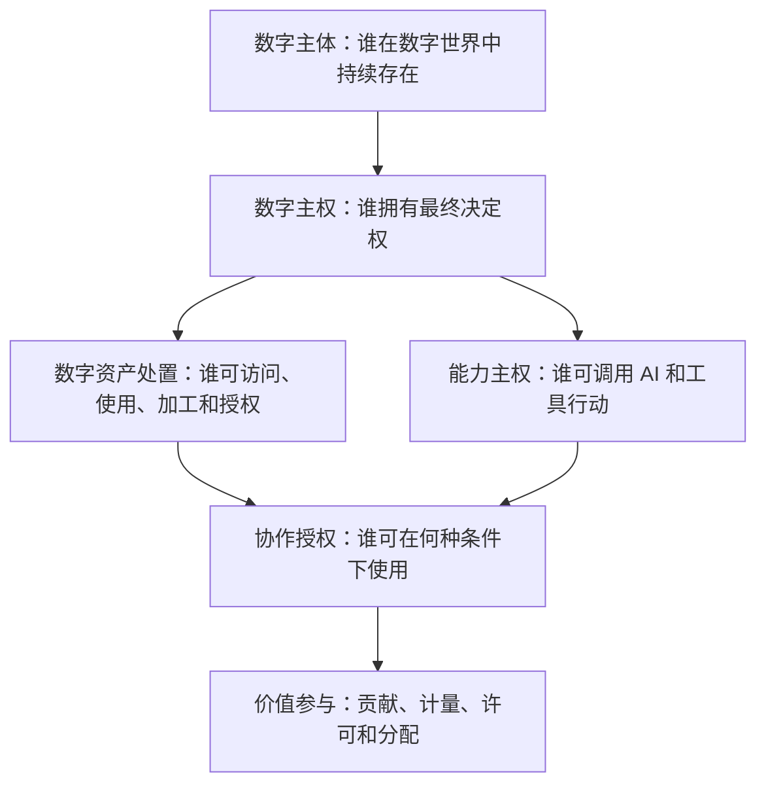

# Digital Me：数字主权、数据处置主权与 Digital Org 叙事

版本：v0.1
日期：2026-07-18
状态：`living_narrative`
用途：战略思想母稿 / 产品原则依据 / 市场教育与对外传播内容源
维护方式：持续更新；重大定义变化须记录版本与原因

> 本文是 Digital Me 关于数字主权的长期叙事母稿，不是法律意见，也不是对尚未实现能力的产品承诺。对外使用时必须根据产品真实状态裁剪，并区分理念、当前能力、实验能力和远景。

---

## 0. 文档定位

Digital Me 的价值不能只用“个人资料管理”“AI 助手”或“数字分身”解释。

其更深层的目标是：

> 为个人在数字世界中建立一个持续存在、能够表达本人意图、管理数字资产、配置 AI 能力、签发授权、参与协作并保留最终决定权的数字主体基础设施。

这一目标可以概括为：**帮助个人建立和行使数字主权**。

本文用于持续管理以下内容：

- 数字主权的定义；
- 数据及数字产出物的含义；
- 数据处置主权与数字主权的关系；
- Digital Me 作为基础设施的角色；
- Digital Org 的可能性；
- 个人、组织、平台和 AI 之间关系的潜在变化；
- 可用于市场教育的表达；
- 不应过度承诺的边界；
- 未来需要通过产品和现实协作验证的问题。

---

## 1. 核心判断

### 1.1 数字主权是 Digital Me 的目标

Digital Me 不只是帮助用户保存数据，也不只是帮助用户调用 AI。

它要建立的是一个以个人为中心的数字主体，使个人能够在数字世界中持续回答并执行以下问题：

- 我是谁；
- 什么属于我；
- 我要向哪里发展；
- 哪些 AI 能力可以附着于我；
- 谁可以使用我的信息、作品、知识和能力；
- 可以为哪个目的、在什么范围、使用多久；
- 什么时候可以代表我行动；
- 哪些动作必须再次获得本人确认；
- 如何停止、撤销、迁移和离开；
- 当我的数字资产和能力产生价值时，我如何参与价值分配。

### 1.2 Digital Me 的基础设施价值

数字主权成为广泛社会实践，需要法律、制度、协议、市场、平台、用户习惯和利益结构共同演进。Digital Me 不能独自完成全部变化。

但如果没有可用的主体基础设施，数字主权只能停留在权利宣言和抽象理念上。

Digital Me 可以率先提供：

- 持续数字身份；
- 本人定义与发展意图；
- 数字资产目录与来源；
- 权利和授权策略；
- AI 能力控制；
- 对外代表授权；
- 行动记录与结果回流；
- 可迁移、可撤销、可恢复的主体载体。

因此，Digital Me 的现实意义不是宣布“数字主权已经成立”，而是：

> 先把个人和组织行使数字主权所需要的技术主体与控制面建设出来，使未来的互操作、真实协作和利益结构有可以落地的载体。

### 1.3 成功标准

Digital Me 不必垄断数字主权，也不应成为新的中心平台。

如果未来 Digital Me 能够成为个人和组织数字主权的重要支撑方之一，让不同平台、模型、能力和协作者都能在本人或组织授权下与其交互，就已经实现了重要价值。

---

## 2. 关键概念

## 2.1 数字主体

数字主体是能够在数字世界中持续表达身份、意图、权利、边界、能力和责任，并能够参与行动与协作的主体载体。

数字主体不是一个账号，也不是一组散落的数据，更不是一次会话中的角色提示词。

它至少具有：

- 连续身份；
- 所有者或治理者；
- 记忆和数字资产；
- 当前状态；
- 发展意图；
- 边界与政策；
- 可配置能力；
- 授权和撤销机制；
- 行动与协作记录；
- 迁移和恢复能力。

## 2.2 个人数字主权

推荐定义：

> **个人数字主权，是个人通过一个持续、可迁移、可验证、可授权和可撤销的数字主体，对自己的数字身份、数字资产、发展意图、AI 能力和对外行动保持最终决定权，并在产生价值时拥有参与分配的能力。**

它至少包括：

1. 自我定义权；
2. 自我发展权；
3. 数字资产管理与处置权；
4. AI 能力配置与支配权；
5. 对外代表授权权；
6. 知情、限制、拒绝和撤销权；
7. 迁移、退出和恢复权；
8. 价值参与权。

## 2.3 “数据”的广义含义

Digital Me 叙事中的“数据”不是机械化的个人信息条目，也不等于“浏览记录拿去出售”。

本文所说的个人或组织数据，采用广义含义，包括：

### A. 事实性信息

- 身份；
- 经历；
- 角色；
- 关系；
- 事件；
- 当前状态；
- 行为记录；
- 设备或业务运行数据。

### B. 表达与创作产出

- 文章；
- 著作；
- 报告；
- 方案；
- 演讲；
- 课程；
- 图片；
- 音频；
- 视频；
- 电影电视作品；
- 游戏；
- 代码；
- 设计；
- 博客和公开表达。

### C. 知识与判断资产

- 专业知识；
- 判断框架；
- 决策记录；
- 研究资料；
- 方法论；
- 经验；
- 偏好；
- 风格；
- 被证伪或被否定的结论。

### D. 协作与组织产出

- 项目资料；
- 会议记录；
- 工作流程；
- 业务规则；
- 客户与供应链信息；
- 机构知识库；
- 研发、生产、服务和运营数据；
- 组织成员共同创造的成果。

因此，在 Digital Me 的语境中，更准确的上位表达是：

> **数字资产与数字产出物**

“数据”可以继续作为简写，但对外传播时应根据语境具体说明，避免被误解为出售个人隐私或零散行为记录。

## 2.4 数据处置主权

推荐定义：

> **数据处置主权，是数字主体对其合法持有、控制或有权管理的数字信息、作品、知识、记录和衍生产出，进行查看、保存、分类、迁移、使用、加工、授权、限制、撤销、删除和价值安排的能力。**

这里的关键不是宣称对所有相关数据拥有绝对所有权，而是把不同权利变成可识别、可配置和可执行的“权利束”。

可能的权利包括：

- 持有；
- 访问；
- 查阅；
- 复制；
- 更正；
- 删除；
- 迁移；
- 使用；
- 加工；
- 组合；
- 许可；
- 限制；
- 撤销；
- 审计；
- 获得说明；
- 参与收益分配。

不同资产和不同参与者拥有的权利可能不同。

## 2.5 数字主权与数据处置主权的关系



数字权利可能先由法律或合同规定，但如果个人和组织缺少持续的数字主体，它们往往只能分散地向不同平台主张，难以形成日常、自动、可审计的执行能力。

因此：

> **数字主权不是数据权利产生的法律前提，而是数据权利工程化、日常化、可执行化的主体前提。**

---

## 3. 与互联网时代的关系变化

## 3.1 互联网时代的典型关系

```text
平台提供便利
→ 用户注册平台账号
→ 用户接受平台统一条款
→ 平台持续收集数据和数字产出
→ 平台聚合、加工并获得主要价值
```

这种模式推动了互联网普及，但也形成了结构性不对称：

- 身份依附平台账号；
- 数据和作品分散在不同平台；
- 授权条款主要由平台制定；
- 使用记录主要掌握在平台；
- 个人缺少统一控制面；
- 迁移和退出成本高；
- AI 对个人的理解和影响也逐渐由平台掌握。

## 3.2 数字主权可能形成的新关系

```text
平台或协作者提出请求
→ Digital Me / Digital Org 识别请求方和目的
→ 按数据、能力、范围、期限和结果去向授权
→ 使用过程可计量、可记录
→ 到期、拒绝或撤销
→ 必要时进行价值交换与收益分配
```

| 互联网平台中心 | 数字主体中心 |
|---|---|
| 平台账号 | 可迁移的数字主体 |
| 统一隐私条款 | 按目的、范围和期限授权 |
| 平台默认持有完整副本 | 主体侧持有或受控空间使用 |
| 平台控制使用记录 | 双方可核对的行动与使用记录 |
| 免费服务交换广泛数据 | 服务、数据使用和能力价值可分别约定 |
| 平台设定推荐目标 | 个人或组织设定意图与目标函数 |
| 平台给用户配置 AI | 数字主体选择和配置 AI 能力 |

## 3.3 不会自动发生

这种变化不会仅因 Digital Me 出现就成为社会常态，还需要：

- 法律和政策边界；
- 平台和工具提供标准接口；
- 身份、凭证、授权和审计互操作；
- 市场参与者接受数字主体签发的授权；
- 使用范围和贡献可计量；
- 撤销在技术上真实执行；
- 用户形成新的使用习惯；
- 新的利益分配结构具有竞争力。

Digital Me 的任务是先完成基础设施和真实协作样本，为这些条件的形成提供前提。

---

## 4. Digital Me 的角色

## 4.1 不是数据仓库，而是主权控制面

Digital Me 应被设计为：

```text
数字身份
+ 自我定义与发展意图
+ 数字资产目录与来源
+ 权利与授权策略
+ AI 能力控制
+ 对外代表授权
+ 行动与协作记录
+ 可撤销与可恢复机制
+ 价值计量与结算接口（远期）
```

Digital Me 可以把数据保存在本地，也可以管理位于授权云端、机构系统、可信数据空间或第三方平台中的资产。

因此，“主权”不要求所有字节都永远存放在同一台个人电脑中；关键是：

- 主体知道资产在哪里；
- 知道谁拥有何种权利；
- 能够决定谁在何种条件下使用；
- 能够监督、停止和撤销；
- 能够迁移或更换服务提供者；
- 不因更换模型、平台或工具而失去主体连续性。

## 4.2 Digital Me 不创造法律权利

Digital Me 可以记录、证明和执行权利，但不能自行宣布权利成立。

它不能自动解决：

- 共同生成数据的多方权益；
- 个人信息合法处理基础；
- 商业秘密；
- 著作权和其它知识产权；
- 雇佣关系中的职务成果；
- 行业监管；
- 数据跨境；
- 公共利益和监管留存义务；
- 收益分配争议。

这些仍需要法律、合同、组织治理和争议解决机制。

## 4.3 Digital Me 的近期证明任务

近期不从数据交易开始，而应先证明：

1. 用户能够看见并确认自己的数字主体；
2. 用户能够管理一种数字资产的使用范围；
3. 用户能够配置一种 AI 能力；
4. 用户能够批准或拒绝一次代表行动；
5. 用户能够撤销授权；
6. 用户能够查看使用记录和结果；
7. 用户能够迁移、恢复或离开；
8. 不同能力和协作者能够接受同一主体的授权表达。

---

## 5. Digital Org

## 5.1 定义

> **Digital Org 是组织在数字世界中统一表达身份、治理数字资产和数据权利、配置 AI 能力、签发授权、参与协作并记录价值流转的数字主体。**

Digital Org 不是企业网盘、知识库或传统权限系统的简单改名。

它是在组织层面回答：

- 组织是谁；
- 谁可以代表组织；
- 组织持有什么数字资产；
- 不同部门、成员和合作方拥有什么权利；
- 哪些 AI 能力可以被组织调用；
- 哪些行动需要何种审批；
- 组织如何与外部人、Agent 和其它组织协作；
- 数据、能力和成果产生的价值如何计量与分配。

## 5.2 与 Digital Me 的共同内核

| 主权内核 | Digital Me | Digital Org |
|---|---|---|
| 主体身份 | 自然人及其数字主体 | 法人、非法人组织、团队或项目组织 |
| 最终决定 | 本人 | 章程、角色、授权链和审批机制 |
| 数字资产 | 个人信息、作品、知识、经历、关系 | 组织数据、知识、流程、成果、品牌和业务资产 |
| 意图 | 个人发展方向 | 组织使命、战略和目标 |
| 边界 | 本人禁区和授权策略 | 合规、权限、风控和内部治理 |
| 能力 | 本人选择的模型、Skill、Agent | 组织级模型、工具、岗位 Agent 和外部服务 |
| 代表授权 | 本人确认 | 角色权限、审批流、共同决策或多方签署 |
| 协作记录 | 个人行动与结果回流 | 组织决策、履约、数据使用和价值流转 |
| 迁移退出 | 本人可导出、冻结、迁移 | 组织变更、成员离职、供应商替换、资产交接 |

核心架构应复用，但治理模型不能把个人的单一 Owner 直接复制到组织。

## 5.3 Digital Org 的现实场景

### 场景 A：机构知识与专业能力授权

机构将长期积累的研究资料、方法论、项目经验和专业知识组织为受控能力，不直接开放原始资料，而是授权外部在指定范围内调用。

### 场景 B：行业数据协作

多家机构在不交出全部原始数据的情况下，在可信环境中进行联合研究、风险分析、模型训练或行业洞察。

### 场景 C：组织 AI 能力治理

组织统一管理模型、Skill、Agent 和外部工具可以访问哪些数据、执行哪些动作、由谁审批以及结果进入何处。

### 场景 D：项目型组织

围绕一个投资、研发、培训、媒体或产业项目建立临时 Digital Org，管理参与方、资料、任务、权限、成果和项目结束后的资产交接。

### 场景 E：数据产品与受控计算

机构对合法持有并有权经营的数据建立目录、使用策略、质量说明、调用接口、计量和结算，不必出售完整原始数据。

### 场景 F：组织间 Agent 协作

一个组织的 Agent 向另一个 Digital Org 提交机器可读请求，由对方依据角色、数据、能力、期限和风险决定是否接受。

## 5.4 Digital Org 与数据收益

Digital Org 可以为数据和数字产出物的授权使用与收益提供技术基础：

- 资产目录；
- 来源和权利记录；
- 合法取得依据；
- 数据分类分级；
- 使用目的；
- 权限和审批；
- 使用范围和期限；
- 是否允许复制、加工或模型训练；
- 调用和计算计量；
- 衍生结果去向；
- 合同和价格；
- 收益归属；
- 撤销后的处理；
- 审计与争议证据。

但“拥有大量数据”不等于当然有权出售或许可。Digital Org 必须记录和执行个人信息、第三方权益、知识产权、商业秘密、行业监管和跨境等边界。

## 5.5 更符合主权原则的价值模式

优先探索：

> **数据不离开，价值可以被调用。**

可能模式：

- 受控查询；
- 按次计算；
- 模型训练许可；
- 聚合结果服务；
- 数据产品许可；
- 专业知识和判断框架调用；
- 组织能力调用；
- 合成数据和脱敏结果；
- 按次、按期、按成果或按贡献计费。

不把出售原始数据副本作为默认商业模式。

## 5.6 产品规划位置

Digital Org 应进入 Digital Me 的长期产品架构，但不立即扩展当前 P1-PANORAMA 个人 Alpha 的开发范围。

规划原则：

1. 当前主体、资产、授权、能力和审计模型不得硬编码为只能支持自然人；
2. 个人与组织共享主权内核；
3. 组织治理、多人角色、审批流和收益分配作为独立产品层；
4. P1-PANORAMA 完成后建立 `DORG-00` 研究与场景规格；
5. 优先从已有真实机构场景选择验证样本；
6. 未经过机构验证前，不宣布 Digital Org 已成为成熟产品。

候选验证方向：

- Aivestor：投资机构的研究、项目、判断和协作资产；
- MUHUB：项目与项目所有者的组织身份和授权协作；
- 培训/研究组织：课程、案例、导师能力、成果和组间权限；
- 内容与媒体机构：作品、版权、素材和生产能力的受控使用。

---

## 6. 技术基础设施框架

## 6.1 主权内核

Digital Me / Digital Org 的长期共同内核建议包括：

```text
Subject Identity       主体身份
Authority Model        决定权与代表权
Asset Registry         数字资产目录
Provenance             来源与贡献
Rights Graph           权利束与参与方
Intent & Boundaries    意图、目标与边界
Capability Registry    AI 与工具能力
Policy Engine          使用和行动规则
Authorization Gateway  授权签发与撤销
Execution Gateway      受控执行
Audit & Evidence       行动、使用和结果记录
Portability            导出、迁移、恢复
Metering & Settlement  计量与结算接口（远期）
```

## 6.2 基础设施不是中心平台

Digital Me 的理想角色不是重新集中保存所有人的数据，而是提供可部署、可迁移、可互操作的主体协议和运行时。

可以存在：

- 本地个人节点；
- 个人可信云节点；
- 企业或机构节点；
- 行业可信数据空间；
- 第三方能力和协作服务；
- 可插拔身份、凭证、支付与存证设施。

无论部署在哪里，主体都应保留：

- 最终授权权；
- 可解释的数据和能力范围；
- 撤销与迁移能力；
- 可核对记录；
- 更换服务提供者的可能性。

## 6.3 DID、凭证和区块链的位置

DID、可验证凭证、数字签名和区块链可以用于：

- 主体标识；
- 身份或资质证明；
- 授权凭证；
- 跨系统验证；
- 存证；
- 结算。

但它们不能单独产生数字主权，也不能自动解决：

- 权利是否合法；
- 平台是否接受；
- 数据是否有价值；
- 撤销能否真实执行；
- 利益如何分配；
- 争议如何解决。

Digital Me 不从 Token 或区块链开始，而从“一次真实的数据授权、一次真实的能力调用和一次可撤销的代表行动”开始。

---

## 7. 公共叙事

## 7.1 一句话

> Digital Me 是属于你自己的数字主体，让你在 AI 时代掌握自己的身份、数字资产、发展方向、AI 能力和对外授权。

## 7.2 四句话

1. Digital Me 是属于你自己的数字主体；
2. 它持续理解你，但事实、推断和发展方向由你决定；
3. 它可以不断获得新的 AI 能力，替你完成数字世界中的任务；
4. 它只有在你授权的范围内，才会使用你的数字资产、代表你行动并与人或其它 AI 协作。

## 7.3 百字表达

> 在互联网时代，人的身份、作品、知识、行为和关系被分散保存在不同平台，个人很难持续管理它们，也很难控制 AI 如何使用和代表自己。Digital Me 希望为每个人建立一个属于自己的数字主体：持续承载身份、记忆、意图和边界，管理数字资产和 AI 能力，并通过可理解、可撤销的授权参与数字协作。它不是另一个平台账号，而是个人在数字世界中的主体基础设施。

## 7.4 Digital Org 一句话

> Digital Org 是组织在数字世界中的主权控制层，统一管理组织身份、数字资产、AI 能力、授权协作和价值流转。

## 7.5 传播主题库

本文可持续衍生以下内容：

1. AI 时代为什么需要个人数字主权；
2. Digital Me 与 ChatGPT、Agent、数字员工有什么不同；
3. 数据为何不只是个人信息，而是人的广泛数字产出；
4. 为什么数据权利需要一个能够持续执行的数字主体；
5. 数字主权是否会改变平台免费换数据的商业模式；
6. 为什么“数据不离开，价值可以被调用”；
7. Digital Me 为什么不是新的中心平台；
8. 能力主权：谁决定 AI 可以替我做什么；
9. 代表权：数字之我何时可以代表本人；
10. Digital Org 如何治理机构数据、知识和 Agent；
11. 组织数据价值为何需要来源、权利、授权和计量；
12. 数字主权、隐私保护和数据变现的区别；
13. 从平台账号到数字主体；
14. 从一次性同意到持续可撤销授权；
15. 从数据交易到受控计算与能力调用。

---

## 8. 对外表达边界

## 8.1 可以主张

- 数字主权具有值得探索的基础设施价值；
- Digital Me 正在建设个人行使数字主权所需的主体控制面；
- 数据包括广义数字资产和产出物；
- 用户应当能够理解、授权、限制、撤销和迁移；
- AI 能力应附着于个人主体，而不是吸收个人主体；
- Digital Org 可以成为组织数据、能力和协作治理的技术方向；
- 价值实现应建立在合法权利、真实贡献和可计量使用之上。

## 8.2 暂时不能主张

- Digital Me 已经使个人获得完整法律意义上的数字主权；
- 所有与个人有关的数据都归个人绝对所有；
- 平台未来必须向所有个人支付数据费用；
- 个人零散数据普遍具有很高交易价值；
- Digital Org 可以自动确认机构数据权属；
- 区块链或 DID 可以自动完成确权；
- 已经实现跨平台撤销、收益分配或公网协作；
- Digital Me 可以完全替代本人承担责任。

## 8.3 叙事重心

个人产品首先强调：

- 主体性；
- 控制权；
- 能力成长；
- 代表授权；
- 可迁移和可撤销。

不要把“出售个人数据赚钱”放在个人产品前台。

Digital Org 可以更早探索机构数字资产授权、受控使用和收益，但必须以合法来源、权利边界和真实价值为前提。

---

## 9. 需要持续验证的问题

### 理念与认知

- 普通用户能否理解“数字主体”；
- “数字主权”是否会被误解为国家网络主权；
- 是否应在不同场合使用“个人数字主权”“数字主体权”或“主体控制权”；
- 用户是否把“数据”误解为隐私出售；
- 哪种表达最能建立主体感而不制造恐惧。

### 产品

- 哪个操作最能让用户感到“这是我的 Digital Me”；
- 用户是否愿意把发展意图和核心边界交给 Digital Me 管理；
- 用户是否真正使用撤销、迁移和停止；
- 能力扩展是否比资料构建更快产生获得感；
- 本地协作模拟能否帮助用户理解代表授权。

### 互操作

- 外部平台是否愿意接受主体签发的细粒度授权；
- Agent 间如何表达数据、能力、期限和结果去向；
- 授权撤销如何跨系统传播；
- 行动记录如何由多方核对；
- 身份与凭证标准何时成熟到可用。

### 价值与商业

- 哪类个人数字产出最有实际调用价值；
- 哪类机构资产最适合受控计算；
- 按次、按期、按成果还是按贡献更合理；
- 如何避免收益叙事诱导隐私出售；
- Digital Me 作为基础设施如何获得可持续收入而不重新垄断数据。

---

## 10. 维护规则

### 10.1 内容分级

本文中的论述应标记为：

- `principle`：项目长期原则；
- `hypothesis`：尚待现实验证的判断；
- `product_commitment`：已经进入规格的产品承诺；
- `implemented`：已有真实实现；
- `public_claim`：已批准对外使用的表达；
- `deprecated`：已经放弃的旧表述。

后续版本可逐段增加状态标签。

### 10.2 更新触发

以下情况必须更新本文：

- Digital Me 定位发生变化；
- 新增或修改主权原则；
- P1-PANORAMA 非开发者试用产生重要认知证据；
- Digital Org 建立正式任务；
- 出现真实跨 Agent 或组织协作；
- 建立数据授权、计量或收益案例；
- 法律、政策或标准发生重要变化；
- 对外传播出现系统性误解；
- 项目对外发布白皮书或融资材料。

### 10.3 版本记录

| 版本 | 日期 | 变化 |
|---|---|---|
| v0.1 | 2026-07-18 | 建立数字主权、广义数据/数字产出物、数据处置主权、Digital Me 基础设施角色、Digital Org 场景和公共叙事母稿 |

---

## 11. 当前决策

1. 数字主权是 Digital Me 的目标和核心公共叙事；
2. 数据采用广义含义，包含事实信息、数字作品、知识、判断、关系和组织产出；
3. Digital Me 不以机械化个人数据变现为核心逻辑；
4. 关键是个人和组织对其合法数字资产拥有可执行的管理与处置能力；
5. Digital Me 的近期使命是率先建设数字主权基础设施，不宣称独自完成制度变革；
6. 互操作、真实协作和利益结构是数字主权成为社会常态的必要条件；
7. Digital Org 纳入长期产品架构，复用主权内核但建立独立组织治理层；
8. P1-PANORAMA 仍以个人 Alpha 为当前主线，不立即扩展 Digital Org 实现；
9. P1-PANORAMA 完成后评估建立 `DORG-00`；
10. 本文作为未来市场教育、内容传播、白皮书和机构方案的持续内容源。

---

## 12. 参考依据

- 《中华人民共和国个人信息保护法》：个人信息权益、知情决定、限制拒绝、查阅复制、更正删除等权利基础；
- 《中共中央 国务院关于构建数据基础制度更好发挥数据要素作用的意见》：数据资源持有、加工使用、产品经营等结构性分置和收益机制；
- 《国家数据基础设施建设指引》：身份登记、数据资源管理、数据产权登记、流通利用和交易基础设施；
- 欧盟《数据法案》：联网产品用户对使用生成数据的访问与使用权；
- W3C DID Core、Verifiable Credentials Data Model：可插拔身份和凭证技术参考。

正式对外发布时应复核最新法律、政策和标准，并添加准确链接与适用范围说明。
