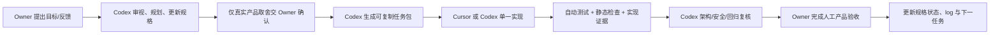

# Digital Me 第一阶段改造升级计划：主体可信化与协作感知

版本：v0.1  
状态：当前执行计划  
制定日期：2026-07-16  
依据：`digitalme_architecture_audit_20260716.md`  
适用范围：当前单机 Electron App、Digital Me Package、已有写作/研究/编程/能力扩展，以及外部协作最小骨架

---

## 1. 阶段定位

### 1.1 阶段目标

第一阶段不再以新增场景或能力数量证明进展，改为同时完成四件事：

1. **强化主体属性与产品感知**：用户能够直观理解“这是我的数字主体”，看见它由什么构成、哪些是本人确认、哪些是系统推断、它现在能代表我做什么；
2. **建立安全、可信、可管的主体内核**：重要数据有来源、变更可确认和回滚、密钥受保护、授权可查看和撤销、重要行动有可信记录；
3. **让已有基础能力真实落地可用**：写作、研究、本地文件和一个受控外部执行能力具备稳定主路径、明确失败状态和可复验结果；
4. **建立外部协作最基础骨架与用户认知**：用户能看见自己的对外能力名片，理解协作会暴露什么、授权什么、留下什么记录，并可生成一次性协作授权草案。

### 1.2 阶段成功的一句话标准

> 用户打开 Digital Me，能够明确感知“这是属于我的数字主体”；知道它依据什么理解我、能做什么、谁能访问什么；可以安全使用已有能力完成真实任务；并能预览一次受控外部协作将如何发生。

### 1.3 产品承诺

用户面统一围绕四句话：

- **这是我**：事实、本人声明、系统推断和发展意图分得清；
- **属于我**：主体资料在我控制的位置，可备份、可迁移、可恢复；
- **由我管**：能力、数据外发和重要变化由我授权，可随时撤销；
- **代表我协作**：只在我批准的范围内展示能力、接受任务和交付结果。

### 1.4 明确非目标

第一阶段不做：

- 公开 Agent 市场、自动匹配、自动接单；
- 自动支付、结算、出租和收益分配；
- 无人值守对外发布、签约、付款或正式承诺；
- 完整 A2A/AP2/DID 网络运行时；
- Web/手机端和百万用户云平台；
- 新增视频、音频、游戏等一级场景；
- 用“安装更多 MCP”代替已有能力硬化。

---

## 2. 第一阶段产品结构

```text
Digital Me App
├── 对话                  轻问答；显示本轮依据与能力使用
├── 做事                  写作 / 研究 / 编程试点
├── 我的数字之我          主体首页 / 构建 / 事实与声明 / 推断 / 发展意图 / 边界
├── 能力                  已有能力、权限、状态、撤销
├── 协作                  我的对外名片 / 一次协作授权草案 / 协作记录
└── 信任中心              数据位置 / 密钥状态 / Package 健康 / 授权 / 行动记录 / 备份恢复
```

“协作”可以先作为“我的数字之我”或“能力”下的一级页签，不强制增加侧栏一级入口；应以用户是否能形成清晰认知为准。

### 2.1 主体首页

用户一眼看见：

- 主体名称、所有者、Package 位置与当前版本；
- 已确认事实、本人声明、系统推断、当前目标、发展意图、边界的数量与状态；
- 本次主体更新、待确认更新和可回滚版本；
- “我现在能做什么”及每项能力的可用/受限/实验状态；
- 对外状态：默认私有、未公开；若生成协作名片，明确其可见范围。

禁止只用“资料数量、覆盖率、蒸馏条数”营造主体感。主体感来自清晰的归属、来源、决定权、行动能力和连续版本。

### 2.2 主体数据分层

第一阶段在 schema、写入入口和界面上固化七类数据：

| 层 | 用户语言 | 写入规则 |
|---|---|---|
| Evidence | 原始依据 | 原则上不可被模型改写；记录 hash 与定位 |
| Fact | 经依据支持的事实 | 必须有来源；冲突进入待核实 |
| Owner Assertion | 我自己确认的说法 | 本人最高决定权；修改须留版本 |
| Inference | 系统对我的理解 | 必须标注推断；可确认、驳回、过期 |
| Current State | 我最近在做什么 | 有有效期；不得固化为永久人格 |
| Development Intent | 我想成为什么样 | 与“现在的我”分开；由本人设定 |
| Capability & Policy | 我能做什么、允许什么 | 独立版本、授权和撤销 |

### 2.3 信任中心

至少提供五类可管理信息：

1. **我的数据在哪里**：Package、会话、成果、密钥分别存放何处；
2. **谁能访问什么**：模型服务、能力扩展、授权文件夹、外部执行体；
3. **本轮会发出什么**：发送到模型或工具的数据类别与目标；
4. **发生过什么**：不可由界面伪造的关键行动记录；
5. **我如何离开或恢复**：备份、导出、恢复、回滚和撤销入口。

### 2.4 外部协作最小骨架

第一阶段必须让用户形成“数字之我可以作为主体协作，但协作受我控制”的产品认知。

最小产品闭环：


第一阶段交付：

- **人读版能力名片**：我是谁、我能提供什么、明确不能做什么、需要本人确认的动作；
- **机器读版 Agent Card 草案**：与现有 contract 数据结构对齐，但默认不公开；
- **Interaction Contract 草案生成器**：调用者、任务、数据范围、能力范围、有效期、结果去向、是否需确认；
- **本地协作模拟**：不接公网也能预览授权前、执行中、结果后的全过程；
- **协作记录**：草案、确认、取消、结果采用/拒绝进入审计。

不把“存在 Agent Card JSON 文件”当作用户已经感知到协作能力；必须有本人可读、可选择、可取消的产品面。

---

## 3. 技术改造工作包

### WP0：基线冻结与版本治理

目标：建立可安全改造的工程起点。

- 确认并初始化 Git 边界；
- 标记当前版本 `0.1-alpha`；
- 创建 Package 只读快照和 SHA-256 文件清单；
- 建立 `planned / specified / implemented / statically_verified / runtime_verified / released` 能力状态表；
- 默认关闭自定义 MCP 自动执行和外部 CLI 写入，直到对应安全工作包验收。

验收：任何后续改动均能定位提交、回滚代码和恢复 Package。

### WP1：PackageStore 与主体数据模型

目标：把主体资产从“多个模块直接改文件”升级为统一、可验证、可回滚的事实源。

- 建立 Package schema version 与校验；
- 抽出唯一 PackageStore；
- 七类数据分层；
- 原子提交、版本快照、change set、diff、rollback；
- source hash、source locator、悬空引用检查；
- Builder、Feedback、Life、Policies 统一走 PackageStore；
- 将重要更新先写入候选区，确认后一次提交。

验收：一次反馈或构建能够说明“依据—建议变化—影响—确认—版本—回滚”。

### WP2：SecretStore、PolicyEngine 与可信审计

目标：让“安全可信可管”成为代码强制，而不是界面文案。

- API Key/OAuth token 迁入 OS 安全存储；renderer 不获得明文；
- 建立统一策略判定：actor、purpose、data scope、action、destination、risk；
- `never_inject / never_export / never_speak_for_me` 在数据出口强制执行；
- Electron 升级、安全基线、IPC sender 与 payload schema 校验；
- 主进程实际执行点强制审计；
- 行动记录 append-only、版本关联、可导出、默认脱敏。

验收：高风险行为必须被拦截或确认；密钥不出现在普通配置、UI 返回和导出中。

### WP3：已有能力硬化与真实可用

目标：少而真实，形成三条稳定主路径。

| 主路径 | 最小真实任务 | 验收 |
|---|---|---|
| 写作 | 基于本人材料完成并修改一份可用文稿 | 有依据、可采用、可导出、失败可见 |
| 研究 | 基于本地/公开来源形成结论与依据 | 有来源时强制挂依据；无来源明确初步 |
| 文件/执行 | 在一个授权目录完成受控读取或改写 | 目录边界真实强制；执行前确认、执行后 diff |

配套：

- ToolBroker；
- 能力白名单、精确版本锁定、最小环境变量；
- 读/写/删/执行/外发分级；
- prompt injection 防护与工具结果不可信处理；
- 超时、取消、失败、降级、诊断信息统一。

验收：每条主路径至少连续完成 5 次真实任务，不依赖开发者手工修文件；失败不会静默冒充成功。

### WP4：主体产品面与观念认知

目标：让技术事实被用户看见并理解。

- 主体首页；
- 事实/声明/推断/状态/意图区分；
- 待确认变化与版本时间线；
- 能力、边界、授权和数据出口可视化；
- 信任中心；
- 首次使用引导：这是我、属于我、由我管、代表我协作。

验收：陌生试用者不看说明文档，也能回答“这个系统与普通 AI 助手有什么不同、哪些内容是事实、哪些是推断、如何撤销能力”。

### WP5：外部协作最小骨架

目标：完成协作感知，不扩大公网攻击面。

- 人读版能力名片；
- Agent Card 草案与 schema 校验；
- Interaction Contract 草案生成、确认、取消、导出；
- 本地模拟一个“外部 Agent 请求研究摘要”的完整流程；
- 结果采用/拒绝与审计；
- 默认私有、无公网发布、无自动支付。

验收：用户能清楚指出本次协作“谁调用、做什么、用什么数据、多久有效、结果去哪、如何撤销”。

### WP6：评测与发布门槛

目标：用证据决定阶段是否完成。

- Package schema/迁移测试；
- Builder、retrieval、feedback、policy 单元测试；
- IPC、ToolBroker、授权集成测试；
- Electron 关键路径端到端测试；
- 恶意 prompt、恶意材料、越权路径、密钥泄露测试；
- “通用模型 + 普通提示词”对照评测；
- Package 导出—删除—重导入一致性测试。

验收：见第 5 节阶段 DoD。

---

## 4. 推荐排期与依赖

以 6—8 周为计划基线；实际按验收推进，不以日期强行宣布完成。

| 周期 | 主工作包 | 关键产物 |
|---|---|---|
| 第 1 周 | WP0 + WP1 设计与最小实现 | Git/快照、Package schema、PackageStore 骨架 |
| 第 2 周 | WP1 | 原子版本、候选更新、来源 hash、回滚 |
| 第 3 周 | WP2 | SecretStore、PolicyEngine、Electron 安全基线 |
| 第 4 周 | WP2 + WP3 | 可信审计、ToolBroker、能力白名单 |
| 第 5 周 | WP3 + WP4 | 三条真实主路径、主体首页、信任中心 |
| 第 6 周 | WP5 | 能力名片、授权草案、本地协作模拟 |
| 第 7—8 周 | WP6 + 修复 | 评测、红队、迁移恢复、阶段验收 |

强依赖：WP0 → WP1/WP2 → WP3/WP4 → WP5 → WP6。  
可并行：主体产品面原型可与 PackageStore 开发并行，但不得绕开最终数据契约。

---

## 5. 第一阶段完成定义（DoD）

全部满足才能进入下一阶段：

### 5.1 主体真实

- 重要事实来源可解析率 100%；
- source 文件有 hash，主体条目可定位到依据；
- 本人声明、系统推断、当前状态和发展意图严格分层；
- 不再存在低置信推断被无解释标为 confirmed；
- 用户可看见并处理全部重要候选更新。

### 5.2 主体属于用户

- Package 可完整备份、导出、校验、恢复；
- 重要写入原子化、有版本、可回滚；
- secret 不进入 Package、普通配置、renderer 返回和日志；
- 导出—删除—重导入后固定评测行为一致。

### 5.3 主体安全可管

- 高风险动作拦截/确认率 100%；
- 模型、能力、文件夹、外部执行体授权可查看和撤销；
- 数据出口执行真实过滤；
- MCP/CLI 不能继承无关 secret，不能越过授权目录；
- 关键行动由执行点强制审计。

### 5.4 已有能力真实可用

- 写作、研究、受控文件/执行三条路径分别连续完成至少 5 次真实任务；
- 任务结果可采用、拒绝、修改、导出；
- 失败和降级对用户可见；
- 不以 UI 存在或一次演示作为完成证据。

### 5.5 协作骨架可感知

- 用户能查看并编辑人读版能力名片；
- 能生成、确认、取消一次性 Interaction Contract 草案；
- 本地模拟协作从请求到结果回流完整走通；
- 默认不公开、不自动外发、不自动支付；
- 用户能解释六个授权要素：谁、任务、数据、能力、期限、结果去向。

### 5.6 产品认知

对至少 3 名非开发者做任务式试用，其中至少 2 人无需阅读架构文档即可正确回答：

1. Digital Me 与普通 AI 助手的主要区别；
2. 哪些内容由本人确认、哪些只是系统推断；
3. 如何禁止某类数据进入模型或工具；
4. 如何撤销能力；
5. 外部协作前自己需要确认什么。

---

## 6. “规划 + Owner 执行 + Cursor/Codex 实现运维”工作机制

### 6.1 角色分工

| 角色 | 主要责任 | 不应承担 |
|---|---|---|
| **Codex 技术负责人** | 架构规划、代码审计、任务拆分、规格维护、实现或代码评审、测试设计、结果验收、故障路由 | 替 Owner 做产品价值与高风险授权的最终决定 |
| **Owner（用户）** | 确认阶段目标和真实取舍；执行只能由本人完成的 GUI、密钥、账号、云控制台和人工体验验收；返回结果 | 手工判断代码正确性、独自拼接零散技术步骤 |
| **Cursor 或 Codex 实现者** | 按任务包修改代码、补测试、运行静态/自动验证、提交实现证据 | 自行扩大范围、越过规格改变产品原则、以“代码写完”替代验收 |

Codex 可以同时担任技术负责人和某一任务的实现者；但同一工作包必须明确唯一代码 Owner。Cursor 与 Codex 不同时修改同一组文件。

### 6.2 标准工作流



### 6.3 每个代码任务必须有任务包

任务包固定包含：

1. 任务编号与目标；
2. 对应规格章节和风险发现；
3. 允许修改文件；
4. 禁止修改和必须保持的路径；
5. 数据迁移与回滚方案；
6. 验收标准；
7. 自动测试命令；
8. Owner 人工验收步骤；
9. 完成证据与未验证边界。

### 6.4 交接规则

- Cursor 实现后，将变更摘要、文件列表、测试输出和未完成事项交给 Codex复核；
- Codex 实现后，同样必须提交测试证据和 Owner 人工验收步骤；
- 任何实现若发现规格冲突，先暂停并更新规格，不私自绕过；
- 任何涉及主体数据 schema 的改动必须同时提供 migration、fixture 和 rollback；
- 任何涉及能力、密钥、外发和命令执行的改动必须经过安全审查；
- 未经 Owner 人工体验验收，只能标记 `statically_verified` 或 `runtime_verified`，不能标记 `released`。

### 6.5 日常推进节奏

- 每次只推进一个主工作包，最多一个不冲突的辅助包；
- 每轮结束更新 `digitalme_log.md`：完成、证据、未验证、下一步；
- Codex 在每轮开场先读本计划、审计报告、context、product spec 和 log 最新条目；
- Owner 返回运行结果后，Codex负责解释并给出唯一下一步，不让 Owner 自行在多个技术分支中选择；
- 遇到真正的产品/商业取舍才请求 Owner 决策，普通工程选择由技术负责人承担。

---

## 7. 首批实施顺序

第一批只启动以下四个任务，完成后再开后续任务：

1. **P1-00 工程与 Package 基线冻结**；
2. **P1-01 SecretStore 与敏感配置迁移**；
3. **P1-02 Package schema + PackageStore 最小版本提交**；
4. **P1-03 主体首页信息架构与数据契约**。

第一批完成后，再启动 PolicyEngine、可信审计、ToolBroker 和协作骨架。这样既能尽快让用户感知主体，也不会让新界面继续建立在不可控的数据写入之上。

首个标准任务包已建立：`digitalme_phase1_task_P1-00_baseline_freeze.md`。后续 P1-01～P1-03 均须沿用其“目标、范围、禁止事项、迁移、验证、人工验收、回滚、证据”结构。

---

## 8. 状态维护

本文件是第一阶段唯一执行计划；其它文档承担各自职责：

- `digitalme_context.md`：战略、当前阶段和决策索引；
- `digitalme_product_spec_v0.2.md`：产品界面与功能需求；
- `digitalme_architecture_edge_sovereign_v0.1.md`：系统和信任边界；
- `digitalme_architecture_audit_20260716.md`：问题证据与风险基线；
- `digitalme_log.md`：实际变更、验证和交接流水。

本计划中的工作包只能处于：`planned / in_progress / implemented / statically_verified / runtime_verified / accepted / blocked` 之一。
