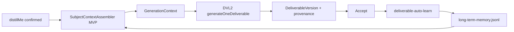

# 第一阶段落地任务包：Cognitive Runtime MVP（持续性验证）

| 项 | 值 |
|----|-----|
| 任务代号 | `CRT-MVP-01` |
| 文档状态 | `ready_for_owner_runtime_acceptance`（实现已合入工程；**未经 Owner 真机验收，不得标 accepted**） |
| 版本 | v0.1.1 |
| 日期 | 2026-07-26 |
| 依据 | `digitalme_cognitive_runtime_v0.1.md`；Context Assembly Layer v0.1；CRT-MVP 实现授权 + 三项设计修正 |
| 目标 | **验证 Digital Me 能否因主体资产 + 学习闭环而产生持续性** |
| 范围 | 只实现 Cognitive Runtime **MVP**，不实现完整 Runtime |

### 设计修正（实现时已落地）

1. **Distillation Gate**：默认自动吸收为 `active_low_confidence`；仅敏感/明显矛盾才打断 Owner；不增加学习确认流程。  
2. **SubjectAssembly.layers**：八层齐全，未实现层为空数组。  
3. **闭环优先**：验收以 UNIQUE token 连续性测试为准，不为架构完美度延迟。

---

## 0. 一句话成功标准

同一 Owner、同一类任务（如「Digital Me 投资人介绍」）：

1. **生成前**能注入已确认主体资产，且 provenance 可核对；  
2. **接受成果后**自动写入可检索记忆（或等价 Active 资产）；  
3. **下一次生成**的 prompt/provenance 能体现上一次学习到的独特内容。  

若三者任一断裂，则本阶段 **未通过持续性验证**。

---

## 1. 根因 / 现状

### 1.1 产品根因

当前 DVL2「生成成果」默认只使用：

- confirmed PlanVersion（goal/audience/usage/constraints/items）  
- 任务附件 `referenceMaterials`  

**没有**把 Digital Me Package / distillMe / memory 装配进生成上下文。  
因此：即使 Owner 已蒸馏身份、即使接受成果已触发 auto-learn 写入，**下一次生成仍可能「不记得我」**——持续性在运行时断裂。

### 1.2 工程现状（只读结论）

| 环节 | 现状 | 对持续性的含义 |
|------|------|----------------|
| `buildGenerationContext` | 仅 Plan + 附件 | **读路径缺主体** |
| `generateOneDeliverable` | 只传 `referenceMaterials`；`subjectContextSnapshotId: null` | provenance 未绑定主体 |
| `assembleDoingContext` | 可读 distill confirmed；仅 VL1 `autoGenerate` 使用 | **能力在，未挂 DVL2** |
| `distillMe` | Identity/Experience/Fact 确认态可用 | 可作 MVP 主体主源 |
| `deliverable-auto-learn` | accept → extract → memory jsonl | **写路径已有雏形**；生成侧未读回 |
| PackageStore | Change Set 写入权威 | 学习提交可复用；本阶段不重构存储 |
| Judgment / Version / Collaboration | 规格有，实现无或未接入 | **本阶段明确不做完整能力** |

### 1.3 断裂点（验证必须钉死）

```text
[已有] distillMe Active ──✕──▶ DVL2 GenerationContext
[已有] auto-learn → memory  ──✕──▶ 下次 Retrieval/Assembly
[已有] provenance.subject* ──✕──▶ 仍为 null / 空
```

MVP 只修这两条读回与一条 provenance，不铺完整 Runtime。

---

## 2. 本阶段范围与非范围

### 2.1 做（MVP）

1. **SubjectContextAssembler MVP**（只读装配）  
2. 最小 **SubjectAssembly** 数据结构  
3. **GenerationContext** 扩展 + generators 拼进 prompt  
4. **provenance** 记录实际使用的主体/记忆引用  
5. 保证 **auto-learn 写入** 可被 Assembler 读到（必要时做最小映射，不重做学习引擎）  
6. **闭环自动化测试**（独特 token 贯穿）

### 2.2 明确不做

| 不做 | 原因 |
|------|------|
| 完整 Judgment 层 / Judgment Activation | 属 Cognitive Runtime Phase D |
| Collaboration / 对外授权网关 | 非本主线 |
| 大规模存储重构、统一 Asset Store 物理合并 | 成本高；MVP 用适配器读现有源 |
| Subject Version / Snapshot / 回滚产品化 | Phase E |
| 完整 Distillation Gate 四维产品化 | 沿用 auto-learn 现有规则即可 |
| 向量检索 / 大规模 RAG | 规则 + 关键词 + 配额足够验证持续性 |
| 改写作/研究/编程独立场景 | 隔离 DVL2 接入点 |
| 恢复 VL1「开始」旧链路作为主体注入主路径 | 避免双主线 |

---

## 3. 现有代码复用分析

### 3.1 可直接复用

| 模块 | 复用方式 |
|------|----------|
| **`distillMe.read` / `summary` / confirmed\|edited** | Assembler 的 Identity / Experience / Fact(Knowledge) **主读源** |
| **`packageDirFromConfig()`**（main） | 定位 Package；Assembler 入参 `packageDir` |
| **`deliverable-auto-learn`** | Learning 闭环写路径；enqueueAfterAccept / conflict 三选项保持 |
| **`PackageStore` + memory 写入** | 保持 auto-learn `commitLearning`；不新造写通道 |
| **`loadExistingMemorySnippets` 思路** | Assembler 读 `memory/long-term-memory.jsonl` 的只读解析可抽共享或并列实现 |
| **`deliverable-context.js`** | 扩展 `buildGenerationContext`；保留附件 budget 分账 |
| **`deliverable-generators.js` `contextBlock`** | 增加「主体背景」块；不直读 Package |
| **`deliverable-generation.js`** | **唯一主接入点**：`generateOneDeliverable` 内调用 Assembler |
| **`doing-context.js`** | 可参考渲染格式；**不要**原样全量 `confirmedContext` 无配额灌入 |

### 3.2 适配后复用（薄封装）

| 模块 | 适配 |
|------|------|
| distill 条目 → SubjectAsset | `layer` 映射：identity→Identity，experience→Experience，fact→Knowledge |
| memory jsonl 行 → SubjectAsset | `layer=Memory`；用 text/statement 字段；top-K |
| auto-learn 写入类型 | episodic/semantic → Memory；确保带可检索唯一文本 |

### 3.3 本阶段不复用为生成主路径

| 模块 | 原因 |
|------|------|
| VL1 `actBehalf:autoGenerate` + `assembleDoingContext` 全量列表 | 与 DVL2 主线分离；无配额 |
| `experience-proposal` UI 全流程 | 冲突已有 auto-learn 三选项；不扩 VL1 学习面板 |
| 完整 PackageStore 多文件知识图谱 | 无必要 |

---

## 4. SubjectContextAssembler MVP 设计

### 4.1 职责

```text
assembleSubjectContext(input) → SubjectAssembly
```

- **只读** Package / distill / memory  
- **不写** Package  
- **不做**完整 Judgment Activation  
- 输出可直接并入 GenerationContext，并支撑 provenance

### 4.2 输入

```text
{
  packageDir: string | null,
  query: {
    goal, audience, usage, constraints,
    deliverableKind, deliverableTitle, deliverablePurpose,
    attachmentKeywords?: string[]   // 可选：附件名/短关键词，非全文
  },
  limits?: {
    subjectCharsLimit: number,      // 默认 8000
    maxIdentity: number,            // 默认 12
    maxExperience: number,          // 默认 8
    maxKnowledge: number,           // 默认 10
    maxMemory: number               // 默认 8
  }
}
```

### 4.3 内部步骤（最小）

1. **Catalog**：从 distillMe 取 confirmed|edited；从 memory jsonl 取最近 N 行（如 200）作候选池。  
2. **Score**：关键词重叠（goal/audience/title）+ recency + confidence 粗分。  
3. **Select**：分层 top-K。  
4. **Budget**：拼 `renderedText`，超限截断并标记 `included:false`。  
5. **Empty policy**：无 Package / 无 Active → `emptyReason`，不伪造主体内容。

### 4.4 建议模块落点（实现时，非本文改码）

- 新文件建议：`digitalme-app/src/act-behalf/subject-context-assembler.js`（或 `src/cognitive/subject-context-assembler.js`）  
- 由 `deliverable-context.buildGenerationContext` 或 `generateOneDeliverable` 调用  
- **禁止** generators 内直接 `fs.read` Package

---

## 5. 数据结构定义

### 5.1 SubjectAssembly（MVP）

```text
SubjectAssembly {
  schemaVersion: 1
  assemblyId: string
  assembledAt: ISO-8601
  packageId: string | null
  packageVersion: string | null
  queryKeyDigest: string          // 对 query 稳定哈希，便于测试
  emptyReason: null | "no_package" | "no_active_assets" | "budget_zero"

  layers: {
    identity:   SubjectAssetView[]
    knowledge:  SubjectAssetView[]   // distill fact
    experience: SubjectAssetView[]
    memory:     SubjectAssetView[]
    // MVP 不包含：preference, judgment, skill, artifactHistory（可留空数组）
  }

  renderedText: string
  budget: {
    subjectCharsLimit: number
    subjectCharsUsed: number
    truncated: boolean
  }
  policy: {
    excludedCount: number
    excludedSample: [{ assetId, reason }]  // 最多保留数十条
  }
  refs: SubjectAssetRef[]         // 仅 included:true，供 provenance 直接拷贝
}

SubjectAssetView {
  assetId: string
  layer: "identity" | "knowledge" | "experience" | "memory"
  statement: string
  confidence: string | number | null
  source: "distill_me" | "long_term_memory"
  included: boolean
  truncated?: boolean
}

SubjectAssetRef {
  assetId: string
  layer: string
  source: string
  contentHash?: string            // 可选：statement 哈希
  included: true
}
```

### 5.2 GenerationContext 扩展

在现有字段上增加：

```text
GenerationContext {
  // 已有：goal, audience, usage, constraints, summary, title, purpose, kind,
  //       taskId, planVersionId, packageId, deliverableId,
  //       attachmentText, attachmentRefs

  subjectAssembly: SubjectAssembly | null
  subjectRenderedText: string     // 便捷字段 = assembly.renderedText
  subjectRefs: SubjectAssetRef[]  // = assembly.refs
}
```

**Prompt 拼装顺序（MVP）**：

1. 任务理解  
2. 成果说明  
3. **Digital Me 主体背景**（`subjectRenderedText`；空则明示「本次未装配到已确认主体资产」）  
4. 参考材料  
5. 反占位 / 反跑偏约束  

### 5.3 Provenance 字段（DeliverableVersion）

在现有 `provenance` 上：

```text
provenance: {
  // 已有：planVersion, sourceRefs(attachment/task_goal/plan), attachmentRefs, ...

  subjectContextSnapshotId: assemblyId | null     // 复用现有字段名，不再恒为 null
  subjectContextSnapshotVersion: packageVersion | null

  subjectRefs: SubjectAssetRef[]                  // 新增：实际 included 主体
  memoryRefs: SubjectAssetRef[]                   // 新增：layer===memory 的子集（或并列）
  assembly: {
    assemblyId: string
    queryKeyDigest: string
    budget: { subjectCharsUsed, subjectCharsLimit, truncated }
    emptyReason: string | null
  }

  // MVP 不做：skillRefs / judgmentRefs / artifactHistoryRefs（可省略或空数组）
}
```

**硬规则**：`subjectRefs` 必须 ⊆ 进入 messages 的主体语句；测试可断言独特 token。

---

## 6. 最小接入点（生成前如何调用）

### 6.1 推荐唯一钩子

```text
generateOneDeliverable(...)
  → load task + referenceMaterials          // 已有
  → assembleSubjectContext({ packageDir, query from snap+deliverable+task })
  → buildGenerationContext({ ..., subjectAssembly })
  → generateByKind(...)                     // contextBlock 含主体块
  → write provenance.subject* from assembly.refs
```

### 6.2 谁传 `packageDir`

- `main.js` 中 DVL2 generation / `confirmPlanAndGenerate` 的 `deps` 增加 `packageDir: packageDirFromConfig()`（或 Assembler 内自行解析同一配置）。  
- 测试可注入临时 packageDir fixture。

### 6.3 不接入的位置

- Renderer：不组装主体全文  
- `prepareDeliverablePackage` / `buildExecutionSnapshot`：MVP **可不**把主体写入 snapshot（减少 CAS 面）；主体在**每次生成时实时装配**，便于学习闭环立刻生效  
- Plan 确认：不阻塞

### 6.4 与 Learning 的衔接（读回）

```text
Accept DeliverableVersion
  → deliverable-auto-learn（保持）
  → memory/long-term-memory.jsonl 追加
  → 下一次 generateOneDeliverable
  → Assembler 读 memory → 进入 renderedText + memoryRefs
```

若现有写入字段无法被稳定解析，**仅允许**最小读适配（解析 jsonl 行的 text/statement），不重做 extract 算法——除非闭环测试无法通过。

---

## 7. 闭环测试方案

### 7.1 自动化（必须）

建议脚本：`scripts/test-crt-mvp-continuity.cjs`（名称可调）+ `package.json` script。

| ID | 断言 |
|----|------|
| T1 | Fixture Package 含 distill confirmed，语句含 `UNIQUE_SUBJECT_TOKEN_A`；装配后 `renderedText` / prompt 含该 token |
| T2 | 无 Package 时 `emptyReason=no_package`，不编造主体句；生成仍可基于 goal（不强制失败） |
| T3 | 生成 provenance.`subjectRefs` 含对应 assetId；`subjectContextSnapshotId` 非 null（有资产时） |
| T4 | 模拟 accept → auto-learn（或直接 commit 等价 memory 行）写入 `UNIQUE_LEARN_TOKEN_B` |
| T5 | **第二次** `assemble` / `generate`（同 query 族）prompt 或 memoryRefs 含 `UNIQUE_LEARN_TOKEN_B` |
| T6 | 主体预算截断：超限时 `truncated=true` 且 excluded 有记录；不静默丢光所有层 |
| T7 | DVL2-01/02/03/04/one-click/05 回归仍通过 |
| T8 | 写作/研究页面入口未被误改（冒烟：关键 selector/文案或模块未错误耦合） |

### 7.2 Owner 真机验收（实现授权且工程完成后）

1. 主体中已有 Digital Me 相关确认条目（或现场确认一条带独特短语）。  
2. 生成投资人介绍类成果 → 打开依据/文件，应能感到主体信息影响（非仅附件）。  
3. 接受成果 → 再开一新任务同类目标 → 应能体现上次学习痕迹或至少 provenance/记忆可查。  
4. **不**标 `accepted` 除非 Owner 明确通过。

### 7.3 持续性验证的否决项

- 有 confirmed distill 但 provenance.subjectRefs 为空且无合法 emptyReason  
- 学习写入成功但第二次装配完全读不到  
- 用固定 demo 业务内容冒充主体持续性  

---

## 8. 实施方案（实现时步骤，仍待授权）

1. **规格钉死**：本文数据结构为 MVP 契约；与 Cognitive Runtime v0.1 对齐但裁剪 Judgment/Version。  
2. **实现 Assembler**（只读 + 配额 + digest）。  
3. **接入 `generateOneDeliverable` + `buildGenerationContext` + `contextBlock`**。  
4. **写 provenance**。  
5. **核对 auto-learn → memory 读回**；必要时最小解析适配。  
6. **自动化闭环测试 T1–T8**。  
7. **回归 DVL2 套件**。  
8. 状态保持 `ready_for_owner_runtime_acceptance` 类标记；**不**自行 `accepted` / push（按当时分支纪律）。

---

## 9. 计划修改文件（实现授权后）

| 文件 | 变更意图 |
|------|----------|
| `digitalme-app/src/act-behalf/subject-context-assembler.js`（新） | Assembler MVP |
| `digitalme-app/src/act-behalf/deliverable-context.js` | GenerationContext 并入 subjectAssembly |
| `digitalme-app/src/act-behalf/deliverable-generators.js` | contextBlock 增加主体段 |
| `digitalme-app/src/act-behalf/deliverable-generation.js` | 生成前调用 Assembler；provenance |
| `digitalme-app/src/main.js` | 传入 packageDir / 确认 generation deps（最小） |
| `digitalme-app/src/act-behalf/deliverable-auto-learn.js` | **仅当**读回格式不兼容时做最小对齐（优先不改） |
| `digitalme-app/scripts/test-crt-mvp-continuity.cjs`（新） | 闭环测试 |
| `digitalme-app/package.json` | 增加 test script |
| 可选：`digitalme_context.md` / log | **仅在 Owner 要求升版记录时**更新状态句 |

**不修改**：写作/研究/编程主路径；完整 PackageStore schema；协作模块。

---

## 10. 风险

| 风险 | 影响 | 缓解 |
|------|------|------|
| Package 未配置 / 空 distill | 持续性测不过或误判产品失败 | T2 明确 emptyReason；真机先确认有 Active 资产 |
| Memory 写入格式与读取不一致 | 闭环在 T5 断 | 先写「读回契约」单测；必要时最小适配 |
| 主体+附件挤爆上下文 | 质量下降或截断不公 | 分账预算；Identity 优先保留 |
| 把低质量 auto-learn 语义句当 Identity | 「持续性」变成噪声 | MVP Memory 与 Identity 分层；Identity 只来自 distill confirmed |
| 范围膨胀到 Judgment/Version | 延迟验证 | 本文非范围表；评审卡范围 |
| 隐私/敏感句进对外文案 | 超披露 | MVP：敏感词过滤或降低对外 kind 的 memory 权重（规则即可） |
| 双路径（VL1 doing-context vs Assembler）行为不一致 | 认知混乱 | 文档声明 DVL2 只走 Assembler；不修 VL1 为主 |

---

## 11. 与完整 Runtime 的关系

```text
Cognitive Runtime v0.1 全景
  ├─ MVP（本任务包）= Assembler 读路径 + provenance + 学习读回验证
  ├─ 不做：Judgment / Collaboration / 存储重构 / Version 产品化
  └─ 验证假设：若 MVP 闭环失败，完整 Runtime 不应继续堆功能
```

**阶段出口决策**：

- 闭环测试 + Owner 真机通过 → 再排 Judgment / Version  
- 失败 → 先修读回/写入契约，而不是扩大装配表面  

---

## 12. 数据流（MVP）



---

## 13. 授权与状态

- 本文 = **落地任务包设计**，不是实现授权。  
- 未获 Owner「按 CRT-MVP-01 实现」明确授权前，**不修改代码**。  
- 实现后状态建议：`ready_for_owner_runtime_acceptance`；未经 Owner 主路径验收不得 `accepted`。

---

## 14. 修订

| 版本 | 日期 | 说明 |
|------|------|------|
| v0.1 | 2026-07-26 | 初稿：现状断裂、Assembler MVP、数据结构、接入点、闭环测试、文件清单、风险与非范围 |
