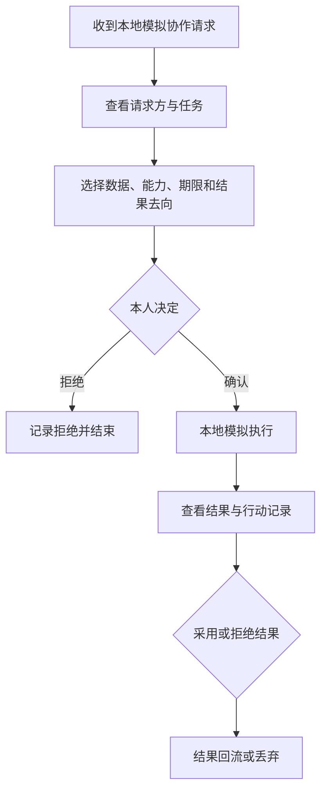

# Digital Me 总任务 P1-PANORAMA：产品全貌 Alpha

版本：v0.3
日期：2026-07-18
状态：`active / PAN-01_pending_spec`
任务类型：阶段策略调整 / 产品纵向闭环 / 市场认知启动
建议基线：`5ab55dc`（代码）+ `8fb8210`（P1-07_DOCS_BASE，仅收工文档）；P1-07 保持 `statically_verified / owner_partial_verified / known_acceptance_gaps / frozen_for_panorama`，不因此标记 accepted

---

## 0. 任务定位

P1-PANORAMA 不是继续增加一个局部功能，也不是降低技术、安全和可信标准。

它要改变当前阶段的交付组织方式：

> 从“先把底层组件逐一磨到发布级，再向用户展示完整产品”，调整为“利用已经建立的可信底座，尽快呈现一个完整、可理解、可体验、可传播的 Digital Me，再依据真实用户反馈决定后续深度硬化的优先级”。

本任务的第一优先级，是让普通用户形成四个明确认知：

1. **这是我**：它持续理解我，但事实、声明、推断、状态和意图分得清；
2. **属于我**：它由我拥有，资料位置、版本、备份、迁移和恢复由我掌握；
3. **由我管**：能力、数据使用、外部行动和授权由我批准、限制、停止和撤销；
4. **代表我协作**：它可以获得新的 AI 能力，并在本人授权范围内代表我与人或其它 Agent 协作。

本任务中的“数据”采用广义含义：既包括事实性信息，也包括文章、报告、代码、影音、设计、知识、判断、关系、项目记录及其它个人数字产出物。P1-PANORAMA 不采用“机械化个人数据变现”叙事，重点是数字主体对其合法数字资产拥有可执行的管理与处置能力。

P1-PANORAMA 的交付对象不是一组底层模块，而是一条用户能够亲自走通、能够向他人讲清、能够用于市场教育的产品完整故事。

---

## 1. 为什么现在调整

### 1.1 已具备的基础

当前已经形成可复用的最小可信底座：

- SecretStore；
- PackageStore、版本、恢复与回滚；
- Subject Home；
- PolicyEngine；
- DecisionAudit；
- ToolBroker 与受控外部 CLI 切片；
- Builder 观念/人格写入；
- Life/identity 主 Builder 写回；
- 写作、研究、对话、能力扩展等既有原型。

这些能力尚未全部达到发布级完备，但足以支撑一个边界清楚的 Product Panorama Alpha。

### 1.2 当前执行偏差

现有战略文档已经确立“双线并行”：

- A 线：数字化构建人；
- B 线：主体化数字实体。

但实际执行形成了近似串行依赖：A 线所有细节充分硬化后，才进入能力、行动和协作。其后果是：

- 用户持续看到资料导入、蒸馏、审阅和版本细节；
- “这是一个数字主体”的体验弱；
- “它能获得能力并替我做事”的体验弱；
- “它能在我授权下代表我协作”的体验尚未出现；
- 产品理念和市场认知无法同步启动；
- 大量时间消耗在当前阶段边际收益较低的交互与异常细节。

### 1.3 本次调整原则

技术可信仍是长期壁垒，但当前阶段不再以“底层组件完成数量”衡量进展，而以“用户闭环是否完整、理念是否可被理解和传播”衡量进展。

---

## 2. 阶段目标

### 2.1 一句话目标

> 让第一次使用 Digital Me 的普通用户在 10～15 分钟内看见并体验：建立自己的数字之我、确认它属于自己、给它增加能力、授权它完成任务、让它参与一次受控协作，并看见结果如何回到自己。

### 2.2 产品成功画面

用户打开 Digital Me 后，不需要理解 Package、MCP、IPC、change set、Agent Card 等内部名词，即可回答：

1. 这是谁的 Digital Me；
2. 它依据什么理解我；
3. 哪些内容是本人确认，哪些只是系统推断；
4. 它当前能为我做什么；
5. 如何给它增加或撤销一种能力；
6. 哪些数据会被某项能力使用；
7. 外部请求由谁发起、想做什么；
8. 如何批准、缩小、拒绝或撤销授权；
9. 任务或协作结果去了哪里；
10. 如何查看记录、恢复资料或停止外部行动。

### 2.3 产品完整闭环


本阶段至少用一个完整示范场景走通以上六步。

---

## 3. 面向公众的核心概念

### 3.1 推荐定义

> **Digital Me 是属于个人自己的数字主体。它承载你的身份、记忆、判断、意图和边界，可以持续获得新的 AI 能力，并只在你授权的范围内替你行动、代表你协作。**

### 3.2 四句公众表达

1. Digital Me 是属于你自己的数字主体；
2. 它持续理解你，但事实、推断和发展方向由你决定；
3. 它可以不断获得新的 AI 能力，替你完成数字世界中的任务；
4. 它只有在你授权的范围内，才会代表你与人或其它 AI 协作。

### 3.3 与相邻产品的区别

| 产品形态 | 核心关系 |
|---|---|
| ChatGPT 等通用助手 | 人使用一个通用 AI |
| Agent | 人委派一个任务执行体 |
| 数字员工 | 组织配置一个岗位角色 |
| 数字分身 | 重点复现形象、声音或表达 |
| **Digital Me** | **人在数字世界中的主体层，拥有自己的身份、记忆、意图、边界、能力和协作权** |

### 3.4 禁止的市场表达

不得把 Alpha 宣传为：

- 已经独立存在的数字生命；
- 可以完全替代真人；
- 已经接入开放 Agent 网络；
- 已经能自动接单、签约、付款或交易；
- 已实现密码学不可篡改身份；
- 已形成完整数字孪生；
- 已具备所有页面所展示能力的发布级安全性。

市场教育必须区分“当前真实可用”“实验能力”“本地模拟”“远景方向”。

### 3.5 数字主权叙事与 Digital Org

P1-PANORAMA 以“个人数字主权”作为公共叙事总纲。数字主权不是单纯的数据所有权，而是个人对数字身份、数字资产、发展意图、AI 能力和对外行动保持最终决定权。

持续叙事母稿见：

`digitalme_digital_sovereignty_narrative_v0.1.md`

Digital Org 纳入长期产品架构：组织可以在相同主权内核上管理组织身份、数字资产、角色授权、AI 能力、外部协作和价值流转。但本轮 P1-PANORAMA 仍以个人 Alpha 为范围，不同时建设组织版产品。

当前架构不得无必要地把主体、资产、授权和能力模型硬编码为只能支持自然人。P1-PANORAMA 完成后，再评估独立建立 `DORG-00` 研究与场景规格。

---

## 4. 目标用户与首个示范场景

### 4.1 Alpha 目标用户

优先面向：

- 知识工作者；
- 创业者与管理者；
- 投资人、研究者与顾问；
- 内容创作者；
- 对个人 AI、数据主权和 Agent 感兴趣的早期用户。

不要求用户具备开发、MCP、命令行或本地模型知识。

### 4.2 首个完整示范场景

建议统一采用“受控研究协作”：

> 一个外部研究伙伴或 Agent 请求调用用户 Digital Me 的公开能力介绍、研究框架和一项已启用研究能力，生成一份 AI 行业趋势摘要。用户可以查看请求、缩小数据范围、设置一次有效、确认本地模拟执行，并决定采用或拒绝结果。

选择该场景的原因：

- 能复用现有研究能力；
- 容易展示“像我”的判断和表达；
- 可以自然呈现来源、能力、数据范围和结果；
- 无需真实公网或交易即可完成协作感知；
- 适合录制演示和邀请非开发者体验。

---

## 5. 产品信息架构

P1-PANORAMA 原则上复用现有侧栏，不进行大规模导航重构。

```text
Digital Me
├── 对话              轻问答；能说明本轮参考了哪些“我的内容”
├── 做事              写作 / 研究 / 受控执行示范
├── 我
│   ├── 产品全貌首页  这是我 / 属于我 / 由我管 / 代表我协作
│   ├── 构建          资料、评测和审阅
│   └── 数字之我      事实、声明、推断、意图、边界
├── 能力              已拥有 / 可获得 / 开发者设置
└── 控制与协作        权限、数据出口、协作沙盘、记录、停止与恢复
```

“控制与协作”可以先作为“我”或“能力”中的一级页签，不强制新增侧栏入口。最终取舍以陌生用户是否容易发现和理解为准。

---

## 6. 四个核心产品面

## 6.1 这是我：数字主体卡与成长路线

首页首屏提供“我的数字主体卡”，至少包括：

- 主体名称；
- 所有者；
- 当前私有/授权状态；
- 当前 Package 版本；
- 已确认事实、本人声明、系统推断、当前状态和发展意图摘要；
- 当前方向或目标；
- 核心边界；
- 当前可用能力；
- 当前外部授权数量；
- 最近一次主体变化；
- “依据什么理解我”的入口。

示意：

```text
木之易的 Digital Me
所有者：木之易 · 当前仅本人可用 · 第 12 版

我现在关注：建设 Digital Me、推进 AI 投资工作
我想成为：能够与 AI 协同进化的数字主体
我不会：未经确认对外承诺、付款或披露私密资料

已确认事实 8 · 本人声明 5 · 系统推断 12
已具备能力：写作、研究、受控本地执行
当前外部授权：无
```

首页同时呈现成长路线：

```text
① 构建我 → ② 看见我 → ③ 武装我 → ④ 授权我 → ⑤ 代表我协作
```

每一步只允许显示：

- 已建立；
- 可体验；
- 实验中；
- 本地模拟；
- 尚未开放。

禁止把静态 UI 存在冒充真实能力完成。

### 6.1.1 本人决定权最小入口

本阶段至少提供三个本人可理解、可修改、可撤销的输入：

- **我是谁**：本人声明；
- **我要去哪里**：发展意图；
- **哪些事不能替我做**：核心边界。

优先复用现有数据结构；如当前写入路径尚未安全迁移，可采用明确标记的 Alpha 候选草案，不得绕开 PackageStore直接写入正式主体资产。

## 6.2 属于我、由我管：薄版控制中心

集中呈现现有可信底座，至少包括：

1. 我的主体资料在哪里；
2. 当前版本和最近可恢复版本；
3. 当前连接的模型服务；
4. 已授权文件夹；
5. 已启用能力及其数据范围；
6. 外部执行体状态；
7. 当前有效协作授权；
8. 最近重要行动；
9. 停止全部外部能力；
10. 备份、恢复、导出或迁移状态。

首页持续显示一条用户状态摘要，例如：

> 私有运行 · 资料由你保管 · 3 项能力可用 · 当前无外部授权

控制感的验收不是“后台已经有安全模块”，而是用户能够：

- 看见；
- 理解；
- 关闭；
- 撤销；
- 恢复；
- 找到行动记录。

## 6.3 武装我：能力获得感

能力页分为三层：

### A. 我已经会的

- 基于本人材料写作；
- 带来源进行研究；
- 受控调用一个本地执行体。

### B. 我可以学会的

用普通用户语言展示可扩展方向：

- 网页研究；
- 邮件；
- 日程；
- 数据分析；
- 编程；
- 内容发布；
- 项目管理。

未实现项必须标记“尚未开放”，不得提供虚假启用按钮。

### C. 开发者设置

MCP、命令、参数、路径、版本等技术配置进入折叠的开发者区域，不作为默认体验。

每张能力卡必须回答：

- 能帮我做什么；
- 会接触哪些数据；
- 哪些动作必须本人确认；
- 当前状态是可用、实验还是预览；
- 如何启用、停止和撤销；
- 如何立即体验一个真实任务。

能力验收从“配置或连接成功”改为：

> 用户启用或进入能力后，能够完成一个真实小任务，并看见自己的 Digital Me 因此多会做了一件什么事。

## 6.4 代表我协作：本地协作沙盘

本阶段不接公网、不自动接单、不支付、不签约，先完成可理解、可操作、可取消的本地协作模拟。

完整流程：



协作授权必须向用户说明六个要素：

1. 谁在请求；
2. 要完成什么任务；
3. 使用哪些数据；
4. 调用哪些能力；
5. 授权多久有效；
6. 结果返回到哪里。

同时说明：

- 哪些动作仍须本人再次确认；
- 如何拒绝；
- 如何缩小范围；
- 如何撤销；
- 本次是否仅为本地模拟。

至少支持：

- 查看请求；
- 拒绝；
- 缩小数据范围；
- 选择能力；
- 设置“一次有效”；
- 确认本地模拟；
- 查看结果；
- 采用或拒绝结果；
- 查看协作记录。

协作记录复用 DecisionAudit 或建立清晰隔离的 Alpha 本地记录；不得伪装成已经发生的公网调用或密码学凭证。

---

## 7. 市场认知与传播任务

市场教育与产品实现同步启动，不等待 Trusted Beta。

## 7.1 必须交付的传播资产

1. **一页项目介绍**：问题、主张、四个承诺、产品闭环、当前状态；
2. **90 秒演示脚本与录屏**：构建我→看见我→武装我→授权我→协作→结果回流；
3. **安全可分享的能力名片**：默认不含原始资料、私密事实、路径和密钥；
4. **产品对照页**：Digital Me 与通用助手、Agent、数字员工、数字分身的区别；
5. **早期体验邀请**：说明 Alpha 边界、数据处理方式和反馈渠道；
6. **统一反馈问卷**：验证用户是否理解理念，而不只是询问界面满意度；
7. **常见问题**：数据属于谁、是否上传、能否删除、是否能替代本人、何时会代表本人行动。
8. **数字主权叙事母稿**：持续维护数字主权、广义数字资产、数据处置主权、能力主权和 Digital Org 的定义、边界与内容选题。

## 7.2 市场教育重点

传播内容优先解释：

- 为什么强大 AI 时代需要“人的主体层”；
- 为什么仅有聊天助手或 Agent 不够；
- 为什么身份、记忆、意图、边界和能力应属于本人；
- 为什么 Digital Me 可以持续成长但不能绕过本人授权；
- 为什么本地优先、可迁移和可撤销重要；
- 为什么能力扩展不是安装更多工具，而是在武装自己的数字主体。

不得优先传播：

- Package 文件结构；
- MCP 接入方法；
- PolicyEngine 规则字段；
- ToolBroker、IPC、hash chain 等内部实现；
- 尚未实现的交易网络或数字生命结论。

## 7.3 反馈问题

非开发者试用后至少回答：

1. 你认为 Digital Me 是什么；
2. 它与 ChatGPT 或普通 Agent 最大的不同是什么；
3. 你是否相信它属于你，为什么；
4. 你在哪里决定它能看什么、做什么；
5. 你是否理解“本人确认”和“系统推断”的区别；
6. 外部协作前你需要确认什么；
7. 哪个环节最让你感受到“这是我的 Digital Me”；
8. 哪个环节让你不信任或不理解；
9. 你最希望它下一步获得什么能力；
10. 你是否愿意持续使用、向他人介绍或加入早期体验。

---

## 8. 实施策略

## 8.1 纵向切片优先

每个实现任务必须说明它位于完整闭环的哪一步。禁止继续按“先完成所有存储、所有策略、所有审计，再做产品面”的顺序推进。

优先复用：

- SubjectOverview；
- PackageStore 只读聚合与版本信息；
- PolicyEngine；
- DecisionAudit；
- ToolBroker；
- Writing；
- ResearchNotebook；
- 现有能力扩展页；
- 现有 contracts 数据结构。

## 8.2 Alpha 状态必须诚实

所有用户面能力必须来自以下状态之一：

| 状态 | 含义 |
|---|---|
| 可用 | 已有真实路径并通过对应运行验收 |
| 实验 | 真实执行，但边界或稳定性仍有限 |
| 本地模拟 | 仅用于展示完整授权与协作流程 |
| 预览 | 可查看设计或草案，不能执行 |
| 尚未开放 | 只说明方向，不提供操作 |

禁止使用一个静态绿色状态把 `implemented` 冒充为“可用”。

## 8.3 最小安全边界

P1-PANORAMA 可以使用薄实现，但不得突破以下底线：

- 不开放公网协作入口；
- 不自动对外发布；
- 不自动签约、付款、交易或承诺；
- 不把真实 Package 复制到公共服务；
- 不向 renderer 返回密钥；
- 不绕开 PolicyEngine 执行高风险动作；
- 不绕开 PackageStore 修改已迁移的主体资产；
- 不让模型或 renderer 决定 dataKind、授权结果或可信审计内容；
- 不以“演示需要”为由触碰或覆盖 Owner 的真实 Package；
- 本地协作模拟必须醒目标注。

## 8.4 细节控制

每个子任务原则上只允许：

- 一轮实现；
- 一轮静态复核；
- 一轮 Owner 主路径体验；
- 阻断性安全、资料损坏、主路径不可用问题必须修复；
- 普通布局、文案微调、低概率异常和非主路径问题进入 backlog。

不得因单个局部任务反复多轮打磨而阻断产品全貌形成。

---

## 9. 子任务拆分

P1-PANORAMA 是总任务，不直接把所有内容交给一个实现分支。经 Owner确认后拆成以下有序任务包。

## PAN-00：战略与规格切换

目标：正式改变当前阶段的交付方式。

交付：

- 更新项目上下文与第一阶段计划；
- 将 Product Panorama Alpha 与 Trusted Beta 分开；
- 冻结 P1-07 当前状态和已知验收缺口；
- 建立新任务索引和 backlog；
- 明确 Alpha 状态标签与验收规则。

不改产品代码。

独立执行任务包：`digitalme_phase1_task_PAN-00_strategy_spec_freeze.md`。

## PAN-01：产品全貌首页

目标：用户进入“我”即可看见完整主体故事。

交付：

- 数字主体卡；
- 四个承诺；
- 五步成长路线；
- 当前意图与核心边界摘要；
- 能力与外部授权状态；
- 下一步体验入口。

原则：优先只读聚合；不为首屏新增复杂写入体系。

## PAN-02：控制权面板

目标：把现有可信底座转化为用户可见的掌控感。

交付：

- 数据位置；
- 版本与恢复；
- 模型与文件夹授权；
- 能力权限；
- 外部执行状态；
- 最近行动；
- 停止与撤销；
- 当前协作授权。

## PAN-03：能力获得感

目标：让用户理解“为自己的数字之我增加能力”。

交付：

- 已拥有 / 可获得 / 开发者设置三层；
- 写作、研究、受控执行三张真实能力卡；
- 每项一个立即体验；
- 数据范围、确认要求、状态和撤销说明；
- 未开放能力的诚实展示。

## PAN-04：本地协作沙盘

目标：走通外部协作最小完整闭环。

交付：

- 人读版能力名片；
- 本地模拟请求；
- 六要素授权；
- 拒绝、缩小、一次有效；
- 本地模拟执行；
- 结果采用/拒绝；
- 协作记录。

## PAN-05：传播与体验包

目标：同步启动市场教育和非开发者试用。

交付：

- 一页项目介绍；
- 产品对照；
- 90 秒演示脚本；
- 安全能力名片；
- 体验邀请；
- 反馈问卷；
- FAQ。

PAN-05 可与 PAN-01～04 并行起草，但正式录屏必须基于真实 Alpha。

## PAN-06：非开发者验证与下一阶段决策

目标：以认知与行为证据决定 Trusted Beta 的优先级。

交付：

- 5～10 名早期体验者；
- 结构化反馈；
- 产品认知指标；
- 误解清单；
- 信任阻断点；
- 最想获得的能力排序；
- Trusted Beta 硬化优先级。

---

## 10. 建议节奏

以 10～14 个工作日形成可演示 Alpha，不以日期替代验收。

| 节奏 | 主任务 | 关键结果 |
|---|---|---|
| 第 1～2 天 | PAN-00 | 规格切换、任务边界、状态冻结 |
| 第 2～4 天 | PAN-01 | 完整主体首页和成长路线 |
| 第 4～6 天 | PAN-02 | 控制权薄面板 |
| 第 6～9 天 | PAN-03 | 三张能力卡和立即体验 |
| 第 8～12 天 | PAN-04 | 本地协作完整闭环 |
| 同步 | PAN-05 | 传播文案、对照、体验包 |
| Alpha 后 | PAN-06 | 非开发者验证与 Beta 排序 |

如现有代码耦合导致某一子任务超出预计，不扩大该子任务；先降为清晰标注的只读、预览或本地模拟版本，保证完整闭环按时出现。

---

## 11. P1-07 与旧任务处理

### 11.1 P1-07

P1-07 当前保持：

```text
statically_verified / owner_partial_verified / known_acceptance_gaps / frozen_for_panorama
```

处理原则：

- 不标 accepted；
- 不继续占用当前主线；
- 已知的多组审阅与智能构建验收问题记入 backlog；
- 只有资料损坏、越权写入、密钥泄漏或主路径完全不可用才立即修复；
- Product Panorama Alpha 完成后，根据真实用户是否依赖该路径决定修复优先级。

### 11.2 暂停项

在 Product Panorama Alpha 完成前，暂停：

- Policies 全面迁移 PackageStore；
- 认知页零散编辑迁移；
- Life 读取体系重构；
- `package:load` scaffold；
- MCP 全面迁移 ToolBroker；
- Package 全类型深度校验与迁移；
- 审计密码学增强；
- 非阻断性 UI 细节反复打磨；
- P1-08 原计划任务。

如某暂停项是 PAN-01～04 的真实阻断依赖，必须先提交最小依赖说明，经 Codex 复核后只实现必要切片。

---

## 12. 验收标准

## 12.1 用户感知验收

至少 5 名非开发者完成任务式试用，其中至少 4 人能够：

1. 在 10～15 分钟内说清 Digital Me 与普通 AI 助手的主要区别；
2. 找到主体所有者、资料位置和私有/授权状态；
3. 区分本人确认与系统推断；
4. 设置或理解一项目标/发展意图；
5. 找到一条核心边界；
6. 体验一种新增能力；
7. 完成一次本地协作授权或拒绝；
8. 说出协作授权的六个要素；
9. 找到停止、撤销、记录和恢复入口；
10. 正确理解哪些功能是真实执行、哪些是本地模拟。

## 12.2 产品闭环验收

- 构建我→看见我→武装我→授权我→协作→结果回流可连续走通；
- 过程不要求用户理解技术术语；
- 所有入口可发现，不依赖提前知道页面布局；
- 每一步都有清晰当前状态和下一步；
- 用户取消不会被显示为成功；
- 本地模拟不会被显示为真实公网协作；
- 结果可采用或拒绝；
- 重要行动有用户可读记录。

## 12.3 技术最低验收

- 不破坏 P1-01～P1-07 已有 hermetic 回归；
- 不触碰或覆盖真实 `digital-me-package/**`；
- 不绕开现有 SecretStore、PackageStore、PolicyEngine 和 DecisionAudit 的已接入路径；
- 新 IPC 有 sender 与 payload 最小校验；
- Alpha 演示数据与真实 Package 明确隔离；
- 关键页面有 Electron 主路径 smoke test；
- 取消、拒绝、停止和恢复至少各覆盖一条真实事件路径；
- 不把静态状态冒充运行健康；
- 不产生密钥、正文、绝对路径等敏感日志泄漏。

## 12.4 市场认知验收

- 一页项目介绍完成；
- 90 秒演示完成；
- 安全能力名片可分享；
- 对照页和 FAQ 完成；
- 至少 5 名早期用户完成体验；
- 收集并整理“最常见误解”和“最强价值感知”；
- 根据反馈明确 Trusted Beta 的前三个硬化任务。

---

## 13. 非目标

P1-PANORAMA 不包含：

- 真实公网 Agent 发现与调用；
- 自动匹配、自动接单；
- 支付、结算、出租、收益分配；
- DID 或区块链实现；
- 无人值守对外发布；
- 自动签约、付款或正式承诺；
- Web/移动端完整产品；
- 完整能力市场；
- Digital Org 多成员、角色审批和机构数据授权运行时；
- 音视频、声纹、相貌和具身输出；
- 完整 Package 编辑器；
- 所有旧写路径全面迁移；
- 发布级红队和规模化云架构；
- 以 UI 展示代替真实能力状态。

---

## 14. 风险与控制

| 风险 | 控制方式 |
|---|---|
| 为追求全貌做成纯概念 Demo | 至少写作、研究或受控执行中有一条真实任务；状态明确区分真实与模拟 |
| 为追求速度绕过可信底座 | 最小安全边界不可突破；新增依赖走独立最小任务包 |
| 产品首页继续堆技术统计 | 以身份、意图、边界、能力、授权和行动组织信息 |
| 协作沙盘被误解为真实网络 | 全流程醒目标注“本地模拟”，传播材料同步说明 |
| 市场传播过度承诺 | 使用状态标签和禁止表达清单 |
| 又陷入局部反复打磨 | 非阻断问题进入 backlog；每子任务限制复核和 Owner 验收轮次 |
| 传播与产品割裂 | 演示脚本直接使用真实 Alpha 主路径，不制作无法复现的宣传动画 |
| Owner 个例固化为通用产品 | 默认文案和场景以普通知识工作者可理解为准；个人案例仅作示例数据 |

---

## 15. 工作机制

### 15.1 角色

- **Owner**：确认战略调整、公众表达、首个示范场景和真实产品取舍；参与非开发者试用；
- **Codex**：维护总任务、拆分子任务、架构与安全复核、控制范围、汇总用户证据；
- **Cursor/实现者**：只执行已经批准的单个 PAN 子任务，不自行扩大范围或转回底层全面重构。

### 15.2 开发闸门

本总任务批准前，不开始编码。

批准后按以下顺序执行：

```text
PAN-00 → PAN-01 → PAN-02 → PAN-03 → PAN-04 → PAN-06
                    ↘ PAN-05 同步推进 ↗
```

每次只启动一个主实现任务；PAN-05 文案资产可并行起草，但不得与代码任务修改同一文件。

### 15.3 子任务完成报告

每个 PAN 子任务必须报告：

- 用户获得了什么新感知；
- 完整闭环推进了哪一步；
- 哪些是真实能力，哪些是模拟或预览；
- 修改文件和提交；
- 主路径测试；
- 是否触碰真实 Package；
- 非阻断 backlog；
- 下一唯一任务。

---

## 16. 本任务完成定义

P1-PANORAMA 只有在以下条件同时满足时才能标记完成：

1. 普通用户能在一个连续体验中看见完整 Digital Me；
2. 四个承诺均有真实、可发现的产品落点；
3. 至少一项能力完成真实小任务；
4. 本地协作沙盘完整走通；
5. 停止、撤销、拒绝、记录和恢复可被用户找到；
6. 真实能力、实验能力、本地模拟和远景严格区分；
7. 传播资产基于真实 Alpha 完成；
8. 至少 5 名非开发者参与试用；
9. 至少 4 人正确理解核心概念与授权边界；
10. 已依据反馈形成 Trusted Beta 的前三个硬化任务；
11. 未发生真实 Package 损坏、越权行动或敏感信息泄漏；
12. Owner 完成产品验收，Codex 完成架构与范围复核。

---

## 17. Owner 已确认决策

2026-07-18，Owner 已确认：

1. 正式将当前主线从“继续深挖 P1 写入迁移”切换为 P1-PANORAMA；
2. 接受 P1-07 保持未 accepted、带已知缺口冻结；
3. 采用“受控研究协作”作为第一个完整示范场景；
4. 采用本文四句公众表达作为 Alpha 的统一口径，并以数字主权叙事母稿持续深化；
5. 接受“真实能力 / 实验 / 本地模拟 / 预览 / 尚未开放”的状态分级；
6. 同意市场教育与 Alpha 实现同步启动；
7. 以 5～10 名非开发者作为第一批认知验证样本；
8. 明确“数据”包括事实信息和广泛数字产出物，不采用机械化个人数据变现逻辑；
9. 将 Digital Org 纳入长期产品架构，但不扩大当前个人 Alpha 的实现范围。

Owner 于 2026-07-18 确认后，PAN-00 已执行（文档冻结）。**唯一下一实现任务**为：

> **PAN-01：产品全貌首页**——须先经 Codex 复核 PAN-00，并建立独立任务包后才可开始编码；不得在此之前修改产品代码或修复 P1-07。
