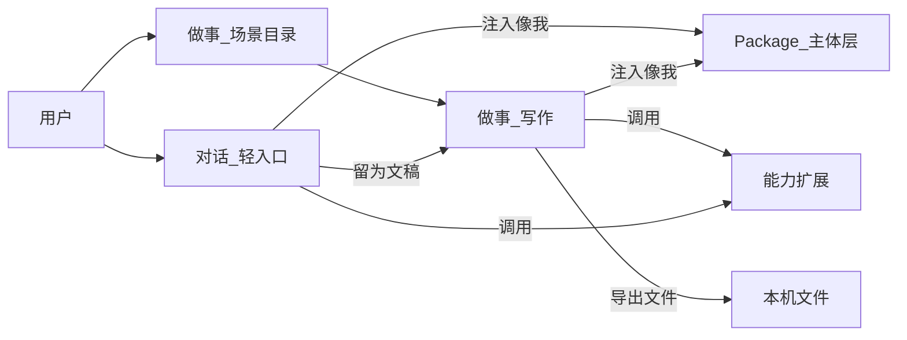

# Digital Me 产品功能与界面规格

版本：v0.5
状态：正式需求源（界面与功能）
日期：2026-07-18
关联：`digitalme_context.md`（战略与架构）、`digitalme_phase1_task_P1-PANORAMA_product_panorama_alpha.md`（当前总任务）、`digitalme_panorama_execution_index_v0.1.md`（当前执行索引）、`digitalme_digital_sovereignty_narrative_v0.1.md`（数字主权叙事）、`digitalme_phase1_subject_upgrade_plan_v0.1.md`（Trusted Beta 硬化依据，不再是当前执行队列）、`digitalme_architecture_audit_20260716.md`（审计风险基线）、`digitalme_person_definition_v0.1.md`（人的定义与采集口径）、`digitalme_inbox_access_plan_v0.1.md`（投递箱与可读范围）、`digitalme_architecture_edge_sovereign_v0.1.md`（部署拓扑）、`digitalme_narrative_ai_era_autonomy.md`（对外叙事）、`digitalme_intake_questionnaire.md`（自我评测）

---

## 0. 文档地位与准入规则

### 0.1 地位

本文是 Digital Me **桌面应用界面与功能的唯一需求源**。战略定位、主体层架构、协议对齐以 `digitalme_context.md` 为准；**凡涉及「用户看见什么、能做什么、何为做完」以本文为准。**

**产品身份**：面向大量真实用户的通用产品，**不是**仅为当前开发者/Owner 服务的定制化 Demo。当前个人 Package 与试用材料只作验证样本。

实现排期、PR、验收必须引用本文章节编号（如 `§3.2`、`§6.1`）。

### 0.2 规格驱动开发（强制）

1. **无规格不排期**：未写入本文（或未升版纳入）的功能，不得作为正式开发项；
2. **零星需求默认进 backlog**：个人试用反馈、临时想法先记入 `digitalme_log.md` 或 backlog，**评审后**修订本规格并升版本号，再开发；
3. **PR 须引用章节**：实现变更说明中标注对应规格条款；
4. **冲突处理**：实现与规格不符视为缺陷；若规格过时，先改规格再改代码。

### 0.3 修订规则

- 小修订（澄清、错别字）：同版本补丁说明写入文首「修订记录」；
- 改变 DoD、IA、产物目录、原则：升次版本号（v0.2 → v0.3），并在 `digitalme_log.md` 留决策记录。

---

## 1. 问题诊断与对标

### 1.1 现状（v0.1 App）

| 表面 | 现状 | 相对可交付标准的缺口 |
|------|------|----------------------|
| 任务工作台 | 纯文本对话；MCP 后台自动调用 | 无附件/图片、无流式、无多会话、无工具轨迹、无产物画布 |
| 任务产出 | 仅演讲 PPT | 类型单一；与对话割裂；无统一 Deliverable 模型 |
| 能力扩展 | MCP 商店可用 | 与工作台联动弱；普通用户仍偏配置感 |
| 蒸馏 Builder | 文件 + 问卷可用 | 无 Package 浏览；审阅无逐条勾选 |

根因：功能由试用反馈零星叠加；战略文档完整，**交互与交付物规格滞后**。

### 1.2 对标选择

| 维度 | 选择 | 说明 |
|------|------|------|
| **交互标杆** | Claude / ChatGPT 工作台 | 对话 + 附件多模态 + Artifacts/预览画布 + 导出文件 + 多会话 |
| **差异化骨架** | Digital Me 主体层 | Package / 像我 / 授权 / 证据链；不做通用聊天壳 |
| **不主攻** | Cursor 式 IDE 深度；Office 式「文档为唯一中心」 | 文档是产物类型之一，不是唯一入口 |

### 1.3 对标能力表（工作台基线）

| 能力 | Claude / ChatGPT 级基线 | Digital Me v0.1 | 目标纳入 |
|------|-------------------------|-----------------|----------|
| 多会话 / 历史 | 有 | 无 | v0.2 |
| 流式输出 / 停止 | 有 | 无 | v0.2 |
| 附件 / 图片输入 | 有 | 无 | v0.2 |
| 产物画布 / 预览导出 | Artifacts 等 | 无（PPT 独立页） | v0.2 |
| 工具调用可见 | 部分产品有 | 后台不可见 | v0.2 |
| 多类型可交付文件 | 有 | 仅 PPT | v0.2–v0.3 |
| 人格 / 主体持久层 | 弱 / 平台绑定 | Package 本地主权 | 差异化保持并做 UI |
| 能力安装商店 | 插件/MCP 不等价 | 已有雏形 | 持续打磨 |

---

## 2. 产品原则（约束一切界面决策）

1. **人人可用 · 少决策**（见 `digitalme_context.md` §3.1）：默认路径零协议术语；选项越少越好。
2. **普通人语言（强制）**：产品面向**普通技术小白与普通知识工作者**。界面、文案、流程须使用**标准化通用语言**作为交互方式；消除技术名词与技术逻辑外露（如 API、Token、MCP、npx、模型名堆砌、路径命令、协议错误码）。内部实现可保留技术细节，**用户面一律翻译为场景语言**（例如「连接能力」而非「启用 MCP Server」；「正在查阅你的资料」而非「tool_calls」）。高级/开发者入口可保留原词，但不得出现在默认路径。
3. **暖色人感界面（强制）**：交互与视觉规划须达到更高专业水准，**消除常见 AI 产品的冷清、机械、强科技感**。采用**暧色调**设计语言：温暖纸感/木质/柔和陶土与奶油色系为主，强调「人感、陪伴感、可信赖」，不强调霓虹、深空黑、赛博紫、冷蓝玻璃拟态。排版与动效应克制、有呼吸感；空白处用引导与人情文案，而非冰冷空状态。
4. **对话是编排面，文件是交付面**：轻松「对话」不承载交付压力；正式写作在「做事 · 写作」同一空间完成初稿→定稿→导出。**禁止**工作台与产物库来回导送作为默认路径。普通问答完整出现在对话中。
5. **输入够用、输出够用**：对话与做事均支持附件；产出覆盖写作/办公主路径。
6. **像我贯穿**：凡生成与导出，默认注入 Package；支持「显示依据」（证据链）。
7. **能力安装不暴露协议**：工具调用可见、可停；界面不出现 MCP / npx / uvx（高级区除外）。
8. **规格驱动开发**：见 §0.2。
9. **主体层 × 能力层**：不与大模型/垂直工作台同台竞品化；做事场景调用能力层，主体层收束「是谁、授权、回流」。
10. **通用场景文案（强制，2026-07-11）**：写入产品的说明、选项、示例、占位符，须按**普通用户真实使用场景**撰写，使用多数人一读就懂的通用说法。禁止把研讨过程中的个人案例、内部黑话、仅对当前 Owner 有意义的例子（如某次试用的具体职务称谓）直接写进默认界面。示例应可替换为「简历 / 任职证明 / 项目材料」这类通行材料名。
11. **通用需求优先于个性化牵引（强制，2026-07-11）**：产品取舍以普遍用户价值为准。Owner 或试用者提出的需求，须先评估是否具有普遍性；若偏个人特例，应反对或降级为可选/高级/个人配置，并给出更通用的设计方案。不得把单人试用路径固化为全体默认。协作细则见 `digitalme_context.md` §5.4。
12. **用户面文案：严谨明白，禁止研讨腔 / 口语化 / 技术化直出（强制，2026-07-13；当日再次确认）**：界面、帮助、提示、空状态、进度、按钮与选项文案，必须面向**最终用户与真实使用场景**书写，用语**严谨、明白、中性**。
    - **禁止**把内部讨论用语、开发黑话、协议/字段名、口语化口号直接写入默认产品面（例如：一等公民、grounded、DSML、tool_calls、claims、养我/弄弄我；以及默认路径中的 MCP/npx 等）。
    - **自检**：换成陌生普通用户是否仍一眼明白；通不过则改写后再合入。
    - 技术细节可留在实现与高级/开发者区，用户面须翻译为场景语言。
13. **对话减压 · 做事分场景（强制，2026-07-13）**：顶栏「对话」为轻松入口；「做事」按场景（写作/研究/编程等）组织。写作交付面唯一（文稿库+改稿+导出同页）。未就绪场景须使用用户面状态标签（自 v0.5 起统一为「尚未开放」等五种；历史文案「筹备中」等同「尚未开放」），禁止空壳假可用。
14. **Owner 意见须审视对标后再落地（强制，2026-07-13）**：Owner / 试用者提出的产品想法视为**提议与线索**，可能不全、可错、可非最优。AI **必须审视**，对标同类最佳实践，按 Digital Me 原则修正，经规格与决策后再实施，并做检测与审计。协作细则见 `digitalme_context.md` §5.4；禁止把下一句灵感直接当 sprint backlog。
15. **Panorama 用户面状态分级（强制，2026-07-18）**：凡能力、成长路线、协作入口，用户面只允许：`可用` · `实验` · `本地模拟` · `预览` · `尚未开放`。工程 `implemented` / `statically_verified` 不自动等于「可用」。详见 §7.5。

### 2.1 文案与视觉速查

| 禁止（默认路径） | 改为 |
|---|---|
| MCP / Server / npx / API Key / Token | 能力、扩展、连接、授权登录 |
| 模型 ID、baseURL、JSON 报错 | 「智能引擎」「连接地址」（设置高级区）/ 「暂时没办成，可以…」 |
| Artifacts / 画布（对小白不直观） | **正文 / 文稿预览**（可看、可导出） |
| DSML / tool_calls / grounded / claims / 一等公民 | 场景语言：参考材料、整理结果、结论与依据 等 |
| 冷黑 + 电光蓝/紫科技风 | 暖奶油、浅陶、柔和赭石强调色；深色若保留须偏暖褐而非冷灰 |
| 「无消息」「Empty」 | 「今天想聊什么？」+ 轻松意图 |
| 研讨个案示例写进默认文案 | 通用材料与角色说法 |
| 工作台↔产物来回「送入/打开」作为主路径 | 做事·写作同页完成；对话仅「留为文稿」 |
| 口语化口号（养我、弄弄我） | 中性说明 |

### 2.2 修订记录

- **v0.5（2026-07-18）**：Product Panorama Alpha 冻结规格（§7.5）；当前主线切至 P1-PANORAMA；用户面五态；与 Trusted Beta 分离；IA 入口对齐 Panorama；不重写对话/写作/研究既有细则。
- **v0.3.13（2026-07-15）**：L0 加深——控制权优先（授权·确认·轨迹·审计·回流）；审计账本落库与展示；写作/研究统一挂 L0 控制说明与能力轨迹；编程可委派本机外部命令执行体（用户确认后，非完整对外协议）。
- **v0.3.12（2026-07-15）**：编程交互区固定滚动与输入对齐；授权白话与「?」说明；成果台（文件/链接/说明）；启动用户手册 `digitalme_user_guide_v0.1.md`。
- **v0.3.11（2026-07-15）**：做事能力四层版图（L0–L3）与 L0 委派最小 DoD；编程场景骨架；Skill 引入自动准备推荐工具；办公沟通类工具进高级目录。
- **v0.3.10（2026-07-14）**：写作/研究 Skill 条仅保留「下拉选用=引入」；创建与删除收口到「能力 → Skill」。
- **v0.3.9（2026-07-14）**：写作「采用为成果」写入正文；能力页统一 Skill 区 + 工具能力（MCP）分层；场景仅保留选用入口。
- **v0.3.8（2026-07-14）**：研究三栏（左课题列表 / 中对话 / 右成果）+ 对话线程 持久化；「开始新研究」清空活动项；写作等同场景可参照三栏。
- **v0.3.7（2026-07-14）**：写作空白稿优先——默认「新建文稿」与对话直接开写；固定文种模板折叠为次要；`type: general` 为默认。
- **v0.3.6（2026-07-14）**：研究达标 ~85%——有材料强制 grounded 校验（导出/送写作）；本地文件作材料；结论–依据可展开。
- **v0.3.5（2026-07-14）**：研究 Agent 四步循环（澄清→检索→读源→成果稿）；预置研究 Skill 包（通用调研/快速简报/深度核对）。
- **v0.3.4（2026-07-14）**：默认检索+fetch+材料自动入库；Brave 主选 + 内置搜索兜底；「调研并回答」入口。
- **v0.3.3（2026-07-14）**：研究/写作主路径简化（A 方案）——研究默认同页问答与导出；材料与严格核对渐进披露；「到写作改稿」可选；禁止无材料阻断主路径。
- **v0.3.2（2026-07-13）**：研究对标纠偏——主对象改为 ResearchNotebook；六阶段强制流水线降级；协作规范强化；当日再确认文案原则（§2.12）与 Owner 线索审视流程（§2.14 / 决策 #47）。
- **v0.3.1（2026-07-13）**：研究升格为独立场景（非写作模板复用）；本人 Skill 跨场景挂载与自建最小闭环。（流水线表述已被 v0.3.2 取代）
- **v0.3（2026-07-13）**：IA 重构——对话轻入口 + 做事分场景；取消独立「产物」顶栏；写作合并为唯一交付面。

### 3.1 目标结构

```text
Digital Me App
├── 对话                 轻松问答（减压入口）；长文可「留为文稿」；能说明本轮参考了哪些「我的内容」
├── 做事                 场景目录 → 写作 / 研究 / 受控执行示范（点亮）/ 其它（尚未开放）
│   └── 写作工作区       文稿库 + 改稿对话 + 正文导出（唯一交付面）
├── 我
│   ├── 产品全貌首页     这是我 / 属于我 / 由我管 / 代表我协作（P1-PANORAMA）
│   ├── 构建             资料、评测和审阅
│   └── 数字之我         事实、声明、推断、意图、边界
├── 能力                 已拥有 / 可获得 / 开发者设置
├── 控制与协作           权限、数据出口、协作沙盘、记录、停止与恢复
│                        （可先作为「我」或「能力」一级页签，不强制新增侧栏）
└── 设置                 模型网关 / Package 路径（高级）
```

侧栏底部保留：Package 摘要、模型状态、已武装能力、品牌句。
**与 v0.3/v0.4 关系**：对话/做事/写作/研究既有细则仍有效；本结构按 §7.5 增加全貌首页与控制协作入口。若入口命名冲突，以 §7.5 为准。

### 3.2 与先前对照

| 先前 | v0.3 |
|------|------|
| 工作台（偏重交付） | **对话**（轻） |
| 产物（独立顶栏） | 并入 **做事 · 写作** |
| 开箱场景挤在聊天下方 | **做事**场景目录 |

### 3.3 核心交互关系



---

## 4. 对话（轻入口）规格

### 4.1 布局

- **左**：会话列表——新建、按时间排序。
- **中**：消息流 + 输入区（附件、轻意图、发送/停止）。
- **右（默认折叠）**：长文预览——仅在明确撰写长文或用户展开时使用；主路径不强迫交付。

### 4.2 附件输入（§ 强制）

| 项 | 规格 |
|----|------|
| 入口 | 输入区「附加」+ 拖拽 |
| 格式 | pdf、docx、pptx、txt、md、常见图片 |
| 呈现 | 附件 chip；文本类注入本轮上下文 |

### 4.3 多会话（§ 强制）

- 本地持久化；字段：id、title、messages、artifact（可选）、linkedLibraryId 等。
- **默认不进对外导出 Package**。

### 4.4 流式与停止（§ 强制）

- Token 级流式；可停止；错误用场景语言。

### 4.5 长文与「留为文稿」（§ 强制 · v0.3）

| 项 | 规格 |
|----|------|
| 预览 | 默认折叠；有长文时可展开查看与导出 |
| 留为文稿 | 一键写入 Deliverable，并进入 **做事 · 写作** 同一条记录 |
| 禁止 | 「送入产物库 / 在产物打开 / 在工作台打开」跨栏导送叙事 |
| 落盘 | 仍可导出至 `文档\DigitalMe\成稿\` |

### 4.6 工具轨迹（§ 强制）

- 场景语言折叠条；高风险前确认。

### 4.7 轻意图（§ 强制 · v0.3）

默认芯片偏问答，例如：解释概念、头脑风暴、总结材料、按我的框架分析。
正式写作/研究入口在「做事」，不在对话页施压。

### 4.8 像我、修正与依据

- 默认注入 Package + RAG；「修正」「显示依据」保留。

### 4.9 非目标（对话）

- 不做第二个沉重工作台；不做完整 IDE。

---

## 5. 工作台（场景目录 + 写作交付 + 研究笔记）规格

### 5.0 场景目录（§ 强制 · v0.3.11）

做事能力按 **L0 主体编排 → L1 场景 → L2 Skill → L3 工具**（见 §6.3、context §7.11）。一级场景只放**稳定任务形态**，职业垂直以 Skill/推荐组挂载。

| 场景 | 状态 |
|------|------|
| 写作 | **点亮**：文稿库 + 改稿对话 + 正文导出（文种交付） |
| 研究 | **点亮**：ResearchNotebook（问一句 → 同页答复与导出；材料与核对在「更多」）；**禁止**以写作模板列表冒充研究；**禁止**把「初步答复」标成已核实终稿 |
| 编程 | **骨架点亮（v0.3.11+）**：中栏对话区内滚动、输入框固定对齐；左栏白话授权说明；右侧**成果台**（文件 / 链接 / 说明摘要）。跟随本地文件与代码仓工具；**禁止自研 IDE**；可换装更强第三方 Coding Agent |
| 办事台账 | **工具原语先行**：邮件/日历等在「能力 → 工具」高级区；薄场景后置 |
| 视频 / 音频 / 定时任务 / 学习 | 筹备中入口说明，禁止空壳假可用；可预留 Skill 挂载位 |

**写作 vs 研究**：写作解决「怎么写好一篇东西」；研究解决「怎么把问题基于来源弄清楚」。研究报告排版模板留在写作；研究主对象是来源集与可审计综合物。

### 5.0.1 L0 主体编排最小闭环（§ 强制 · v0.3.13）

在主体边界与用户授权下指挥工具或其它执行体办事。编程等执行面以**控制权交回用户**为优先验收；「像我」作边界约束，不要求在界面显式表演人格。

| 项 | 要求 |
|----|------|
| 控制权 | 授权分级、高风险委派须确认；结果须经用户「采用为成果」回流 |
| 边界约束 | Package 归属与禁区优先于文风模仿（编程不强求「像我」外显） |
| 轨迹 | 场景语言展示调用了哪些手脚 / 执行体 |
| 审计 | 关键行动写入本机账本，可在场景侧栏与设置中查阅 |
| 回流 | 成果写入本场景成果区 |

**统一面（v0.3.13）**：写作 / 研究 / 编程均注入控制说明、展示能力轨迹、写入审计；编程另支持选用「本机对话」或「外部命令执行体」（设置中配置，发送前确认）。

**明确不做**：对外 Agent 市场、出租结算、无授权的任意委派、完整远程协议调度网络、自研 IDE。

### 5.1 Deliverable 模型

| 字段 | 说明 |
|------|------|
| type | ppt / report / request_doc / proposal / memo / table … |
| templateId | 模板 |
| title / status / formats | 标题、状态、可导出格式 |
| sourceSessionId | 来源会话（可空） |
| packageRef / evidenceRefs | 主体与依据 |
| createdAt / updatedAt | 时间 |

### 5.2 写作工作区（文稿交付面 · v0.3.10）

| 区域 | 作用 |
|------|------|
| 左 | **文稿库** + **新建文稿**（空白，默认）；按文种模板置于折叠区；**Skill 下拉**（选用=引入，见 §5.4） |
| 中 | 可直接描述要写什么；未选文稿时发送即自动建空白稿并写回；回复下提供「采用为成果」写入右侧正文 |
| 右 | 正文编辑 + 导出 Word/MD；PPT 等为次要导出 |

**默认类型**：`type: general`（通用文稿）。请示 / 方案 / 报告等保留为模板产物类型，**不是**开写门槛。
**明确不做**：逼用户先选文种；把模板墙当作唯一开写路径；在写作页堆 Skill 创建/管理入口。

**写作 vs 研究**：写作解决「怎么写好一篇东西」；研究解决「怎么把一个问题弄清楚并拿出可用结果」。研究默认同页交付；需要报告排版或长文改稿时，可选「到写作改稿」。

### 5.3 研究笔记工作区（§ 强制 · v0.3.3）

主对象：`ResearchNotebook`（研究笔记空间）。

| 字段 | 说明 |
|------|------|
| question | 研究问题（可短） |
| sources[] | 参考材料：标题、链接/路径、摘录、可信度（进阶，非主路径门闩） |
| threads | 问答线程 |
| artifacts[] | 整理结果 / 当前稿 |
| claimNotes[] | 结论与依据（进阶） |
| progress | 可选提示；**默认隐藏，不阻断** |
| boundSkillIds / deliverableId | Skill 挂载；可选改稿后的文稿 id |

**默认路径（Simple）**：左栏选题或「开始新研究」→ 中间对话得答复 → **右侧成果稿** 复制 / 导出（文本、Word）。对话写入 `threads`，切换场景回来仍可续。
**布局（v0.3.8+）**：左准备区（进行中 / 已完成 / 开始新研究）；中交互与下一步引导；右成果可编可出。「采用为成果」写入成果稿；顶栏 **Skill 仅下拉引入**（§5.4）。写作已同构三栏；编程等点亮时可参照。
**无材料时**：可对话、可导出；答复须标注「初步，待核实」；禁止编造无出处事实结论。
**有材料后**：答复尽量挂材料；「更多」内可对照、核对、查缺口。
**到写作改稿**：**可选**，仅在需要排版或长文改稿时使用；**不是**研究默认终点。
**明确降级**：v0.3.1 六阶段强制流水线、v0.3.2 无材料硬门闩均不再作主路径约束。

### 5.3.1 研究进阶（「更多」内）

参考材料库、整理历史、结论核对、对照表 / 不一致 / 证据缺口、进度提示、AI 辅助添加材料（链接一键入库、抓取摘要）。

### 5.3.2 研究达标路线（§ 规划 · v0.3.4+）

**达标定义**：相对市场最好组合（Perplexity 发现引用 + NotebookLM 来源综合 + 轻量 Deep Research 多步循环），通用调研场景 **≥85%**。

**能力策略（强制）**：

1. **第三方优先**：检索、读网页、Agent 编排等，有成熟 MCP / Skill / Agent 产品则**导入跟随**，不自研等价轮子；
2. **自建边界**：仅当（a）无合适第三方，或（b）主体层特有（像我、授权、审计、Package 注入）且实现成本低；
3. **动态管理**：能力目录、版本、默认启用、降级与替换须可配置（见 §6.3 能力扩展）。

**分期（研究模块）**：

| 期 | 目标综合分 | 交付 |
|----|-----------|------|
| v0.3.4 | ~60% | 默认检索 MCP + fetch 开箱；检索结果自动入库；工具轨迹可见 | **已交付** |
| v0.3.5 | ~75% | 研究 Agent 四步循环（澄清→检索→读源→成果稿）；预置研究 Skill 包 | **已交付** |
| v0.3.6 | ~85% | 有材料强制 grounded；本地文件作材料；结论–依据可展开 | **已交付** |

**功能开发通用流程（对标法）**：审视现状 → 对标市场最好 → 量化差距 → 适配 Digital Me（第三方优先）→ 规格决策 → 实施 → 验收 DoD。

### 5.4 本人 Skill（跨场景 · v0.3.11）

Skill = 可复用的办事方式（约定、步骤、推荐工具能力、sceneTags）。写作/研究/编程等共用模型。

| 面 | 行为 |
|----|------|
| **能力 → Skill** | 统一管理：预置浏览、自建（新建）、删除、「引入到场景」 |
| **写作 / 研究 / 编程页** | 仅下拉：选用 = **引入**（写入该场景 activeSkill）；选「未引入」恢复默认。禁止创建/跳转管理入口 |
| **引入跟随** | 引入后按 Skill 的 `recommendedExtensions` **自动准备**无需密钥的工具能力；需密钥项提示到「能力」配置 |

引入后影响本场景后续回答方式，**不**更换课题或文稿本身。共享 Skill 市场后置。

### 5.5 交互原则

1. 写作交付面与研究笔记面分离；禁止研究页主推写作模板墙。
2. 对话「留为文稿」进入写作；研究**默认同页导出**；跨场景「到写作改稿」**可选**，禁止作为默认主路径。
3. 导出默认「像我」。
4. Owner 产品意见视为假设与线索；须审视 → 对标最佳实践 → 适配 Digital Me → 规格决策 → 实施 → 检测与审计（见 §2.14、context §5.4）。

### 5.6 导出类型分期

| 类型 | 格式 | 版本 |
|------|------|------|
| 研究报告 / 请示 / 方案 / 备忘录 | .docx + .md | 已有 |
| 演讲 PPT | .pptx | 已有 |
| 表格 CSV | .csv | 已有 |

---


## 6. 其余表面规格

### 6.1 观念与表达（原「蒸馏」，位于「我」内）

| 项 | 规格 | 版本 |
|----|------|------|
| 入口文案 | 「丰富表达与判断 / 仅保管」；人生事实改走「时间线」 | **v0.2.6** |
| 导入格式 | docx/txt/md/pptx/pdf（已有） | — |
| 问卷 / 开箱场景包入口 | 场景包降低冷启动；绑定推荐能力并自动准备 | **v0.2.16** |
| 审阅 | **逐条勾选**写入；冲突条目提示 | v1.0（v0.3 可先做勾选） |
| 进度与乱码防护 | 保持现有 | — |
| 导航 | 不再单独侧栏「蒸馏」；归入「我 · 观念与表达」 | **v0.2.6** |

### 6.2 我的数字之我（Package 深浏览，v1.0）

| 项 | 规格 | 版本 |
|----|------|------|
| 浏览 | persona、style、frameworks、核心记忆只读卡片 | **v1.0**（可与「我 · 概览」共用摘要） |
| 编辑 | 后置；优先通过「修正」与观念导入增量 | 编辑器非 v0.2 |
| 与「我」关系 | 「我」为日常定义入口；本条为完整 Package 浏览深化 | v1.0 |

### 6.3 能力与技能（v0.3.11）

| 分区 | 规格 | 版本 |
|-----|------|------|
| **L0 主体编排** | 控制权 · 边界 · 轨迹 · 审计 · 回流；指挥工具/外部执行体；见 §5.0.1 | **v0.3.13** |
| **Skill 区** | 在「能力」页统一管理：预置 + 自建（新建/删除）；按写作 / 研究 / 编程等场景分类 | **v0.3.9+** |
| **场景引入** | 场景页仅下拉「选用=引入」；引入跟随 `recommendedExtensions` 自动准备工具 | **v0.3.10–0.3.11** |
| **工具能力区** | 精选目录按原语：本地文件、联网阅读、代码仓、**办公沟通（邮件/日历·高级）** 等 | 持续 |
| **扩展性** | 新手脚进店；新 Skill 可导入；新任务形态才加场景；新 Agent 由 L0 调度（context §7.11.3） | **v0.3.11** |
| 共享 Skill 市场 | 安装他人/市场 Skill | v1.0 |

**分层原则**：L0=谁指挥；L1=什么任务形态；L2 Skill=怎么办；L3 工具=能调什么手脚。禁止混称；用户面默认不讲协议名，说明中可用「业界常称 MCP」标注一次。

价值与 MCP 同级（见 context §7.9）。

### 6.4 设置 · 授权与审计

| 项 | 规格 | 版本 |
|----|------|------|
| 模型网关 / Package 路径 | 已有 | — |
| 授权与审计 | 调用日志：何时、用了哪些记忆、调用了哪些能力、是否外发 | **v1.0 最小可用** |
| 高风险确认策略 | 可查看红线列表 | v1.0 |

### 6.5 「我」栏目（定义我）

口径总纲见 `digitalme_person_definition_v0.1.md`。

| 项 | 规格 | 版本 |
|----|------|------|
| 导航 | 侧栏「对话 · 做事 · 我 · 能力」。「我」内一级二分：**构建** / **数字之我**；页头「说明」+ 关键点悬浮提示 | **v0.3** |
| 概览 | 覆盖度摘要 + 对内能力面「我现在能做什么」；薄包时优先提示履历+评测；不显示处理过程 | **v0.2.16** |
| 认知 | 观念 / 成就 / 社会关系 / 能力边界；本批自动采纳校对；低把握行内改正；自我认知简报 | **v0.2.12** |
| 构建 · 待处理材料 | 紧凑单行：文件名 + 摘要；用途与操作在行尾；已写入默认折叠；提交 → 开始构建 | **v0.2.15** |
| 构建 · 两类材料引导 | 引导履历与经历 + 自我评测或判断材料；同一文件含两类亦可 | **v0.2.15** |
| 构建 · 可读文件夹 | 授权文件夹扫描入队；行布局与待处理材料一致 | **v0.2.15** |
| 构建 · 自我评测 | 题库 v0.3：点选/多选为主，开放题与理由可选；进度与最低门槛 | **v0.2.15** |
| 构建 · 高级 | 想法类材料 / 只存不写入 / 经历专项 | **v0.2.15** |
| 数字之我 · 观念与表达 | 成品预览与校对入口；补充材料回构建 | **v0.2.10** |
| 时间线 | **真时间轴**可编辑；事实结果落点；专项导入可作捷径 | **v0.2.6+** |
| 角色 | 由事件派生的任职切片 | **v0.2.6** |
| 关系 | 认知页：机构触点展示 + 关系人候选/手动添加；完整 L4 编辑可加深 | **v0.2.8** |
| 观念与表达 | 自我评测 + 高级文件导入 | **v0.2.15** |
| 边界 | 系统默认 + 确认修改 | **v0.2.6** |
| 人模型富化 | 通用 PersonEnrichment（事件/成就/领域/触点/关系人候选/能力线索/推断）；信号词典举一反三 | **v0.2.8** |
| 规划全文 | `digitalme_inbox_access_plan_v0.1.md` | — |
| 文案 | 通用场景 + 用户面严谨明白（§2.10–§2.12） | **v0.2.15** |
| 资产分表 | 默认高敏；后置 | 后续 |

---

## 7. 分期与完成定义（DoD）

### 7.0 当前阶段覆盖规则（2026-07-18）

架构审计后，v0.2/v0.3 已完成项按“原型已实现”保留，不再自动等同于安全可用或产品验收。
**当前实施最高优先级**为 **v0.5 Product Panorama Alpha（§7.5）** 与总任务 `P1-PANORAMA`。
§7.4（v0.4 主体可信化与协作感知）保留为 **Trusted Beta 深度硬化目标与风险依据**；若与 §7.5 冲突，**用户体验与当前排期以 §7.5 为准**；安全底线仍不可突破。
原「以 `digitalme_phase1_subject_upgrade_plan_v0.1.md` 为当前执行计划」的表述已废止（该文件降级为 Trusted Beta 依据）。

### 7.1 v0.2 — 工作台达标

**目标**：输入与会话达到同类工作台基线。

**DoD（全部满足才算完成）**：

1. 可附加文件与图片（§4.2）；
2. 多会话本地持久化（§4.3）；
3. 流式输出 + 停止（§4.4）；
4. 至少一种画布产物（Markdown）可预览，并导出 `.md` 与 `.docx`（§4.5）；
5. 工具调用过程对用户可见（场景语言）（§4.6）；
6. 研究报告 / 请示 / 方案 / 备忘录 至少以「画布导出或产物模板」之一可用（§5.2 中 v0.2 项）；若工期紧张，**画布 Markdown→docx 可覆盖报告类**，产物库模板可紧随同一迭代。

**明确不进 v0.2**：声纹/相貌、完整数字孪生采集、A2A 对外协作运行时、PPT 版式美化优先于内容、Package 完整编辑器。

### 7.2 v0.3 — 对话轻入口 + 做事分场景

**目标**：交付面唯一；对话减压；场景目录可扩展。

**DoD**：

1. 侧栏为「对话 | 做事 | 我 | 能力」；无独立「产物」顶栏；
2. 对话为轻问答；长文可「留为文稿」进入做事·写作同一条；
3. 做事·写作三栏：文稿库 + 改稿对话 + 正文导出（同页闭环）；
4. 做事·研究点亮（**来源集 + grounded 综合**，非写作模板复用；非强制六阶段向导）；编程/视频/音频/定时/学习为筹备中说明；
5. PPT + 报告/请示/方案/备忘录可像我导出；
6. 对内可读能力面保留。
7. **v0.3.1**：研究独立存储与本人 Skill 存为/启用（写作·研究）。
8. **v0.3.2**：ResearchNotebook 迁移；无来源不能送到写作；综合物与主张–证据最小核对。

**明确不做**：七场景同时满功能；跨栏「送入/打开」主路径；把对话做成第二个沉重工作台；研究页以写作模板列表冒充研究；无来源锚点却宣称「减少错误」的伪质检；自研学术检索库 / PRISMA 全套。

### 7.3 v1.0 — 主体层产品

**目标**：可对外称为完整主体层 App。

**DoD**：

1. 「我」栏目可用：时间轴可编辑、观念与表达导入、边界系统默认（§6.5）；完整 Package 深浏览可继续加深；
2. 证据链最小可用（显示依据完善）；
3. 本人 Skill 自建可用；
4. 授权/审计最小可用；
5. 默认路径无 MCP/npx 等协议术语；观念审阅支持逐条勾选。

### 7.4 v0.4 — 第一阶段：主体可信化与协作感知（历史阶段目标；Trusted Beta 依据）

> **状态说明（2026-07-18）**：本节不再是当前排期的最高优先级。深度硬化、连续 5 次真实验收、导出—删除—重导入等仍作为 Trusted Beta 候选要求保留。当前用户体验以实现 §7.5 为准。

**目标**：让用户真实感知数字之我是独立、属于本人、可管理并能受控协作的主体；把现有基础能力从“已点亮”升级为“安全、稳定、可重复使用”。

#### 7.4.1 主体首页

| 区域 | 规格 | 验收 |
|---|---|---|
| 主体身份 | 名称、Owner、Package 位置、版本、私有/协作状态 | 用户一眼确认“谁的数字之我、数据在哪里” |
| 主体构成 | 原始依据、事实、本人声明、系统推断、当前状态、发展意图、能力/边界分层 | 不以一个“覆盖率”混合展示不同性质数据 |
| 主体变化 | 待确认变化、最近版本、影响范围、回滚 | 重要变化可接受、拒绝、暂缓、撤销 |
| 行动能力 | 写作/研究/文件执行等可用、受限、实验状态 | 状态来自真实健康检查，不来自静态文案 |
| 对外状态 | 默认私有；能力名片及其可见范围 | 未主动公开时明确显示“未公开” |

#### 7.4.2 信任中心

| 区域 | 规格 |
|---|---|
| 数据位置 | Package、会话、成果、密钥分别在哪里 |
| 数据出口 | 当前模型服务和能力可能接收哪些数据；本轮发送前可见 |
| 授权 | 模型、能力、文件夹、外部执行体的权限与撤销 |
| Package 健康 | schema、来源 hash、悬空引用、最近备份、版本可回滚状态 |
| 行动记录 | 由主进程执行点生成；显示谁、何时、用什么能力、数据范围、结果 |
| 离开与恢复 | 备份、导出、校验、恢复；secret 永不随普通导出 |

#### 7.4.3 主体安全交互

1. 密钥输入后不再回显明文，只显示“已配置/需更新”；
2. 写、删、执行、外发、访问 Package/密钥目录必须由策略层判定；
3. 高风险确认必须说明动作、目标、数据范围和影响，禁止只有“是否继续”；
4. 禁区在模型注入、导出和工具调用前由代码过滤，不能只写入 system prompt；
5. 失败、降级和未核实必须可见，禁止静默回落后仍显示成功。

#### 7.4.4 已有能力真实可用

- 写作：基于本人材料形成文稿，能显示依据、采用、修正、导出；
- 研究：有材料时结论挂依据，无材料时明确“初步待核实”；
- 文件/执行：仅在真实授权目录读取或改写，执行前确认、执行后显示 diff；
- 每条主路径连续完成至少 5 次真实任务才标记“可用”；
- 外部 CLI 与自定义 MCP 在安全硬化前标为“开发者实验”，默认关闭。

#### 7.4.5 外部协作最小产品面

| 功能 | 第一阶段规格 | 明确不做 |
|---|---|---|
| 人读版能力名片 | 我是谁、能做什么、不能做什么、哪些动作需本人确认 | 自动公开 |
| Agent Card 草案 | 由能力名片生成机器读版并校验 schema | 公网发现网络 |
| 一次性协作授权 | 谁调用、任务、数据、能力、期限、结果去向、确认要求 | 长期无限授权 |
| 本地协作模拟 | 请求→授权→模拟执行→结果采用/拒绝→记录 | 自动接单/支付 |
| 协作记录 | 草案、确认、取消、结果及其 Package/Policy 版本 | 宣称为密码学凭证（签名前） |

#### 7.4.6 v0.4 DoD

1. 重要事实来源可解析率 100%，source 有 hash 和定位；
2. 七类主体数据在 schema、写入和 UI 上分层；
3. Package 重要写入原子化、有版本、可回滚；
4. secret 不进入普通配置、renderer 返回、Package 和日志；
5. 高风险动作 100% 被拦截或确认；
6. 写作、研究、受控执行各连续通过 5 次真实任务；
7. 能力名片、一次性授权草案和本地协作模拟完整可用；
8. 至少 3 名非开发者试用，2 人以上正确理解主体归属、推断区别、撤销与协作确认；
9. 自动测试、安全测试、导出—删除—重导入一致性测试通过；
10. Owner 完成人工产品验收，Codex 完成架构/安全复核。

### 7.5 v0.5 — Product Panorama Alpha 冻结规格（当前）

**地位**：P1-PANORAMA 用户体验与功能范围的冻结需求源。实现任务为 PAN-01～PAN-06；执行索引见 `digitalme_panorama_execution_index_v0.1.md`。
**不重写**：§4～§6 既有对话、写作、研究、Skill 等细则继续有效；本节只冻结全貌闭环，并覆盖与之冲突的入口、导航与状态描述。

#### 7.5.1 四个产品承诺

1. **这是我**：事实、本人声明、系统推断、当前状态和发展意图分得清；
2. **属于我**：主体资料、版本、恢复、迁移和私有状态由本人掌握；
3. **由我管**：数据使用、能力、外部行动和授权可查看、批准、限制、停止和撤销；
4. **代表我协作**：只在本人批准的范围内代表本人参与协作。

#### 7.5.2 六步完整体验链

```text
构建我 → 看见我 → 武装我 → 授权我 → 代表我协作 → 结果回流并成长
```

PAN-01～PAN-04 每项实现必须说明服务其中哪一步。

#### 7.5.3 产品全貌首页（PAN-01）

用户进入「我」即可看见：

- 数字主体卡（名称、所有者、私有/授权状态、Package 版本、分层摘要、方向、边界、能力、外部授权、最近变化、「依据什么理解我」）；
- 四个承诺的可发现落点；
- 成长路线：构建我 → 看见我 → 武装我 → 授权我 → 代表我协作；
- 本人决定权最小入口：我是谁 / 我要去哪里 / 哪些事不能替我做；
- 下一步体验入口。

优先只读聚合；不为首屏新增复杂写入体系。未安全迁移的写入须明确标记候选草案，不得绕开 PackageStore 写入正式主体资产。

#### 7.5.4 薄版控制权面板（PAN-02）

至少呈现：资料位置、版本与可恢复版本、模型服务、已授权文件夹、已启用能力及数据范围、外部执行体、当前协作授权、最近重要行动、停止全部外部能力、备份/恢复/导出/迁移状态。
验收：用户能够看见、理解、关闭、撤销、恢复、找到行动记录——而非仅后台存在安全模块。

#### 7.5.5 能力页三层与三张能力卡（PAN-03）

| 层 | 内容 |
|---|---|
| 已拥有 | 基于本人材料写作；带来源研究；受控调用一个本地执行体 |
| 可获得 | 网页研究、邮件、日程、数据分析、编程、内容发布、项目管理等方向；未实现标「尚未开放」，无虚假启用 |
| 开发者设置 | MCP、命令、参数、路径、版本等折叠；非默认体验 |

写作、研究、受控执行三张能力卡每张必须回答：能做什么、接触哪些数据、哪些须本人确认、状态（可用/实验/预览）、如何启用停止撤销、如何「立即体验」一个真实小任务。

#### 7.5.6 本地协作沙盘（PAN-04）

不接公网、不自动接单、不支付、不签约。流程：收到本地模拟请求 → 查看请求方与任务 → 选择数据/能力/期限/结果去向 → 本人拒绝或确认 → 本地模拟执行 → 查看结果与记录 → 采用或拒绝结果 → 回流或丢弃。

**六要素授权**（必须向用户说明）：

1. 谁在请求；
2. 要完成什么任务；
3. 使用哪些数据；
4. 调用哪些能力；
5. 授权多久有效；
6. 结果返回到哪里。

同时说明仍须再次确认的动作、如何拒绝/缩小/撤销、本次是否仅为本地模拟。协作记录复用 DecisionAudit 或隔离的 Alpha 本地记录；不得伪装公网调用或密码学凭证。

#### 7.5.7 结果采用或拒绝、行动记录与回流

- 任务或协作结果必须可**采用**或**拒绝**；
- 重要行动有用户可读记录；
- 取消、拒绝、停止不得显示为成功；
- 采用结果可回流到主体成长可见处（薄实现即可）。

#### 7.5.8 用户面状态标签（仅允许五种）

| 状态 | 含义 |
|---|---|
| 可用 | 真实执行路径 + 对应运行验收 |
| 实验 | 真实执行，边界或稳定性有限 |
| 本地模拟 | 本机演示授权与协作，不代表公网 |
| 预览 | 可查看设计或草案，不能执行 |
| 尚未开放 | 只说明方向，不提供可操作入口 |

禁止：用静态绿色状态把工程 `implemented` 冒充「可用」；把本地模拟写成真实外部协作。

#### 7.5.9 Alpha 非目标

不含：真实公网 Agent 发现与调用；自动匹配/接单；支付结算出租收益；DID/区块链实现；无人值守对外发布；自动签约付款；Web/移动端完整产品；完整能力市场；Digital Org 多成员/角色审批/机构授权运行时；音视频具身；完整 Package 编辑器；全部旧写路径迁移；发布级红队与规模化云；以 UI 展示代替真实能力状态。

#### 7.5.10 最小安全边界

- 不开放公网协作入口；不自动对外发布；不自动签约、付款、交易或承诺；
- 不把真实 Package 复制到公共服务；不触碰或覆盖 Owner 真实 `digital-me-package/**` 作为默认测试；
- 不向 renderer 返回密钥；不绕开 PolicyEngine 执行已纳管高风险动作；不绕开 PackageStore 修改已迁移主体资产；
- 不让模型或 renderer 决定可信 dataKind、授权结论或审计事实；
- 本地协作模拟必须醒目标注。

#### 7.5.11 PAN-01～PAN-04 连续主路径验收

全部满足才算 Product Panorama Alpha 产品闭环达标（总任务完成另见 P1-PANORAMA §16）：

1. 构建我→看见我→武装我→授权我→协作→结果回流可连续走通；
2. 不要求用户理解 Package/MCP/IPC 等术语；
3. 入口可发现；每步有清晰当前状态与下一步；
4. 至少写作、研究或受控执行中有一条真实小任务；
5. 本地协作六要素授权可完成一次确认或拒绝；
6. 用户取消不会被显示为成功；本地模拟不会被显示为公网协作；
7. 结果可采用或拒绝；重要行动有可读记录；
8. 停止、撤销、记录和恢复入口可被找到。

---

## 8. 实现映射（供工程排期，非本轮改代码）

| 规格 | 主要触及路径（现状） |
|------|----------------------|
| 工作台 UI | `digitalme-app/src/renderer/index.html`, `app.js`, `styles.css` |
| 聊天 / 工具 | `main.js`, `capabilities/chat-tools.mjs` |
| 文本提取 | `builder.js`（附件复用） |
| PPT | `outputs/pptx.js` |
| 新产出 | 建议 `outputs/docx.js` / `outputs/markdown.js` 等 |
| 会话持久化 | 新建 sessions 存储模块 |

**建议 v0.2 实现顺序**：附件 → 流式/停止 → 多会话 → 工具轨迹可见 → Markdown 画布 + md/docx 导出 → 产物库打通与报告类模板。

---

## 9. Backlog 与评审

- 试用中发现的问题记入 `digitalme_log.md`「待办」或独立 backlog 列表。
- 评审问题：是否破坏少决策？归属哪一期？改规格哪一节？
- 通过后升版本文，再开发。

---

## 10. 修订记录

| 日期 | 版本 | 说明 |
|------|------|------|
| 2026-07-10 | v0.2 | 首版正式规格：IA、工作台、产物、各表面、DoD、准入规则；停止零星需求驱动 |
| 2026-07-10 | v0.2.1 | 增补：普通人通用语言交互；暖色人感视觉（去冷清机械/强科技感）；开始实现 v0.2 DoD |
| 2026-07-10 | v0.2.2 | 用户面「画布」改为「成稿预览」；明确问答留主对话、长成稿才进右侧 |
| 2026-07-10 | v0.2.3 | 成稿真实落盘（文档\DigitalMe\成稿）；docx 宋体/雅黑适配 WPS；禁止元说明冒充成稿 |
| 2026-07-13 | v0.2.11 | 构建体验精修：主按钮层级、队列/进度摘要、完成后跳转数字之我 |
| 2026-07-13 | v0.2.12 | 线 A 加深：归类冲突、截断头尾、最小像我校验、认知页自动采纳校对 |
| 2026-07-13 | v0.2.13 | 页内说明帮助 + 关键点悬浮提示（我为主，其它栏目同步入口） |
| 2026-07-13 | v0.2.14 | 履历+评测冷启动引导；评测问卷 v0.2 精修与起步门槛 |
| 2026-07-13 | v0.2.15 | 材料列表紧凑化；用户面文案原则；自我评测 v0.3 选项化 |
| 2026-07-13 | v0.2.16 | 线 B：场景包绑定能力 + 对内可读能力面 |
| 2026-07-13 | v0.2.17 | 成稿 ↔ 产物库双向打通与体验收口 |
| 2026-07-13 | v0.3 | 对话轻入口 + 做事分场景；写作唯一交付面 |
| 2026-07-13 | v0.3.1 | 研究独立场景 + 本人 Skill（后由 v0.3.2 纠偏主路径） |
| 2026-07-14 | v0.3.9 | 能力页 Skill 区；工具能力（MCP）分层；写作采用为成果 |
| 2026-07-14 | v0.3.10 | 场景 Skill 仅下拉引入；创建/删除收口能力页 |
| 2026-07-15 | v0.3.11 | 做事四层版图；L0 委派 DoD；编程骨架；Skill→工具跟随；办公工具目录 |
| 2026-07-15 | v0.3.12 | 编程 UX：固定滚动与输入对齐；白话授权；成果台；用户手册 v0.1 |
| 2026-07-15 | v0.3.13 | L0 控制权优先；审计账本；写作/研究统一 L0；外部命令执行体委派 |
| 2026-07-16 | v0.4 | 审计后阶段收敛：主体首页、信任中心、主体资产安全内核、已有能力硬化、外部协作最小感知；旧 L0/审计/CLI 由“已实现”降为“待安全硬化的原型” |
| 2026-07-18 | v0.5 | Product Panorama Alpha 冻结规格（§7.5）；P1-PANORAMA 为当前主线；用户面五态；Trusted Beta 与 Alpha 分离；不重写对话/写作/研究既有细则 |
| 2026-07-14 | v0.3.8 | 研究三栏（左课题/中对话/右成果）+ threads 持久化 |
| 2026-07-14 | v0.3.7 | 写作空白稿优先：新建通用文稿 + 发送自动建稿；文种模板折叠次要 |
| 2026-07-14 | v0.3.3 | 研究同页闭环（A 方案）：默认极简 + 同页导出；材料软标注；到写作改稿可选 |
| 2026-07-13 | v0.3.2 | 研究 ResearchNotebook：来源集 + grounded 综合 + 送到写作；协作规范入规则 |

---

## 11. 一句话验收标准（产品级）

> 用户能在工作台里**附上材料**、**多轮持续工作**、**看见系统在调用什么能力**、并得到**可打开的像我文档/PPT**——而不是只能对着空白对话框打字、最后只得到一段聊天记录和一个孤立 PPT 表单。
