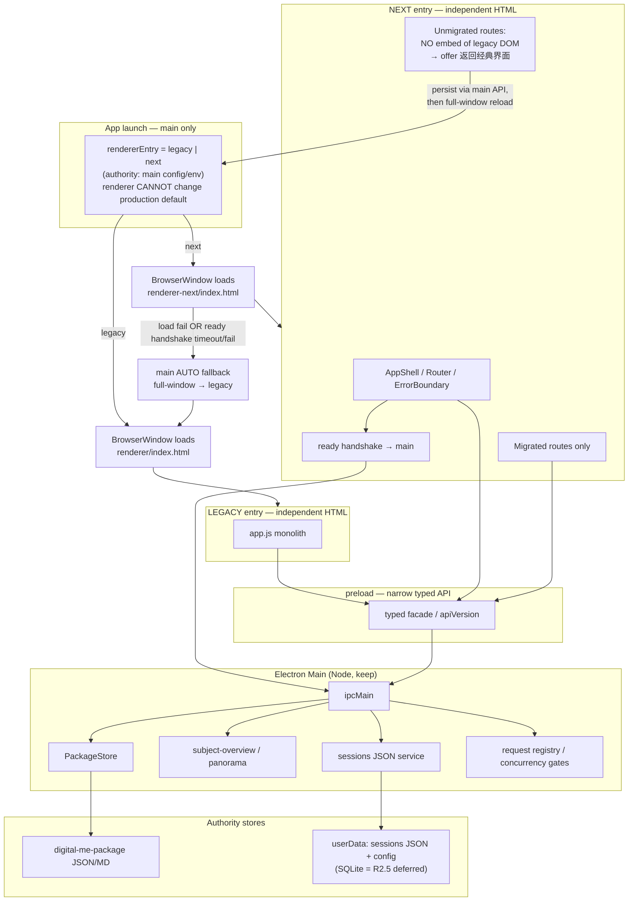

# Renderer Foundation R0：架构决策与渐进迁移规格

版本：v0.1.2  
日期：2026-07-20  
状态：**`accepted`**（决策/规格接受；**不是**代码实现完成）  
性质：**架构决策与迁移规格**；接受后授权**起草 R1 任务包**；**仍不**授权创建 R1 实现分支或改源码，直至 R1 任务包经 Codex 复核通过  
所属主线：`P1-PANORAMA`（三位一体 Alpha）  
前置：PAN-01S / PAN-01S.1 / PAN-01S.2 `accepted`（Owner real Electron runtime；baseline `cbde807`）  
决策血缘：初稿 `fc56259` → 修订 1 `ac8daf3` → 本接受修订  
依据：`digitalme_bounded_architecture_audit_2026-07-20.md`（方案 C）；产品规格 v0.6.3；执行索引 v0.2.10+

> **状态语义**
>
> - **`accepted`**：Owner 确认方案 C 与修订 1 边界（含整窗拓扑、R2.5 SQLite deferred、Playwright E2E、R1 收窄、next 加载/ready 失败由 main 自动回退 legacy）；属**决策接受**，不等于 R1 已实现；
> - R0 implementation = `not_started`；实现分支**不存在**；
> - **当前下一文档任务**：起草并冻结 R1 独立实施任务包；**Codex 复核通过前不得创建 R1 实现分支或修改源码**；
> - **不得**启动 PAN-02；
> - 本文件**不**改变 PAN-01S 族 accepted 结论。

---

## 1. 执行摘要

Digital Me 的**最大工程资产**在 Electron 主进程、preload、PackageStore 与核心服务；**最大产品负债**在约万行级 `renderer/app.js` + 巨型 `index.html` 单体（隐藏 DOM、全局可变状态、页面与请求态缠绕）。

**R0 冻结方案 C（审计推荐）：**

1. **保留 Electron**、Node 主进程、preload、PackageStore、`digital-me-package` 权威主体数据与既有核心服务。  
2. **渐进重建 renderer**（strangler / 垂直切片），**禁止**在旧 `app.js` / `index.html` 上无限堆补丁，也**禁止**全面重写后端。  
3. **新 renderer** 使用 **TypeScript + React + Vite**（确切版本由 R1 兼容性 spike 锁定；未锁定不得进入业务迁移）；仅通过**窄化、类型化 preload API** 访问能力；**禁止** renderer 直接 Node/fs。  
4. **R1/R2 初期采用整窗 renderer 入口切换**（legacy HTML 与 next HTML 为两个独立入口；**不做** iframe/webview；**不允许**一窗双状态机）。  
5. **R2 继续使用现有 JSON sessions**；SQLite 拆至 **R2.5**（`planned` / `deferred`），需独立 ADR 与量化触发条件，**不是** PAN-02 前提。  
6. **冻结 chat 三层模型**：`displayText` / `modelText` / `attachmentRefs`。  
7. **P0～P4 / B0～B5** 由主进程可信派生；renderer **不得**自行推导。  
8. **新 renderer 主 E2E = Playwright Electron**；禁止新增 Spectron；旧 owner-runtime harness 保留作 legacy 回归并逐步缩减。  
9. 每个迁移切片必须可回滚；切片经 Owner 真机验收后才可移除对应旧路径。  
10. **next 加载失败或 ready 握手失败时，由 main 自动整窗回退 legacy**（生产安全默认；见 §4 / §11.2）。

**当前授权范围：** R0 决策已 `accepted`；可起草 R1 独立实施任务包。  
**未授权：** R1 实现分支、依赖安装改 lockfile（属 R1 实现阶段）、PAN-02、任何产品源码修改（直至 R1 任务包 Codex 复核通过并获实现授权）。

---

## 2. 当前问题与非目标

### 2.1 当前问题（已确认）

| 问题 | 证据摘要 |
|---|---|
| renderer 单体过大 | `app.js` ~1 万行量级；`index.html` 多 view + 大量 `hidden` |
| 隐藏 DOM + 按钮转发成主实现方式 | 极简面叠加旧工作台，而非替换 |
| 状态多重真相 | `meLane` vs DOM hidden；气泡 vs `history`；合同 vs 可点按钮 |
| preload API 面过宽 | 百级 IPC 键；缺少按页面切片的类型契约 |
| 测试偏合同/静态 | hermetic / owner-runtime 偏导航；真实附件往返曾长期不足 |
| 技术债已登记 | displayText 2000 vs 展开 8000；菜单底部定位；write/research/code 并发未统一；旧 prompt/confirm；E2E 不足 |

### 2.2 非目标（R0 / 近期切片明确不做）

- 不更换 Electron / 不改为纯 Web 产品。  
- 不全面重写 PackageStore、策略引擎、ToolBroker、PAN-01R 安全骨架。  
- 不把 Digital Org、公网协作、支付结算拉进 R0。  
- 不实现 PAN-02 理解通道能力。  
- 不在本轮修改任何产品源码或依赖。  
- 不把 SQLite 做成主体档案库；**R2 不引入 SQLite**。  
- 不在 R1/R2 使用 iframe/webview 混挂新旧 renderer。  
- 不恢复 PAN-01R 生产入口。  
- 不重开已 `accepted` 的 PAN-01S 产品合同（可在后续切片**适配** UI 层，不回退验收结论）。  
- 禁止新增 Spectron。

---

## 3. 已确认事实、推断、待验证项

### 3.1 已确认

1. 仓库路径 `D:\Projects\Digital Me`；PAN-01S 族已 Owner 真机验收 `accepted`（baseline `cbde807`）。  
2. 审计推荐方案 C：保壳换面；不全面重写。  
3. Package 与 sessions 分离：Package ≈ 主体权威；sessions ≈ Electron `userData` JSON 工作台状态。  
4. `subject-overview` / `panorama.buildMinimalSurface` 在主进程求值 P0～P4；renderer 白名单导航。  
5. chat schema v2（`chat-message-model.js`）已分离 `displayText` / `modelText` / `attachmentRefs`。  
6. PAN-01R 生产入口被规格与 preload 环境门禁隔离；仅 test harness。  
7. 现有测试矩阵：单元 / hermetic DOM / Electron owner-runtime 并存；新表面将以 Playwright Electron 为主 E2E。

### 3.2 推断

1. 继续在 `app.js` 堆功能会使 PAN-02 与新事故同构复发。  
2. 仅物理拆分文件（方案 B）若不换状态边界，无法解决多重真相。  
3. TypeScript 对 preload 契约与消息 schema 的收益高于短期学习成本。  
4. 整窗入口切换比 iframe/webview 混挂更安全，避免双状态机与隐藏 DOM 转发复发。  
5. SQLite 可延后：JSON sessions 在 Alpha 阶段仍可支撑 R2 迁移，直至出现量化性能触发条件。

### 3.3 待验证（≤5，不阻塞本修订冻结）

1. 生产 userData 中 sessions **脱敏**大小/条数分布（**禁止**读真实正文；仅未来受控统计）。  
2. write/research/code 全局 request 竞态的完整清单。  
3. Vite + Electron 在本仓库 Windows 下的 production-load / 打包路径（R1 spike）。  
4. Playwright Electron 与现有 Electron 主进程启动方式的兼容性（R1 spike）。  
5. Owner 对 React 学习曲线的可接受度（见 §18）。

---

## 4. 目标架构图（整窗入口切换）



**冻结拓扑（关闭歧义）：**

1. R1/R2 初期采用**整窗** renderer 入口切换；**不做** iframe/webview。  
2. `legacy` 与 `next` 是**两个独立 HTML 入口**。  
3. feature flag 在**应用启动时**决定入口。  
4. next 中未迁移路由**不得**嵌入旧 DOM；提供「返回经典界面」：先经 main **持久化必要状态**，再整窗加载 legacy。  
5. legacy 默认保持生产安全回滚，直到 next 达到本任务包定义的最低可用路由集合并通过 Owner 验收。  
6. **不允许**一个窗口同时运行两套 renderer 状态机。  
7. **不允许**新按钮触发旧隐藏 DOM。  
8. feature flag **权威位于 main**；renderer **不能**自行修改生产默认值。  
9. **自动回退（强制）：** 若选择 `next` 后出现 **HTML/资源加载失败**，或 **ready 握手超时/失败**，**main 必须自动**将入口回退为 legacy 并**整窗**加载；不得停留在空白/半初始化 next；须记录可审计原因（不含隐私正文）。

---

## 5. main / preload / renderer / PackageStore 边界表

| 层 | 允许 | 禁止 |
|---|---|---|
| **main** | IPC；PackageStore；P0～P4 / buildFlow 派生；模型调用；密钥与策略；sessions JSON；**rendererEntry flag 权威**；请求注册与并发门禁；审计 | 把 UI 文案拼装成唯一真相却不经合同；向 renderer 泄漏 secret / 绝对路径 / 附件全文（除非契约明确）；让 renderer 改写生产默认入口 |
| **preload** | 暴露窄化、版本化、类型化 API；环境门禁（ownerRuntime / PAN01R harness）；只读查询当前入口 | 任意 `ipcRenderer` 透传；向页面暴露 Node；生产启用 test-only API；暴露「改生产默认入口」的无门禁 API |
| **renderer（next）** | 渲染已迁移路由；短暂 UI 态；调用 preload；请求「返回经典界面」（经 main） | `fs` / 直读 Package；自行推导 P0～P4；嵌入 legacy DOM；一窗双状态机；改生产默认 flag |
| **renderer（legacy）** | 既有行为；生产默认回滚目标 | 被 next 按钮远程驱动隐藏 DOM |
| **PackageStore / Package** | 主体权威 | 被 sessions / 未来 SQLite 取代；被 renderer 直写 |
| **sessions JSON（R2）** | 会话列表、消息、附件引用 | 被 SQLite 在 R2 强制替换 |
| **SQLite（R2.5 仅）** | 经 ADR 批准后的运行索引/临时态 | 主体权威；无量化触发即实施 |

---

## 6. 技术选型决策记录

| # | 决策项 | **冻结结论** | 理由（摘要） | 反对意见与为何不采纳 |
|---|---|---|---|---|
| 1 | 运行壳 | **继续 Electron** | 本地 Package、文件对话框、安全存储、IPC 信任边界 | Web-only 短期不可接受 |
| 2 | 主进程语言 | **保持现有 JS CommonJS；新模块可渐进 TS** | 不强迫一夜迁移安全切片 | 全量 TS 化 main 成本高 |
| 3 | Package / 核心服务 | **全部保留** | 后端为资产 | 全面重写不可接受 |
| 4 | 新 renderer 语言 | **TypeScript** | 契约与 schema 编译期约束 | 纯 JS 难强制边界 |
| 5 | UI 框架 | **React**（**确切 major/minor 由 R1 spike 锁定**；R0 不写「18+」模糊口径） | 组件所有权 + Error Boundary；生态成熟 | Vue/Svelte 另开选型成本；原生易滑回单体 |
| 6 | 构建工具 | **Vite**（确切版本 R1 spike 锁定） | HMR、ESM、Electron 路径成熟 | 无构建不可维持 TS+React |
| 7 | 状态库 | **默认 React state + 轻量 context；不默认 Redux** | 页面态短命；权威在 main | 全局 store 易复制 `app.js` |
| 8 | SQLite | **延后至 R2.5**（`planned` / `deferred`） | R2 先迁 JSON；避免存储迁移与 UI 迁移叠爆 | R2 即上 SQLite → 范围过大 |
| 9 | CSS | **CSS Modules 或等价作用域样式** | 避免巨型全局 CSS | 不强制 Tailwind |
| 10 | E2E | **Playwright Electron = 新表面主 runner**；保留现有 owner-runtime 作 legacy 回归 | 真实窗口验收 | **禁止新增 Spectron** |
| 11 | 迁移拓扑 | **整窗独立 HTML 入口切换** | 关闭双状态机 / iframe 歧义 | 按路由混挂两套 DOM → 禁止 |

**版本锁定规则：** R1 任务包必须写入确切 React / Vite / Playwright / TypeScript 版本与 lockfile；**未锁定不得进入 R2 业务迁移**。R0 只冻结技术族，不假装已选精确版本号。

---

## 7. 状态所有权表（核心）

| 状态 | 权威层 | 谁可写 | 持久化 | renderer 角色 |
|---|---|---|---|---|
| Package 主体数据 | PackageStore | main | Package 文件 | 只读展示 |
| P0～P4 `minimalSurface` | main `panorama` | 仅派生 | 否 | 渲染合同；白名单导航 |
| B0～B5 `buildFlow` | main + 会话叠加 | main 合同 | inbox/Package 为主 | 展示当前步 |
| **rendererEntry flag** | **main** | main（受控 API / 配置）；**生产默认仅 main** | userData/config | 只读；可请求「下次用经典界面」经 main |
| 路由 / 当前页面（单入口内） | 当前 renderer shell | 当前入口内 | 可选偏好 | **整窗切换时丢弃**（见 §12） |
| 进行中的 chat 请求 | main request registry | main | 否（飞行中） | 显示进度；门禁读 main |
| 会话列表与消息 | sessions JSON（R2） | main | userData JSON | 编辑 UI；保存走 API |
| 气泡 `displayText` | 消息模型 | main/规范化 | sessions | 只渲染 display |
| 模型上下文 `modelText` | main | main | 可截断 | 不可当气泡 |
| 附件引用 | main | main | 引用 | 展示元数据 |
| 配置 / 密钥 | SecretStore | main | 安全存储 | 永不回显 secret |
| PAN-01R harness | env + main | 仅测试 | 否 | 生产无入口 |

**核心结论：** renderer **不是** Package 或业务状态的第二权威；**也不是**生产入口 flag 的权威。

---

## 8. chat 数据模型（冻结）

沿用并强化 PAN-01S.2 schema v2：

```text
MessageV2 {
  schemaVersion: 2
  id: string
  role: "user" | "assistant" | "system" | ...
  displayText: string
  modelText: string
  attachmentRefs: Array<{ id, name, kind, ... }>
  createdAt: string
}
```

规则：

1. 气泡只读 `displayText`；禁止把 `modelText` / 附件正文渲染进聊天流。  
2. 旧消息无 schema v2：legacy scrub（短摘要 + 「正文已隐藏」）。  
3. 发送：renderer 提交输入 + 附件引用；main 组装模型上下文。  
4. **已知债（R2 清偿）：** `DISPLAY_TEXT_MAX=2000` 与折叠展开 `8000` 不一致。  
5. write/research/code：R4 前可过渡；R4 完成须统一单飞行请求 + 会话导航门禁。

---

## 9. 新 preload API 契约原则

1. 按域分组：`session.*` / `chat.*` / `subject.*` / `build.*` / `package.*` / `settings.*` / `runtime.*` …  
2. `apiVersion`；破坏性变更升版本并保留迁移窗口。  
3. 类型先行：共享 `.d.ts`。  
4. 最小权限；R1 仅需 runtime stamp + 入口查询/请求回滚 facade。  
5. 错误形状统一：`{ ok: false, code, userMessage }`。  
6. test-only 仅 env 门禁；生产剔除。  
7. 禁止 renderer 自定义任意 `ipcRenderer.invoke`。  
8. **大规模 preload 重写不在 R1**；按切片增量收窄。

---

## 10. 目录结构与入口（修订）

```text
digitalme-app/
  src/
    preload/                         # 渐进；R1 最小 typed facade
      contracts/
    renderer-next/                   # Vite root — NEXT 独立 HTML 入口
      index.html
      src/
        main.tsx
        app/Shell.tsx
        app/router.tsx               # 仅已迁移路由；未迁移 → 返回经典界面
        app/ErrorBoundary.tsx
        features/                    # R2+ 按切片添加；R1 可为空壳占位
        shared/preload-client/
      e2e/                           # Playwright Electron
    renderer/                        # LEGACY 独立 HTML 入口（保留）
      app.js
      index.html
      styles.css
```

**加载规则（冻结）：**

- 启动时 main 读取 `rendererEntry` ∈ `{ legacy, next }`，整窗加载对应 `index.html`。  
- **不允许** next 内 iframe/webview 嵌 legacy。  
- **不允许**按路由在同一窗口混挂两套状态机。  
- next 未迁移路由：展示明确说明 +「返回经典界面」；**先**调用 main 持久化必要状态，**再**将入口切到 legacy 并整窗重载。  
- 生产默认：`legacy`，直到 next 最低可用路由集合经 Owner 验收（见 §15）。  
- **自动回退：** 加载 `next` 时，若 **load 失败** 或 **ready 握手超时/失败**，main **必须自动**整窗加载 `legacy`（见 §11.2）；不得依赖用户手动抢救空白窗。

---

## 11. 旧 renderer 渐进替换机制（Strangler · 整窗）

1. **Feature flag 权威 = main**（config/env）；生产默认 `legacy`；renderer 不得自行改写生产默认。  
2. **每次只迁移一个垂直切片**（§14）；完成定义含 Playwright E2E + Owner 真机。  
3. 新旧**不得**共享可变单例；共享经 main API。  
4. **禁止**新按钮触发旧隐藏 DOM（零例外作为完成标准；过渡 hack 不得合入默认路径）。  
5. **回滚**：main 将入口设为 `legacy` 并整窗加载；不靠 git revert 作为唯一手段。  
6. **删除旧路径**：仅在对应切片默认 `next` 且 Owner 验收稳定后（R6）。  
7. 旧 **owner-runtime harness** 保留用于 legacy 回归；迁移稳定后逐步缩减，**不立即删除**。

### 11.1 整窗切换时的状态命运

| 类别 | 切换时行为 |
|---|---|
| **必须先由 main 持久化**（否则丢失不可接受） | 当前会话 id 选择；未发送完且产品要求保留的输入草稿（若契约已有）；关联文稿元数据变更；settings 中已确认项；rendererEntry 偏好本身 |
| **可丢弃的短暂 UI 态** | 焦点、滚动位置、菜单开合、未提交的行内编辑框、Error Boundary 本地错误面板、纯前端折叠/展开、路由栈（next 内） |
| **飞行中请求** | 以 main request registry 为准；切换前应停止或完成；UI 绑定随窗口销毁，不得假设跨入口续挂同一 React 树 |

### 11.2 next 加载 / ready 握手失败 → main 自动回退 legacy

| 项 | 冻结 |
|---|---|
| 触发 | （1）next HTML/关键资源 **load 失败**；（2）next shell **ready 握手超时或显式失败**（超时上限由 R1 任务包锁定，建议默认 ≤10s） |
| 责任方 | **仅 main** 判定并执行；renderer 不得假装已就绪 |
| 动作 | 立即整窗加载 **legacy** `renderer/index.html`；会话/Package 权威数据不因回退而损坏 |
| 会话态 | 自动回退视为异常路径：短暂 UI 态可丢；必要持久化态以 main 已有数据为准；不得为抢救 UI 读取真实隐私正文 |
| 审计 | 记录失败类别与时间（无堆栈刷用户面；无附件/资料正文） |
| 生产默认 | 自动回退后，**本次进程**以 legacy 运行；是否改写持久化 `rendererEntry` 默认值由 R1 规定（建议：**不**因单次失败永久改写 Owner 显式选择的 next 偏好，但须保证下次仍安全可启动；开发/E2E 可强制） |
| E2E | R1 必须覆盖「模拟 next 失败 → 自动落 legacy」至少一条 |

---

## 12. 数据保护与回滚方案

| 资产 | 保护 | 回滚 / 重建 |
|---|---|---|
| Package | 不改权威 | PackageStore journal/版本 |
| sessions JSON | R2 迁移 UI 时不改存储格式权威 | 整窗回 legacy 仍读同一 JSON |
| SQLite（R2.5 仅） | 独立 ADR；备份；双读验证 | 失败回 JSON；可重建索引 |
| rendererEntry | main 权威；生产默认 legacy | 用户请求回 legacy；**load/ready 失败时 main 自动整窗回 legacy（§11.2）** |
| 短暂 UI 态 | 不作为权威 | 切换或自动回退时丢弃（§11.1） |
| 密钥 | SecretStore | 既有 clear 流程 |

**硬规则：** 自动化使用**隔离 fixture userData**；禁止指向真实个人 Package/sessions；**禁止**为调研读取真实 sessions **正文**（未来仅允许脱敏大小/条数/性能指标）。

---

## 12.5 SQLite：R2.5 独立 ADR（拆出）

| 项 | 冻结 |
|---|---|
| 默认状态 | **`planned` / `deferred`** |
| R2 | **沿用现有 JSON sessions**；迁会话列表、聊天页、类型化 API、main 请求注册与并发门禁 |
| R2.5 | 独立 ADR / feasibility gate；**不是** R2 完成条件；**不是** PAN-02 前提 |
| 隐私 | 不读真实 sessions 正文；未来统计仅脱敏大小、条数、性能 |
| 触发条件（须量化且经验证） | 例如：sessions JSON 达经验证性能阈值；启动/列表/保存不达标；查询/索引需求无法由 JSON 安全满足 |
| 实施前提 | 独立任务包 + 备份 + 双读验证 + 回滚方案 + **Owner 授权** |
| Package | 永不被 SQLite 取代 |

---

## 13. E2E、故障恢复、并发与隐私测试门槛

### 13.1 测试分层

| 层 | 用途 | 不足时能否过切片 |
|---|---|---|
| 单元（Vitest / node） | schema、纯函数 | 否，仅必要 |
| DOM/harness | 组件交互（无完整 Electron） | 否，辅助 |
| **Playwright Electron E2E** | 新 renderer 主路径；真实窗口 + 隔离 userData | **否 → 切片不得标完成** |
| **既有 owner-runtime harness** | legacy 回归；迁移期保留 | 不替代 next 的 Playwright 门槛 |
| **Owner 真机验收** | 观感与主路径 | **否 → 不得删旧路径 / 不得默认 next** |

### 13.2 Runner 冻结

1. **新 renderer 主 E2E：Playwright Electron 驱动。**  
2. **现有 owner-runtime harness：保留**用于旧 renderer 回归；切片稳定后逐步缩减，不立即删除。  
3. **禁止新增 Spectron。**  
4. **超时（R1 任务包可微调，但 R0 设下限口径）：**  
   - 单测例默认超时：**60s**；  
   - 整套 R1 最小 E2E 套件超时：**10 min**；  
   - 更长用例须在任务包中显式登记理由。  
5. R1 必须验证（见 §15）：Windows 本地启动；隔离 userData；runtime stamp；legacy/next 整窗切换；next shell Error Boundary；生产打包或等价 production-load 路径。

### 13.3 产品 E2E 清单（R2+ 逐条点亮；R1 点亮子集）

1. 启动并校验 runtime stamp / commit。  
2. 新建、切换、改名、删除会话。  
3. 附件后切换及重启：正文不泄漏。  
4. 关联文稿紧凑卡。  
5. 请求并发、停止、会话导航门禁。  
6. P0～P4「我」页。  
7. 「继续了解我」进入构建。  
8. Package `read_error` 恢复入口。  
9. 生产构建无 PAN-01R 入口。  
10. 隔离 fixture userData。

### 13.4 故障恢复

| 场景 | 期望 |
|---|---|
| 新对话 | 不挟带上一请求 |
| 停止请求 | 立即停止；UI 可发送 |
| 损坏历史 | 降级展示；可继续 |
| Package 不可读 | P0 + 恢复；构建入口仍在 |
| 关闭关联文稿 | 持久化清除；聊天恢复 |
| 返回经典界面 | main 持久化必要态后整窗 legacy |

---

## 14. 分阶段迁移切片（排序）

| 切片 | 目标 | 依赖 | 预估 |
|---|---|---|---|
| **R0** | 本决策与契约冻结 | — | 文档 |
| **R1** | 最小 next shell + 整窗开关 + Playwright 骨架（**收窄，见下**） | R0 Owner/Codex 接受 | **≤ 一个小里程碑** |
| **R2** | 会话列表 + 聊天页 + 类型化 API + main 请求注册/并发门禁；**JSON sessions** | R1 完成且版本已锁定 | 主风险 |
| **R2.5** | SQLite ADR / feasibility（默认 deferred） | 量化触发 + Owner 授权 | 独立；可跳过 |
| **R3** | 「我」+ 构建向导 | R1；建议 R2 后 | 主路径 |
| **R4** | 工作台 + 统一请求模型 | R2 | 中大 |
| **R5** | 能力与设置 | R1 | 中 |
| **R6** | 删除旧 DOM / 失效入口 | 相关切片默认 next 且 Owner 验收 | 收尾 |

**推荐顺序：** R0 → R1 → R2 →（可选 R2.5）→ R3 → R4 → R5 → R6。  
**PAN-02 不以 R2.5/SQLite 为前提。**

### 14.1 R1 最终范围（收窄）

**包含：**

- `renderer-next` 最小目录与构建；  
- TypeScript；  
- React shell；  
- Vite 开发与 production-load；  
- Error Boundary；  
- runtime stamp 类型化 preload facade；  
- **main 权威** legacy/next 启动开关；  
- Playwright Electron 最小 E2E；  
- 回滚到 legacy（整窗）。

**明确不包含：**

- chat / 会话迁移；  
- 「我」或构建；  
- 工作台；  
- SQLite；  
- Package 数据迁移；  
- PAN-02；  
- 大规模 preload 重写。

R1 完成条件必须是**最小、可测、可回滚**；预计不超过一个小里程碑。确切依赖版本与 lockfile 在 R1 任务包锁定；spike 未通过不得进入 R2。

---

## 15. 每切片进入 / 完成 / 停止条件

### 通用

- 进入：上一切片完成或书面豁免；本切片任务包已写；隔离 fixture；未并行扩大 PAN。  
- 完成：类型检查；相关 Playwright E2E 绿；可回 legacy；无真实 Package 写入；Codex 复核；**Owner 真机**（默认 next / 删旧路径前）。  
- 停止：Package 被绕过；PAN-01R 生产入口；无法回滚；隐私泄漏；滑向 PAN-02。

### 切片要点

| 切片 | 进入 | 完成（额外） | 停止（额外） |
|---|---|---|---|
| **R1** | R0 决策接受 | Windows 启动；隔离 userData；runtime stamp；**legacy↔next 整窗切换**；Error Boundary；production-load 或等价；Playwright 最小套件在超时内绿；**版本与 lockfile 已锁**；可一键回 legacy；**next load/ready 失败 → main 自动回 legacy（E2E 覆盖）** | 塞入 chat/我/工作台/SQLite/大规模 preload 重写；无自动回退 |
| **R2** | R1 完成 | E2E #2–#5；JSON sessions；类型化 session/chat API；main 请求注册与并发门禁；无正文铺屏；可回 legacy | 引入 SQLite；恢复单 `content` 模型；嵌 legacy DOM |
| **R2.5** | 量化触发 + Owner 授权 + 独立 ADR | 备份、双读、回滚证明 | 无触发强上；读真实正文 |
| **R3** | 建议 R2 完成 | E2E #6–#8；P0 行为保持 | renderer 重算 P0～P4 |
| **R4** | R2 完成 | 统一请求门禁 | 顺手做理解通道 |
| **R5** | R1 完成 | 设置/能力主路径；密钥不回显 | Digital Org |
| **R6** | 相关默认 next 稳定 | 旧 DOM 清零；入口审计 | 未验收删 legacy |

**next 最低可用路由集合（生产默认可切 next 的前提，摘要）：** R2+R3 经 Owner 真机验收（或 Owner 书面定义的更小集合）；在此之前生产默认保持 legacy。

---

## 16. PAN-02 解锁条件

PAN-02 保持 **`planned` / `blocked`**，直到**同时**满足：

1. R0 决策经 Codex 再复核通过且 Owner 确认 §18。  
2. **R2 与 R3 至少完成并经 Owner 真机验收**（若书面豁免顺序，仍须完成 R1 + 风险接受）。  
3. 独立 PAN-02 任务包已冻结；不依赖旧 `app.js` 单体为唯一承载。  
4. E2E #3/#5/#6/#7/#9 持续绿。  
5. Owner/Codex 明确启动授权。

**明确：** PAN-02 **不以 SQLite / R2.5 为前提**。  
**禁止：** 仅文档通过就启动 PAN-02；或在旧单体上直接开理解通道。

---

## 17. 风险和预计投入

| 风险 | 等级 | 缓解 |
|---|---|---|
| 双轨行为漂移 | 高 | 整窗单入口；禁止嵌 DOM |
| React/Vite/Playwright 版本摩擦 | 中 | R1 spike 锁版本；未锁不进 R2 |
| 整窗切换丢短暂 UI | 低 | §11.1；必要态先持久化 |
| SQLite 过早引入 | 中 | R2.5 deferred + 量化触发 |
| 范围膨胀 | 高 | R1 收窄清单；停止条件 |
| Alpha 速度下降 | 中 | 小里程碑；不平行 PAN-02 |

**投入量级（决策用）：** R1 ≤ 小里程碑；R2/R3 各约 1–2 周量级；R2.5 仅在触发后另估。

---

## 18. Owner 决策问题（≤5）— 已接受记录

| # | 问题 | Owner 结论（2026-07-20） |
|---|---|---|
| 1 | 是否批准方案 C？ | **是** |
| 2 | 是否批准 TS + React + Vite（确切版本 R1 spike 锁定）？ | **是** |
| 3 | 是否同意 SQLite 延后至 R2.5，R2 继续 JSON sessions？ | **是** |
| 4 | 是否批准整窗入口切换及 R1→R2→R3？ | **是**（含 load/ready 失败由 main 自动回退 legacy） |
| 5 | 是否接受 §16 的 PAN-02 解锁门槛？ | **是**；PAN-02 仍 `planned` / `blocked` |

---

## 19. 明确禁止事项

1. 未经接受本决策即创建 R1 分支或改产品代码。  
2. 在旧 `app.js` 上新开大型产品能力（含 PAN-02）。  
3. renderer 直读写 Package / 任意 fs。  
4. 用 SQLite 取代 Package；或在 R2 强行引入 SQLite。  
5. iframe/webview 混挂新旧 renderer；一窗双状态机。  
6. 新按钮触发旧隐藏 DOM。  
7. renderer 自行修改生产默认 `rendererEntry`。  
8. 新增 Spectron。  
9. 恢复 PAN-01R 生产入口。  
10. 以自动化绿灯替代 Owner 真机验收。  
11. 读取真实个人资料 / sessions 正文做开发或自动化。  
12. amend / squash / push 作为流程默认。

---

## 20. 验收清单（针对本 R0 文档）

- [x] 整窗迁移拓扑歧义已关闭（§4 / §10 / §11）。  
- [x] next load/ready 失败 → main 自动回退 legacy（§11.2）。  
- [x] SQLite 拆至 R2.5 deferred；R2 = JSON。  
- [x] E2E = Playwright Electron；禁 Spectron；超时口径明确。  
- [x] R1 范围收窄为最小可测可回滚壳。  
- [x] Owner 五项问题已接受（§18）。  
- [x] R0 决策标为 **`accepted`**（决策接受；非实现完成）。  
- [ ] R1 独立实施任务包已起草并经 Codex 复核（下一文档任务）。  
- [x] 未修改源码/依赖；未创建实现分支。  
- [x] PAN-01S 族 accepted 未被改写。

---

## 21. 调度与状态机

| 项 | 值 |
|---|---|
| 本文件状态 | **`accepted`**（决策/规格；v0.1.2） |
| R0 implementation | `not_started` |
| R0 implementation branch | **不存在** |
| R2.5 SQLite | `planned` / `deferred` |
| 下一动作 | **起草并冻结 R1 独立实施任务包** → Codex 复核；**复核通过前不得创建 R1 实现分支或改源码** |
| PAN-02 | `planned` / `blocked` |
| PAN-01S / S.1 / S.2 | `accepted`（不变） |

---

## 22. 修订记录

| 日期 | 版本 | 说明 |
|---|---|---|
| 2026-07-20 | v0.1-draft | 初稿（`fc56259`）；`spec_drafted` / `codex_review_pending` |
| 2026-07-20 | v0.1.1-draft | Codex 第一轮：整窗拓扑、SQLite→R2.5、Playwright、收窄 R1（`ac8daf3`） |
| 2026-07-20 | v0.1.2 | **Owner 接受**；补充 next load/ready 失败由 main 自动回退 legacy；修正状态文档多余 `>`；授权起草 R1 任务包（仍禁实现分支） |
