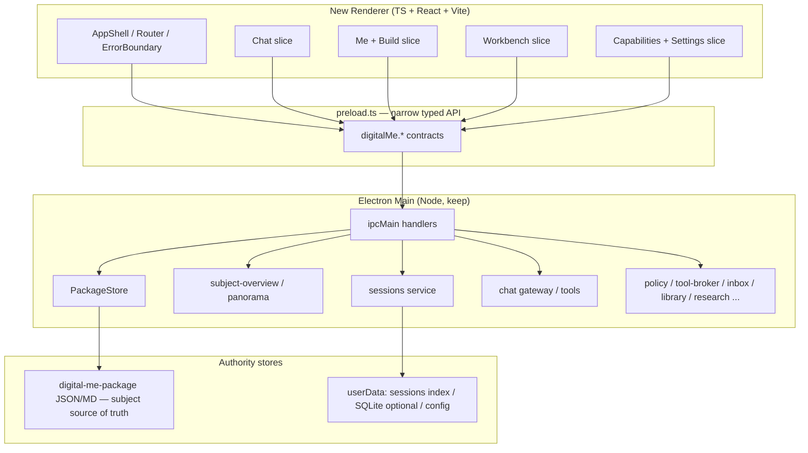

# Renderer Foundation R0：架构决策与渐进迁移规格

版本：v0.1-draft  
日期：2026-07-20  
状态：`spec_drafted` / `codex_review_pending`  
性质：**架构决策与迁移规格**；**不**授权实现；**不**创建实现分支  
所属主线：`P1-PANORAMA`（三位一体 Alpha）  
前置：PAN-01S / PAN-01S.1 / PAN-01S.2 `accepted`（Owner real Electron runtime；baseline `cbde807`）  
代码血缘基线（只读）：`cbde807` / 当前文档起草 HEAD `27e90a9`  
依据：`digitalme_bounded_architecture_audit_2026-07-20.md`（方案 C）；产品规格 v0.6.3；执行索引 v0.2.8+

> **状态语义**
>
> - `spec_drafted`：决策/任务包已起草，等待 Codex 复核；
> - **不得**标 `accepted`（须 Codex 复核 + Owner 决策确认）；
> - **不得**自行创建 `R1` 实现分支或开始编码；
> - **不得**启动 PAN-02；
> - 本文件**不**改变 PAN-01S 族 accepted 结论。

---

## 1. 执行摘要

Digital Me 的**最大工程资产**在 Electron 主进程、preload、PackageStore 与核心服务；**最大产品负债**在约万行级 `renderer/app.js` + 巨型 `index.html` 单体（隐藏 DOM、全局可变状态、页面与请求态缠绕）。

**R0 冻结方案 C（审计推荐）：**

1. **保留 Electron**、Node 主进程、preload、PackageStore、`digital-me-package` 权威主体数据与既有核心服务。  
2. **渐进重建 renderer**（strangler / 垂直切片），**禁止**在旧 `app.js` / `index.html` 上无限堆补丁，也**禁止**全面重写后端。  
3. **新 renderer** 使用 **TypeScript + React + Vite**；仅通过**窄化、类型化 preload API** 访问能力；**禁止** renderer 直接 Node/fs。  
4. **可选引入 SQLite**，仅用于 sessions / 运行索引 / 临时状态；**永不**取代 Package 的 JSON/Markdown 权威。  
5. **冻结 chat 三层模型**：`displayText` / `modelText` / `attachmentRefs`（PAN-01S.2 已落地方向，R0 固化为迁移契约）。  
6. **P0～P4 / B0～B5** 由主进程可信派生；renderer **不得**自行推导优先级或伪造成功态。  
7. 每个迁移切片必须带**真实 Electron E2E** 与 **feature flag 回滚**；切片经 Owner 真机验收后才可移除对应旧路径。

**当前授权范围：** 仅本决策/任务包的起草与 Codex 复核。  
**未授权：** R0/R1 实现、依赖安装、新分支、PAN-02。

---

## 2. 当前问题与非目标

### 2.1 当前问题（已确认）

| 问题 | 证据摘要 |
|---|---|
| renderer 单体过大 | `app.js` ~1 万行量级；`index.html` 多 view + 大量 `hidden` |
| 隐藏 DOM + 按钮转发成主实现方式 | 极简面叠加旧工作台，而非替换 |
| 状态多重真相 | `meLane` vs DOM hidden；气泡 vs `history`；合同 vs 可点按钮 |
| preload API 面过宽 | 百级 IPC 键；缺少按页面切片的类型契约 |
| 测试偏合同/静态 | hermetic / owner-runtime 偏导航；真实附件往返曾长期不足 |
| 技术债已登记 | displayText 2000 vs 展开 8000；菜单底部定位；write/research/code 并发未统一；旧 prompt/confirm；E2E 不足 |

### 2.2 非目标（R0 / 近期切片明确不做）

- 不更换 Electron / 不改为纯 Web 产品。  
- 不全面重写 PackageStore、策略引擎、ToolBroker、PAN-01R 安全骨架。  
- 不把 Digital Org、公网协作、支付结算拉进 R0。  
- 不实现 PAN-02 理解通道能力。  
- 不在本轮修改任何产品源码或依赖。  
- 不把 SQLite 做成主体档案库。  
- 不恢复 PAN-01R 生产入口。  
- 不重开已 `accepted` 的 PAN-01S 产品合同（可在后续切片**适配** UI 层，不回退验收结论）。

---

## 3. 已确认事实、推断、待验证项

### 3.1 已确认

1. 仓库路径 `D:\Projects\Digital Me`；PAN-01S 族已 Owner 真机验收 `accepted`（baseline `cbde807`）。  
2. 审计推荐方案 C：保壳换面；不全面重写。  
3. Package 与 sessions 分离：Package ≈ 主体权威；sessions ≈ Electron `userData` 工作台状态。  
4. `subject-overview` / `panorama.buildMinimalSurface` 在主进程求值 P0～P4；renderer 白名单导航。  
5. chat schema v2（`chat-message-model.js`）已分离 `displayText` / `modelText` / `attachmentRefs`；关联文稿改为紧凑卡（PAN-01S.2）。  
6. PAN-01R 生产入口被规格与 preload 环境门禁隔离；仅 test harness。  
7. 现有测试矩阵：单元 / hermetic DOM / Electron owner-runtime 并存，但真实 E2E 覆盖仍不足。

### 3.2 推断

1. 继续在 `app.js` 堆功能会使 PAN-02 与新事故同构复发。  
2. 仅物理拆分文件（方案 B）若不换状态边界，无法解决多重真相。  
3. TypeScript 对 preload 契约与消息 schema 的收益高于短期学习成本。  
4. React 组件树比「再开一套原生模块约定」更能强制页面所有权（对本团队 Alpha 节奏更可控）。

### 3.3 待验证（≤5，不阻塞 R0 冻结）

1. 生产 userData 中旧 sessions 体量分布（不得在本轮读真实正文）。  
2. write/research/code 全局 request 竞态的完整清单。  
3. Vite + Electron 在本仓库 Windows 环境下的打包路径细节（R1 验证）。  
4. SQLite 与现有 `workbench-sessions.json` 迁移成本（R2 设计细化）。  
5. Owner 对 React 学习曲线的可接受度（见 §18 决策问题）。

---

## 4. 目标架构图



**旧 renderer**（`app.js` / `index.html`）在迁移期内仅作为 **fallback 路由目标**，由 feature flag 切换；**同一用户意图不得同时由新旧两套状态机驱动**。

---

## 5. main / preload / renderer / PackageStore 边界表

| 层 | 允许 | 禁止 |
|---|---|---|
| **main** | IPC；PackageStore 读写；P0～P4 / buildFlow 派生；模型调用；密钥与策略；会话持久化服务；审计 | 把 UI 文案拼装成唯一真相却不经合同；向 renderer 泄漏 secret / 绝对路径 / 附件全文（除非契约明确的一次性预览） |
| **preload** | 暴露窄化、版本化、类型化 API；环境门禁（ownerRuntime / PAN01R harness） | 任意 `ipcRenderer` 透传；向页面暴露 Node；生产启用 test-only API |
| **renderer（新）** | 渲染；本地短暂 UI 态（折叠、焦点、草稿输入）；调用 preload；展示主进程合同 | `fs` / 直接读 Package；自行推导 P0～P4；把模型上下文当气泡；第二份 Package 缓存权威；长期靠 `hidden` 双轨同一功能 |
| **PackageStore / Package** | 主体权威；版本/锁/journal；preview→confirm→commit | 被 sessions/SQLite 取代；被 renderer 直写 |
| **sessions / SQLite（若启用）** | 对话索引、消息元数据、附件引用、运行临时态 | 存放主体事实权威副本；损坏后不可重建的唯一真相 |

---

## 6. 技术选型决策记录

| # | 决策项 | **冻结结论** | 理由（摘要） | 反对意见与为何不采纳 |
|---|---|---|---|---|
| 1 | 运行壳 | **继续 Electron** | 本地 Package、文件对话框、安全存储、已有 IPC 信任边界均为 Alpha 约束；换壳不对症 | Web-only 需重做本地权威，短期不可接受 |
| 2 | 主进程语言 | **保持现有 JS CommonJS；新模块可渐进 TS** | 不强迫一夜迁移安全切片 | 全量 TS 化 main 成本高、风险大 |
| 3 | Package / 核心服务 | **全部保留** | 审计确认后端为资产 | 全面重写会丢失 P1 安全证据 |
| 4 | 新 renderer 语言 | **TypeScript** | 消息 schema、preload 契约、P0～P4 导航白名单需要编译期约束，避免再出现「第二真相」 | 纯 JS 无法以低成本强制契约 |
| 5 | UI 框架 | **React 18+** | 组件所有权清晰，利于按页面切片与 Error Boundary；生态与 Electron 示例成熟；测试工具链完整 | Vue/Svelte 亦可，但引入第二框架讨论成本；原生模块需另建等同纪律，历史已证明易滑回单体 |
| 6 | 构建工具 | **Vite**（renderer 专用） | 快速 HMR、清晰 ESM、Electron 社区路径成熟 | 无构建会在 TS+React 下不可维持；Webpack 更重 |
| 7 | 状态库 | **默认 React state + 轻量 context；不默认上 Redux** | 页面态应短命；权威态在 main | 过早引入全局 store 易复制 `app.js` 全局 `let` |
| 8 | SQLite | **采纳为可选运行库（R2 起）** | sessions 索引/附件引用/临时态需要可查询与大小治理；损坏可重建 | 用 SQLite 存主体 → **明确禁止** |
| 9 | CSS | **CSS Modules 或等价作用域样式；保留设计 token** | 避免巨型全局 `styles.css` 再膨胀 | 不强制 Tailwind（减少选型噪声） |
| 10 | 测试 | **Vitest（单元）+ Playwright/Spectron 类 Electron E2E（或现有 electron harness 升级）** | 必须区分层级 | 仅字符串匹配测试 → 禁止作为切片完成证据 |

**复杂度值得的原因：** TypeScript + React + Vite 的新增成本，换取的是「无法再把所有产品面塞进单文件」的结构约束；这与 Owner 已验收仍暴露的技术债（单体、E2E 不足、并发模型不一）直接对症。

---

## 7. 状态所有权表（核心）

| 状态 | 权威层 | 谁可写 | 持久化 | renderer 角色 |
|---|---|---|---|---|
| Package 主体数据 | PackageStore | main（经 preview/confirm） | Package 文件 | 只读展示派生结果 |
| P0～P4 `minimalSurface` | main `panorama` | 仅派生，不手写 | 否（每次 overview） | 渲染合同；执行白名单 `navTarget` |
| B0～B5 `buildFlow` | main 派生 + 会话叠加规则 | main 合同；renderer 仅会话 overlay（如「本会话已完成」） | inbox/Package 为主 | 展示当前一步；禁止发明步骤 |
| 路由 / 当前页面 | renderer shell | renderer | 可选 UI 偏好 | 唯一 UI 路由权威（新旧不可双开） |
| 进行中的 chat 请求 | main request registry + renderer 订阅 | main 生成 requestId；renderer 绑定 UI | 否 | 显示进度；导航门禁读 main/守卫合同 |
| 会话列表与消息 | sessions 服务（JSON→可迁 SQLite） | main | userData | 编辑 UI；保存走 API |
| 气泡展示文本 | 消息 `displayText` | 写入时由 main/规范化模块约束 | sessions | 只渲染 display；禁止回退到 model/附件正文 |
| 模型上下文 | `modelText` / 发送当轮组装 | main | 可截断存；大附件优先引用 | 不可当作气泡 |
| 附件 | `attachmentRefs` + 主进程读取 | main | 引用；正文默认不进会话 JSON | 展示文件名/状态 |
| 关联文稿 | session artifacts 元数据 | main + renderer 动作 | sessions/library | 紧凑卡；正文在文稿页 |
| 配置 / 密钥 | main SecretStore | main | userData 安全存储 | 永不回显 secret |
| PAN-01R harness | env + main 门禁 | 仅测试进程 | 否 | 生产构建无入口 |

**核心结论：** renderer **不是** Package 或业务状态的第二权威；任何「看起来像成功」的 UI 必须能指回 main 合同或显式本地草稿。

---

## 8. chat 数据模型（冻结）

沿用并强化 PAN-01S.2 schema v2：

```text
MessageV2 {
  schemaVersion: 2
  id: string
  role: "user" | "assistant" | "system" | ...
  displayText: string          // UI 唯一展示源；有上限
  modelText: string            // 发给模型的上下文；有上限；可截断标记
  attachmentRefs: Array<{ id, name, kind, ... }>  // 无正文
  createdAt: string
}
```

规则：

1. **气泡只读 `displayText`**（及折叠策略）；禁止把 `modelText` / 附件正文渲染进聊天流。  
2. **旧消息无 schema v2**：走既有 legacy scrub（短摘要 + 「正文已隐藏」）；禁止「截断但仍像全文」。  
3. **发送路径**：renderer 提交用户输入 + 附件引用；main 组装模型上下文；需要附件正文时由 main 按引用读取或短时缓存。  
4. **已知债（不挡 R0 冻结，进 R2 清偿）：** `DISPLAY_TEXT_MAX=2000` 与折叠展开上限 `8000` 不一致——R2 必须统一产品规则并补 E2E。  
5. write/research/code：**R4 前**允许过渡期各自守卫；**R4 完成条件**要求统一「单飞行请求 + 会话导航门禁」模型。

---

## 9. 新 preload API 契约原则

1. **按域分组**：`session.*` / `chat.*` / `subject.*` / `build.*` / `package.*` / `settings.*` …；禁止再暴露扁平百级随意键作为长期契约。  
2. **版本字段**：`apiVersion`；破坏性变更必须升版本并保留迁移窗口。  
3. **类型先行**：`preload` 与 renderer 共享 `.d.ts`（或生成类型）；非法载荷在边界失败。  
4. **最小权限**：页面只注入所需子集（可分 preload 通道或 facade）。  
5. **错误形状统一**：`{ ok: false, code, userMessage }`；禁止把堆栈直接刷到用户面。  
6. **test-only**：仅 env 门禁；生产构建 tree-shake / 编译期剔除。  
7. **禁止**：renderer 自定义 `ipcRenderer.invoke('任意通道')`。

---

## 10. 新 renderer 目录结构草案

```text
digitalme-app/
  src/
    main/                    # 现有 main 可渐进迁入（非 R0 必须）
    preload/
      index.ts
      contracts/             # 共享类型与 apiVersion
    renderer-new/            # Vite root（新）
      index.html
      src/
        main.tsx
        app/Shell.tsx
        app/router.tsx
        app/ErrorBoundary.tsx
        features/chat/
        features/me/
        features/build/
        features/do/
        features/settings/
        shared/ui/
        shared/preload-client/
      e2e/
    renderer/                # 旧表面（迁移期保留）
      app.js
      index.html
      styles.css
```

加载策略（R1 冻结实现细节）：Electron `BrowserWindow` 根据 feature flag 加载 `renderer-new` 或旧 `renderer`；允许**按路由**混合（例如 chat 新、settings 旧），但**同一路由不得双挂载**。

---

## 11. 旧 renderer 渐进替换机制（Strangler）

1. **Feature flag**（config 或 env）：`renderer.slices.chat = "legacy" | "next"` 等。  
2. **每次只迁移一个垂直切片**（见 §14）；完成定义含 E2E + Owner 真机。  
3. **新旧不得共享可变单例**；需要共享时经 main 权威 API。  
4. **禁止**「新按钮转发点击旧隐藏 DOM」作为长期方案（短期过渡 ≤1 个切片周期，必须登记到期删除）。  
5. **回滚**：flag 切回 `legacy`；不靠 git revert 作为唯一手段。  
6. **删除旧路径**：仅在该切片 Owner 真机验收通过且 flag 默认 `next` 稳定一个验收周期后执行（R6）。

---

## 12. 数据保护与回滚方案

| 资产 | 保护 | 回滚 / 重建 |
|---|---|---|
| Package | 不改权威；迁移切片禁自动 migrate | PackageStore journal/版本；设置中恢复 |
| sessions JSON | R2 迁移前备份副本；迁移脚本可逆 | 保留 JSON 旁路读取直至 SQLite 稳定 |
| SQLite（若启用） | 损坏 → 从 JSON 备份或空库重建索引；**不**声称恢复已删附件正文 | 「重建索引」用户动作 |
| 用户草稿 / library | 现有 userData 路径不变 | 导出能力保留 |
| 密钥 | SecretStore；不进 renderer | clear API 既有流程 |

**硬规则：** 任何迁移步骤默认使用**隔离 fixture userData**；禁止指向真实个人 Package/sessions 跑自动化。

---

## 13. E2E、故障恢复、并发与隐私测试门槛

### 13.1 测试分层（必须区分）

| 层 | 用途 | 不足时能否过切片 |
|---|---|---|
| 单元（Vitest / node） | schema、纯函数、状态机 | 否，仅必要 |
| DOM/harness | 组件渲染与交互（无完整 Electron） | 否，辅助 |
| **Electron E2E** | 真实窗口 + 隔离 userData | **否 → 切片不得标完成** |
| **Owner 真机验收** | 真实观感与主路径 | **否 → 不得删旧路径 / 不得默认 next** |

### 13.2 R0 冻结的 Electron E2E 清单（实现于 R1 骨架起逐条点亮）

1. 启动应用并校验 runtime stamp / commit 暴露值。  
2. 新建、切换、改名、删除会话（含行内改名与自定义删除确认）。  
3. 发送附件后切换会话及重启：聊天区不出现附件/个人资料正文。  
4. 关联文稿仅紧凑卡，不占聊天正文区。  
5. 请求进行中：停止可用；切换/新对话/删除被门禁拦截并提示。  
6. 「我」页 P0～P4 合同渲染（fixture 驱动）。  
7. 「继续了解我」真实进入构建向导（lane/tab 正确）。  
8. Package `read_error`：显示恢复入口且构建入口仍在（P0）。  
9. 生产构建：无 PAN-01R 生产入口（设置/帮助/主路径）。  
10. 全程隔离 userData/fixture；断言未访问真实 Package 路径。

### 13.3 故障恢复（产品要求）

| 场景 | 期望 |
|---|---|
| 新对话 | 不挟带上一请求；可在门禁允许时立即创建 |
| 停止请求 | 立即停止生成；UI 回到可发送 |
| 损坏历史 | 降级展示；可继续新消息；不抛未处理异常 |
| Package 不可读 | P0 文案 + 恢复入口；基础「继续了解我」仍在 |
| 关闭关联文稿 | 持久化清除关联；聊天区恢复 |

---

## 14. 分阶段迁移切片（排序）

| 切片 | 目标 | 依赖 | 预估（量级） |
|---|---|---|---|
| **R0** | 本决策与契约冻结 | — | 文档（本文件） |
| **R1** | 新 shell、路由、Error Boundary、preload 类型骨架、E2E 骨架、flag | R0 accepted | 小里程碑 |
| **R2** | 会话列表 + 对话页迁移（含 schema/SQLite 可选、并发门禁） | R1 | 主风险切片 |
| **R3** | 「我」概览 + 构建向导迁移（消费 P0～P4/B0～B5 合同） | R1；建议 R2 后 | 主路径切片 |
| **R4** | 工作台（写作/研究/代码）迁移 + 统一请求模型 | R2 | 中大 |
| **R5** | 能力与设置迁移 | R1 | 中 |
| **R6** | 删除旧 renderer 兼容 DOM / 失效入口 / 转发残渣 | R2–R5 对应项均默认 next 且 Owner 验收 | 收尾 |

**推荐执行顺序：** R0 → R1 → **R2 → R3**（可论证并行设计但不可并行合并互踩状态）→ R4 → R5 → R6。  
**优先 R2 再 R3 的理由：** 对话事故与会话模型是已证实的高伤痛面；「我」已 accepted，迁移时以保行为为主。

---

## 15. 每切片进入 / 完成 / 停止条件

### 通用进入条件

- 上一切片完成或显式豁免；  
- 本切片任务包/清单已写；  
- 隔离 fixture 准备好；  
- **未**并行扩大到下一产品 PAN。

### 通用完成条件

- 代码 + 类型检查通过；  
- 本切片相关 Electron E2E 全绿；  
- flag 可切回 legacy；  
- 无真实 Package 写入；  
- Codex 静态复核通过；  
- **Owner 真机验收通过**（才可默认 next / 才可删旧路径）。

### 通用停止条件

- 发现 Package 权威被绕过；  
- 生产出现 PAN-01R 入口；  
- 无法回滚 legacy；  
- 隐私正文泄漏到聊天 DOM；  
- 范围滑向 PAN-02 功能。

### 切片要点

| 切片 | 进入 | 完成（额外） | 停止（额外） |
|---|---|---|---|
| R1 | R0 Owner/Codex 接受决策 | 空壳可启动；stamp E2E；flag 骨架 | 引入与壳无关的业务大迁移 |
| R2 | R1 完成 | E2E #2–#5；schema 一致；无正文铺屏 | 为求快恢复单 `content` 模型 |
| R3 | R1 完成；建议 R2 完成 | E2E #6–#8；P0 双入口行为保持 | 在 renderer 重算 P0～P4 |
| R4 | R2 完成 | 统一请求门禁；旧 do 场景可回滚 | 顺手做理解通道能力 |
| R5 | R1 完成 | 设置/能力主路径；密钥不回显 | 扩大为 Digital Org |
| R6 | 相关切片默认 next 稳定 | 旧 DOM 删除清单清零；生产包体积/入口审计 | 未验收就删 legacy |

---

## 16. PAN-02 解锁条件

PAN-02（理解通道 Alpha）保持 **`planned` / `blocked`**，直到**同时**满足：

1. **R0 决策被 Codex 复核通过且 Owner 确认**（本文件从 `spec_drafted` 进入可执行基线；仍不等于 R0 实现完成）。  
2. **R2 与 R3 至少完成并经 Owner 真机验收**（对话不再铺原文；「我」/构建在新表面可发现且合同正确）——*若 Owner 书面豁免顺序，必须仍完成 R1 + 明确风险接受*。  
3. **独立 PAN-02 任务包已冻结**（另文），且不依赖旧 `app.js` 单体作为唯一承载。  
4. **E2E 清单 #3/#5/#6/#7/#9 持续绿**（回归门槛）。  
5. **启动授权**：Owner/Codex 在 R0 边界下明确选择「先继续 R4+」或「允许 PAN-02 启动」。

**禁止：** R0 仅起草完毕就启动 PAN-02；或在旧单体上直接开理解通道。

---

## 17. 风险和预计投入

| 风险 | 等级 | 缓解 |
|---|---|---|
| 双轨 UI 行为漂移 | 高 | flag、合同测试、禁止双挂载 |
| React/Vite 学习与打包摩擦 | 中 | R1 只做壳；Windows 路径先验证 |
| SQLite 迁移损坏会话 | 中 | JSON 备份；可重建；默认不删 JSON |
| 迁移期 Alpha 速度下降 | 中 | 切片垂直可演示；不平行 PAN-02 |
| 误删 PAN-01R 安全骨架 | 低 | R6 白名单删除；骨架留 main |
| 范围膨胀成全面重写 | 高 | 非目标清单；停止条件 |

**投入量级（决策用，非承诺排期）：**  
R1 约数日；R2/R3 各约 1–2 周量级；R4 更大；R5 中等；R6 数日。总迁移以「小里程碑可验收」为单位，不设一次性大爆炸切换日。

---

## 18. Owner 决策问题（≤5）

请 Owner 明确答复：

1. **是否批准方案 C 作为唯一主策略**（保留 Electron/main/PackageStore；渐进重建 renderer；拒绝以全面重写或继续无限补丁为主策略）？  
2. **是否接受新 renderer 技术栈 = TypeScript + React + Vite**？（若否，备选：TypeScript + 模块化原生；需同时批准等价的模块边界纪律。）  
3. **是否批准 R2 引入 SQLite（仅 sessions/索引/临时态）**，并接受「库损坏可重建索引、Package 仍为权威」？  
4. **迁移顺序是否批准 R1 → R2（对话）→ R3（我/构建）**？（若要求先 R3，请书面确认。）  
5. **PAN-02 解锁是否接受 §16 门槛**（至少 R0 确认 + R2/R3 真机验收 + 独立任务包）？

---

## 19. 明确禁止事项

1. 未经 Owner/Codex 接受本决策即创建 R1 实现分支或改产品代码。  
2. 在旧 `app.js` 上新开大型产品能力（含 PAN-02）。  
3. renderer 直读写 Package / 任意 fs。  
4. 用 SQLite 取代 Package 权威。  
5. 恢复 PAN-01R 生产入口。  
6. 以自动化绿灯替代 Owner 真机验收。  
7. 新旧页面同时拥有同一业务状态机。  
8. 长期靠隐藏 DOM + 点击转发冒充迁移完成。  
9. amend / squash / push 作为流程默认。  
10. 读取真实个人资料正文做开发或自动化。

---

## 20. 验收清单（针对本 R0 文档本身）

- [ ] 方案 C、技术栈、SQLite 边界、chat 三层模型、状态所有权均有**明确结论**（非只列优缺点）。  
- [ ] R1–R6 顺序与进入/完成/停止条件完整。  
- [ ] PAN-02 解锁条件可执行且与执行索引一致。  
- [ ] E2E 十项已列出且区分测试层级。  
- [ ] Owner 决策问题 ≤5。  
- [ ] 未修改源码/依赖；未创建实现分支。  
- [ ] PAN-01S 族 accepted 记录未被改写。  
- [ ] Codex 复核通过后，状态可升为 `codex_review_passed` / `owner_decision_pending`（另提交）；**不得**在本起草提交标 accepted。

---

## 21. 调度与状态机

| 项 | 值 |
|---|---|
| 本文件状态 | `spec_drafted` / `codex_review_pending` |
| R0 implementation | `not_started` |
| R0 implementation branch | **不存在**（禁止擅自创建） |
| 下一动作 | Codex 复核本任务包 → Owner 答复 §18 →（通过后）另立 R1 实现任务包 |
| PAN-02 | `planned` / `blocked` |
| PAN-01S / S.1 / S.2 | `accepted`（不变） |

---

## 22. 修订记录

| 日期 | 版本 | 说明 |
|---|---|---|
| 2026-07-20 | v0.1-draft | 初稿冻结候选；基于 2026-07-20 有界架构审计方案 C 与 PAN-01S 族验收后技术债清单 |
